# Image Prompts

共 68 条 Prompt · 点击图片或标题查看完整 Prompt。

> 此文件由 `python tools/add_prompt.py rebuild` 自动生成；命令行或网页新增 Prompt 后会自动更新。

<table>
<tr>
<td width="50%" valign="top">

<a href="prompts/watercolor-editorial-collage/index.md">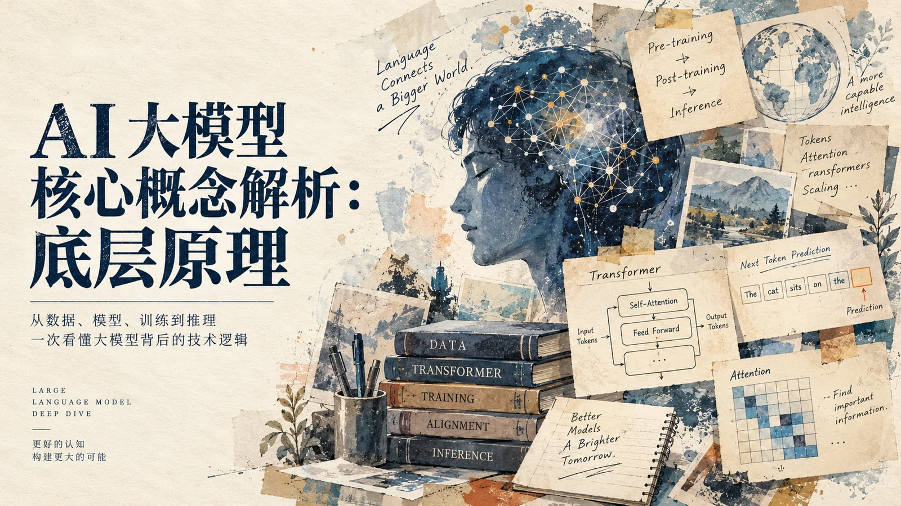</a>

<a href="prompts/watercolor-editorial-collage/index.md"><strong>复古水彩编辑拼贴封面</strong></a> 
封面知识类 · ChatGPT Image · 16:9 水彩 / 拼贴 / 编辑插画 / 纸张质感 / 复古

<a href="prompts/minimal-line-whiteboard-cover/index.md">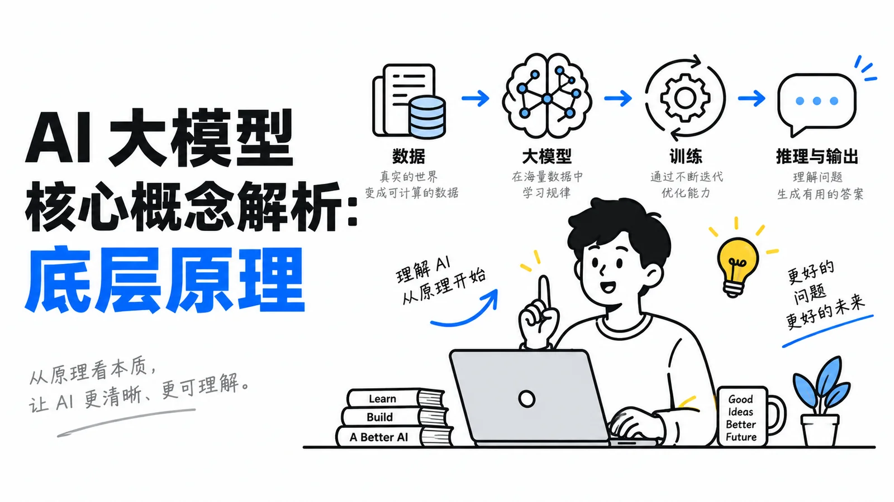</a>

<a href="prompts/minimal-line-whiteboard-cover/index.md"><strong>极简线描白板封面</strong></a> 
封面知识类 · ChatGPT Image · 16:9 极简线描 / 白板插画 / 信息图 / 扁平手绘 / 科技封面

<a href="prompts/warm-paper-handdrawn-flow-cover/index.md">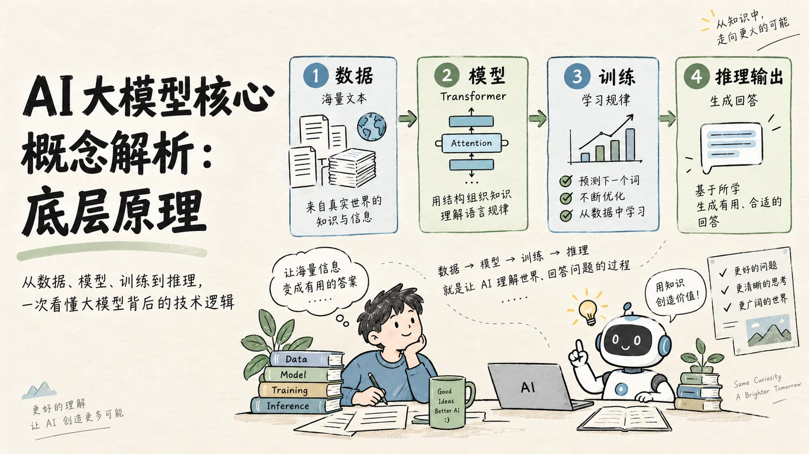</a>

<a href="prompts/warm-paper-handdrawn-flow-cover/index.md"><strong>白板手绘知识图解</strong></a> 
封面知识类 · ChatGPT Image · 16:9 手绘 / 信息图 / 白板 / 流程图解 / 极简插画

<a href="prompts/handdrawn-editorial-infographic/index.md"><strong>手绘编辑型知识信息图</strong></a> 
知识图解类 · ChatGPT Image · 16:9 手绘 / 信息图 / 流程图 / 手帐 / 纸张质感

<a href="prompts/godot-2d-pixel-metaphor-poster/index.md">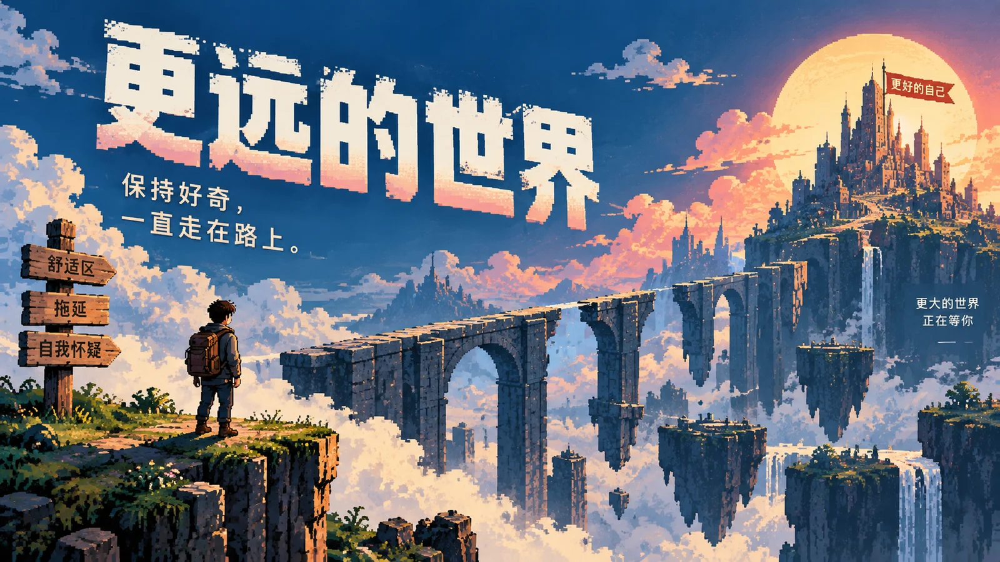</a>

<a href="prompts/godot-2d-pixel-metaphor-poster/index.md"><strong>Godot 2D 像素隐喻海报</strong></a> 
封面设计类 · ChatGPT Images 2.5 · 自定义 像素艺术 / 独立游戏 / Godot / 视觉隐喻 / 游戏关卡 / 概念海报

<a href="prompts/osb-industrial-blue-line-metaphor/index.md"><strong>OSB 工业蓝线条隐喻</strong></a> 
封面设计类 · ChatGPT Images 2.5 · 自定义 OSB刨花板 / 工业蓝 / 极简线条 / 视觉隐喻 / 工业标识 / 编辑封面

<a href="prompts/pixel-avatar-generator/index.md">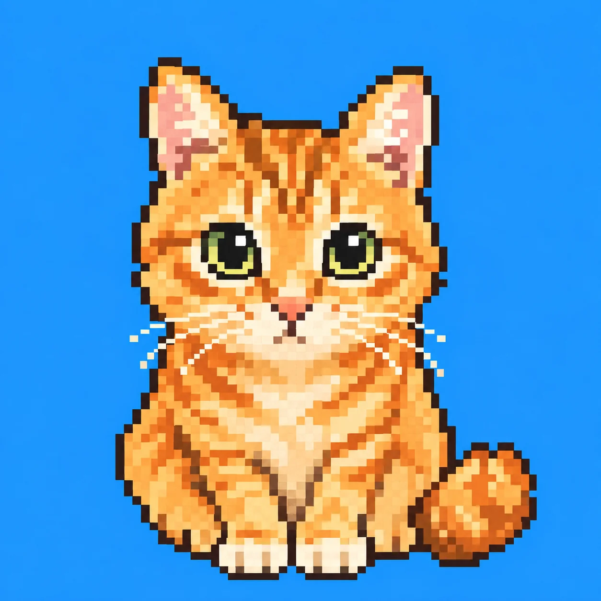</a>

<a href="prompts/pixel-avatar-generator/index.md"><strong>像素风头像生成器</strong></a> 
头像生成类 · ChatGPT Images 2.5 · 1:1 像素风 / 头像 / 8-bit / 复古游戏 / 高饱和配色 / 角色设计

<a href="prompts/consulting-report-visual/index.md"><strong>咨询报告视觉</strong></a> 
封面设计类 · ChatGPT Images 2.5 · 自定义 管理咨询 / 瑞士现代主义 / 商业报告 / 编辑设计 / 战略视觉 / 极简封面

<a href="prompts/business-tech-magazine-cover/index.md"><strong>商业杂志头版</strong></a> 
封面设计类 · ChatGPT Images 2.5 · 自定义 商业杂志 / 科技编辑 / 商业趋势 / 编辑设计 / 概念封面 / 数据新闻

<a href="prompts/four-layer-landmark-poster/index.md"><strong>四层风格城市地标转译海报</strong></a> 
摄影转绘类 · ChatGPT Image · 3:4 城市地标 / 四层海报 / 风格转译 / 摄影转绘 / 旅行海报 / 版画

<a href="prompts/mid-century-geometric-paper-collage/index.md"><strong>复古中期现代主义几何纸片拼贴</strong></a> 
风格转换类 · ChatGPT Images 2.5 · 自定义 几何拼贴 / 纸片插画 / Mid-century / 复古编辑 / 低饱和 / 手工剪纸

<a href="prompts/retro-diffuse-gradient-editorial-poster/index.md">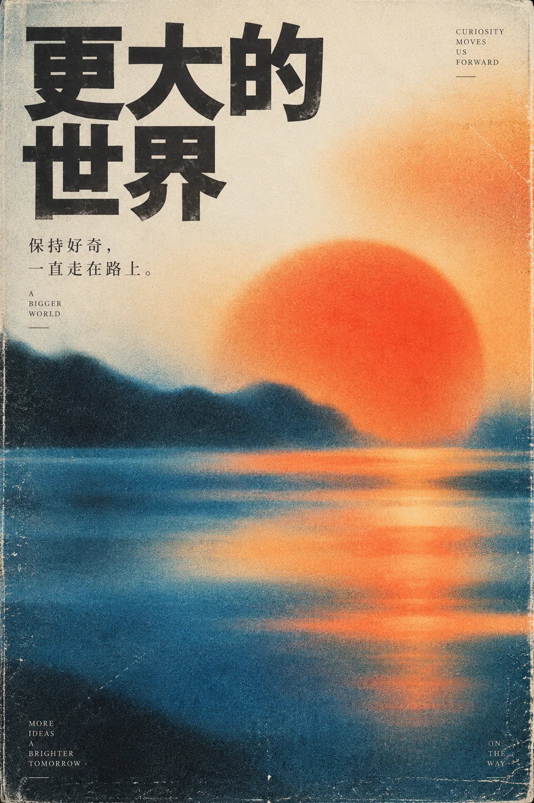</a>

<a href="prompts/retro-diffuse-gradient-editorial-poster/index.md"><strong>复古弥散渐变</strong></a> 
海报设计类 · ChatGPT Images 2.5 · 自定义 弥散渐变 / 复古印刷 / 实验排版 / 编辑海报 / 扫描质感 / 独立杂志

<a href="prompts/vintage-business-infographic/index.md"><strong>复古报刊商业信息图</strong></a> 
封面知识类 · 未注明 · 2:1 复古 / 商业 / 信息图

<a href="prompts/retro-time-dislocation-editorial-cover/index.md"><strong>复古时代错位编辑封面</strong></a> 
封面设计类 · ChatGPT Images 2.5 · 自定义 复古商业插画 / 时代错位 / 编辑设计 / 超现实隐喻 / Mid-century / 杂志封面

<a href="prompts/retro-ink-dot-matrix-metaphor/index.md"><strong>复古油墨点阵隐喻</strong></a> 
封面设计类 · ChatGPT Images 2.5 · 自定义 复古油墨 / 点阵插画 / 极简隐喻 / 档案美学 / 编辑封面 / 机械铅字

<a href="prompts/polaroid-watercolor-pet-portrait/index.md">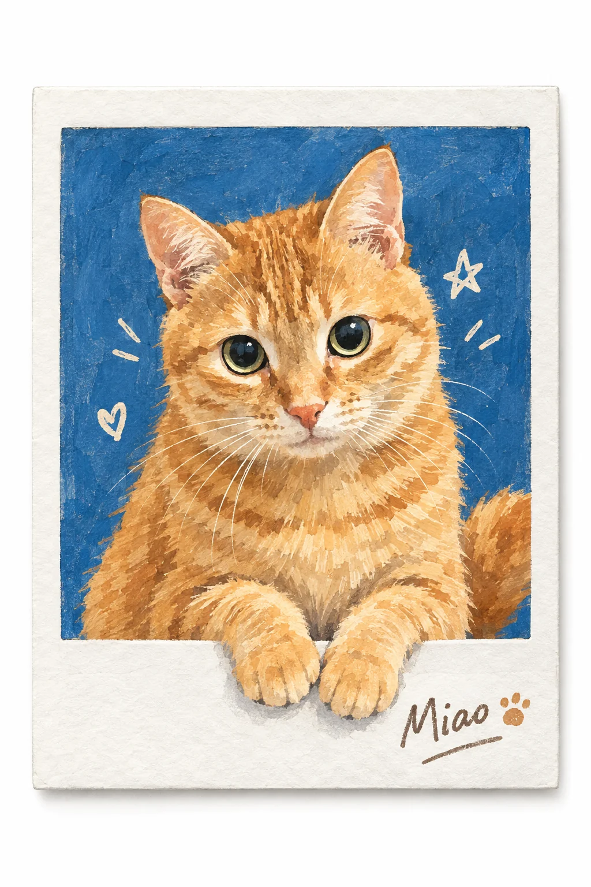</a>

<a href="prompts/polaroid-watercolor-pet-portrait/index.md"><strong>宠物拍立得水彩手绘</strong></a> 
宠物插画类 · ChatGPT Images 2.5 · 自定义 宠物肖像 / 拍立得 / 水彩手绘 / 超框构图 / 手写签名 / 纪念插画

<a href="prompts/color-neo-constructivist-megastructure-poster/index.md"><strong>彩色新构成主义巨构海报</strong></a> 
海报设计类 · ChatGPT Images 2.5 · 自定义 新构成主义 / 巨构视觉 / 几何海报 / 极端尺度 / 限色设计 / 复古印刷

<a href="prompts/handdrawn-tech-infographic/index.md"><strong>手绘技术科普信息图</strong></a> 
封面知识类 · ChatGPT Image · 16:9 手绘 / 信息图 / 科普 / 笔记感 / 技术插画

<a href="prompts/cultural-archive-photo-comparison/index.md"><strong>文化档案式摄影对比海报</strong></a> 
摄影海报类 · ChatGPT Image · 3:2 摄影再设计 / 左右对比 / 文化档案 / 海报设计 / 东方美学

<a href="prompts/voxel-block-world-poster-1/index.md"><strong>方块世界</strong></a> 
海报设计类 · ChatGPT Images 2.5 · 自定义 方块世界 / 体素 / Minecraft / 游戏视觉 / 像素场景 / 立体文字

<a href="prompts/minimal-public-space-editorial-photography/index.md">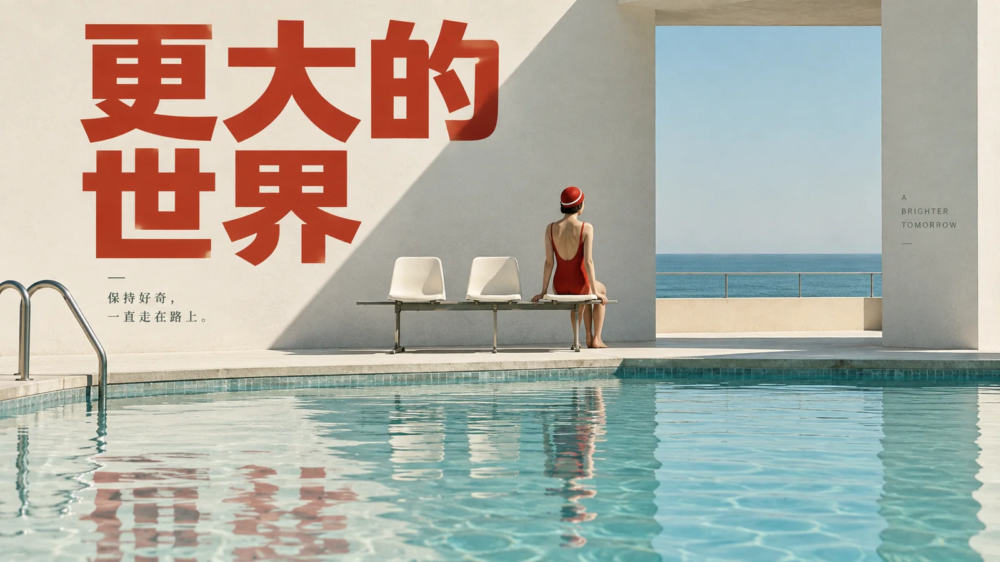</a>

<a href="prompts/minimal-public-space-editorial-photography/index.md"><strong>极简公共空间摄影</strong></a> 
摄影海报类 · ChatGPT Images 2.5 · 自定义 公共空间 / 极简摄影 / 编辑海报 / 几何构图 / 复古色彩 / 空间隐喻

<a href="prompts/minimal-handdrawn-tech-concept-map/index.md"><strong>极简手绘技术概念关系图</strong></a> 
封面知识类 · ChatGPT Image · 16:9 手绘 / 信息图 / 白板 / 技术科普 / 概念图解

<a href="prompts/minimal-paper-acrylic-block-illustration/index.md">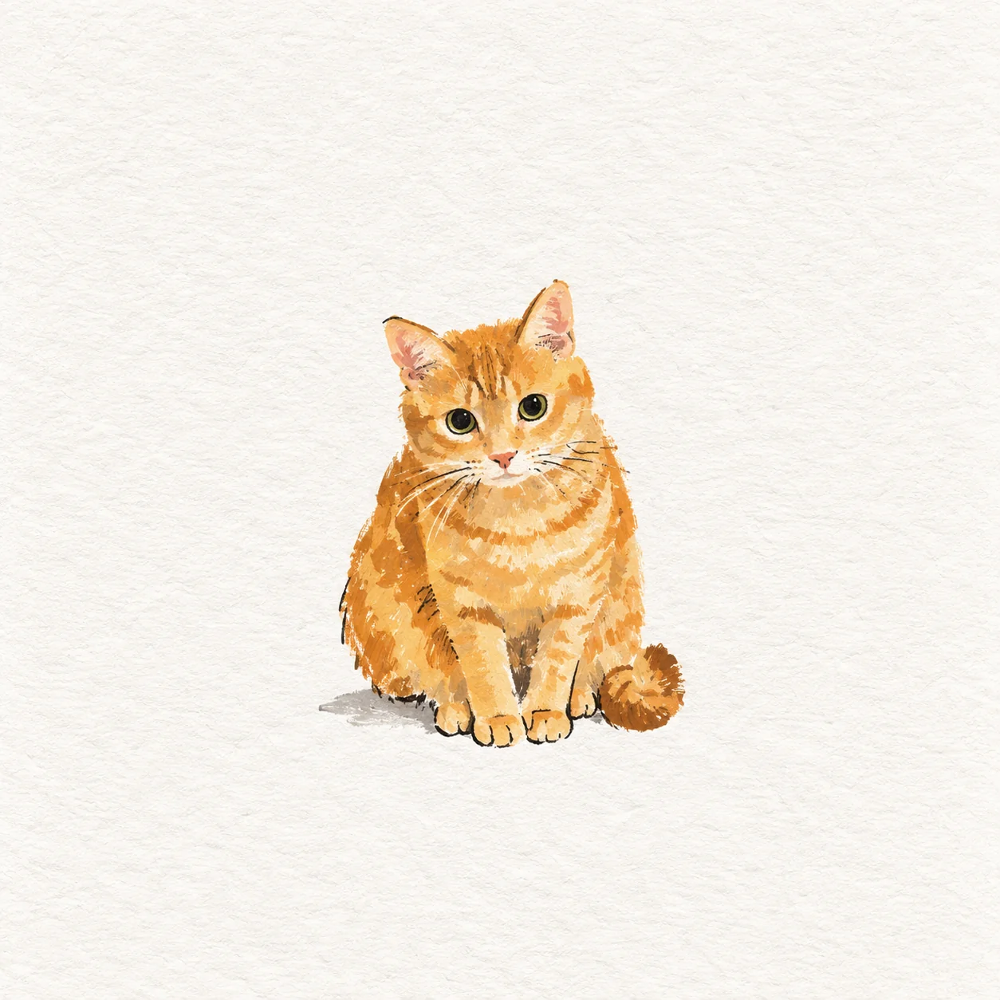</a>

<a href="prompts/minimal-paper-acrylic-block-illustration/index.md"><strong>极简纸感丙烯色块插画</strong></a> 
插画设计类 · ChatGPT Images 2.5 · 自定义 极简插画 / 纸张质感 / 丙烯色块 / 大留白 / 视觉提炼 / 封面插画

<a href="prompts/minimal-visual-metaphor-editorial-cover/index.md">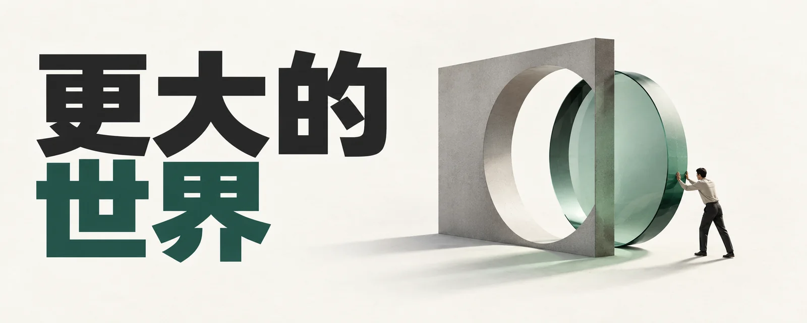</a>

<a href="prompts/minimal-visual-metaphor-editorial-cover/index.md"><strong>极简视觉隐喻风</strong></a> 
封面设计类 · ChatGPT Images 2.5 · 自定义 极简 / 视觉隐喻 / 抽象装置 / 商业科技 / 编辑设计 / 静物摄影

<a href="prompts/minimal-light-tech-visual/index.md"><strong>极简轻科技视觉</strong></a> 
封面视觉类 · ChatGPT Image · 自定义 极简 / 科技 / 渐变 / 品牌视觉 / 轻拟物

<a href="prompts/navy-white-diecut-sticker/index.md"><strong>深蓝白手绘模切贴纸</strong></a> 
参考图风格化 · ChatGPT Image · 1:1 手绘 / 模切贴纸 / 极简插画 / 深蓝白 / 人物宠物 / 参考图重绘

<a href="prompts/scientific-journal-concept-cover/index.md">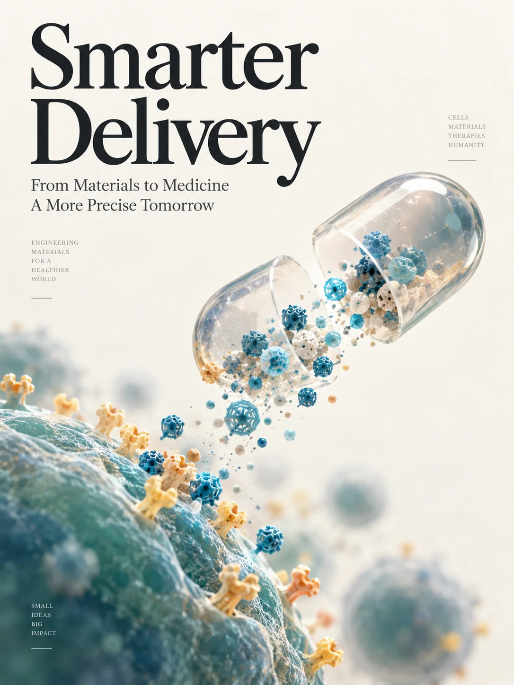</a>

<a href="prompts/scientific-journal-concept-cover/index.md"><strong>科研期刊概念</strong></a> 
封面设计类 · ChatGPT Images 2.5 · 自定义 科研期刊 / 科学封面 / 机制可视化 / 学术视觉 / 编辑设计 / 概念渲染

<a href="prompts/pastel-modular-knowledge-flow/index.md">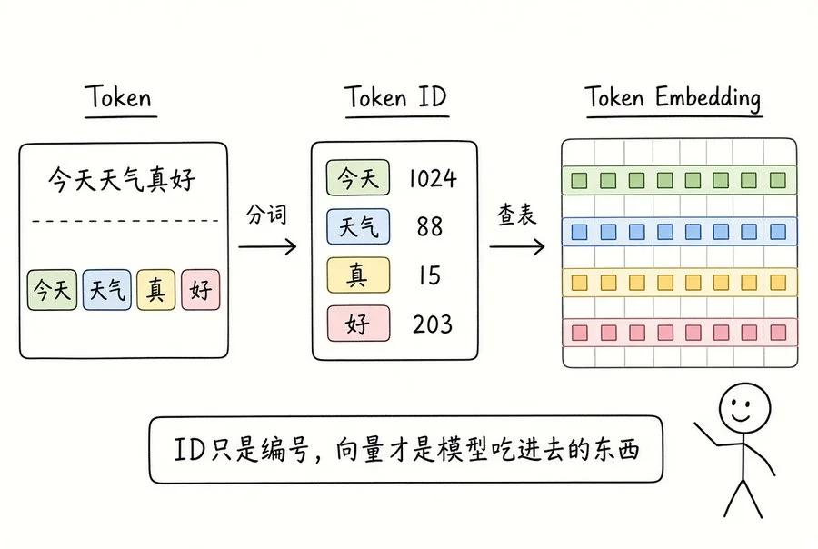</a>

<a href="prompts/pastel-modular-knowledge-flow/index.md"><strong>粉彩模块知识流程讲解图</strong></a> 
封面知识类 · ChatGPT Image · 16:9 手绘 / 信息图 / 白板 / 知识图解 / 流程图 / 科普

<a href="prompts/embossed-debossed-paper-editorial-cover/index.md">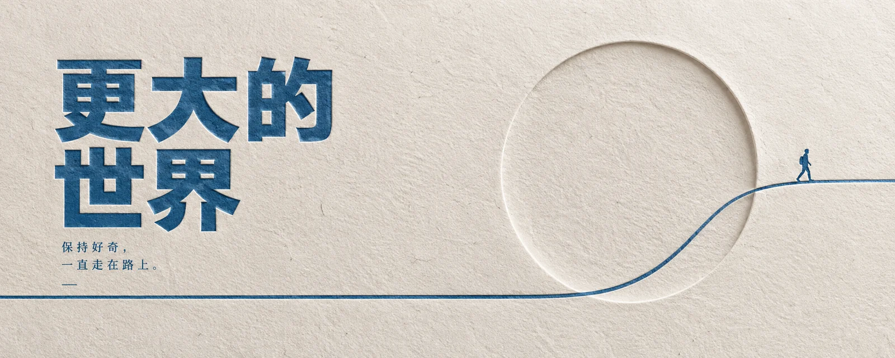</a>

<a href="prompts/embossed-debossed-paper-editorial-cover/index.md"><strong>纸面击凸压凹封面</strong></a> 
封面设计类 · ChatGPT Images 2.5 · 自定义 击凸 / 压凹 / 纸张工艺 / 编辑设计 / 极简海报 / 艺术书封

<a href="prompts/cyber-bioluminescent-flower-infographic/index.md"><strong>赛博生物荧光花卉概念信息图</strong></a> 
科技信息图类 · ChatGPT Image · 9:16 赛博 / 生物荧光 / 花卉 / 信息图 / HUD / X光透视 / 科技档案

<a href="prompts/silver-foil-klein-blue-editorial-cover/index.md"><strong>银色锡纸蓝字</strong></a> 
封面设计类 · ChatGPT Images 2.5 · 自定义 银色锡纸 / 克莱因蓝 / 极简设计 / 线条隐喻 / 编辑封面 / 金属材质

<a href="prompts/black-white-vintage-etching-cover/index.md"><strong>黑白复古蚀刻版画封面</strong></a> 
封面艺术类 · ChatGPT Images 2.5 · 5:2 黑白 / 蚀刻版画 / 铜版画 / 复古 / 超现实 / 编辑插画

<a href="prompts/black-white-gray-avant-garde-geometric-poster/index.md"><strong>黑白灰先锋几何海报</strong></a> 
海报设计类 · ChatGPT Images 2.5 · 自定义 黑白灰 / 几何海报 / 先锋设计 / 现代主义 / 极简排版 / 构成设计

<a href="prompts/black-red-silhouette-cover/index.md"><strong>黑红剪影封面</strong></a> 
封面视觉类 · ChatGPT Image · 自定义 黑红 / 剪影 / 极简 / 高对比 / 编辑封面 / 视觉隐喻

</td>
<td width="50%" valign="top">

<a href="prompts/noir-case-editorial-infographic/index.md">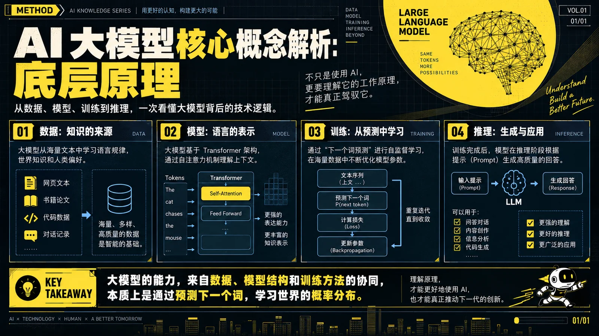</a>

<a href="prompts/noir-case-editorial-infographic/index.md"><strong>暗黑案件风知识图解</strong></a> 
封面知识类 · ChatGPT Image · 16:9 暗黑漫画 / 信息图 / 案件调查 / 编辑排版 / 论文解读

<a href="prompts/case-board-editorial-infographic/index.md">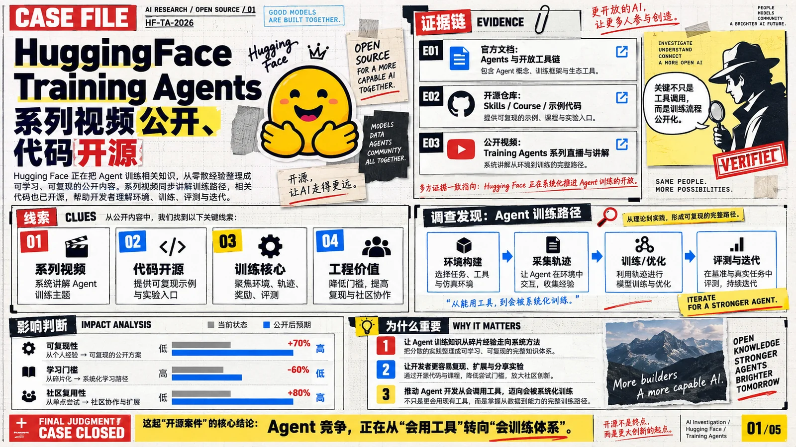</a>

<a href="prompts/case-board-editorial-infographic/index.md"><strong>案件调查风知识图解</strong></a> 
封面知识类 · ChatGPT Image · 16:9 案件调查 / 信息图 / 编辑排版 / 漫画杂志 / 论文解读

<a href="prompts/scientific-editorial-infographic/index.md">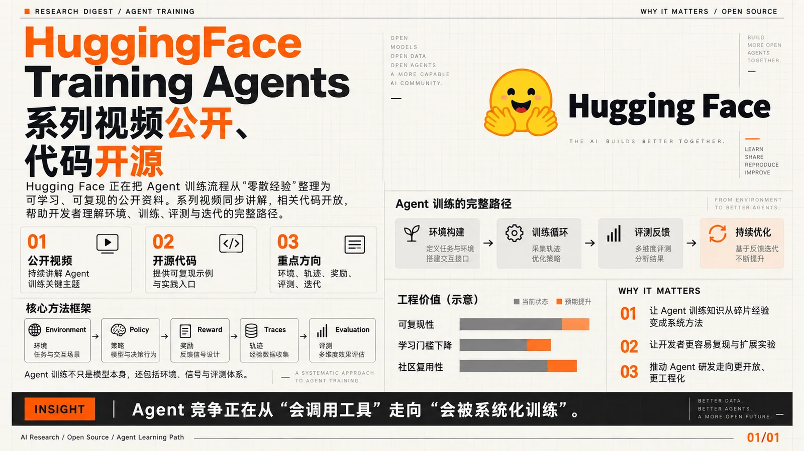</a>

<a href="prompts/scientific-editorial-infographic/index.md"><strong>科研编辑风知识信息图</strong></a> 
封面知识类 · ChatGPT Image · 16:9 科研 / 信息图 / 编辑排版 / 论文解读 / 瑞士网格

<a href="prompts/anthropic-research-editorial/index.md"><strong>Anthropic Research 风格研究编辑封面</strong></a> 
封面视觉类 · ChatGPT Image · 自定义 研究编辑 / 极简 / 手绘隐喻 / 衬线排版 / 大面积留白 / AI研究

<a href="prompts/archive-tabletop-editorial-cover/index.md">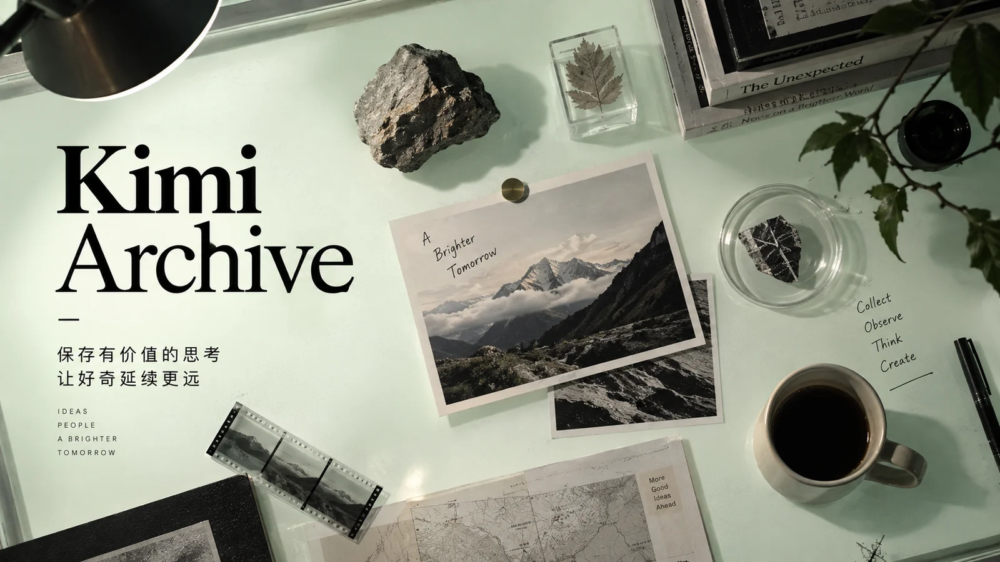</a>

<a href="prompts/archive-tabletop-editorial-cover/index.md"><strong>Kimi Archive 档案美学</strong></a> 
封面设计类 · ChatGPT Images 2.5 · 自定义 档案美学 / 静物摄影 / 编辑设计 / 灯箱桌面 / 概念封面 / 极简留白

<a href="prompts/oriental-minimalist-ink-portrait/index.md"><strong>东方极简水墨线条肖像</strong></a> 
人物艺术类 · ChatGPT Image · 2:3 水墨 / 东方美学 / 极简 / 毛笔线条 / 人物肖像 / 参考图重绘

<a href="prompts/avant-garde-retro-architecture-poster/index.md"><strong>先锋复古建筑海报</strong></a> 
建筑视觉类 · ChatGPT Image · 自定义 建筑 / 复古海报 / 新构成主义 / 编辑设计 / 丝网印刷 / 城市视觉

<a href="prompts/brand-collaboration-connection/index.md"><strong>品牌协同连接</strong></a> 
封面设计类 · ChatGPT Images 2.5 · 自定义 品牌协同 / 工具连接 / 产品集成 / 轻拟物 / 3D图标 / 极简封面

<a href="prompts/business-tech-magazine-cover-1/index.md"><strong>商业杂志头版</strong></a> 
封面设计类 · ChatGPT Images 2.5 · 自定义 商业杂志 / 科技编辑 / 商业趋势 / 编辑设计 / 概念封面 / 数据新闻

<a href="prompts/jinan-typography-travel-poster/index.md"><strong>城市字母填景旅游海报</strong></a> 
旅游海报 · ChatGPT Image · 16:9 城市 / 旅游 / 海报 / 字体设计 / 建筑插画

<a href="prompts/retro-duotone-editorial-infographic/index.md">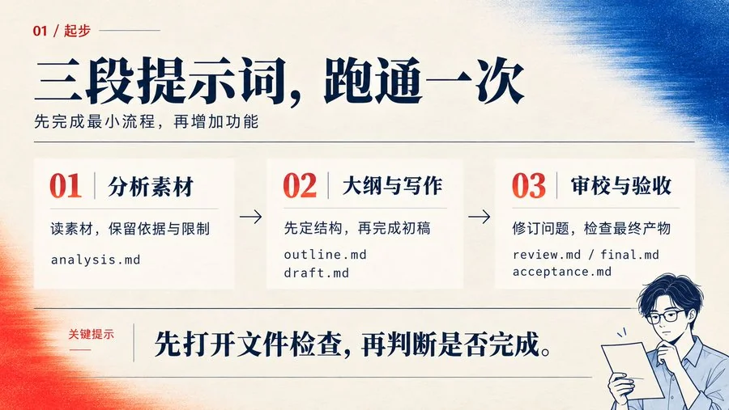</a>

<a href="prompts/retro-duotone-editorial-infographic/index.md"><strong>复古双色编辑知识图解</strong></a> 
封面知识类 · ChatGPT Image · 16:9 复古 / 信息图 / 编辑设计 / 双色印刷 / 知识卡片 / 中文排版

<a href="prompts/retro-torn-paper-collage-editorial-poster/index.md">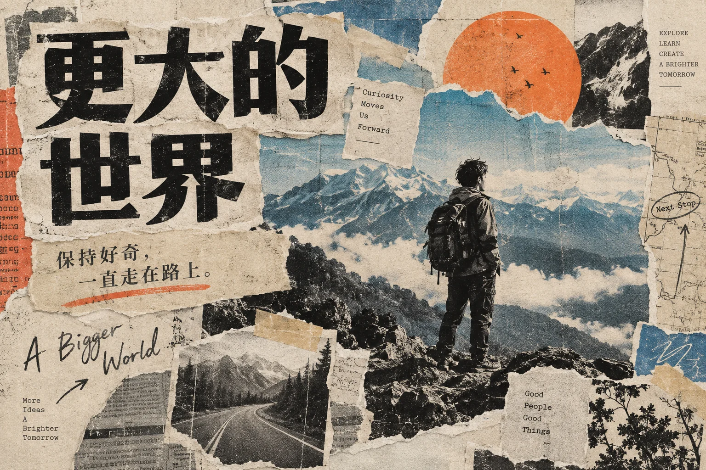</a>

<a href="prompts/retro-torn-paper-collage-editorial-poster/index.md"><strong>复古手撕拼贴</strong></a> 
海报设计类 · ChatGPT Images 2.5 · 自定义 手撕拼贴 / 复古编辑 / 旧报纸 / 杂志海报 / 半调网点 / 手写批注

<a href="prompts/retro-japanese-sci-fi-anime-cover/index.md">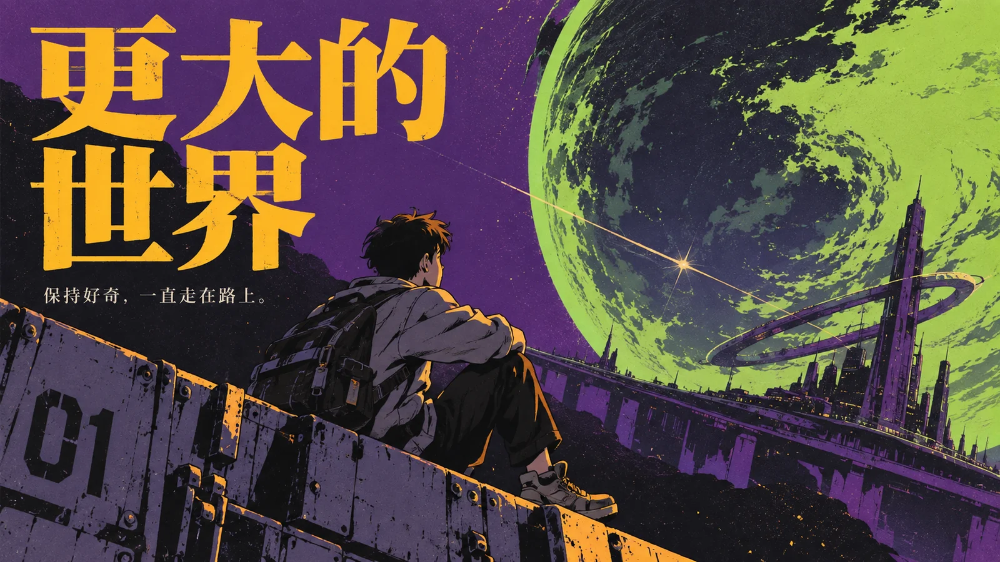</a>

<a href="prompts/retro-japanese-sci-fi-anime-cover/index.md"><strong>复古日本科幻动画</strong></a> 
封面设计类 · ChatGPT Images 2.5 · 自定义 复古动画 / 日本科幻 / 赛璐璐 / 标题卡 / 高饱和限色 / 编辑封面

<a href="prompts/retro-watercolor-tutorial-infographic/index.md">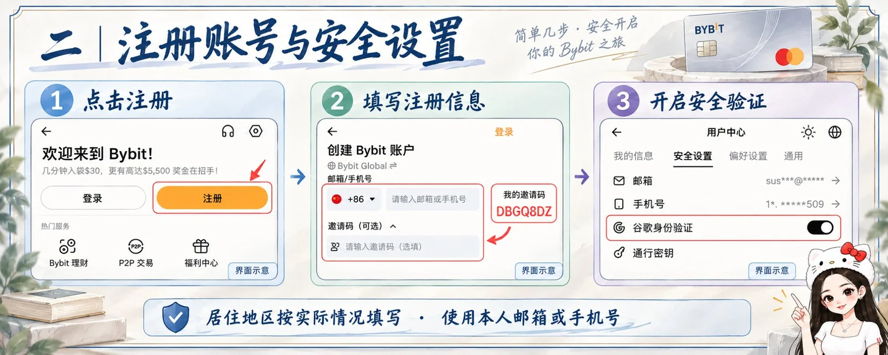</a>

<a href="prompts/retro-watercolor-tutorial-infographic/index.md"><strong>复古水彩手账教程图解</strong></a> 
封面知识类 · ChatGPT Images 2.5 · 5:2 手绘 / 教程 / 信息图 / 水彩 / 步骤图解 / 编辑设计

<a href="prompts/pet-portrait-scribble-line-illustration/index.md">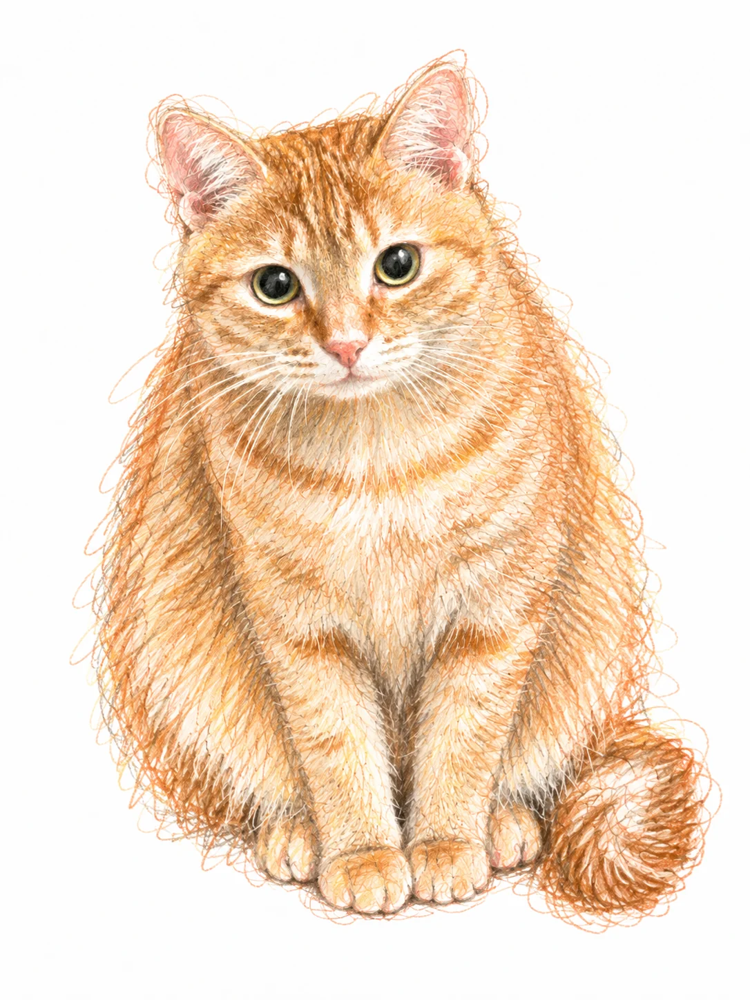</a>

<a href="prompts/pet-portrait-scribble-line-illustration/index.md"><strong>宠物手绘肖像指南</strong></a> 
宠物插画类 · ChatGPT Images 2.5 · 自定义 宠物插画 / 手绘肖像 / 彩铅蜡笔 / 凌乱线条 / 白底留白 / 纪念头像

<a href="prompts/giant-perspective-chinese-title-poster/index.md"><strong>巨型透视中文标题</strong></a> 
海报设计类 · ChatGPT Images 2.5 · 自定义 中文字体 / 巨型标题 / 强透视 / 空间海报 / 视觉冲击 / 字体构成

<a href="prompts/grotesque-soul-handdrawn-portrait/index.md"><strong>怪诞灵魂手绘</strong></a> 
人物插画类 · ChatGPT Images 2.5 · 自定义 怪诞手绘 / 情绪夸张 / 彩色铅笔 / 蜡笔 / 圆珠笔 / 人物重绘

<a href="prompts/handdrawn-notebook-infographic/index.md"><strong>手绘笔记知识图解</strong></a> 
知识信息图类 · ChatGPT Image · 3:4 手绘 / 信息图 / 笔记本 / 知识图解 / 马克笔 / 技术科普

<a href="prompts/voxel-block-world-poster/index.md"><strong>方块世界</strong></a> 
海报设计类 · ChatGPT Images 2.5 · 自定义 方块世界 / 体素 / Minecraft / 游戏视觉 / 像素场景 / 立体文字

<a href="prompts/minimal-low-poly-editorial-illustration/index.md">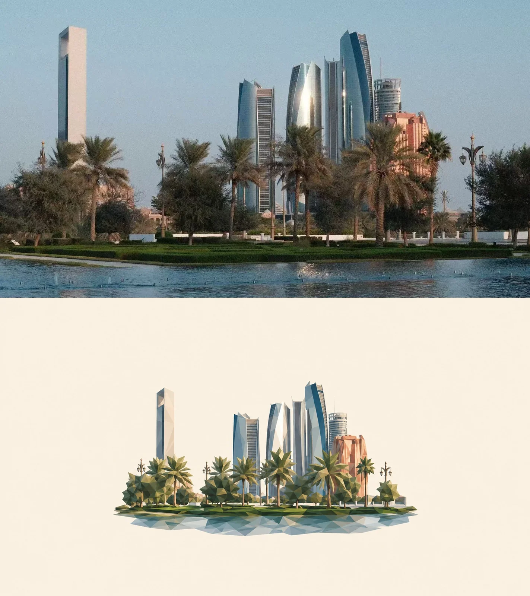</a>

<a href="prompts/minimal-low-poly-editorial-illustration/index.md"><strong>极简低多边形编辑插画</strong></a> 
风格转换类 · ChatGPT Images 2.5 · 自定义 Low Poly / 极简插画 / 编辑插画 / 几何切面 / 大留白 / 照片重绘

<a href="prompts/minimal-strategy-editorial-infographic/index.md">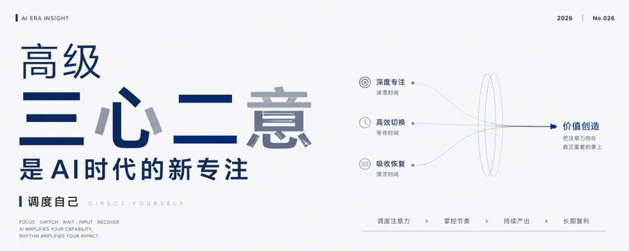</a>

<a href="prompts/minimal-strategy-editorial-infographic/index.md"><strong>极简战略编辑知识图解</strong></a> 
封面知识类 · ChatGPT Images 2.5 · 16:9 极简 / 编辑设计 / 知识图解 / 战略咨询 / 商业思维 / 瑞士网格

<a href="prompts/minimal-editorial-typography/index.md"><strong>极简杂志文字排版</strong></a> 
封面知识类 · ChatGPT Image · 3:4 极简 / 文字排版 / 杂志设计 / 编辑设计 / 高级感

<a href="prompts/minimal-ink-concept-editorial-cover/index.md"><strong>极简纸本墨线概念封面</strong></a> 
封面概念类 · ChatGPT Image · 自定义 极简 / 墨线 / 视觉隐喻 / 编辑设计 / 纸本 / 概念封面

<a href="prompts/minimal-light-tech-cover/index.md">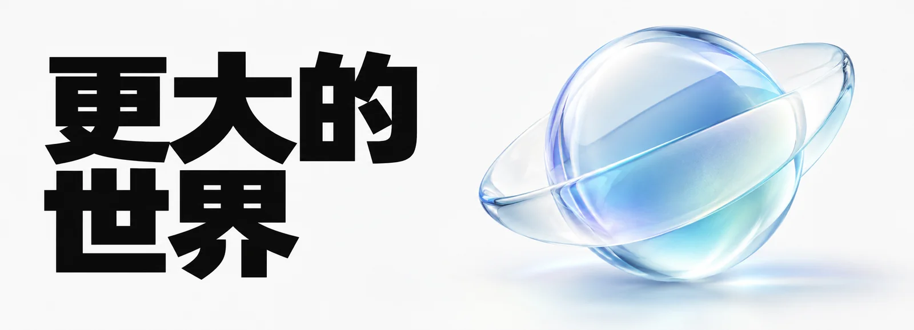</a>

<a href="prompts/minimal-light-tech-cover/index.md"><strong>极简轻科技</strong></a> 
封面设计类 · ChatGPT Images 2.5 · 自定义 极简科技 / 轻科技 / 3D玻璃 / 品牌视觉 / 产品封面 / 大留白

<a href="prompts/french-minimal-ink-concept-poster/index.md"><strong>法式极简墨线海报</strong></a> 
封面设计类 · ChatGPT Images 2.5 · 自定义 法式极简 / 墨线插画 / 概念海报 / 视觉隐喻 / 编辑设计 / 大留白

<a href="prompts/whiteboard-infographic/index.md"><strong>白板手绘知识图解</strong></a> 
封面知识类 · 未注明 · 16:9 手绘 / 白板 / 信息图

<a href="prompts/3d-paper-cut-concept-poster/index.md"><strong>立体纸雕概念海报</strong></a> 
封面设计类 · ChatGPT Images 2.5 · 自定义 纸雕 / 立体剪纸 / 视觉隐喻 / 编辑设计 / 极简留白 / 概念海报

<a href="prompts/red-annotated-whiteboard-teaching-guide/index.md"><strong>红色批注白板教学拆解图</strong></a> 
封面知识类 · ChatGPT Image · 16:9 手绘 / 信息图 / 白板 / 流程图 / 教学图解

<a href="prompts/semantic-translation-minimal-poster/index.md">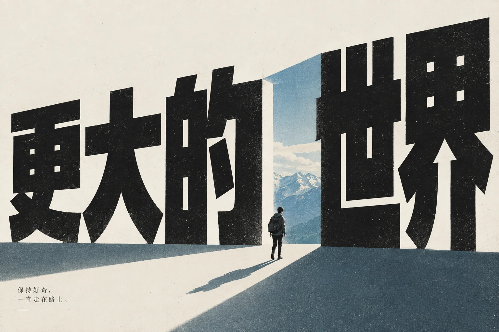</a>

<a href="prompts/semantic-translation-minimal-poster/index.md"><strong>语义转译极简</strong></a> 
海报设计类 · ChatGPT Images 2.5 · 自定义 语义转译 / 极简海报 / 文字构成 / 视觉隐喻 / 编辑设计 / 概念海报

<a href="prompts/oversized-title-interleaved-editorial-poster/index.md"><strong>超大标题图文穿插</strong></a> 
海报设计类 · ChatGPT Images 2.5 · 自定义 超大标题 / 图文穿插 / 编辑设计 / 杂志封面 / 品牌视觉 / 现代海报

<a href="prompts/pastel-handdrawn-infographic/index.md">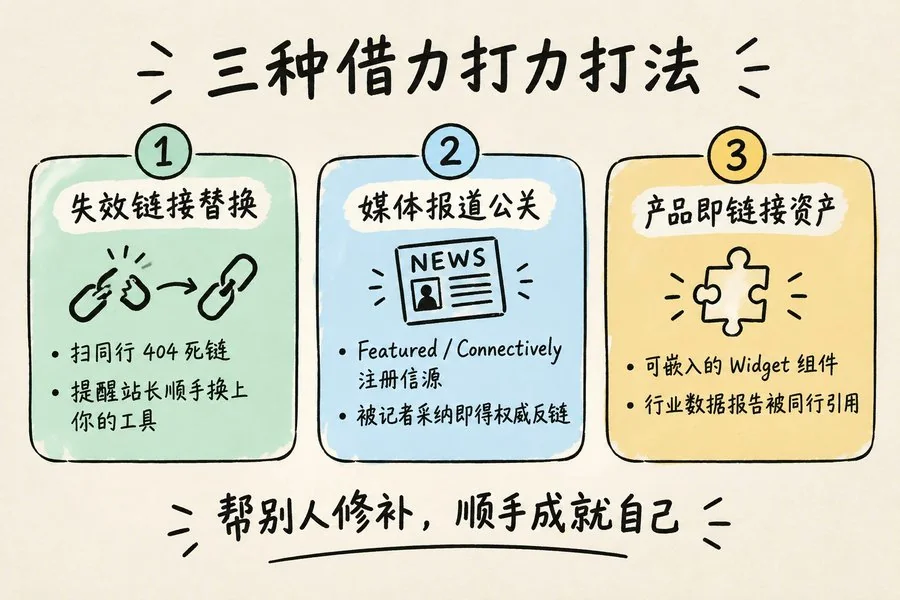</a>

<a href="prompts/pastel-handdrawn-infographic/index.md"><strong>马卡龙纸张手绘知识图解</strong></a> 
封面知识类 · ChatGPT Image · 自定义 手绘 / 信息图 / 马卡龙 / 纸张 / 知识图解 / 手写字

<a href="prompts/black-white-minimal-concept-poster/index.md"><strong>黑白极简概念海报</strong></a> 
海报设计类 · ChatGPT Images 2.5 · 自定义 黑白灰 / 极简 / 概念海报 / 编辑设计 / 现代主义 / 作品集封面

<a href="prompts/editorial-boundary-illustration/index.md"><strong>黑白越界编辑插画</strong></a> 
参考图风格化 · ChatGPT Image · 4:5 黑白插画 / 编辑设计 / 越界构图 / 几何色块 / 手绘线稿 / 参考图重构

<a href="prompts/black-retro-modernist-cover/index.md"><strong>黑色复古现代主义封面</strong></a> 
封面视觉类 · ChatGPT Image · 自定义 黑色封面 / 复古现代主义 / 编辑插画 / 几何构成 / 书封设计 / 丝网印刷

</td>
</tr>
</table>
