# Image Prompts

> 此文件由 `python tools/add_prompt.py rebuild` 自动生成，请勿手工编辑。

## 人物艺术类

### 东方极简水墨线条肖像

[查看 Prompt](prompts/oriental-minimalist-ink-portrait/index.md) · 水墨 / 东方美学 / 极简 / 毛笔线条 / 人物肖像 / 参考图重绘 · ChatGPT Image · 2:3

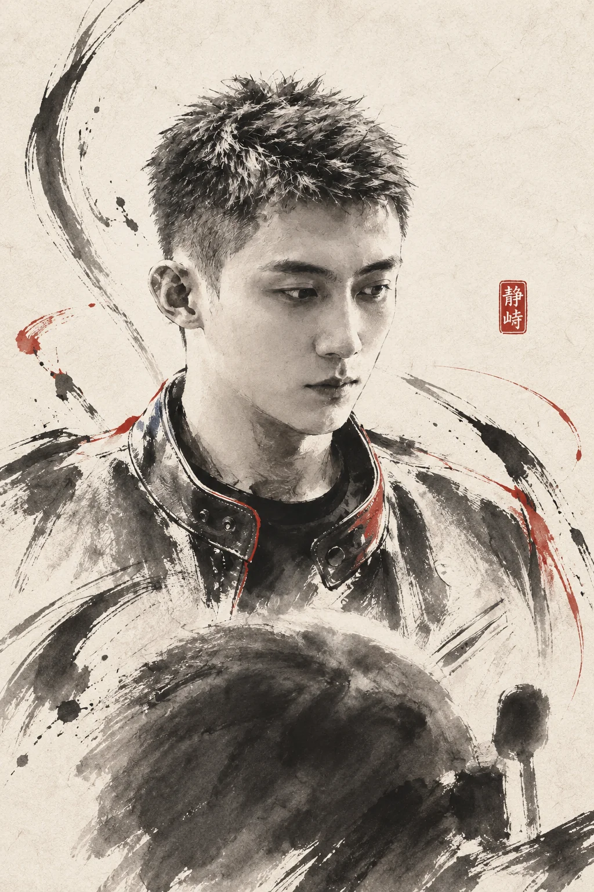

## 参考图风格化

### 深蓝白手绘模切贴纸

[查看 Prompt](prompts/navy-white-diecut-sticker/index.md) · 手绘 / 模切贴纸 / 极简插画 / 深蓝白 / 人物宠物 / 参考图重绘 · ChatGPT Image · 1:1

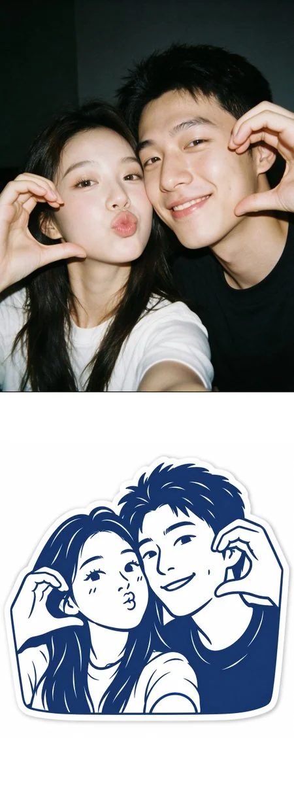

### 黑白越界编辑插画

[查看 Prompt](prompts/editorial-boundary-illustration/index.md) · 黑白插画 / 编辑设计 / 越界构图 / 几何色块 / 手绘线稿 / 参考图重构 · ChatGPT Image · 4:5

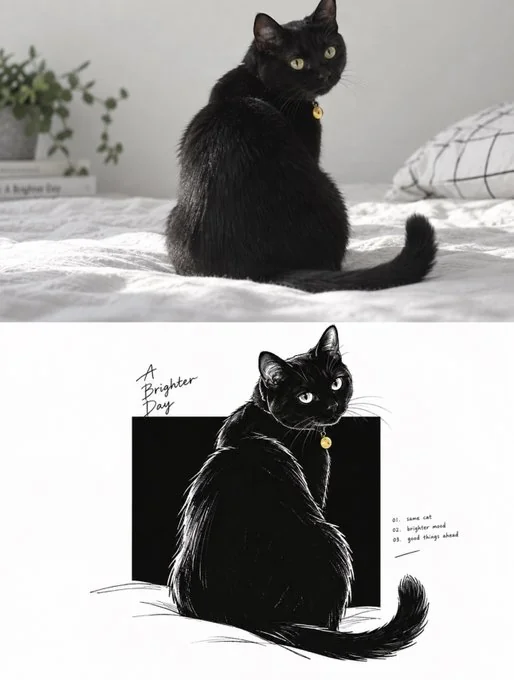

## 封面知识类

### 复古报刊商业信息图

[查看 Prompt](prompts/vintage-business-infographic/index.md) · 复古 / 商业 / 信息图 · 未注明 · 2:1

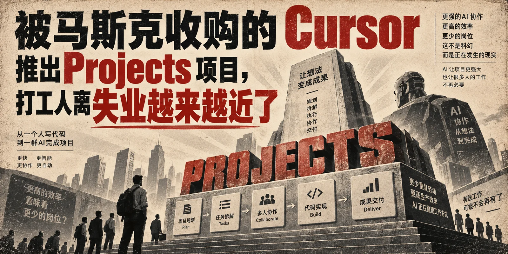

### 手绘技术科普信息图

[查看 Prompt](prompts/handdrawn-tech-infographic/index.md) · 手绘 / 信息图 / 科普 / 笔记感 / 技术插画 · ChatGPT Image · 16:9

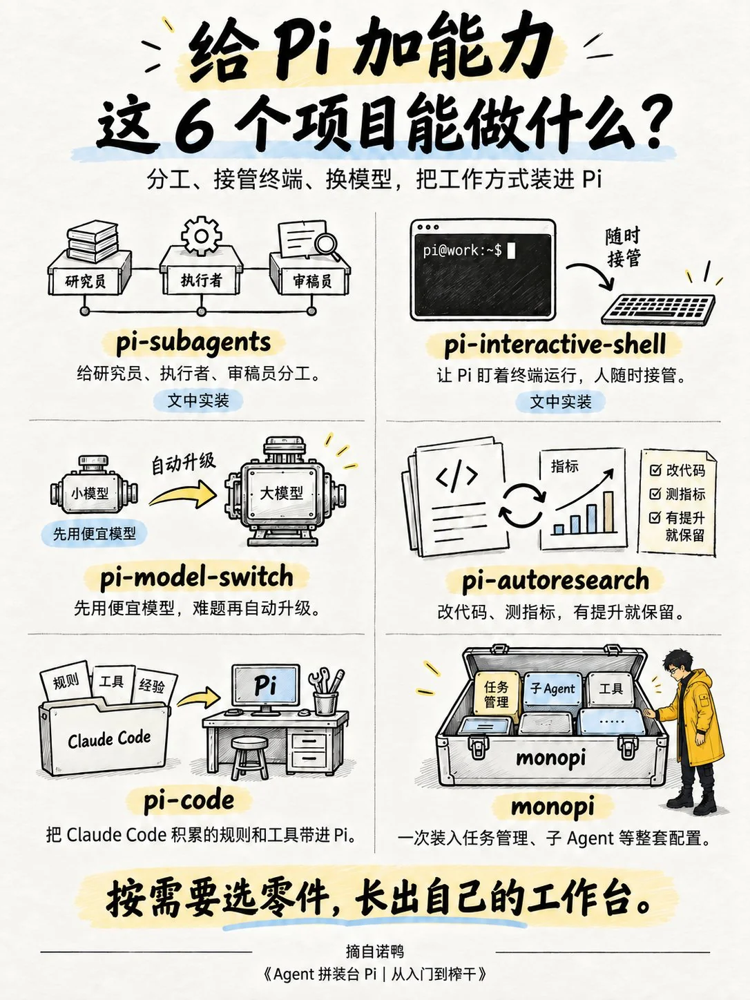

### 极简杂志文字排版

[查看 Prompt](prompts/minimal-editorial-typography/index.md) · 极简 / 文字排版 / 杂志设计 / 编辑设计 / 高级感 · ChatGPT Image · 3:4

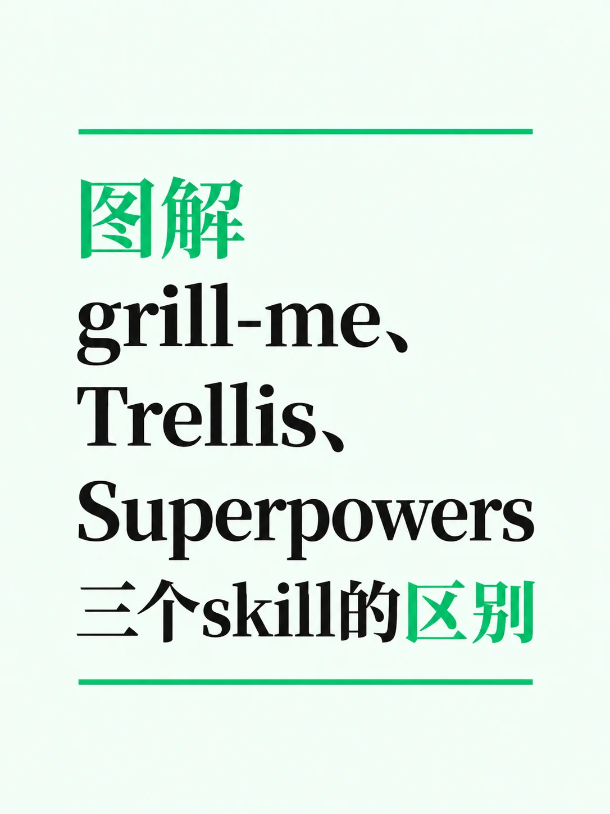

### 白板手绘知识图解

[查看 Prompt](prompts/whiteboard-infographic/index.md) · 手绘 / 白板 / 信息图 · 未注明 · 16:9

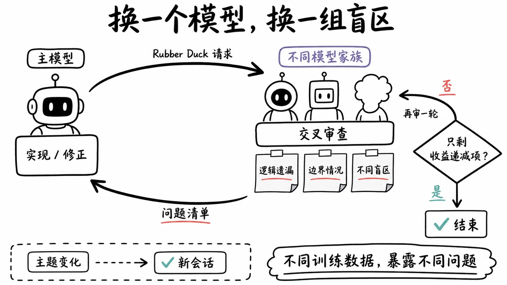

### 白板手绘知识图解

[查看 Prompt](prompts/whiteboard-infographic-1/index.md) · 手绘 / 信息图 / 白板 / 技术科普 / 概念图解 · ChatGPT Image · 16:9

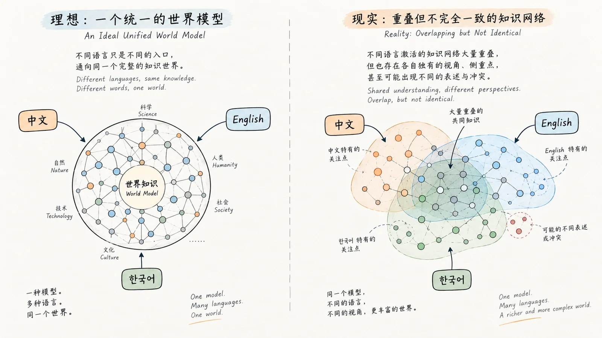

## 封面艺术类

### 黑白复古蚀刻版画封面

[查看 Prompt](prompts/black-white-vintage-etching-cover/index.md) · 黑白 / 蚀刻版画 / 铜版画 / 复古 / 超现实 / 编辑插画 · ChatGPT Images 2.5 · 5:2

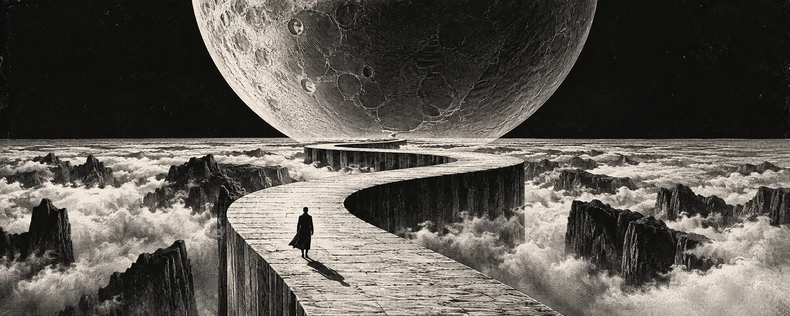

## 封面视觉类

### Anthropic Research 风格研究编辑封面

[查看 Prompt](prompts/anthropic-research-editorial/index.md) · 研究编辑 / 极简 / 手绘隐喻 / 衬线排版 / 大面积留白 / AI研究 · ChatGPT Image · 自定义

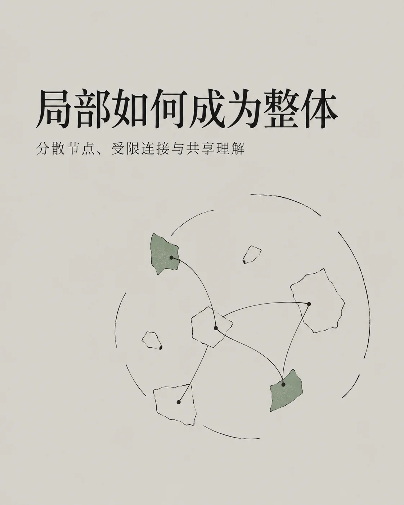

### 极简轻科技视觉

[查看 Prompt](prompts/minimal-light-tech-visual/index.md) · 极简 / 科技 / 渐变 / 品牌视觉 / 轻拟物 · ChatGPT Image · 自定义

### 黑红剪影封面

[查看 Prompt](prompts/black-red-silhouette-cover/index.md) · 黑红 / 剪影 / 极简 / 高对比 / 编辑封面 / 视觉隐喻 · ChatGPT Image · 自定义

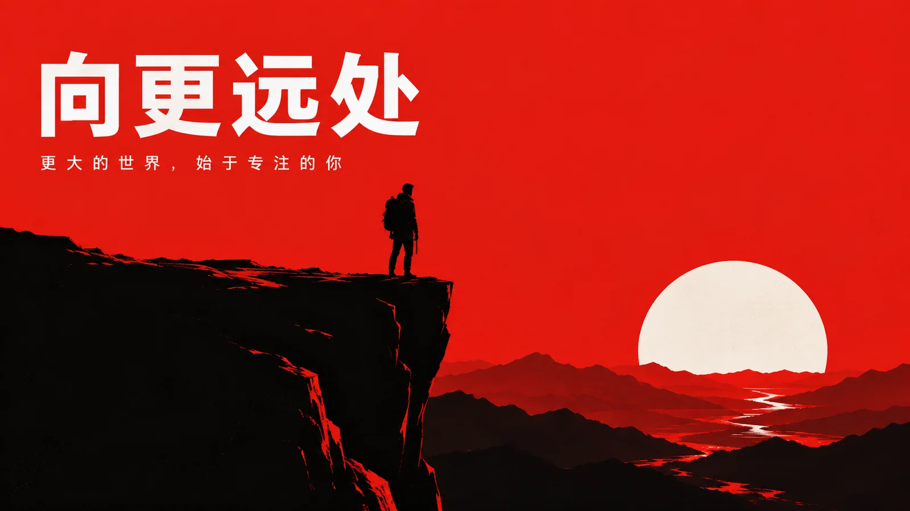

### 黑色复古现代主义封面

[查看 Prompt](prompts/black-retro-modernist-cover/index.md) · 黑色封面 / 复古现代主义 / 编辑插画 / 几何构成 / 书封设计 / 丝网印刷 · ChatGPT Image · 自定义

## 封面设计类

### 咨询报告视觉

[查看 Prompt](prompts/consulting-report-visual/index.md) · 管理咨询 / 瑞士现代主义 / 商业报告 / 编辑设计 / 战略视觉 / 极简封面 · ChatGPT Images 2.5 · 自定义

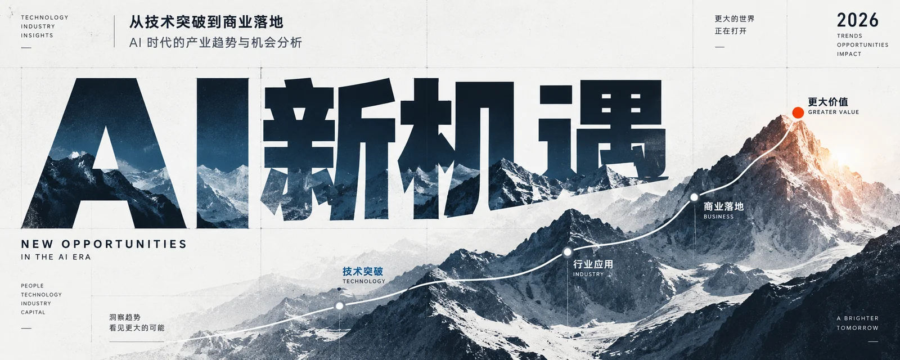

### 品牌协同连接

[查看 Prompt](prompts/brand-collaboration-connection/index.md) · 品牌协同 / 工具连接 / 产品集成 / 轻拟物 / 3D图标 / 极简封面 · ChatGPT Images 2.5 · 自定义

### 商业杂志头版

[查看 Prompt](prompts/business-tech-magazine-cover/index.md) · 商业杂志 / 科技编辑 / 商业趋势 / 编辑设计 / 概念封面 / 数据新闻 · ChatGPT Images 2.5 · 自定义

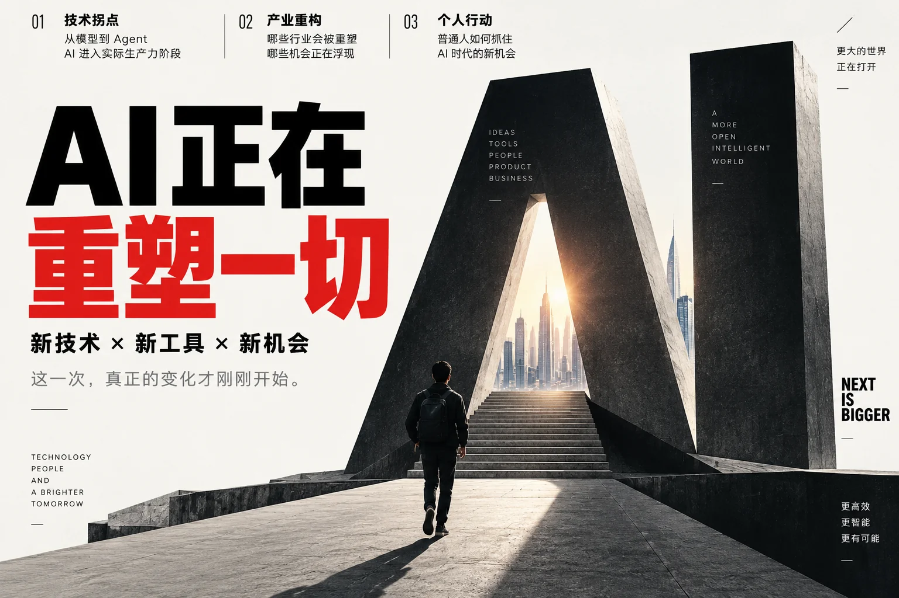

### 商业杂志头版

[查看 Prompt](prompts/business-tech-magazine-cover-1/index.md) · 商业杂志 / 科技编辑 / 商业趋势 / 编辑设计 / 概念封面 / 数据新闻 · ChatGPT Images 2.5 · 自定义

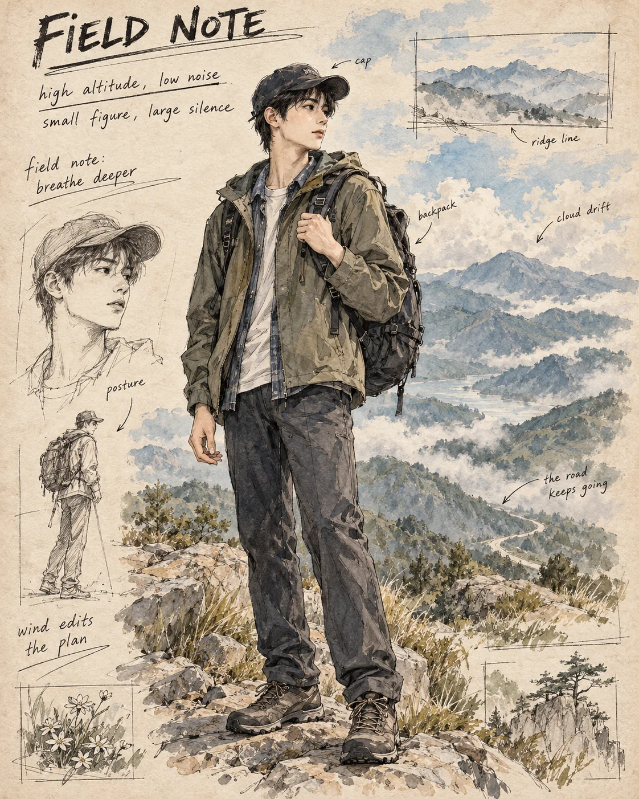

### 法式极简墨线海报

[查看 Prompt](prompts/french-minimal-ink-concept-poster/index.md) · 法式极简 / 墨线插画 / 概念海报 / 视觉隐喻 / 编辑设计 / 大留白 · ChatGPT Images 2.5 · 自定义

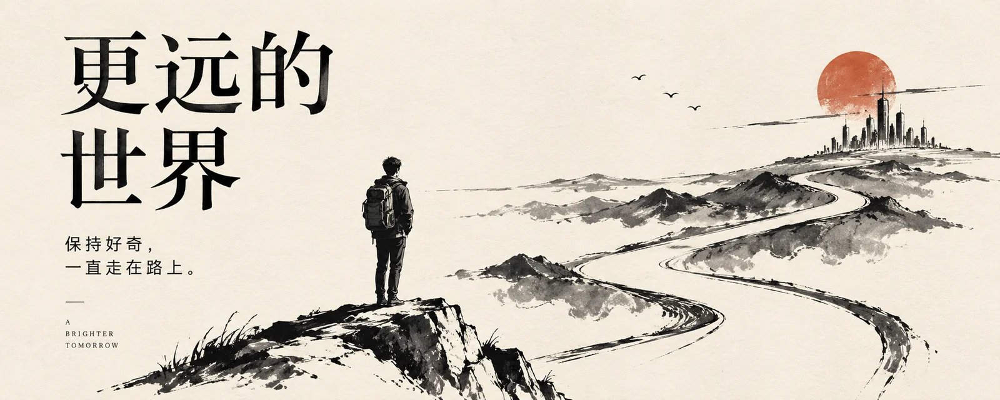

## 建筑视觉类

### 先锋复古建筑海报

[查看 Prompt](prompts/avant-garde-retro-architecture-poster/index.md) · 建筑 / 复古海报 / 新构成主义 / 编辑设计 / 丝网印刷 / 城市视觉 · ChatGPT Image · 自定义

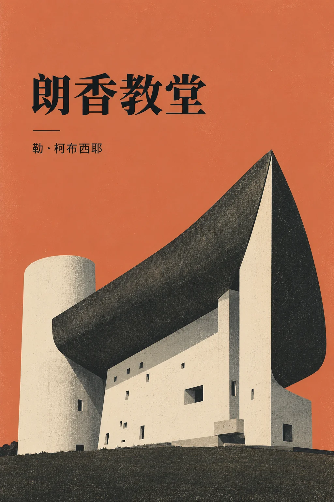

## 摄影海报类

### 文化档案式摄影对比海报

[查看 Prompt](prompts/cultural-archive-photo-comparison/index.md) · 摄影再设计 / 左右对比 / 文化档案 / 海报设计 / 东方美学 · ChatGPT Image · 3:2

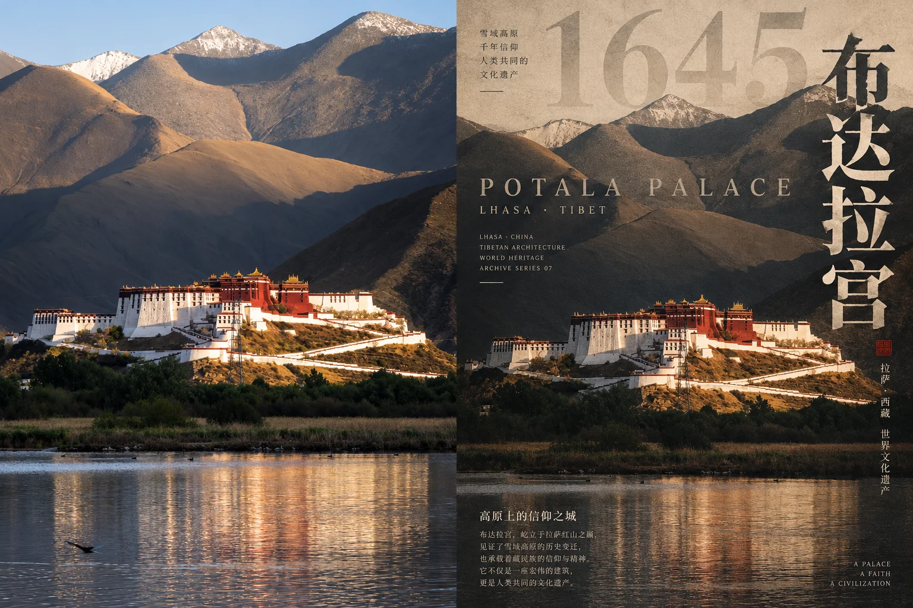

## 摄影转绘类

### 四层风格城市地标转译海报

[查看 Prompt](prompts/four-layer-landmark-poster/index.md) · 城市地标 / 四层海报 / 风格转译 / 摄影转绘 / 旅行海报 / 版画 · ChatGPT Image · 3:4

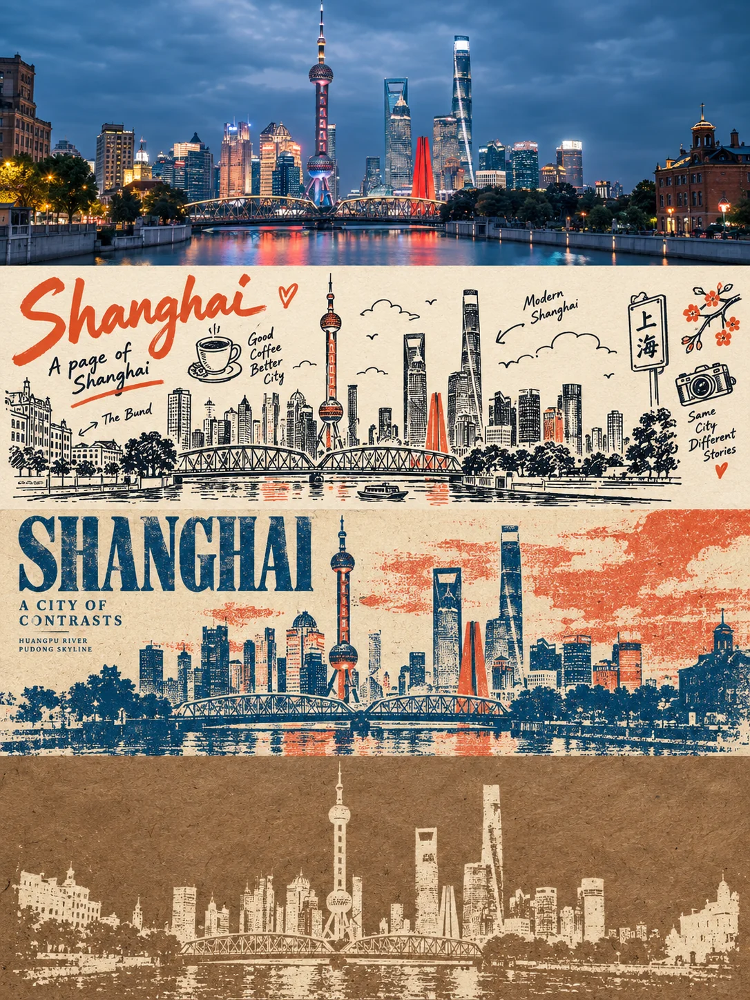

## 旅游海报

### 城市字母填景旅游海报

[查看 Prompt](prompts/jinan-typography-travel-poster/index.md) · 城市 / 旅游 / 海报 / 字体设计 / 建筑插画 · ChatGPT Image · 16:9

## 海报设计类

### 巨型透视中文标题

[查看 Prompt](prompts/giant-perspective-chinese-title-poster/index.md) · 中文字体 / 巨型标题 / 强透视 / 空间海报 / 视觉冲击 / 字体构成 · ChatGPT Images 2.5 · 自定义

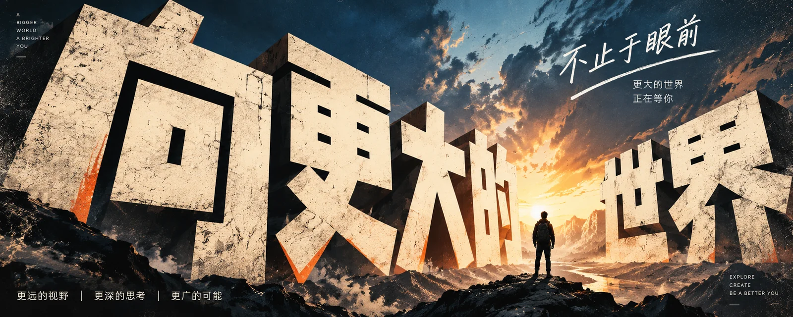

### 彩色新构成主义巨构海报

[查看 Prompt](prompts/color-neo-constructivist-megastructure-poster/index.md) · 新构成主义 / 巨构视觉 / 几何海报 / 极端尺度 / 限色设计 / 复古印刷 · ChatGPT Images 2.5 · 自定义

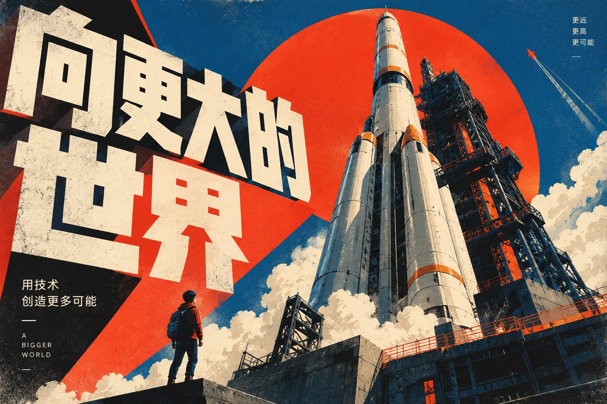

### 方块世界

[查看 Prompt](prompts/voxel-block-world-poster/index.md) · 方块世界 / 体素 / Minecraft / 游戏视觉 / 像素场景 / 立体文字 · ChatGPT Images 2.5 · 自定义

### 方块世界

[查看 Prompt](prompts/voxel-block-world-poster-1/index.md) · 方块世界 / 体素 / Minecraft / 游戏视觉 / 像素场景 / 立体文字 · ChatGPT Images 2.5 · 自定义

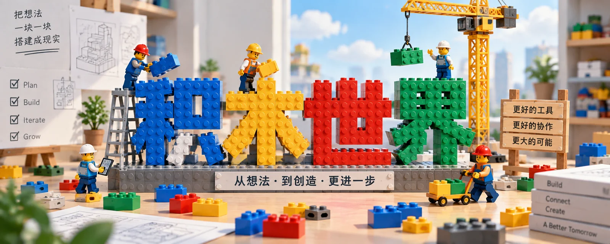

### 黑白极简概念海报

[查看 Prompt](prompts/black-white-minimal-concept-poster/index.md) · 黑白灰 / 极简 / 概念海报 / 编辑设计 / 现代主义 / 作品集封面 · ChatGPT Images 2.5 · 自定义

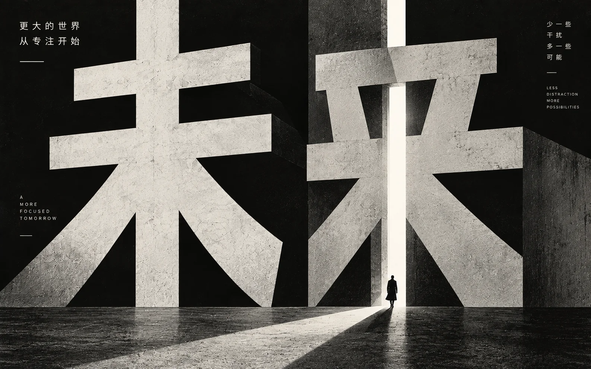

### 黑白灰先锋几何海报

[查看 Prompt](prompts/black-white-gray-avant-garde-geometric-poster/index.md) · 黑白灰 / 几何海报 / 先锋设计 / 现代主义 / 极简排版 / 构成设计 · ChatGPT Images 2.5 · 自定义

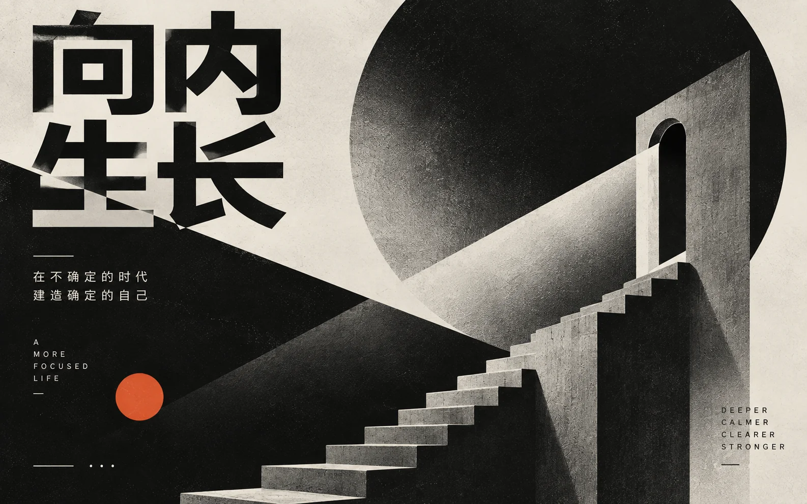

## 知识信息图类

### 手绘笔记知识图解

[查看 Prompt](prompts/handdrawn-notebook-infographic/index.md) · 手绘 / 信息图 / 笔记本 / 知识图解 / 马克笔 / 技术科普 · ChatGPT Image · 3:4

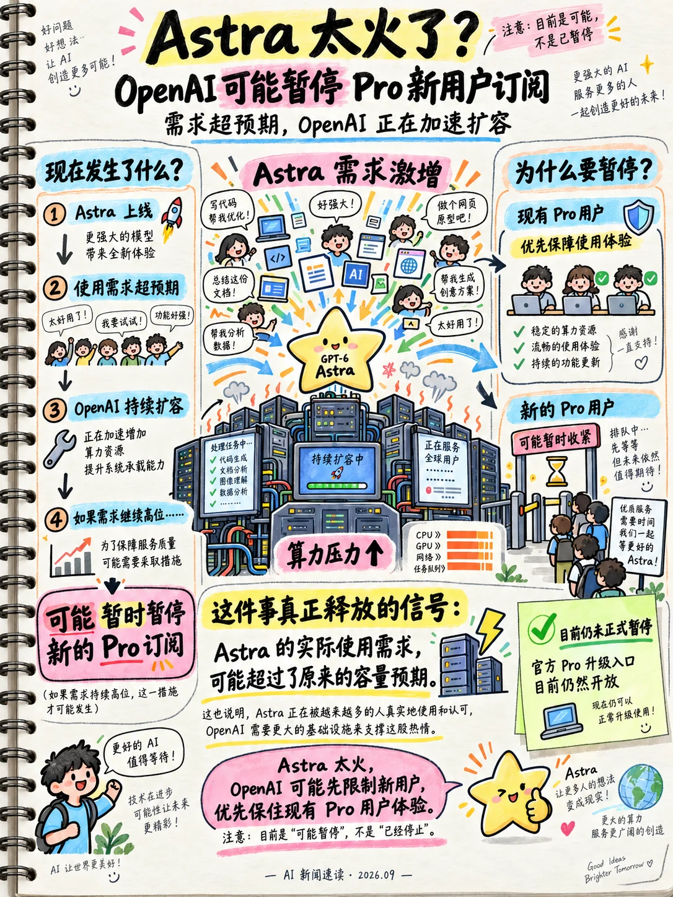

## 科技信息图类

### 赛博生物荧光花卉概念信息图

[查看 Prompt](prompts/cyber-bioluminescent-flower-infographic/index.md) · 赛博 / 生物荧光 / 花卉 / 信息图 / HUD / X光透视 / 科技档案 · ChatGPT Image · 9:16

