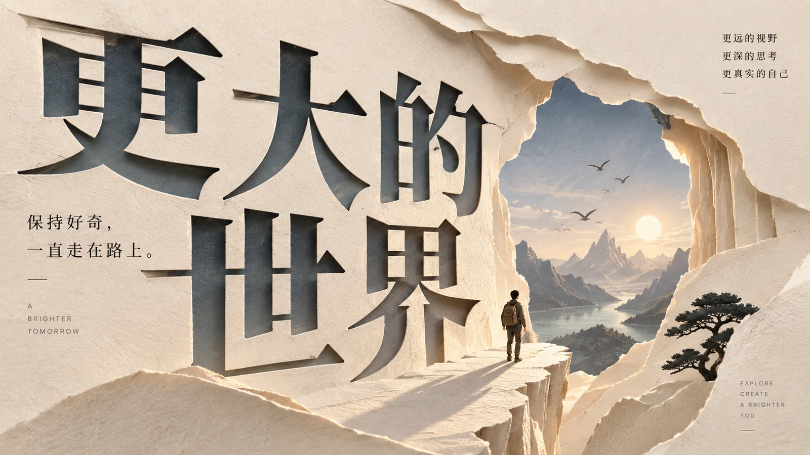

# 立体纸雕概念海报



## Prompt

```text
围绕用户提供的主题，创作一张高级 3D Paper Cut / 立体纸雕概念海报。

这不是普通插画叠加纸张纹理，也不是儿童剪纸。

请先理解“{{主题或主标题}}”真正表达的核心观点、关系、情绪、矛盾或变化，
再提炼一个最准确的视觉隐喻，
并将这个隐喻完整转译成一个由真实纸张切割、折叠、镂空和层叠形成的立体纸雕装置。

整个画面只保留：
1 个核心概念，
1 个核心视觉隐喻，
1 个主视觉，
1 个明确视觉中心，
1 套统一纸雕空间，
必要的标题信息，
大片经过设计的留白。

所有纸层、文字、主体、阴影和空间必须属于同一个真实纸雕世界。

【输入】
主题 / 主标题：{{主题或主标题}}
副标题：{{可留空}}
画幅比例：{{自动 / 1:1 / 4:5 / 3:4 / 2:3 / 9:16 / 16:9 / 5:2 / 3:1 / 自定义}}
输出尺寸：{{自动 / 宽×高 / 可留空}}
输出模式：{{单张 / 多尺寸套图}}
用途：{{自动判断 / 自定义}}
语言：{{中文 / 英文 / 中英混排 / 无文字}}
文字模式：{{完整标题 / 核心标题 / 预留文字区 / 无文字}}
情感倾向：{{自动判断 / 温暖 / 安静 / 治愈 / 克制 / 理性 / 神秘 / 浪漫 / 怪诞 / 冷峻 / 戏剧性 / 未来感 / 复古 / 高级 / 自定义 / 可多选}}
色彩倾向：{{自动判断 / 明亮 / 深色 / 暖色 / 冷色 / 低饱和 / 高对比 / 单色 / 双色 / 黑白灰+强调色 / 奶油色 / 大地色 / 自然绿色 / 蓝灰色 / 柔和粉彩 / 复古色 / 怪诞撞色 / 自定义 / 可多选}}
补充语境：{{可留空}}
必须出现：{{可留空}}
禁止出现：{{可留空}}

【核心概念】
先在内部理解主题，不展示分析过程。

判断：
主题表面在说什么；
真正值得表达的观点是什么；
最重要的矛盾或关系是什么；
什么发生了变化；
观众最应该记住什么。

不要把标题中的所有名词逐个变成纸雕物件。

按照：

主题
→ 核心判断
→ 单一关系
→ 视觉隐喻
→ 纸雕结构

完成转译。

一个强关系优先于多个漂亮物件。

如果某个元素只能告诉观众“主题里出现了这个东西”，
却不能强化核心观点，
删除它。

【视觉隐喻】
整张图只选择一个核心视觉隐喻。

优先从“关系”和“动作”中寻找，而不是从图标中寻找。

可以使用：
打开，
关闭，
穿透，
阻挡，
连接，
断裂，
分裂，
聚合，
生长，
下降，
上升，
隐藏，
显现，
包裹，
拉开，
收束，
循环，
错位，
嵌套，
跨越，
平衡，
失衡，
留缺，
远近变化。

例如：
一层纸被打开，露出更深空间；
多个纸层向唯一出口收束；
一道切口贯穿多个层级；
两个纸结构通过细小桥梁连接；
完整形体中刻意缺失一块；
外层结构包裹内部脆弱主体；
连续纸层逐渐从有序变为断裂。

这些只是关系示例，不是固定模板。

根据当前主题重新推导。

【必须出现】
如果用户填写 {{必须出现}}，
将这些内容融入同一个核心隐喻。

不要把“必须出现”的元素平铺成素材清单。

它们必须成为：
主结构的一部分，
隐喻的一部分，
纸层的一部分，
或者一个必要的语义锚点。

如果多个必选元素彼此无关，
通过统一空间关系重新组织，
避免形成多个视觉中心。

【Less is More】
每一个元素都必须至少承担一种功能：

强化主题；
建立隐喻；
构成空间；
引导视线；
增强层级；
承载文字；
塑造情绪。

否则删除。

不要因为画面有空白就补：
花朵，
小图标，
星星，
装饰线，
几何碎片，
随机纸片，
编辑小字。

留白本身就是构图。

主视觉只有一个。

不要让不同纸雕物件平均占据画面。

【真实纸雕结构】
画面必须像真实纸张经过：

切割，
镂空，
叠放，
折叠，
弯曲，
穿插，
悬挑，
嵌套

后搭建出来的实体纸雕作品，
再由专业摄影棚拍摄。

必须清楚表现：

纸张厚度，
纸层边缘，
层与层之间真实距离，
镂空关系，
前后遮挡，
切割边缘，
微小纸纤维，
柔和接触阴影，
少量自然微卷，
极轻折痕，
合理翘边。

纸层数量只以建立空间和核心隐喻为准。

不要机械堆叠几十层同心轮廓。

每一层都需要有：
结构作用，
空间作用，
或语义作用。

【纸张材质】
纸面必须是：
哑光，
细腻，
可触摸，
真实，
略有纤维感。

不同纸层可以存在轻微：
厚度变化，
纹理差异，
纸色差异，
表面粗糙度差异。

但整体仍属于同一套材料语言。

不要出现：
塑料光泽，
泡沫板质感，
金属反射，
玻璃材质，
树脂玩具感，
光滑 CG 表面。

不要通过给普通插画添加纸张纹理来伪造纸雕。

空间必须真正由纸层建立。

【主视觉】
主视觉必须是核心隐喻本身。

它可以是：
一处纸雕洞景，
一道贯穿纸层的路径，
一个被多层纸张包裹的主体，
一组向中心收束的结构，
一个被切开的巨大形体，
一个从平面逐渐生长成立体结构的形态，
一个通过纸桥连接的两侧空间，
一处有意留下的缺口。

不要在同一张图里建立多个大型主体。

主视觉应当：
轮廓明确，
关系清晰，
缩略图中也能读懂。

【图文融合】
标题不是后期贴在纸雕画面上的文字层。

文字必须与纸雕共享：
空间，
光源，
投影，
透视，
尺度，
材质逻辑。

可以让标题：

直接由纸张切割成实体文字；
从一层纸中镂空出来；
嵌入纸层边缘；
被不同纸层局部遮挡；
从纸层之间穿出；
成为门洞；
成为窗口；
成为路径；
成为墙体；
成为空间边界；
成为整个纸雕结构的一部分。

标题与主视觉必须真正咬合。

不要出现：
上方文字 + 下方纸雕插画
这种相互独立的结构。

【短标题】
如果“{{主题或主标题}}”较短，
优先完整使用主标题作为重要视觉结构。

主标题必须准确显示：
“{{主题或主标题}}”

它可以较大，
并与纸层直接发生空间关系。

【长标题】
如果标题较长，
不要把完整长句全部做成巨大纸雕文字。

自动拆成两层：

第一层：
从原标题中提炼一个最有冲击力、最适合视觉化的核心词或短语，
作为主视觉标题。

第二层：
完整保留原始标题，
作为清晰但较小的编辑信息。

完整标题必须仍然清楚可读，
不得省略或生成错误内容。

【文字模式】
根据 {{文字模式}} 严格执行。

完整标题：
完整显示用户主标题；
长标题可以采用“核心词 + 完整标题”双层结构。

核心标题：
只把最重要核心词作为主要视觉文字；
如语义需要，可用极小次级文字保留完整主题。

预留文字区：
不要生成主要标题文字；
在构图中留下清晰、低纹理、无遮挡的文字区域。

无文字：
不出现标题、副标题、标签、乱码、随机英文或装饰文字。

【语言】
如果 {{语言}} 为中文：
保证中文字形准确、完整、清楚。

如果为英文：
保证英文拼写正确。

如果为中英混排：
中英文使用统一编辑排版系统，
不要随意混合过多字体。

如果为无文字：
画面彻底依靠纸雕隐喻表达主题。

【副标题】
如果用户提供：
“{{副标题}}”

则准确显示。

副标题只作为第二或第三信息层级。

它应：
短，
克制，
清晰，
不解释全部隐喻。

不要自动增加更多说明文字。

【标题字体】
字体风格根据主题选择，但保持现代编辑感。

中文可以使用：
现代黑体，
几何黑体，
克制宋体，
宋黑混合气质。

英文可以使用：
neutral sans-serif，
geometric sans-serif，
modern serif，
editorial serif。

字体本身不要过度花哨。

真正的设计感来自：
纸层关系，
材质，
尺度，
留白，
文字和空间的咬合。

【构图】
根据 {{画幅比例}} 原生重新设计构图。

禁止先制作一个固定画面再：
裁切，
拉伸，
补边，
扩大背景。

不同画幅必须重新考虑：
主体比例，
纸层方向，
标题位置，
留白，
视觉动线，
信息密度。

【纵向画幅】
4:5 / 3:4 / 2:3 / 9:16：

优先强化：
上下关系，
深度，
上升，
下降，
包裹，
打开，
穿透，
垂直层叠。

主视觉可以从下向上生长，
也可以由顶部向深处打开。

标题可以位于：
顶部留白，
纸层内部，
主体附近的负空间。

【横向画幅】
16:9 / 5:2 / 3:1：

优先强化：
左右关系，
连接，
跨越，
路径，
距离，
打开与阻挡。

超宽比例中进一步减少信息。

让单一视觉关系在横向空间中充分展开。

不要为了填满宽度加入更多物件。

【方形画幅】
1:1：

强化：
中心结构，
单一洞景，
单一开口，
聚合关系，
包裹结构。

构图更加集中。

【自定义比例】
根据具体比例重新决定：

纸层扩展方向，
视觉中心，
标题位置，
主体尺度，
负空间区域。

不要机械缩放已有构图。

【输出尺寸】
如果提供明确 {{输出尺寸}}，
按照该尺寸对应的比例设计构图。

尺寸只决定最终输出规格，
不能通过拉伸或变形适配。

【多尺寸套图】
如果 {{输出模式}} 为“多尺寸套图”：

所有尺寸必须保持：

相同主题，
相同核心隐喻，
相同纸张材质，
相同主配色，
相同视觉识别，
相同核心标题逻辑。

但每一个比例都重新设计构图。

不要直接裁切同一张图。

每个比例都是独立成图。

不要把多个尺寸放进：
拼图，
联系表，
网格，
样机展示。

【留白】
留白需要明显存在。

它承担：
呼吸，
情绪，
视觉停顿，
标题空间，
高级感，
结构分区。

不要把所有区域都填上纸层。

主体可以集中在某一侧，
也可以被大面积空白包围。

“少但不空”是目标。

【光线】
使用统一、柔和的摄影棚光源。

光线主要负责表现：
纸张厚度，
层间距离，
镂空深度，
前后遮挡。

所有纸层共享同一个光源方向。

阴影必须：
自然，
柔软，
细腻，
透明，
方向一致。

不要使用：
硬边黑影，
纯黑死阴影，
舞台聚光灯，
强烈电影光，
大面积发光。

除非 {{情感倾向}} 明确需要更强戏剧性，
也只能在真实纸雕摄影逻辑内提高明暗反差。

【阴影】
阴影不能成为独立装饰。

阴影只用于回答：

哪一层在前？
哪一层在后？
纸有多厚？
层间距离是多少？
哪里发生镂空？
哪里发生遮挡？

避免为了立体感加入夸张浮雕阴影。

【情绪】
根据 {{情感倾向}} 确定一个主情绪。

如果用户选择多个情绪，
不要平均混合。

确定：
1 个主情绪，
其余作为微弱辅助或反差。

例如：

温暖：
使用柔和纸色和开放空间。

安静：
增加留白，降低色彩冲突。

治愈：
使用柔和曲线、包裹或轻盈打开关系。

克制：
减少层数和强调色。

理性：
强化几何结构、清晰路径和冷色关系。

神秘：
使用多层洞景、隐藏和显现。

浪漫：
使用柔和曲面和微妙色彩关系。

怪诞：
通过意外比例、错位或异常空间关系表达，
而不是堆叠怪物。

冷峻：
使用硬朗轮廓、冷色和较严格结构。

戏剧性：
加强空间尺度和局部明暗反差。

未来感：
使用抽象、精准的纸层结构，
不要使用霓虹科技元素。

【色彩系统】
根据 {{色彩倾向}} 建立统一配色。

整理为：

1 个背景色，
1 个主要纸层色，
1 个辅助色，
最多 1 个极少量强调色。

如果用户选择多个色彩方向，
将它们协调成一套可执行的配色系统，
不要逐项加入。

纸层之间必须能够清楚区分，
但整体保持统一。

允许：
同色不同明度，
近似色层叠，
双色关系，
黑白灰 + 单一强调色，
克制的多层纸色。

不要让每一层都使用不同颜色。

【色彩方向】
明亮：
提高整体明度，保持纸张柔和。

深色：
使用深灰、深蓝、暗棕等纸色，
同时保留足够层次。

暖色：
偏向奶油、陶土、浅棕、柔橙。

冷色：
偏向蓝灰、银灰、雾蓝、冷白。

低饱和：
整体柔和、成熟。

高对比：
通过纸层明暗和少量颜色反差建立冲击，
不是全画面高饱和。

单色：
使用一种色相的多个明度层级。

双色：
建立清晰主辅两色关系。

黑白灰 + 强调色：
强调色只用于核心节点。

奶油色：
以奶油白、米色、暖灰为主。

大地色：
使用自然纸张、赭石、陶土、沙色。

自然绿色：
使用鼠尾草绿、苔绿、灰绿。

蓝灰色：
使用雾蓝、蓝灰、冷灰。

柔和粉彩：
保持低饱和和纸张质感。

复古色：
使用略带时间感但干净的限色系统。

怪诞撞色：
控制在少量纸层中形成有意冲突，
仍需保持高级与秩序。

【强调色】
如果存在强调色，
面积必须很小。

它可以用于：
一个关键纸层，
一个节点，
一个标题词，
一个路径终点，
一个隐喻发生的位置。

不要平均撒在多个区域。

【纸雕空间】
纸层应真正建立空间纵深。

可以通过：
洞景，
套层，
切口，
窗口，
折叠，
错层，
纸桥，
悬挑，
半封闭结构
建立空间。

每一层的距离必须合理。

不要所有纸层紧贴在一起。

也不要制造无法物理成立的悬浮纸片，
除非通过隐藏结构仍然符合纸雕装置逻辑。

【用途适配】
根据 {{用途}} 自动调整信息密度。

文章 / 公众号封面：
强化主题识别和缩略图可读性，
减少细小结构。

社交媒体：
让主视觉和标题在小尺寸下依然清楚。

海报：
允许增加少量纸雕空间细节。

PPT / 报告头图：
增加留白，
降低复杂度。

品牌视觉：
强化纸雕结构的独特识别性，
减少辅助信息。

【必须避免】
不要普通扁平插画。

不要儿童剪纸。

不要只使用：
平面剪纸边框，
简单花朵剪纸，
幼儿手工纸艺。

不要给普通插画添加纸纹就称为纸雕。

不要多个主体争抢视觉中心。

不要：
物件堆积，
无意义装饰，
复杂背景，
大量小图标，
大量编辑小字。

不要让图像和标题互相独立。

不要制作：
PPT 模板，
电商海报，
产品促销页，
复杂信息图。

不要使用：
廉价科技霓虹，
蓝紫发光，
HUD，
塑料 3D，
泡沫材质，
金属质感，
玻璃拟态，
廉价 CG 模型。

不要：
错字，
乱码，
虚构品牌，
虚构日期，
虚构人物，
虚构刊号，
无意义英文。

不要使用：
黑死阴影，
过硬投影，
夸张悬浮，
全画面高饱和，
无逻辑撞色。

不要通过：
机械裁切，
拉伸，
补边
适配尺寸。

不要输出：
样机，
拼图，
网格，
联系表，
多方案对比。

严格排除：
{{禁止出现}}

【生成前检查】
生成前内部检查：

主题是否已经被压缩成一个核心关系？

是否只有一个核心视觉隐喻？

是否只有一个主要视觉中心？

主视觉是否真的由纸雕结构表达，而不是普通插画？

每一层纸是否都有明确作用？

是否可以删除某一层而不影响主题？
如果可以，删除。

标题是否真正进入纸雕空间？

图像和文字是否共享同一光源、透视和投影？

是否保留足够留白？

是否出现了没有意义的装饰？

色彩是否形成统一体系？

阴影是否真实表达纸层厚度和距离？

是否意外出现塑料、泡沫或 CG 质感？

用户要求必须出现的元素是否已经融入同一隐喻？

用户禁止的内容是否完全排除？

【最终标准】
最终只生成独立最终成图。

每个目标比例只对应一张完整作品。

最终画面必须同时满足：

一个核心概念；
一个准确视觉隐喻；
一个主视觉；
一个明确视觉中心；
真实纸雕层叠结构；
清楚可见的纸张厚度与切割边缘；
自然纸纤维与哑光质感；
真实前后纵深；
柔和统一摄影棚光线；
自然一致的层间阴影；
图像和文字共享同一个物理空间；
标题准确、清晰；
配色统一克制；
辅助信息极少；
留白明显且经过设计。

整体必须做到：

少但不空，
简但不弱，
纸层真实，
隐喻准确，
标题清楚，
留白高级，
光影自然，
配色克制，
一眼能懂，
一眼能记住。

最终效果应像一位高级纸艺艺术家与编辑设计师，
围绕“{{主题或主标题}}”
共同制作了一件真实存在的纸雕艺术装置，
再由专业摄影师完成最终封面拍摄。

不是“纸张风格的插画”，
而是“用真实纸层和空间关系把一个观点雕出来”。
```
