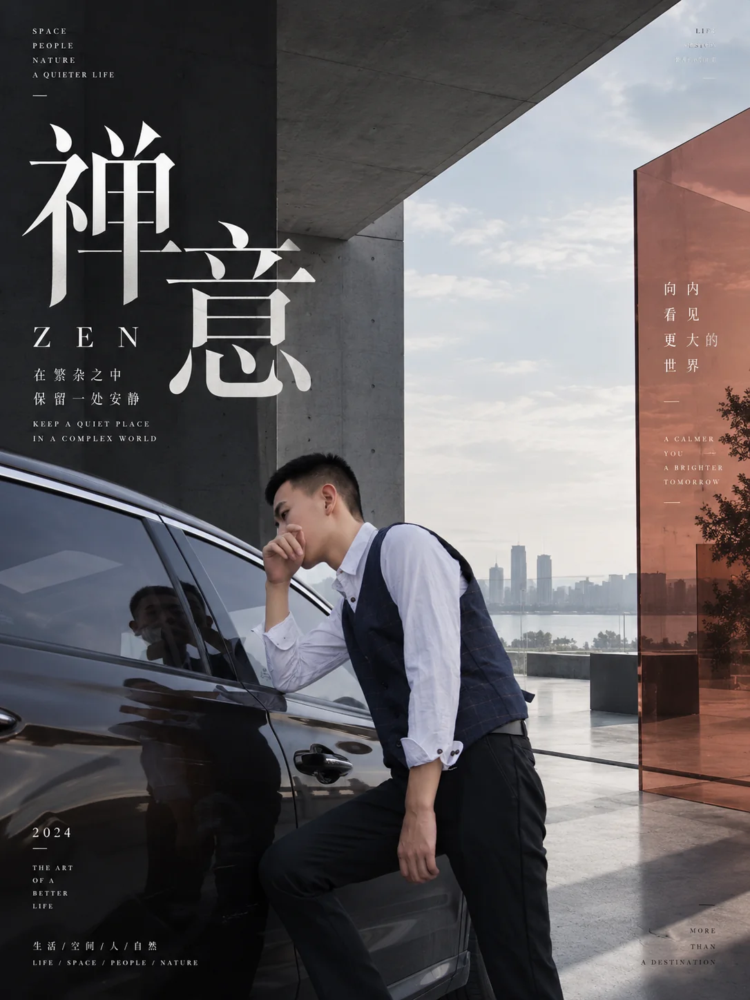

# 高端空间品牌编辑海报



## Prompt

```text
基于用户上传的图片或用户提供的主题，创作一张“高端建筑空间摄影 × 国际编辑设计 × 半透明建筑色块 × 东亚品牌排版”风格的高级商业视觉。

【输入方式】

支持以下任意一种输入：

方式 A：用户上传一张图片
参考图：{{用户上传的图片}}

方式 B：用户提供主题
主题 / 主标题：{{主题}}

可选信息：
核心观点：{{一句话说明真正想表达的内容，可留空}}
副标题：{{可留空}}
活动 / 品牌名称：{{可留空}}
时间：{{可留空}}
地点：{{可留空}}
补充信息：{{展览、会议、发布会、品牌活动等，可留空}}
画幅比例：{{根据用途自动判断，默认 4:5}}
语言：{{中文 / 英文 / 中英混排，默认中英混排}}
用途：{{品牌海报 / 发布会 / 展览 / 商业活动 / 文章封面 / 形象视觉}}
强调色：{{可留空，自动判断}}
可选禁用元素：{{可留空}}

【核心视觉】

整体采用：

高级建筑与室内摄影
+
大尺度中文编辑标题
+
国际主义排版系统
+
半透明彩色建筑平面
+
深色空间与自然光
+
少量高品质产品或文化物件。

最终效果应像国际建筑事务所、高端家具品牌、汽车品牌、艺术机构、设计展、科技生活方式品牌或文化会议的正式视觉，而不是普通活动宣传海报。

画面需要同时具有真实空间的物质感和高度设计化的平面构成。

【首先判断输入类型】

如果用户上传了图片：

先分析原图中的：

主体；
建筑或空间类型；
人物或产品；
主要材质；
光线方向；
空间透视；
最重要的结构线；
视觉焦点；
主色调；
品牌气质；
画面情绪。

保留原图最重要的主体身份和空间关系，在此基础上进行高级商业摄影与编辑设计重构。

不要无理由改变产品型号、人物身份、建筑类型或场景本质。

如果用户只提供主题：

先理解主题对应的行业、情绪和视觉语义，然后自行构建一个适合主题的高级建筑空间。

空间可以是：

当代美术馆；
高端展厅；
建筑事务所；
现代会议空间；
城市顶层空间；
家具展厅；
文化机构；
设计酒店；
极简住宅；
高级工作室；
品牌发布空间；
玻璃幕墙城市室内。

场景必须服务于主题，不要为了好看随机选择豪宅或展厅。

【空间摄影】

整个画面首先是一张高完成度的建筑或室内摄影作品。

空间使用真实建筑材料，例如：

清水混凝土；
深色石材；
金属；
玻璃；
木材；
磨砂墙面；
天然织物；
大理石；
亚光漆面。

强调真实光线与空间纵深。

可以使用大面积落地窗，让城市、建筑、天空或自然景观成为远景。

光线以自然侧光、晨昏光、建筑缝隙光或高对比室内光为主，通过真实阴影塑造空间。

画面具有建筑摄影般精确的垂直线、透视线与空间秩序。

避免普通房地产样板间摄影感。

【场景中的主体】

根据主题选择极少量具有高识别度的主体。

例如：

家具主题：
一把具有雕塑感的设计椅、茶几、灯具和材料样本。

汽车主题：
汽车局部或完整车身、品牌画册、钥匙和展厅。

文化会议：
书籍、雕塑、笔记本、纸张、展览资料。

科技主题：
电脑、极简工作台、屏幕、展陈装置。

设计生活：
花器、书籍、家具、艺术品或材质样品。

主体数量保持克制，每一个物件都应具有摄影价值。

不要堆满产品。

【半透明建筑色块】

这是整套视觉最重要的识别元素之一。

在真实空间中加入 1–3 块大型半透明彩色几何平面，使它们看起来像真正存在于建筑空间里的：

透明亚克力板；
有色玻璃；
半透明隔断；
建筑装置；
悬挂展板；
空间中的彩色膜材。

这些色块不能像简单覆盖在照片上的图形。

必须具有：

正确空间透视；
真实厚度；
透光效果；
环境反射；
颜色叠加；
投射阴影；
物体透过色板后的颜色变化。

色板可以穿越前景、中景和背景，与建筑共同构成空间。

优先采用矩形、狭长竖板、倾斜平面和大型几何切面。

【色彩系统】

整体使用非常克制的：

黑；
炭灰；
水泥灰；
象牙白；
天然木色；
金属色。

在此基础上加入一种或两种强烈强调色。

推荐根据主题自动选择：

设计 / 家具：
钴蓝 + 橙红。

汽车 / 速度：
深红 + 黑。

文化 / 学术：
酒红 + 深蓝。

科技 / AI：
高饱和橙 + 黑灰，或深蓝 + 暖橙。

艺术 / 创意：
朱红 + 群青。

强调色主要存在于半透明建筑色板、局部标题或极少数视觉节点。

不要使用彩虹色系。

【大型中文标题】

标题是第二个核心视觉中心。

使用大尺寸中文字体，与建筑空间共同构图。

字体优先选择：

现代宋体；
高对比衬线字体；
具有高级时尚编辑感的中文字形；
极少量理性黑体。

标题可以采用：

竖排；
多行堆叠；
左右分栏；
沿建筑垂直结构排列；
跨越大面积深色墙面。

标题字号可以非常大，但必须保留清晰层级。

不要把标题简单放在图片最上方居中。

文字应像空间建筑的一部分。

【中英编辑系统】

中文负责主要叙事。

英文负责建立国际编辑感和信息层级。

英文可以包括：

主题英文翻译；
行业关键词；
活动名称；
日期；
城市；
品牌理念；
极短观点；
栏目式词汇。

英文使用：

高品质衬线体；
极细无衬线体；
大写字母；
宽字距；
小字号排版。

典型形式例如：

FURNITURE
INTERIOR
MATERIALS
DESIGN

PEOPLE
IDEAS
SPACES
A BRIGHTER TOMORROW

具体内容根据当前主题自动生成，不固定复用。

【信息排版】

将信息划分为三个视觉层级：

第一层：
大型中文主题。

第二层：
活动名称、英文标题、日期或一句核心观点。

第三层：
行业关键词、场馆、时间、短句、项目说明等微型信息。

文字可以分散在：

左侧深色墙面；
透明色板；
建筑立柱；
右上角；
角落；
桌面或展陈区域附近。

允许一个画面同时存在多个信息区，但所有文字必须严格服从同一网格。

不要把所有文字集中成一个信息框。

【主题文案生成】

如果用户只提供主题，则自动生成符合主题的少量海报文案。

建议包括：

一个中文主标题；
一个简短中文副标题；
一个英文主题名；
一句中英文核心短句；
3–5 个英文关键词。

如果主题明显对应活动，还可以生成展示性质的：

日期；
时间；
场馆；
栏目名。

不要虚构真实电话号码、网址、公司地址、合作机构、官方身份或真实品牌授权信息。

用户没有提供的事实性商业信息，只能作为虚构视觉样稿内容，并保持简洁。

【上传图片模式】

如果用户上传图片，则以原图作为内容依据。

允许：

重新裁切；
调整空间透视；
整理光线；
扩大环境；
增加建筑式编辑装置；
重新组织文字；
优化商业摄影质感。

必须保留原图的核心主体和可识别特征。

如果是汽车，保留车型的关键造型特征。

如果是家具，保留家具轮廓。

如果是建筑，保留核心建筑结构。

如果是人物，保持人物数量、主体身份与主要动作。

不要因为这种风格常使用建筑空间，就把任何照片强行转换成完全无关的室内展厅。

如果原图本身不是室内空间，可以把半透明色板和排版系统作为“空间化编辑层”与原环境融合。

【主题模式】

如果没有参考图片，则根据主题建立一套完整场景。

先思考：

“什么空间最能代表这个主题？”

再决定建筑、产品和物件。

例如：

AI 与生活：
当代文化空间、工作台、电脑、人与展览场景。

家具设计：
现代展厅、设计家具、材料样品。

文学与文化：
学院建筑、书籍、雕塑、阅读空间。

汽车：
城市高层展厅、汽车、品牌资料和城市天际线。

城市设计：
建筑模型、材料、现代空间与城市景观。

主题视觉应具有叙事依据，不只是豪华室内背景。

【构图】

画面采用明显的建筑式分区。

利用：

墙面；
窗框；
立柱；
透明色板；
桌面；
家具；
建筑梁；
光影边界

形成天然网格。

允许标题与场景产生局部遮挡和前后层次。

强调：

垂直结构；
大色块；
透视线；
负空间；
前中后景。

避免将所有元素平均分布。

画面应有非常明确的视觉重心。

【光影】

光影必须真实并具有戏剧性。

允许大片暗部。

通过窗户或建筑开口产生：

强烈侧光；
长阴影；
反射；
局部高光；
色板投影。

整体偏电影摄影和高级建筑摄影。

不要把暗部全部提亮。

深色空间与明亮窗外形成的明暗对比，是这一视觉体系的重要组成部分。

【材质】

真实表现：

混凝土的粗粝；
石材的纹理；
玻璃的反射；
金属的冷感；
织物的柔软；
木材的温度；
亚克力的透明度；
纸张与书籍的细节。

环境应该具有可以“触摸”的材质感。

不要使用过度光滑、塑料化的三维渲染质感。

【不同画幅适配】

横版：
适合大型品牌视觉、展览横幅和活动主视觉。利用左右分区，让标题与空间形成对话。

竖版：
适合文化活动、会议、科技主题和展览海报。强化建筑纵向结构与大型竖排标题。

接近方形：
强化产品、品牌名称与中央空间关系。

不得为了适配画幅简单裁切已有版式，应重新组织空间和文字。

【整体气质】

高级、成熟、国际化、建筑感、文化感、品牌感、理性而具有视觉张力。

像由国际设计工作室为：

建筑展；
家具品牌；
汽车品牌；
艺术展览；
文化会议；
科技生活方式品牌；
设计论坛；
高端商业活动

制作的品牌主视觉。

核心视觉识别来自：

真实高级空间
+
大尺度中文排版
+
黑灰建筑基底
+
高饱和半透明建筑色板
+
精细英文编辑文字
+
真实自然光影。

【负面约束】

避免普通活动展板；
避免互联网运营海报；
避免电商促销风；
避免廉价商务会议背景；
避免彩虹渐变；
避免赛博朋克；
避免满屏霓虹灯；
避免普通写字楼会议室；
避免房地产样板房宣传感；
避免大量人物；
避免复杂产品堆叠；
避免悬浮式界面；
避免大量图标；
避免信息图风格；
避免文字全部浮在照片表面；
避免半透明色块缺乏真实透视和光影；
避免所有区域同样明亮；
避免平淡均匀构图；
避免过多强调色。
```
