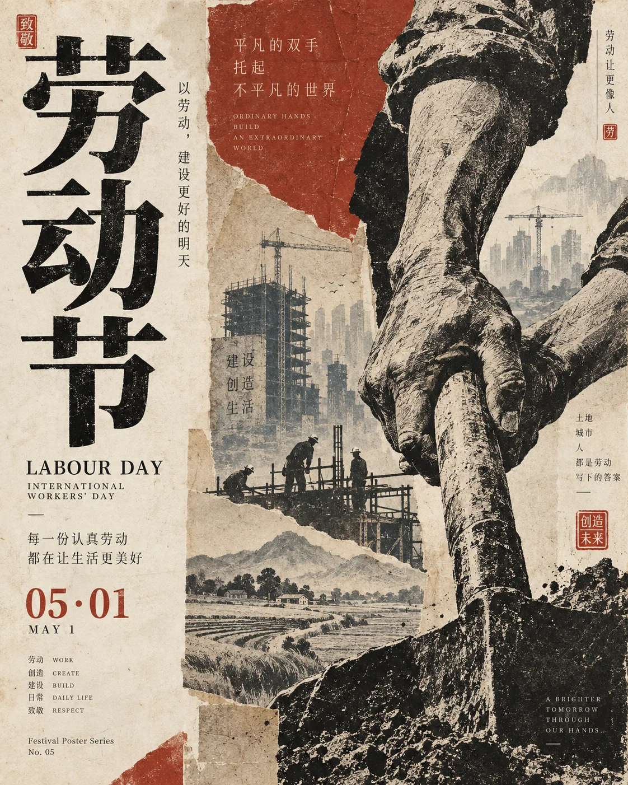

# 东方节日纸本拼贴海报


## Prompt

```text
围绕用户提供的一个节日，创作一张“东方传统文化 × 当代中文编辑设计 × 旧纸拼贴 × 水墨版画”风格的高级节日海报。

【输入】
节日：{{节日名称，必填}}
画幅比例：{{默认 3:4}}

无需用户额外提供主题、文案、色彩、日期或视觉元素。

【核心目标】

首先理解用户提供节日的：

文化来源；
历史背景；
时间与季节；
核心精神；
传统习俗；
代表性植物、器物、建筑、食物或自然现象；
最具有辨识度的文化符号；
适合表达的情绪与祝福。

然后将这些内容重新组织成一张具有现代编辑设计气质的东方文化海报。

不要简单堆砌节日素材。

需要从众多文化元素中提炼：

一个核心视觉意象；
2–4 个辅助意象；
一句简短节日主题文案；
一套符合节日气质的颜色。

最终形成：

传统文化内容
+
现代中文字体
+
纸本拼贴
+
水墨山水或线描
+
少量印章
+
克制的中英排版。

【视觉基调】

作品应像：

当代文化机构节日海报；
博物馆节气主题视觉；
独立设计工作室文化系列；
传统文学与现代平面设计结合的艺术海报。

整体具有：

东方；
人文；
安静；
庄重；
诗性；
纪念感；
纸本感；
文化感。

避免廉价国潮和商业节庆促销感。

【主标题】

节日名称是整个画面的第一视觉中心。

使用巨大中文标题。

标题通常控制在 2–5 个汉字，例如：

重阳
教师节
国庆
中秋

根据节日气质自动选择字形：

传统节日：
具有碑刻、雕版、宋刻本或古籍标题感的中文字形。

庄重纪念类节日：
端正、挺拔、有力量的现代宋体或高对比衬线中文字体。

人文类节日：
带有书籍出版与文学气质的现代中文字形。

标题允许：

纵向排列；
上下堆叠；
左侧大字；
右侧大字；
跨越版面；
局部与图形叠合。

字体本身应成为主要图形。

允许轻微的：

油墨颗粒；
活字印刷不均；
木刻质感；
纸张渗墨。

不要使用廉价书法字体或夸张狂草。

【核心意象自动提取】

根据用户提供的节日，自动选择最准确的核心文化意象。

例如：

重阳：
山岳、登高、菊花、茱萸、老人、秋日、层峦。

中秋：
满月、桂花、庭院、屋檐、山水、团圆、月影。

教师节：
红笔、批改作业、课本、纸张、讲台、粉笔、书写痕迹。

国庆：
红旗、日轮、山河、城市或国家象征性建筑、山川大地。

端午：
龙舟、江水、粽叶、艾草、五色丝、夏日水气。

春节：
灯火、门窗、春联、梅花、团聚、年节器物。

清明：
远山、细雨、柳枝、墓园或纪念空间、春水。

元宵：
灯笼、月色、街巷、灯谜、团圆。

七夕：
星空、银河、织物、鹊鸟、古典爱情意象。

儿童节：
童年物件、纸飞机、玩具、草地、手绘图形，但保持编辑设计气质。

具体节日必须重新分析。

不要机械重复月亮、祥云、古建筑、菊花、灯笼等固定“国风素材”。

【构图】

根据节日内容自动选择最适合的版式，不套用固定模板。

可以采用：

1. 左右分栏
一侧超大中文标题，一侧核心视觉。

2. 上下分层
上部标题，下部山水、人物或文化场景。

3. 中央纪念式构图
主标题或核心符号位于中央，四周使用极少辅助信息。

4. 大型图形压边
让月亮、红旗、山体、纸页、花朵或其他核心视觉从画面边缘进入。

5. 编辑拼贴构图
使用数块矩形或不规则纸片承载山水、历史场景或文化图像。

整体保持不对称但有秩序。

画面需要明显留白，不要平均铺满内容。

【纸本拼贴】

允许加入 1–3 块纸本拼贴区域。

拼贴可以表现：

山水；
建筑；
人物；
历史图像；
文化器物；
书页；
植物；
节日象征。

拼贴边缘可以：

自然裁切；
轻微撕裂；
呈矩形版画；
像旧书插页；
像宣纸画片。

拼贴不能做成现代照片墙。

它们应自然融入整体纸张和印刷语言。

【山水与自然】

如果节日与季节、自然或传统文化密切相关，可以加入中国山水画式背景。

山水可以采用：

淡墨；
青灰；
赭石；
水墨版画；
旧书插画；
极淡纸本印刷。

远景必须降低对比度，与纸张自然融合。

山、水、云、树林、建筑主要承担空间和文化情绪。

不要抢夺主标题。

【人物】

如果节日涉及人物关系，可以加入极少量人物。

人物可以是：

登高者；
师生；
家庭成员；
行人；
老人；
儿童；
传统生活人物。

人物尺寸通常很小，只承担故事和尺度作用。

教师节等具有具体行为的节日可以适当放大局部，例如：

手写批注；
红笔；
试卷；
书本。

但仍保持编辑艺术海报气质。

避免大型商业人物肖像。

【文化器物】

可以使用具有节日识别度的器物。

例如：

书籍；
纸页；
红笔；
花枝；
灯笼；
香囊；
茶器；
粽叶；
月饼；
传统织物；
印章。

器物应被处理为：

线描；
版画；
淡彩；
纸本拼贴；
局部摄影与印刷混合。

不要使用电商产品摄影方式表现。

【主色系统】

根据节日自动选择一套主色，而不是所有节日都使用中国红。

推荐逻辑：

重阳：
米白 + 墨黑 + 菊花金 + 山石灰。

中秋：
深靛蓝 + 月光米金 + 桂花金。

教师节：
旧纸米白 + 墨黑 + 暗红批注色。

国庆：
象牙白 + 中国红 + 金色 + 墨黑。

端午：
米白 + 艾草绿 + 墨青。

清明：
灰白 + 淡墨 + 柳叶灰绿。

春节：
朱红 + 米金 + 墨黑，但保持克制。

元宵：
深红或夜蓝 + 暖金。

具体配色应根据节日文化语境重新判断。

通常只使用：

一种背景色；
一种主要文字色；
一种核心强调色；
必要时一种辅助色。

避免五颜六色。

【大面积色块】

如果节日需要更强纪念性，可以使用一块大尺度色彩形状。

例如：

红色笔刷面；
金色圆日；
深蓝夜空；
墨色矩形；
赭色山体；
纸本拼贴。

色块允许具有：

刷痕；
颗粒；
版画纹理；
纸纤维；
不完整边缘。

不要做成光滑数字渐变。

【日期信息】

自动识别该节日常见日期表达方式。

可以显示：

公历日期；
农历日期；
节日传统日期；
年份。

例如：

09.10
TEACHERS' DAY

农历九月初九
DOUBLE NINTH FESTIVAL

农历八月十五
MID-AUTUMN FESTIVAL

如果节日日期随年份变化，而用户没有指定年份，不要虚构具体公历日期。

此时优先使用稳定的传统日期，例如：

农历八月十五；
农历九月初九；

或者只显示节日名称和英文名称。

只有日期能够可靠确定时才加入精确日期。

【副标题】

围绕节日精神自动生成一句简短中文副标题。

控制在约 6–16 个汉字。

例如整体语言方向：

登高 · 赏菊 · 敬老
守艺不辍，薪火长明
致敬每一位点亮他人道路的人
山河同庆
一月满，人团圆

具体内容必须针对当前节日重新生成。

不要机械使用示例。

文案应具有：

文化感；
节制；
纪念性；
人文气息。

避免宣传口号和网络鸡汤。

【英文】

加入节日常用英文名称作为次级文字，例如：

DOUBLE NINTH FESTIVAL
TEACHERS' DAY
NATIONAL DAY
MID-AUTUMN FESTIVAL

英文使用优雅衬线字体或小型大写排版。

英文权重明显低于中文。

还可以加入 2–4 个极小英文关键词，例如：

HERITAGE
REUNION
CRAFT
MEMORY
AUTUMN
RESPECT

这些只作为编辑细节。

【竖排文字】

在画面边缘或主视觉附近加入极少量中文竖排文字。

内容可以是：

节日日期；
习俗关键词；
一行诗意短句；
文化注释。

例如整体结构：

云山入秋
菊香渐浓

或：

月满人间

具体文案必须根据节日生成。

竖排文字用于强化东方编辑气质，不形成长篇正文。

【印章】

加入 1–2 枚小型朱红印章。

印章可以位于：

主标题旁；
角落；
副标题附近；
拼贴图像边缘。

印章内容可使用：

节日简称；
年份；
文化系列名称；
抽象篆刻字符。

印章尺寸必须很小。

不要使用大量印章。

【编号与系列系统】

可以加入极小：

No. 08
09/09
10·01
Festival Poster Series
Festival Archive

等系列化信息。

这些文字使画面具有文化机构或设计系列感。

不要解释编号。

【材质】

整张海报具有真实旧纸、宣纸、棉纸或艺术书纸张质感。

加入非常细微的：

纸张纤维；
油墨颗粒；
木刻印刷；
轻微褪色；
墨色不均；
版画颗粒；
自然磨损。

整体像一张保存良好的文化海报或旧书印刷品。

纸张可以有年代感，但必须保持高级和干净。

避免：

严重污渍；
烧焦；
裂纹；
破损；
过度泛黄。

【水墨与版画融合】

传统视觉不要完全采用写实水墨。

更适合融合：

中国白描；
木刻版画；
石版印刷；
水墨山水；
旧书插画；
纸本摄影；
现代拼贴。

使画面既具有历史感，又明显属于当代平面设计。

【文字层级】

第一层：
节日中文主标题。

第二层：
简短中文副标题。

第三层：
英文节日名称与日期。

第四层：
习俗、文化关键词、竖排短句。

第五层：
编号、系列名、极小英文。

文字层级必须明显。

不要把所有字做成相似大小。

【主题自适应规则】

传统自然型节日：
例如重阳、清明、中秋。

强化：
山水；
季节；
植物；
日月；
自然气候；
人与天地的关系。

人文纪念型节日：
例如教师节。

强化：
具体行为；
人与人的关系；
纸张；
书写；
工作痕迹；
生活细节。

国家 / 公共纪念型节日：
例如国庆。

强化：
山河；
公共建筑；
国家象征色；
宏观空间；
稳定庄重的构图。

家庭团聚型节日：
强化：
月亮；
庭院；
灯火；
餐桌；
归家；
温暖但克制的人文意象。

非遗 / 文化型节日：
强化：
传统工艺；
器物；
纹样；
手艺；
文化传承。

不同节日必须拥有不同视觉中心。

不能只是替换标题后继续使用相同模板。

【整体气质】

文化性、东方性、纪念性、出版物感、历史感与现代设计感并存。

作品像从一本高级“中国节日视觉档案”中取出的一页。

观众第一眼看到节日名称。

第二眼发现与节日真正相关的文化意象。

第三眼看到日期、习俗、英文和细微编辑信息。

系列统一性来自：

暖纸材质
+
大型中文字体
+
节日专属色彩
+
传统文化意象
+
纸本拼贴与版画
+
朱红小印章
+
克制中英排版。

【负面约束】

避免廉价国潮；
避免电商节日促销；
避免红包、金币、烟花等商业素材机械堆砌；
避免所有节日都使用红金；
避免所有节日都加入祥云、仙鹤、灯笼；
避免仙侠游戏风；
避免卡通人物；
避免三维国风场景；
避免高饱和渐变；
避免复杂光效；
避免满版传统纹样；
避免大型印章；
避免字体过多；
避免文字密集；
避免传统元素与节日本身无关；
避免虚构节日历史信息；
避免不确定情况下虚构精确公历日期；
避免现代商业 Logo 抢夺主题；
避免将海报做成普通节日祝福贺卡。
```