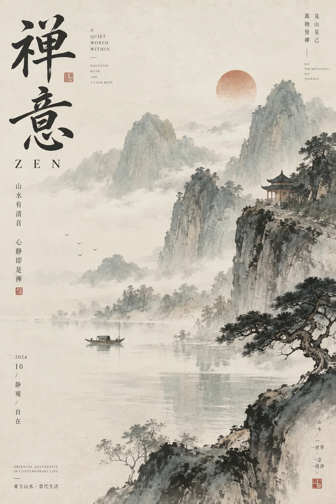

# 新国风山水意境海报


## Prompt

```text
围绕用户提供的主题，创作一张“中国山水绘卷 × 新国风编辑设计 × 水墨设色海报”风格的竖版视觉作品。

【输入】
主题 / 主标题：{{主题}}
核心意境：{{一句话说明主题真正想表达的气质或意境，可留空}}
辅助文案：{{副标题或补充短句，可留空}}
关键词：{{2–4 个概念，可留空}}
场景倾向：{{山岳 / 江湖 / 春景 / 雪景 / 云海 / 亭阁 / 古道 / 梅松 / 日月，可留空}}
画幅比例：{{默认 4:5}}
语言：{{中文 / 英文 / 中英混排}}
用途：{{文章封面 / 公众号封面 / 艺术海报 / 展览视觉 / 系列海报}}
色彩倾向：{{淡墨青绿 / 雪白灰梅 / 赤壁朱砂 / 烟雨浅青 / 可留空}}
可选情绪倾向：{{清雅 / 辽阔 / 幽静 / 诗性 / 壮阔 / 古意 / 空灵}}
可选禁用元素：{{不想出现的元素，可留空}}

【提示词】

先理解主题的情绪、季节、时间感与东方审美意象，再将其转化为一个具有中国山水精神的主场景。画面不追求写实摄影，而是采用“传统山水画意境 + 当代海报排版”的方式表现，让作品同时具有古典诗意与现代设计感。核心不是机械复刻古画，而是提炼山水、云雾、树木、水岸、亭阁、古建筑、栈道、扁舟、飞鸟、落日、梅枝、松石等东方意象，构成一个完整而有呼吸感的山水叙事场景。

整体采用竖版艺术海报构图，兼具“画”与“版式”两层结构。画面主体可以是远山与云海、江岸与亭台、雪湖与梅枝、赤壁与栈道、春山与烟水等典型东方山水场景，但必须保留明显的近景、中景、远景层次。近景用于建立质感和视觉切入点，中景承接叙事，远景营造空间深度与诗意留白。允许以一枝梅、一段山路、一角亭阁、一片湖面或一处崖壁作为前景框景，增强中国画卷般的引导感。

风格上采用水墨设色与国风绘景结合的方式。山石、树木、云雾、水面与建筑都应保留明显的东方笔墨气息，可以带有工笔与写意结合的效果。笔触既要细腻，也要保留轻微的宣纸渗化、飞白、积墨、皴擦和设色层次，使画面具有传统绘画韵味。不要做成纯扁平插画，也不要做成西式奇幻概念图，更不要出现强烈三维建模感。

色彩以东方设色体系为主，根据主题自动选择主色方向。可使用雪白、淡墨灰、青绿、米白、雾青、朱砂红、岩彩赤、浅桃、松黑、赭石等带有中国画气质的颜色。整体色调应统一、克制、柔和，有宣纸与矿物颜料般的温润质感。若主题偏清冷，可采用雪白、淡灰、浅墨、雾粉等色系；若主题偏壮阔，可采用朱砂、赭石、墨黑、云白等色系；若主题偏春日与空灵，可采用浅青绿、淡粉、雾白、暖灰等色系。避免高饱和商业广告配色与霓虹色。

文字系统需要形成明显的编辑设计感。主标题可以使用大字号高品质英文字体或中英组合标题，英文宜采用优雅的高对比衬线体或带艺术感的编辑字体，中文则可采用简洁宋体、书卷感衬线体或具有古典气质的排版形式。加入少量辅助小字，包括英文短句、中文短句、竖排题字、栏目式信息、小型说明、署名、地点、日期或诗性标语，使画面像一本东方艺术杂志封面或展览海报。微型文字只承担节奏与气质，不形成大段正文。

构图中应将画面视觉与文字版式自然融合。标题通常放在顶部或左上区域，辅助文字可分布在左右边缘、底部留白处或竖排区域。可以加入极少量东方视觉标记，例如印章式红章、小型题签、细分隔线、简洁编号或署名信息，但都应克制，主要起到增强东方编辑气质的作用。避免密集排版、过多标签和信息拥挤。

材质上保留细微纸张纹理、旧画册质感、宣纸纤维感、轻微颗粒、色彩沉淀与柔和褪色效果，使整张海报具有高品质纸本印刷感。整体应干净、雅致、安静，不要做旧过度，也不要出现脏污破损感。

整体气质应当兼具东方诗性、自然空灵、古典审美与现代设计语言。它像中国山水画在当代海报体系中的一次重构，既有传统文化的呼吸感，也有高级编辑设计的秩序感。系列感来自统一的山水意境、宣纸质感、设色体系、中英排版和留白结构，而不是重复同一座山或同一种具体景物。

【主题自适应规则】

不要机械重复同样的景别、构图和具体元素，先判断主题更接近哪一种山水关系，再选择对应的视觉语言：

春意 / 生机：优先考虑青绿山水、烟水空濛、桃李或梅枝、亭台、晨光、流水与轻雾。
雪景 / 清寒：优先考虑积雪、寒梅、枯树、静水、远寺、白雾与淡日，整体更克制清冷。
壮阔 / 登临：优先考虑高崖、栈道、群峰、云海、古松、楼阁与远日，强调空间张力。
幽静 / 内省：优先考虑湖岸、亭子、孤舟、薄雾、远山、空白水面与缓慢节奏。
古意 / 人文：优先考虑古建筑、桥梁、题字、印章、题签和更强的书卷气。
晨昏 / 时序：优先考虑日轮、天光、霞色、山雾、倒影与空气感，用光色表达情绪。

只选择最符合主题的一种主导场景，并围绕它展开完整画面，使作品在同一视觉体系内保持变化。

【负面约束】
避免赛博朋克、游戏原画感、过强奇幻感、过度写实摄影、廉价国潮风、厚重商业宣传感、卡通化人物、大量人物群像、信息过载、复杂拼贴、现代城市建筑、西式油画笔触以及与主题无关的杂乱装饰。若用户提供了禁用元素，严格排除。
```