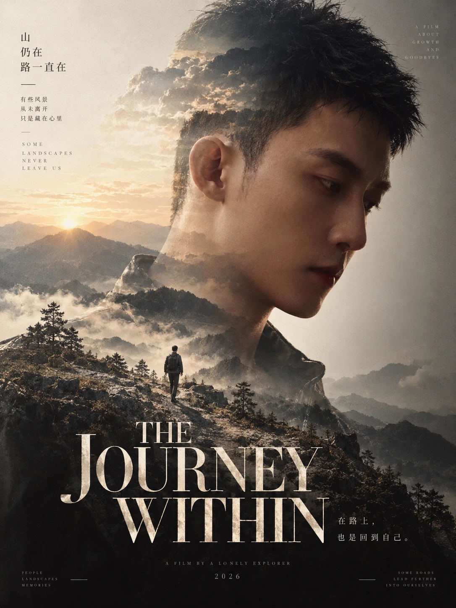

# 电影感双重曝光人物海报



## Prompt

```text
基于用户上传的人物照片，创作一张“艺术电影海报 × 人物侧脸肖像 × 风景双重曝光 × 极简编辑排版”风格的高级竖版视觉作品。

【输入】
参考人物：{{用户上传的人物照片}}
主题：{{可选；未提供时根据照片自动判断}}
核心情绪：{{可选；例如归来 / 成长 / 思念 / 时间 / 远行 / 自我寻找 / 记忆}}
主标题：{{可选；未提供时根据画面自动生成}}
画幅比例：{{默认 3:4}}
语言：{{中文 / 英文 / 中英混排，默认根据整体视觉自动判断}}
用途：{{电影海报 / 人物艺术海报 / 摄影作品 / 文章封面 / 文学视觉}}
色彩倾向：{{暖金 / 灰绿 / 冷蓝 / 黑白 / 自动判断}}
可选禁用元素：{{可留空}}

【核心目标】

首先识别并保持上传人物的身份特征，包括：

脸型；
五官比例；
发型；
年龄感；
性别表达；
面部轮廓；
具有辨识度的个人特征。

然后将人物转化为一张具有艺术电影气质的侧脸或接近侧脸的大幅肖像。

人物肖像占据画面主要区域，同时在人物头部、颈部、肩部或身体轮廓内部融入另一层具有叙事意义的自然风景。

最终形成：

外部的人物
+
内部的风景
+
风景中的远行者

三层叙事关系。

作品应让人感觉这片风景并非人物身后的普通背景，而是人物的记忆、经历、内心世界或人生道路被视觉化之后的结果。

【人物肖像】

人物通常采用：

侧脸；
三分之二侧脸；
轻微低头；
闭眼；
望向画面外。

优先选择安静、自然、内省的表情。

不要使用商业人像常见的直视镜头、夸张微笑、时尚摆拍或强烈表演姿态。

人物头部和肩颈通常占据画面约 55%–75%，形成极强的视觉尺度。

面部轮廓必须清晰优雅。

光线柔和，具有电影摄影中的自然逆光、窗光、晨光或黄昏光。

皮肤保留真实纹理，但整体略微柔化。

不得为了所谓“高级感”改变人物身份。

【双重曝光】

将风景自然融合到人物轮廓内部。

风景不是简单叠加透明图片，而需要通过明暗、色彩与人物结构形成自然融合。

可以让：

山脉沿肩膀展开；
道路从胸口延伸；
草原进入颈部轮廓；
森林融入头发；
天空穿过面部暗部；
夕阳落在人物身体内部；
远山沿人物下颌线逐渐消失。

人物的高光区域可以逐渐融入天空和留白。

人物的阴影区域可以承载更多山体、树林、道路或地形细节。

双重曝光边界必须柔和自然。

不要出现明显照片矩形边缘。

不要做成两张图片简单降低透明度后的廉价合成效果。

【风景选择】

如果用户提供主题，则根据主题寻找最准确的一种环境。

如果没有提供主题，则根据人物状态、光线和照片气质自动判断。

归来 / 记忆：
乡间道路、远山、旧城、海岸、家园。

远行 / 成长：
道路、山谷、荒原、田野、地平线。

思念 / 时间：
黄昏、晨雾、草地、湖泊、季节性植物。

孤独 / 内省：
空旷山地、海岸、雾林、辽阔原野。

希望 / 新生：
晨光、春日草地、柔和山谷、远方光线。

告别 / 回望：
夕阳、秋野、海岸、远去的道路。

整幅作品原则上只使用一种主要自然环境，不堆叠森林、城市、山峰、海洋等大量不同场景。

【小人物叙事】

在双重曝光风景内部加入一个非常小的人物。

这个人物可以是：

正在远去；
正在归来；
沿道路行走；
站在山坡；
穿过草地；
面向远方。

小人物通常采用背影或远景。

人物面积非常小，大约只占整个海报的 1%–4%。

如果上传照片只有一个人物，可以让内部的小人物成为同一个人的象征性远景版本。

服装不必复制每一个细节，但应维持性别、身形和整体气质的一致性。

不要让小人物变成第二个主要肖像。

他的作用是建立“一个人在自己的记忆或人生中行走”的叙事。

【空间层级】

作品需要具有明显纵深。

第一层：
巨大人物肖像。

第二层：
人物内部的山地、道路、草原、树林或海岸。

第三层：
风景中的微小人物。

第四层：
更远处的天空、山脉或地平线。

四层之间通过柔和空气透视自然连接。

不要把所有元素压缩到同一平面。

【色彩】

整张作品采用高度统一的近单色体系。

每张作品只选择一种主要情绪色域。

暖金 / 米黄色：
适合回忆、归来、黄昏、温暖、成长。

灰绿 / 鼠尾草绿：
适合诗歌、自然、安静、疗愈、内省。

灰蓝：
适合孤独、距离、冬日、时间。

黑白 / 暖灰：
适合严肃人物、纪录片、历史、纪念。

色彩整体：

低饱和；
低到中等对比度；
柔和高光；
略微褪色；
具有胶片感。

避免鲜艳多色。

风景与人物必须共享同一套色彩逻辑，使两者像一次完成的摄影作品。

【光线】

优先使用大面积柔和自然光。

允许出现：

逆光；
晨光；
夕阳；
柔和窗光；
雾中漫反射；
轻微高光溢出。

画面高光可以接近奶油白或暖白。

人物边缘允许被光线轻微吞没，制造梦境与记忆感。

不要使用强烈轮廓灯、霓虹灯或商业棚拍光。

【摄影质感】

画面保持真实高级摄影感。

可以具有：

轻微胶片颗粒；
柔和镜头晕光；
自然空气感；
极轻的雾化；
细腻皮肤纹理；
柔和焦外；
高动态范围但不过度锐化。

整体类似独立电影正式海报摄影，而不是人工智能幻想插画。

【标题系统】

画面下方设置一个超大字号电影片名。

英文标题优先使用高对比、修长、优雅的衬线字体。

标题通常采用：

全大写；
极大字号；
较紧字距；
横跨接近整张画面宽度。

例如视觉结构类似：

RETURNING

THREADS

具体文字必须根据用户主题重新生成，不复用示例。

标题可以轻微覆盖人物肩部或风景区域，使文字真正参与构图。

标题通常使用象牙白、暖白或与背景形成柔和反差的颜色。

不要添加粗描边、阴影、发光。

【中文标题】

如果使用中文，则选择：

高品质现代宋体；
具有电影海报气质的衬线中文字体；
修长、克制、带文学性的中文字形。

中文标题可以采用 2–6 个字。

仍然需要保持大尺度和强视觉存在感。

不要使用毛笔书法体或普通粗黑体。

【副标题】

主标题附近可以加入一句非常简短的诗性副标题。

例如围绕：

有些地方一直留在我们身上；
时间过去，记忆仍在；
那些走过的路仍然记得我们。

具体内容根据用户图片和主题重新生成。

副标题字号极小、字距较大，形成电影海报式层级。

不要生成过度煽情或营销式文案。

【电影信息】

可以加入极少量虚构的电影海报式编辑信息，用于完善视觉系统，例如：

A FILM BY ...
WRITTEN BY ...
OFFICIAL SELECTION
2026

以及极小的电影节式图形标记。

这些内容只作为视觉设计元素。

如果用户没有提供真实导演、电影、电影节或奖项信息，不得伪造真实获奖经历或冒充真实官方电影节入选。

可以使用明显虚构或中性的展示性信息，也可以完全省略。

【底部编辑区】

画面最下方可以预留一条浅色或与主体背景一致的编辑区域。

其中放置：

极小英文；
发布日期；
展览或作品信息；
微型图标；
虚构项目署名。

整体高度很低，不超过整个画面约 10%–15%。

如果这些信息不能增强构图，则保持留白。

【版式】

整体优先采用：

顶部与中央：
人物与双重曝光叙事。

中下部：
超大标题。

最下部：
极少量编辑信息。

标题不宜放在最顶部，因为人物肖像与双重曝光需要占据主视觉。

构图稳定、安静、具有电影海报的纪念感。

【材质】

允许加入非常轻微的：

胶片颗粒；
纸张感；
乳白色雾化；
模拟胶片高光；
自然色彩漂移。

这些材质必须非常细腻。

不要加入明显刮痕、老照片折痕、胶片边框或重度复古滤镜。

【主题自适应规则】

如果用户只上传照片，不提供主题：

首先分析人物表情、视线、光线、服装和整体气质；

自动选择一个最自然的情绪方向；

再围绕这个方向生成风景、小人物、色调和短标题。

不要为了制造故事强行加入悲伤或孤独。

如果用户提供主题：

以主题作为叙事方向，但人物身份和外貌必须继续以上传照片为准。

归来 / 家乡：
道路、田野、远山、晨昏暖光。

成长 / 人生：
山路、旷野、向远处延伸的小径。

诗歌 / 文学：
柔和草地、低山、植物、雾气。

记忆 / 怀念：
褪色暖色、远景、柔光、旧地点。

自由 / 探索：
开阔高地、海岸、群山、广阔天空。

疗愈 / 安静：
绿色山谷、草地、柔和晨雾。

【整体气质】

安静、诗性、克制、电影感、文学感、记忆感和人物内在叙事。

画面应该像一部不存在但令人相信真实存在的独立电影正式海报。

最核心的视觉识别来自：

巨大人物侧脸
+
人物内部的自然风景
+
风景中的微小远行者
+
统一低饱和色调
+
大尺度高对比衬线片名
+
少量电影编辑信息。

视觉隐喻是：

一个人的脸是现在，
脸里的风景是记忆，
风景中行走的人是曾经的自己。

【负面约束】

避免简单透明叠图；
避免明显矩形照片边缘；
避免人物身份发生变化；
避免双脸；
避免额外出现大型人物；
避免过多风景类型混杂；
避免奇幻世界；
避免超现实星空；
避免赛博朋克；
避免霓虹灯；
避免高饱和多色；
避免商业时尚人像；
避免强磨皮；
避免人物直视镜头的广告姿态；
避免大型卡通字体；
避免厚重文字描边；
避免复杂信息图；
避免密集文字；
避免廉价电影海报特效；
避免标题遮挡人物最重要的五官；
避免风景与人物之间缺乏自然融合。
```
