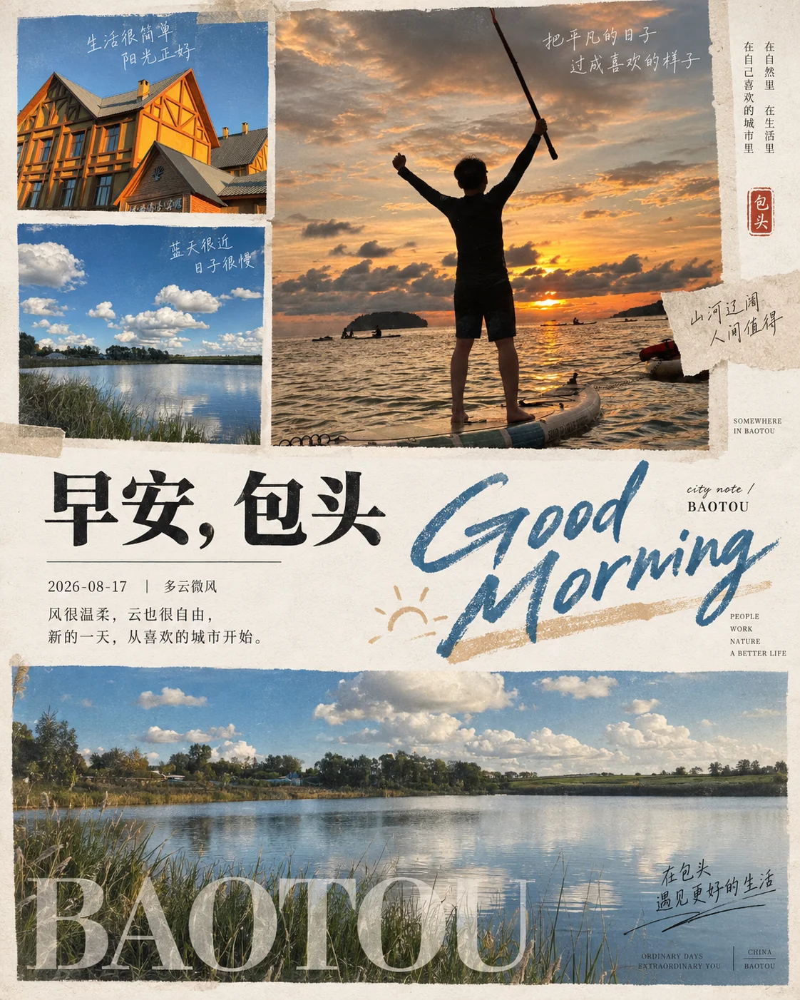

# 城市氛围拼贴晨间海报



## Prompt

```text
基于用户上传的图片和用户提供的城市名称，创作一张“城市摄影拼贴 × 晨间手账编辑设计 × 胶片氛围重构”风格的竖版海报。

【输入】
参考图：{{用户上传的图片，支持 1–6 张，必填}}
城市：{{城市名称，必填}}
国家 / 地区：{{可留空}}
画幅比例：{{默认 4:5}}

无需用户额外提供主题、文案、版式或色彩方案。

【核心目标】

先分析用户上传图片的整体氛围，再将图片重组为一张统一气质的城市拼贴海报。

用户上传的图片负责决定：

场景内容；
主体；
天气感；
光线；
时间氛围；
城市生活细节；
色彩倾向；
情绪基调。

用户提供的城市名称负责决定：

主标题中的城市名；
英文城市名；
城市注释文字；
整张海报的城市身份。

不要自行替换用户提供的城市名称。

【第一步：分析图片氛围】

先分析所有上传图片，识别并归纳：

天气：晴、阴、雨、雨后、雾、湿润、海风、闷热、清爽等；
时间感：清晨、上午、午后、傍晚；
色温：偏冷、偏暖、中性；
光线：柔光、阴天漫射光、日照、逆光、雨天反光；
环境关键词：街道、老城、海边、绿荫、花影、骑楼、胡同、咖啡、雨伞、店招、车站、滨江、老巷等；
情绪关键词：安静、潮湿、松弛、温柔、轻盈、朦胧、慵懒、文艺、生活感、海风感、花园感、都市感。

然后将所有图片统一处理为“同等氛围”的视觉系统。

如果用户上传多张图片：

保证所有照片在色调、明暗、空气感和胶片气质上统一。

如果用户只上传一张图片：

从同一张图片中提取 2–3 个细节裁切，组成上方拼贴；
同时保留一张较大的主图作为下方主视觉。

最终看起来像同一次城市漫步中拍下的一组连贯影像。

【整体版式】

使用竖版 4:5 画布。

整体背景为浅米白、暖白或略带纸张颗粒感的艺术纸。

版面分为三大区域：

上部：
3 个拼贴小图模块。

中部：
留白信息区，放置中文城市问候、英文手写主标题和少量编辑信息。

下部：
1 张横向大图，作为整张海报的主视觉。

整体像一本城市生活方式杂志的封面页，既有日记感，也有设计感。

【上部拼贴】

上部采用不规则但稳定的拼图结构，通常为：

左侧上下两个较小矩形图；
右侧一个较大的横向或竖向图。

也可以根据图片比例微调，但始终保持“2 小 + 1 大”的阅读节奏。

这些小图应该优先选择：

细节；
局部；
氛围镜头；
材质感；
环境切片；
有城市呼吸感的片段。

例如：

雨中的杯子；
店门口的灯牌；
花枝；
街角倒影；
海边栏杆；
车窗上的雨滴；
自行车篮；
树影；
旧墙文字；
咖啡杯；
街头一角。

这些图的作用不是重复主图，而是先建立城市气味与情绪。

【下部主图】

下部使用一张横向主视觉大图。

这张图应当最能代表该组图片的整体城市氛围。

优先选择：

人物在街道中行走；
面向城市远景；
海边散步；
雨中穿行；
老城生活场景；
具有纵深与叙事感的城市一瞬。

主图需要有故事感和空间感，像一句完整的城市叙述。

如果多张图片都适合作为主图，优先选择最有“人进入城市”感觉的一张。

如果没有人物，也可以使用具有道路、街巷、海岸或环境延伸感的场景。

【拼贴统一处理】

所有图片都要统一处理为相同风格，而不是简单原样摆放。

统一处理方向包括：

轻微低饱和；
柔和高光；
电影感空气透视；
微弱胶片颗粒；
自然雾化；
适度降低反差；
温柔的色彩收束；
统一白平衡；
统一明暗层次。

如果原图是雨天：

强化湿润反光、玻璃水汽、街道倒影、潮湿空气，但不要夸张成暴雨纪实风。

如果原图是晴天：

强化晨间光线、叶影、海风、温暖但克制的明亮感。

如果原图是海边城市：

保留海风、潮湿、阳光反射、水面与花影的松弛感。

如果原图是老城街巷：

保留生活感、慢节奏、旧建筑与人之间的亲近感。

所有图都要显得像同一套摄影集，而不是杂乱无章的素材拼盘。

【中文城市问候】

中部左侧放置中文城市问候，固定结构优先为：

早安，{{城市}}

例如：

早安，成都
早安，上海
早安，广州
早安，厦门

如果图片整体明显不是清晨，也可以根据氛围微调为更宽泛的晨间城市问候，但优先保持“早安”这一系列识别语言。

文字使用高品质中文宋体或带书卷感的现代衬线字体。

整体气质安静、克制、温柔。

【英文手写主标题】

中部右侧放置一个非常醒目的英文手写主标题：

GOOD MORNING

使用大尺度、自由、略带毛边的英文手写笔刷字。

字形具有：

轻快；
随性；
醒目；
略带杂志封面感。

它需要成为整张海报第二视觉中心。

文字位置通常横跨中部留白区，可以略微超出常规文本边界，形成有呼吸感的版面张力。

【城市英文名】

在英文手写标题附近，用极小字号加入英文城市说明，例如：

city note / Chengdu
city note / Shanghai
city note / Guangzhou
city note / Xiamen

如果用户提供的是中文城市名，则自动使用对应常见英文名。

这行文字很小，只起到编辑设计细节作用。

【日期与天气】

在中文“早安，{{城市}}”下方加入一行微型信息。

如果用户没有提供真实日期和天气，则不要伪造复杂气象数据。

可以使用更克制的展示方式，例如：

2026-08-17 | 雨后清晨
2026-08-17 | 多云微风
2026-08-17 | 湿润海风
2026-08-17 | 晨光微凉

如果需要展示温度，只有在用户明确提供时才写精确数值。

否则只使用视觉可判断的天气感描述。

【中文短句】

在日期天气下方，生成 1–2 行极短中文短句。

短句应该来自图片氛围和城市气质，例如：

慢一点，世界反而更近。
云层再厚，街道也会发光。
湿热的风里，也有清晨的勇气。
海边的光，总能把心事吹淡。

具体内容必须根据上传图片重新生成，不要重复固定句子。

语气保持：

安静；
生活化；
不鸡汤；
不说教；
像个人手账里的随手一句记录。

【底部大城市英文名】

在下部主图底部加入超大号、低对比、半透明的英文城市名：

CHENGDU
SHANGHAI
GUANGZHOU
XIAMEN

字体优先使用高对比衬线体，修长、优雅、具有杂志封面感。

字母跨越主图底部，但透明度较低，不要抢走主图主体。

它的作用是完成城市识别和版面平衡。

【图片内容选择逻辑】

如果上传多张图片，优先组合出：

1 张物件或局部氛围图；
1 张城市远景或街景图；
1 张中等景别的生活场景图；
1 张带人物或路径感的大主图。

如果用户上传的都是类似场景，也要通过裁切制造层次：

近景细节；
中景环境；
远景空间；
人物主图。

保证视觉节奏丰富。

【色彩系统】

整体色彩必须来自用户图片本身。

常见方向：

雨天城市：
雾蓝灰、湿绿、灰紫、冷白。

海边城市：
灰蓝、浅青、奶白、海风米色。

老城街巷：
暖灰、茶褐、旧墙绿、低饱和金色。

花影城市：
浅粉、灰紫、灰绿、暖白。

夏日南方：
柔和暖绿、植物灰、潮湿米色、淡金。

不要强行把所有城市都调成同一种颜色。

要做的是保留原图气质，并把它统一、提纯、柔和化。

【纸张与版面质感】

背景为暖白纸张，带极轻微纸纤维和颗粒。

不要厚重做旧，不要脏污，不要折痕明显。

整张海报应像高质量印刷成品：

安静；
干净；
留白充足；
有收藏感。

【人物处理】

如果图片中有人物，保持人物自然、真实、生活化。

不要重塑成时装片人物。

人物多为：

背影；
侧身；
行走；
撑伞；
看向远方；
穿行于街巷或海边。

人物在画面中承担“把观众带入城市”的作用。

如果没有人物，不要强行新增大量人物，只需保留城市氛围。

【城市风格差异】

如果用户提供的是内陆雨城，如成都：

强化雨巷、茶气、湿润、慢节奏、竹影、店招、烟火气。

如果是超大都市，如上海：

强化雨后的玻璃、街头反光、天际线、路口、轻微都市疏离感。

如果是岭南城市，如广州：

强化花影、树荫、潮湿、骑楼、水边与热带植物气息。

如果是海滨城市，如厦门：

强化海风、栏杆、花、船、海边步道、日光与松弛感。

不同城市不是只替换标题，而是连图片调性、短句和细节一起变化。

【整体气质】

整张作品要像：

一本城市漫游杂志中的晨间专题页，
或一个城市生活方式品牌发布的日常系列海报。

它的核心不是“景点介绍”，而是“这座城市今天给人的感受”。

最终识别来自：

上部三格氛围拼贴
+
中部“早安，城市”与 GOOD MORNING
+
下部大图叙事
+
统一胶片气质
+
暖白纸面
+
大号英文城市名。

【负面约束】

避免旅游宣传册感；
避免高饱和网红滤镜；
避免电商海报感；
避免复杂图标；
避免地图；
避免信息图；
避免拼图边框过厚；
避免照片之间色调不统一；
避免把所有图都做成同一景别；
避免大面积霓虹色；
避免厚重做旧；
避免鸡汤文案；
避免卡通元素；
避免过多贴纸感装饰；
避免城市名与图像气质脱节；
避免无依据生成与用户上传图片不一致的城市氛围。
```
