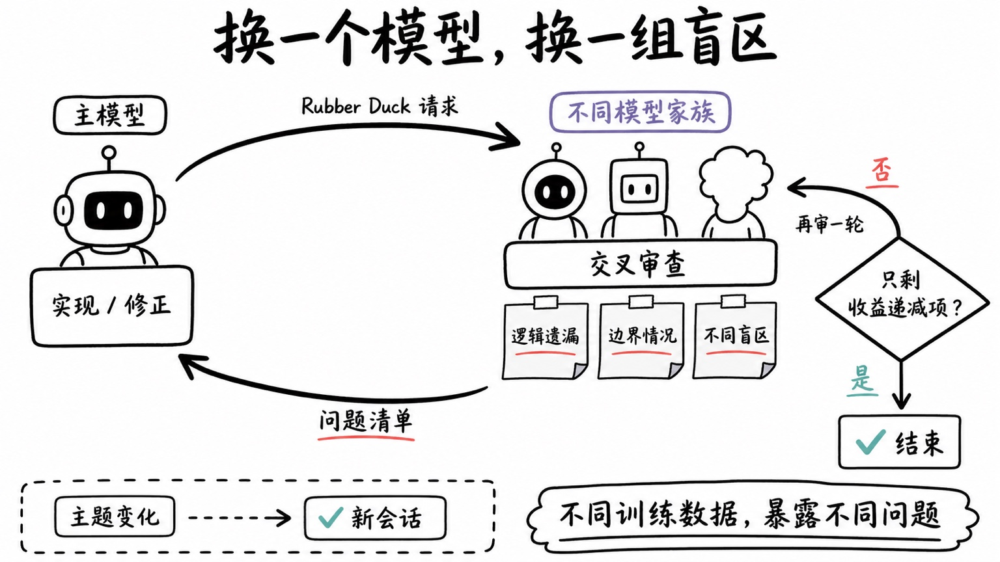

# 封面知识类

| | |
| ---- | ----- |
| | 白板手绘知识图解风格，现代极简手绘信息图，纯白偏暖背景，大量干净留白。 使用黑色马克笔式手绘线条，线条略微不规则，具有真实手绘笔触和轻微粗细变化，不使用机械化矢量线条。 使用简洁的手绘流程图视觉语言，通过圆角矩形、手绘方框、箭头、菱形判断框、便签纸、下划线、勾选符号和简化人物图标表达信息关系。 人物和图标采用极简黑色线稿卡通造型，造型可爱但克制，不强调细节，不追求写实。 中文文字采用自然手写马克笔字体，主标题明显加粗并具有轻微毛笔感，正文保持清晰易读。 整体以黑白为主，仅使用少量低饱和强调色：柔和红色用于重点和下划线，青绿色用于确认和完成，灰紫色用于分类标签。强调色面积很小。 信息组织像人在白板上边思考边讲解，通过粗大弧形箭头建立阅读顺序；布局自由但逻辑清晰，避免严格、冰冷的商业流程图感。 整体效果朴素、清晰、轻松、有知识感，类似技术博主手绘知识卡片、工程师白板讲解图、公众号科普信息图。二维平面插画，无3D，无真实阴影，无渐变，无复杂背景，无照片质感。|