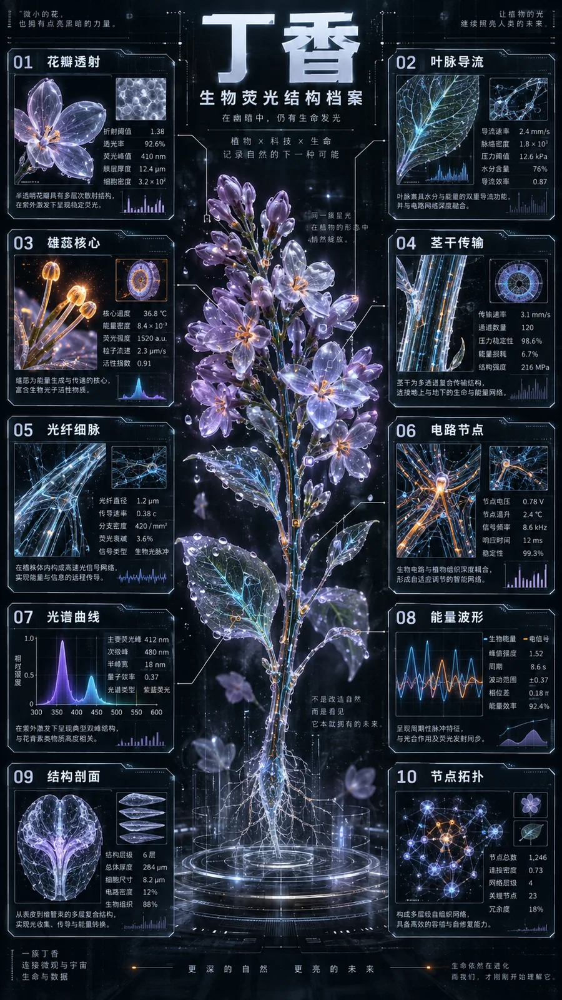

# 赛博生物荧光花卉概念信息图



## Prompt

````text
# 赛博生物荧光花卉概念信息图

## Prompt

```text
赛博半透明生物荧光花卉概念信息图，9:16 竖版。

主体：{植物名称}

中央是一株超写实 3D 赛博花卉，
悬浮于冷黑色未来实验室虚空中。

保持真实植物的形态、花序、叶片与茎干结构，
整体比例约为：
65% 有机生命体，
35% 数字电路。

花瓣与叶片呈半透明磨砂玻璃质感，
具有次表面散射、X 光透视、薄膜折射与显微水滴。

植物内部脉络转化为：
PCB 电路、
光导纤维、
发光毛细管、
流动能量液体。

避免机械零件随意拼贴，
数字结构必须自然沿真实植物组织生长。

采用“主星—卫星”构图。

中央立体花卉约占画面 30%，
外围约 70% 为高密度二维 HUD 信息系统。

画面边缘精确排列 10 个独立数据模组，
严格对齐隐藏网格。

使用约 0.5pt 超细直线与 90 度机械折线，
分别连接至：
花瓣、
叶脉、
茎干、
雄蕊、
内部电路节点。

10 个模组内嵌不同类型的科学数据可视化，例如：

微型条形图、
波形图、
光谱曲线、
等高线剖面、
拓扑节点、
点阵刻度、
结构剖面、
技术参数表。

模组之间保持独立，
形成硬边、模块化、正交排列的技术档案系统。

视觉风格：

超写实生物 X 光渲染
×
冷峻正交 HUD 界面
×
未来植物实验档案。

背景为接近黑色的无限虚空，
加入极弱数字颗粒、扫描线、点阵网格与体积雾。

中央主体不设置外框，
自然融入黑色空间。

外围 UI 使用硬边模块化切割，
保持冷静、精密、克制。

避免：
普通游戏界面、
廉价赛博朋克、
卡通质感、
夸张霓虹灯、
随机机械零件、
杂乱彩虹渐变。

配色主题：{主题名称}

背景基底：{深色背景}

半透明结构色：{低饱和玻璃色}

主生物荧光色：{主色}

辅助荧光色：{辅色}

唯一强调色：{强调色}

技术文字色：{文字色}

色彩比例：

背景与结构色约占 60%，
主色与辅助荧光色约占 30%，
强调色仅占 5%—10%。

全画面最多使用：
两种荧光色，
一种强调色。

强调色严格用于：
雄蕊能量核心、
PCB 交汇节点、
关键箭头、
危险参数、
数据峰值。

禁止大面积使用强调色，
禁止随机彩虹渐变。

主体颜色映射规则：

花瓣主体：
使用半透明结构色。

花瓣边缘与主要叶脉：
使用主生物荧光色。

内部细脉、毛细管与光纤：
使用辅助荧光色。

PCB 交汇节点与雄蕊核心：
仅使用强调色。

外围 HUD 的整体亮度不得超过中央植物主体。

排版采用浓缩技术文档风格。

顶部设置一个超大纯汉字黑体标题：

“{植物名称}”

约 64px，
禁止拼音，
禁止英文主标题，
禁止中英混排。

标题下方可以设置较小的中文技术副标题，例如：

“生物荧光结构档案”

外围 10 个数据模组使用：
等宽感小标题、
技术无衬线正文、
高密度微型参数文字。

文字信息从中央向画面边缘逐渐增加，
不得遮挡植物主体。

10 个模组可根据植物结构自动生成技术主题，例如：

01 花瓣透射
02 叶脉导流
03 雄蕊核心
04 茎干传输
05 光纤细脉
06 电路节点
07 光谱曲线
08 能量波形
09 结构剖面
10 节点拓扑

参数内容可以包含：

折射阈值、
透光率、
荧光峰值、
脉络密度、
导流速率、
节点温升、
信号频率、
能量效率、
结构层级、
连接密度等。

所有主要文字使用中文，
避免乱码、伪汉字和无意义的大型文字。

整体要求：

超高细节，
电影级照明，
真实玻璃折射，
次表面散射，
X 光半透明结构，
体积辉光，
锐利边缘，
精密技术排版，
统一构图，
极高信息密度，
印刷级品质。

最终效果应像一份来自未来生物实验室的
“数字植物生命结构研究档案”，
而不是普通赛博朋克海报。
````
