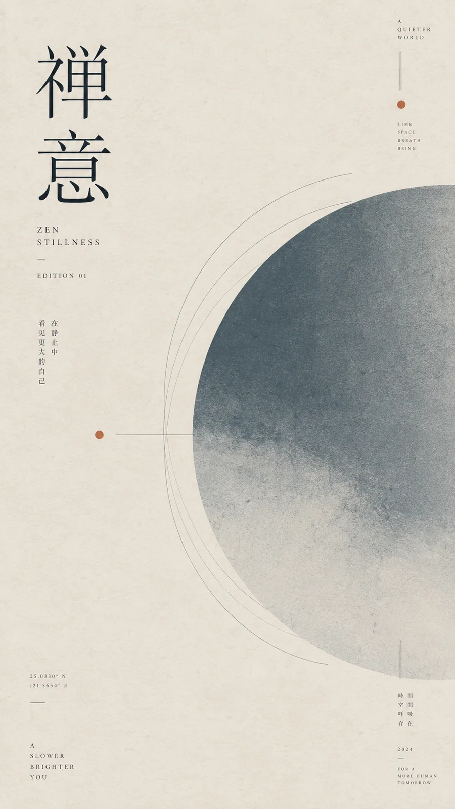

# 东亚现代主义编辑海报



## Prompt

```text
围绕用户提供的主题，创作一张“当代东亚编辑设计 × 国际主义现代排版 × 极简抽象艺术海报”风格的竖版视觉作品。

【输入】
主题 / 主标题：{{主题}}
核心含义：{{一句话说明主题真正表达的内容，可留空}}
辅助文案：{{副标题或补充短句，可留空}}
关键词：{{2–4 个概念，可留空}}
画幅比例：{{默认 2:5}}
语言：{{中文 / 英文 / 中英混排}}
用途：{{文章封面 / 公众号封面 / 艺术海报 / 展览视觉 / 报告题图}}
色彩倾向：{{可留空，留空时根据主题自动判断}}
可选情绪倾向：{{安静 / 理性 / 诗性 / 克制 / 深度 / 温柔 / 未来}}
可选禁用元素：{{不想出现的元素，可留空}}


【视觉目标】

先理解主题的情绪、概念和内在关系，再从中提炼一个简单而准确的视觉隐喻。

视觉隐喻可以来自自然现象、天体、地形、植物、光线、轨迹、距离、时间、信号、石块、结构或纯粹几何关系，但只保留一个核心视觉中心。

不要直白描绘主题，也不要堆叠大量象征物，而是将概念进一步抽象成圆、弧线、平行曲线、等距轮廓线、长圆角几何体、坐标轴、轨迹、放射线或柔和色块，使画面具有安静、理性、诗性和现代感。

【构图】

采用超长竖版编辑海报构图，大面积保留空白。

使用清晰但不可见的现代主义网格组织画面，根据主题自动选择非对称构图、纵向构图、中心轴构图或上下分区构图，不使用固定模板。

主标题、核心图形与辅助文字之间保持明显尺度差异。

核心视觉占据画面的一个主要区域，其余区域保持克制和呼吸感。

允许部分图形越出画面边界，以形成更加成熟的编辑设计感。

【图形语言】

大量使用极细而精确的线条，包括：

同心圆、平行线、连续弧线、等距轮廓、轨迹线、放射线、垂直基准线、坐标点、小圆、半圆以及简化几何结构。

图形保持二维、平面、克制和抽象。

重复线条应具有稳定间距和数学秩序，同时保留轻微的人文感。

避免复杂插画、卡通图形、三维模型和过度装饰。

【文字系统】

主标题使用高品质编辑字体，可以根据主题在优雅高对比衬线体与现代无衬线体之间自动选择。

标题允许非常醒目，但保持克制。

中文文字可以采用短句、四字词或竖排形式。

加入少量极小字号英文或中文编辑注释，可采用较大的字距、全大写、小型编号、日期、坐标或短句，使其类似艺术书、展览目录和独立杂志中的辅助信息。

这些微型文字只承担视觉节奏，不应形成密集正文。

文字必须严格遵守网格，并与图形形成有意识的距离关系。

【色彩】

根据主题自动选择一个主色域，并最多加入一种小面积强调色。

主色应覆盖绝大多数画面，整体低饱和、偏灰、柔和而高级。

可使用鼠尾草绿、暖灰、米白、陶土红、灰蓝、深靛蓝、沙色、墨黑等自然编辑色系。

强调色只用于太阳、圆点、节点、光源或视觉焦点等极少数区域。

避免高饱和多色设计和强烈商业广告配色。

【材质】

画面带有高品质艺术纸和老式印刷品的细微质感。

加入非常轻微的纸张纤维、油墨颗粒、网点、色彩扩散、柔和渐变和自然的不均匀感。

整体仍然保持干净精致，颗粒不能喧宾夺主。

【整体气质】

安静、理性、诗性、克制、留白充足。

像一本关于自然、时间、空间、思想或人文主题的独立艺术杂志封面，也像现代美术馆中的平面设计展览海报。

画面具有明显的系列视觉识别，同时每个主题都拥有自己独立的构图、色彩和核心隐喻。

避免商业宣传海报感、互联网运营海报感、赛博朋克、复杂拼贴、过度装饰、照片堆叠、大面积三维效果以及信息过载。

【主题自适应规则】

不要机械重复之前生成过的构图或图形。

首先判断主题更接近以下哪一种视觉关系：

自然 / 时间：
优先考虑光、太阳、月亮、雾、地形、波纹、季节、植物等隐喻。

空间 / 距离：
优先考虑地平线、坐标、轨迹、窗口、路径、边界和远近关系。

秩序 / 系统：
优先考虑网格、节点、序列、连接、等距线、模块和结构。

生长 / 变化：
优先考虑展开、放射、萌发、扩散、层叠和渐变。

静止 / 内省：
优先考虑石块、圆、空白、孤立几何体、缓慢曲线和稳定结构。

科技 / 信息：
优先考虑信号、节点、轨道、坐标、波形、连接和抽象信息结构。

只选择其中最符合主题的一套视觉语言，并继续进行抽象化，使最终作品保持统一设计体系，同时避免系列作品之间构图雷同。

【负面约束】
避免商业运营海报感、赛博朋克风、复杂拼贴、大面积三维效果、廉价滤镜、信息过载、杂乱文字堆砌、卡通化插画、过度写实摄影以及与主题无关的装饰元素。若用户提供了禁用元素，严格排除。
```
