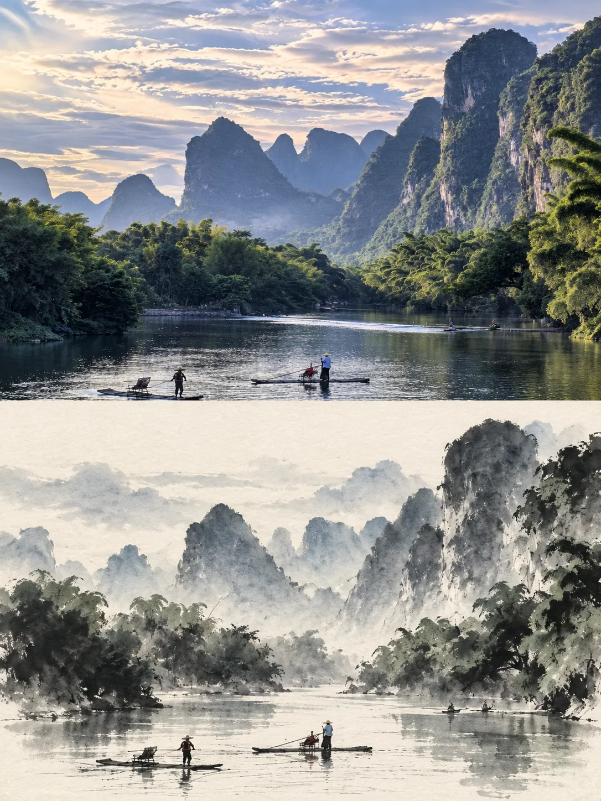

# 当代东亚摄影 × 水墨重构双联海报


## Prompt

```text
基于用户上传的照片，创作一张“当代东亚艺术海报 × 编辑摄影 × 极简水墨重构”风格的作品。

上传照片是画面内容、主体身份、场景结构和空间关系的唯一参考依据。最终作品必须能够清晰看出上下两部分来自同一个场景，同时形成“现实摄影 / 艺术抽象”的视觉对照。

【输入】

参考图：用户上传的照片
画幅比例：3:4
构图形式：上下二联画
上半部分：原始摄影
下半部分：水墨重构
用途：艺术海报 / 摄影作品 / 展览视觉 / 社交媒体视觉
文字：默认不添加任何标题、说明文字、印章或装饰性字符

【核心视觉结构】

使用竖版 3:4 画布，并沿水平方向严格划分为两个面积相等的区域：

上方 50%：原始摄影
下方 50%：极简当代水墨重构

两部分边界清晰、尺寸完全一致，形成上下对应的双联画结构。

上下画面表现同一个主体、同一个场景和相同的核心空间关系，使观者能够立即识别它们之间的对应关系。

上半部分负责呈现真实世界，下半部分负责提炼场景的结构、气韵与情绪。

【上半部分：原始摄影】

尽可能忠实保留上传照片。

重点保持：

- 主体身份与外观特征
- 主体数量
- 原始构图和主体位置
- 建筑、山体、树木、水面、道路等主要结构
- 透视关系与空间比例
- 场景中的自然纹理
- 光线方向
- 天气与空气氛围
- 原始色彩之间的关系

整体仍然是一张真实摄影作品。

只进行克制的高级编辑处理，包括轻微色彩分级、曝光和平衡调整、层次优化、局部清理以及细节整理，使其具有高端艺术杂志、摄影集或美术馆展览图录中的编辑摄影质感。

为了适应 3:4 构图，可以自然延展天空、地面、水面、墙体或周围环境。

延展部分必须遵循原始场景的透视、光线和材质逻辑。

保持主要主体的形态、比例、位置和视觉身份稳定，不改变场景的核心构图。

【下半部分：极简水墨重构】

将上方照片中的同一场景重新解释为一幅独立成立的当代东亚水墨作品。

这不是照片的水彩滤镜版本，也不是逐像素临摹。

先观察照片，再提取其中最具有辨识度的：

- 主体轮廓
- 建筑或自然结构
- 透视关系
- 前景、中景与远景层次
- 视觉节奏
- 空间留白
- 光影方向
- 天气氛围
- 情绪气质

保留足够的结构信息，使观者能够明确判断下方水墨画对应上方照片，同时大胆减少次要细节。

通过“提炼、概括、留白、消隐”重新组织场景，让下半部分成为一幅具有独立艺术价值的作品。

【水墨表现语言】

纸张使用温暖象牙白或偏暖米白色宣纸，能够看到非常轻微、自然、不规则的纸张纤维。

主要使用中国水墨语言：

水墨晕染
湿画法自然扩散
干笔皴擦
断裂笔触
墨色叠加
边缘渗化
渐隐
飞白
深浅墨层
大面积负空间

部分结构可以只画出一半，让其自然消失在纸张留白之中。

近景可以使用较明确的墨色和笔触，中景逐渐减弱，远景可以通过淡墨、雾气和留白完成。

避免机械描边，让墨迹具有真实的水分扩散、毛笔压力变化和宣纸吸水特征。

【核心原则】

保持“同一场景，两种观看方式”的关系。

上半部分强调真实、具体、可触摸的摄影世界。

下半部分强调提炼、节奏、气韵、空间和情绪。

水墨部分只保留足以建立识别关系的视觉信息，其余内容允许通过留白、淡化和抽象处理。

整体信息密度应逐渐从上方摄影的丰富细节，过渡到下方水墨的克制与空灵。

画面保持安静、成熟、克制和当代感，避免传统旅游纪念品式的“中国风”装饰。

【主色系统】

上半部分：

以参考照片原本的色彩关系为基础，只进行克制的高级色彩分级，不人为替换主体颜色。

下半部分：

主色：
黑色
炭黑
灰色
淡墨
蓝灰色

纸张：
暖象牙白
米白色

允许从原照片中提取极少量低饱和颜色作为点缀，例如：

雾蓝
灰青
玉石绿
矿物绿
暖金色
淡黄色
朱砂红

彩色面积必须明显少于墨色与留白。

墨色、纸张与负空间始终占据视觉主导地位。

【风格总基调】

当代东亚艺术
高级编辑摄影
极简水墨
艺术书籍视觉
美术馆展览图录
克制
安静
留白
自然
诗意
具有空间感

避免华丽装饰、过度饱和色彩、复杂边框、书法标题、印章堆叠、传统卷轴装饰以及明显的数字滤镜效果。

最终作品应像一位当代东亚艺术家将一张摄影作品与自己对同一场景的水墨记忆并置在同一张展览海报上。
````
