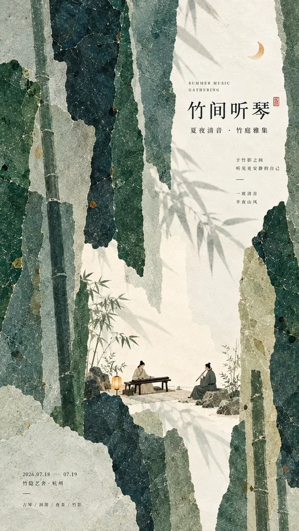

# 现代东方大色域微场景海报


## Prompt

```text
围绕用户提供的主题，创作一张具有“现代东方编辑设计 × 大色域构成 × 微型叙事 × 手工纸本拼贴”气质的文化活动海报。画面首先是一件成熟的平面设计作品，其次才是插画，避免普通国风插画或宣传模板感。

【输入】
主题 / 活动名称：{{主题}}
主标题：{{标题文字}}
辅助信息：{{日期、地点、副标题等，可留空}}
主色域：{{2–4 种低饱和主色，可自动判断}}
空间隐喻：{{山势 / 水岸 / 庭院 / 工坊 / 染布 / 纸鸢等，可自动判断}}
微场景：{{人物正在进行的一件具体事情}}
文化元素：{{1–3 个相关器物或文化符号，可留空}}
画幅比例：{{默认 3:4}}
用途：{{文化活动海报 / 展览海报 / 公众号配图 / 活动宣传}}
可选强调色：{{朱红 / 暖黄 / 橙色等，可自动判断}}

【核心视觉结构】
使用大面积低饱和色块建立画面主体，通过撕纸、叠层、遮挡、穿插、斜向延伸与负空间形成抽象空间关系，让色块隐约联想到{{空间隐喻}}，但不要直接绘制成完整写实场景。远看首先看到清晰的大形、色域和留白关系，缩略图状态下仍具有明显辨识度。

在大片色域之间放置一个尺度很小但内容完整的{{微场景}}，人物与器物合计约占画面的 2%–5%。人物正在真实完成一个动作，通过动作、器物与环境关系形成小故事，不摆拍，也不成为画面主体。{{文化元素}}自然参与人物行为或空间环境，不作为装饰符号集中陈列。

【主色系统】
以{{主色域}}统治整个画面，不平均分配颜色，通过大面积与小面积、深浅与留白形成节奏。仅允许一个约占画面 1%–3% 的{{强调色}}节点，用于人物、灯火、印记、月亮或器物局部点睛。

【材质与排版】
主要色块具有真实而细腻的手工纸、水彩纸浆与矿物颜料质感，可以看到天然纸纤维、颜料沉积、轻微压痕、擦印和不规则撕纸边缘，但整体保持干净、哑光、自然，不做脏旧复古滤镜。

主标题“{{标题文字}}”使用精致的中文宋体、明朝体或现代出版字体，字号克制，利用留白进行非对称排版；{{辅助信息}}采用更小字号形成清晰层级。只绘制用户明确提供的文字，不自行生成无意义英文、编号、Logo 或装饰文字。

【核心原则】
视觉层级始终保持“大色域 > 微场景 > 标题文字 > 文化细节”。构图避免机械居中、规则网格和元素平均分布，通过错位、遮挡、疏密反差与大片留白形成现代东方编辑感，让画面呈现“远看简洁有大形，近看有材质、有动作、有故事”的阅读体验。

【风格总基调】
现代东方、编辑设计、纸本拼贴、水彩材质、微型叙事、低饱和、安静、克制、自然、有文化气质，具有专业文化机构海报的完成度。避免巨大标题、传统水墨画、普通国潮插画、写实摄影背景、商业促销感、过度装饰、3D CGI、玻璃质感和霓虹色。
```
