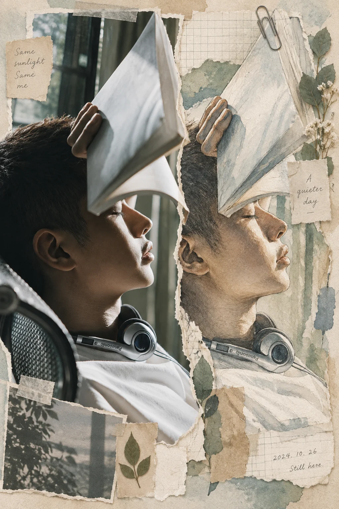

# 纸本手账摄影拼贴



## Prompt

```text
基于用户上传的照片，创作一张“真实摄影 × 手工剪贴簿 × 水彩插画 × 当代纸本编辑设计”风格的视觉作品。

【输入】
参考图：{{用户上传的照片}}
画幅比例：{{跟随参考图 / 16:9 / 3:4 / 4:3 / 1:1}}
版式：{{自动判断 / 左侧摄影右侧拼贴 / 上方摄影下方拼贴 / 全幅纸本拼贴}}
主题情绪：{{自动判断 / 宁静 / 温柔 / 治愈 / 自然 / 旅行 / 日常 / 怀旧}}
文字语言：{{中文 / 英文 / 不添加文字}}
文案：{{可留空；如果提供，必须准确使用用户给出的文字}}
强调色：{{自动从参考图提取，可留空}}
用途：{{摄影再创作 / 社交媒体视觉 / 海报 / 旅行记录 / 宠物纪念 / 日常手账}}

【核心目标】

把参考照片理解为内容与主体来源，在保持主体高度可辨认的基础上，将照片中的人物、动物、建筑、风景或静物重新解释成具有真实手工质感的纸本拼贴作品。

视觉效果像一本制作精良的私人旅行手账、自然观察笔记或独立杂志编辑页：既保留摄影的真实感，又具有水彩、墨线、剪纸、旧纸张和实体文具共同组成的模拟手工作品感。

作品需要温和、安静、有生活气息，避免商业广告式的光洁感。

【参考图保真】

准确理解参考照片中的：

主体身份与辨识特征；
主体姿态、朝向和比例；
主要场景结构；
具有识别度的颜色与纹理；
人与环境、动物与环境或物体之间的空间关系。

拼贴区域中的主体应明显来自同一张参考照片，即使转换成水彩、彩铅、墨线或纸本插画，也要保留原主体最重要的轮廓、姿态、花纹、服饰、建筑结构或景观特征。

允许重新组织背景和辅助元素，但不要随意改变主体种类、身份、动作与关键特征。

【版式结构】

优先采用具有编辑感的双重视觉叙事：

方案一：
一侧保留干净、真实、完整的摄影画面，另一侧将同一主题重新构造成纸本手账拼贴。

方案二：
上方保留原始摄影感，下方进入纸本拼贴世界。

方案三：
当全幅拼贴更适合主题时，以主体插画作为视觉中心，让不同纸片、图像碎片和文具自然围绕主体展开。

摄影区域应简洁完整，拼贴区域可以丰富，但两者必须保持明显的主次关系。

画面整体采用非严格网格的编辑布局，局部略有错位、遮盖和叠压，保留真实人工排版的不完美感，同时维持清晰的视觉秩序。

【主体处理】

在拼贴部分，将主体转换成细腻的水彩、彩铅和黑色细线结合的手绘效果。

保留自然轮廓和真实结构，同时让边缘具有轻微纸纤维、颜料晕染、铅笔草稿和手工描线痕迹。

局部细节可以接近写实，例如动物毛发、羽毛、人物服装、建筑轮廓、山脉纹理或杯具材质；整体仍保持手绘插画感，避免变成完全写实照片。

主体应是视觉中心，周围装饰负责建立语境，不能压过主体。

【纸本拼贴语言】

大量使用真实可触摸的模拟纸本材料：

暖白或米白水彩纸；
轻微泛黄的旧纸；
牛皮纸；
方格纸与横线笔记纸；
撕裂边缘的便签；
旧地图、票据、明信片或档案纸碎片；
半透明纸；
低饱和色纸；
和纸胶带；
金属回形针与长尾夹；
邮戳、印章、极轻的铅笔线与墨迹。

纸片尺寸、角度和边缘应略有差异，通过覆盖、胶带固定、夹子固定和自然阴影形成真实的层叠关系。

纸张必须有细微纤维、压痕、折痕、磨损和厚度差异，使画面看起来像真实手工拼贴后被重新摄影，而不是纯数字平面设计。

【主题派生元素】

根据参考照片本身自动选择少量辅助素材。

自然或动物主题可以使用：
叶片、植物标本、枝条、足迹、自然观察笔记、微型风景速写。

旅行或建筑主题可以使用：
地图碎片、邮戳、票根、地标线描、当地植物、旅行笔记。

日常静物主题可以使用：
清单纸、便签、杯垫、纸张污渍、干花、钢笔、小型生活物件。

人物主题可以使用：
票据、日期、手写短句、植物、随身物件、地点线索。

这些元素只用于强化故事背景，不需要机械地全部出现。

【色彩】

颜色主要从参考照片中提取，再整体降低饱和度约一个层级。

以暖米白、浅灰褐、牛皮纸色作为基础，根据主题加入少量灰绿、鼠尾草绿、雾蓝、砖红、淡粉、赭石或其他来自原照片的强调色。

主体可以保留最具有识别度的局部鲜明颜色，使其成为视觉焦点。

避免高饱和糖果色、强烈霓虹色、大面积纯黑背景以及过度统一的数字渐变。

【光线与材质】

模拟柔和自然日光照射在真实纸本拼贴上的感觉。

纸张之间产生非常轻微的接触阴影，回形针和金属夹具有克制的真实反光，胶带略微半透明，植物具有干燥压花质感。

整体光线柔和、漫射、自然，保留真实摄影和实体纸张的物理质感。

避免强烈棚拍高光和过度戏剧化照明。

【文字系统】

文字属于拼贴材料的一部分，不作为正式商业标题系统。

可混合使用：
纤细自然的手写体；
旧式打字机字体；
铅笔短注；
极小字号的档案式文字。

文字应分散在 2–4 张纸片上，每处只保留一句极短内容或几个词，像个人笔记、旅行记录或观察摘录。

如果用户提供明确文案，将需要出现的文字放在引号中，并准确呈现，只使用指定内容。

如果用户选择“不添加文字”，仍保留便签、纸片和编辑层次，但所有纸片保持无字状态。

不要自动生成品牌名称、网址、二维码、水印或大型宣传标语。

【细节节奏】

允许出现少量能够强化真实手账感的小细节，例如：

胶带边缘；
撕纸纤维；
铅笔划线；
咖啡环或淡水渍；
细小纸屑；
植物标本；
邮戳；
复古印章；
夹子；
钢笔；
信封；
图章；
极轻的颜料飞溅。

每张图只选择与主题有关的少数细节，保持呼吸感和留白。

【整体质感】

最终画面应同时具有：

真实摄影的可信度；
水彩与彩铅的手绘感；
模拟纸张的实体触觉；
私人手账的亲密感；
独立杂志的编辑秩序；
旅行日记与自然观察册的叙事性；
温和克制的怀旧气息。

第一眼先识别参考照片中的主体，第二眼注意到主体被重新解释成纸本艺术，最后才逐渐发现纸片、文字、文具与植物等细节。

保持层次丰富，但避免拥挤。

【约束】

保持参考照片主体的身份、姿态和核心辨识特征稳定。

不要将画面制作成普通照片滤镜。
不要制作成纯数字扁平插画。
不要制作成儿童手工卡纸风格。
不要使用光滑矢量图形替代真实纸张。
不要堆积大量贴纸、表情符号或卡通图标。
不要加入与参考照片无关的大型装饰物。
不要让辅助文字和文具遮挡主体的重要区域。
不要出现明显的三维渲染塑料质感。
不要出现品牌标志、水印、二维码或无关文字。

整体保持“真实照片被重新收集、剪裁、绘制并整理进一本高级纸本手账”的视觉逻辑。
```
