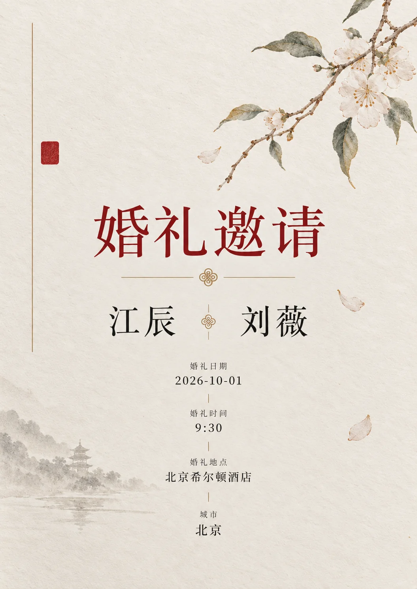

# 高级编辑式婚礼邀请函



## Prompt

```text
围绕用户提供的婚礼信息，创作一张“高级婚礼纸品 × 精品杂志编辑设计 × 艺术图录排版”风格的竖版婚礼邀请函。

如果用户上传了参考图片，先分析参考图的风格特征，再将这些风格特征迁移到新的邀请函设计中；如果用户没有上传参考图，则根据主题内容自动判断最合适的视觉方向。生成结果应体现同类气质，而不是机械复刻参考图。

【输入】

参考图片：{{可上传 0–4 张，可留空}}
参考图用途：{{风格参考 / 内容参考 / 风格+内容参考，可留空}}

新郎：{{姓名}}
新娘：{{姓名}}
主标题：{{例如：婚礼邀请 / Wedding Invitation，可留空}}
婚礼日期：{{日期}}
婚礼时间：{{时间}}
婚礼地点：{{地点}}
城市：{{城市，可留空}}
邀请文案：{{一句简短邀请语，可留空}}
辅助文字：{{英文短句 / 誓言 / 日期等，可留空}}

视觉主题：{{现代极简 / 东方婚礼 / 法式浪漫 / 地中海 / 复古 / 艺术婚礼，可留空}}
主视觉：{{婚礼场景 / 情侣摄影 / 人物插画 / 植物 / 建筑 / 抽象符号 / 自动判断}}
强调色：{{酒红 / 朱红 / 柠檬黄 / 香槟金 / 墨黑 / 自动判断}}
画幅比例：{{默认 3:4}}
语言：{{中文 / 英文 / 中英混排}}
用途：{{电子邀请函 / 印刷请柬 / 婚礼海报 / 社交媒体发布}}
可选禁用元素：{{不想出现的元素，可留空}}

【参考图使用规则】

如果提供了参考图片，先识别并提炼以下风格维度：

1. 版式结构  
包括留白比例、文字区与图像区关系、信息分布、对称或非对称构图、视觉重心位置。

2. 字体系统  
包括中文字体气质、英文字体气质、手写体使用方式、标题与正文层级关系、字距与行距风格。

3. 色彩逻辑  
包括主色、辅助色、强调色、综合色调、冷暖倾向、饱和度控制方式。

4. 主视觉语言  
包括摄影、插画、水彩、线描、植物装饰、东方元素、杂志式裁切、建筑场景等主要表达手法。

5. 材质与工艺感  
包括纸张纹理、棉纸感、压纹、烫金、油墨、颗粒、水彩晕染、钢笔线条等真实印刷品气质。

6. 装饰密度  
包括边框、枝叶、印章、细线、题注、手写批注等装饰元素的多少与使用位置。

分析完成后，保留其整体审美逻辑与气质，再根据当前婚礼内容重新组织画面。不要照搬参考图中的人物、构图、具体文案、日期、地点、花卉种类或符号细节。

如果用户上传的是婚纱照、情侣照或场地照，并且同时希望将其作为内容参考，则在保留整体风格语言的前提下，将这些图像内容自然融入邀请函设计中。

如果未上传参考图，则模型根据输入内容自动推断最适合的风格方向，优先在以下视觉倾向中选择：
- 东方极简婚礼纸品
- 现代杂志风婚礼邀请函
- 法式或意式浪漫纸本设计
- 水彩植物系婚礼邀请函
- 高级摄影排版型婚礼海报
- 艺术图录式婚礼视觉

【视觉方向】

整体像由专业婚礼纸品工作室与高级生活方式杂志共同完成的邀请函设计，安静、浪漫、精致，并具有真实印刷品的物理质感。

背景使用暖象牙白、奶油白或自然棉纸色，呈现极轻微纸张纤维、压纹和油墨颗粒。避免纯白数字背景，也避免明显做旧。

采用严格而轻盈的编辑式网格，大面积留白，让标题、姓名、日期、地点和主视觉之间形成清晰的纵向阅读节奏。版面可以轻微不对称，但视觉重心必须稳定，不要堆满装饰元素。

将婚礼双方姓名或主标题作为最重要的文字层级，可使用高对比衬线字体、现代中文宋体、优雅书法字体或纤细手写体。正文和日期使用较小字号、较宽字距和克制的排版方式，形成精品杂志、艺术画册与高级婚礼纸品的混合气质。

如果使用中文与英文，建立明确字体对比：
中文保持端庄、疏朗、现代；
英文可采用高对比衬线体、小型大写字母或细腻手写体；
避免所有文字都使用装饰字体。

画面只建立一个主要视觉焦点，根据主题与参考图风格自动选择最合适的表达方式，例如：
- 使用黑白或低饱和婚纱摄影作为主视觉
- 使用情侣背影或极简人物插画
- 使用精致水彩婚礼场景或植物装饰
- 使用东方枝叶、印章、传统纹样或抽象中式符号
- 使用海岸、建筑、餐桌、花艺等场景营造婚礼氛围

主视觉承担情绪表达，文字负责信息传达，两者不要互相争抢注意力。

装饰元素保持少量且精确，可以使用纤细边框、植物枝条、小型印章、手写批注、局部金色线条或轻微水彩晕染，但不要同时大量出现。

配色控制在象牙白、黑色或深灰基础上，再加入一种主要强调色。强调色面积保持克制，可以来自朱红、酒红、香槟金、柠檬黄、植物绿或用户参考图中的代表性色彩。

模拟真实高级印刷工艺，可以隐约表现专色油墨、凸版印刷、烫金、压凹、棉纸纹理、水彩颜料或钢笔墨迹，但整体依然保持干净。

【文字排版原则】

优先保证姓名、日期、时间和地点正确、清晰、完整。

主标题必须具有最高视觉层级；
姓名为第二视觉层级；
日期和地点形成稳定的信息锚点；
辅助文字明显缩小，不抢主体。

文字之间保持足够呼吸空间，不要把邀请函做成信息密集的活动海报。

如果提供了明确文字，只使用用户提供的内容，不自行添加无意义英文、随机日期、虚构地点或乱码。

【整体气质】

高级婚礼杂志；
精品婚礼纸品；
艺术图录；
真实印刷物；
克制浪漫；
精致留白；
可根据参考图自然偏向东方、法式、现代或摄影化方向。

【避免】

避免廉价婚庆模板感；
避免大量粉色渐变和梦幻光效；
避免俗艳金色；
避免满版花卉；
避免复杂边框包围全部内容；
避免卡通爱心、戒指、香槟杯等直白婚礼图标；
避免三维塑料质感；
避免过多字体；
避免文字拥挤；
避免随机英文和乱码；
避免多个视觉主体争夺注意力；
避免机械照搬参考图。
```
