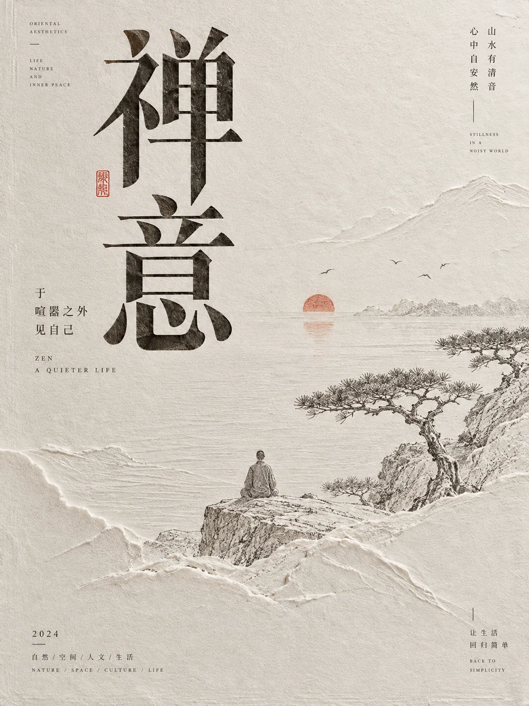

# 东方纸雕浮雕文化海报



## Prompt

```text
围绕用户提供的主题，创作一张“东方纸本艺术 × 浅浮雕压印 × 传统线描 × 当代中文编辑设计”风格的高级文化海报。

【输入】
主题 / 主标题：{{主题}}
核心内容：{{一句话说明主题真正表达的内容，可留空}}
副标题：{{可留空}}
关键信息：{{人物 / 时间 / 地点 / 活动 / 作品信息等，可留空}}
核心意象：{{可留空，由模型根据主题自动判断}}
画幅比例：{{默认 3:4}}
语言：{{默认中文，可中英混排}}
用途：{{文章封面 / 文化海报 / 节庆海报 / 邀请函 / 纪念海报 / 文学视觉}}
强调色：{{可留空，自动判断}}
可选禁用元素：{{可留空}}

【核心视觉】

先理解主题所属的文化语境、情绪和叙事重心，再将主题转化成一张具有“纸上浮雕作品”质感的东方编辑海报。

整个视觉系统由以下元素组成：

暖白或象牙色艺术纸；
大面积安静留白；
具有力量感的中文主标题；
细腻东方线描场景；
纸雕般的浅浮雕与压印纹理；
极少量单色点缀；
克制的编辑排版；
轻微传统书籍装帧气质。

画面应像一张真正使用厚棉纸、压凸、压凹、烫印和精细线描共同完成的实体艺术印刷品，而不是普通数字国风插画。

【主题理解】

不要机械地把任何主题都转换成山水、古建筑或祥云。

首先判断主题属于哪种类型：

文学 / 历史；
节庆 / 纪念；
家庭 / 仪式；
电影 / 戏剧；
城市 / 建筑；
自然 / 人文；
教育 / 阅读；
品牌 / 文化活动。

然后寻找最能够代表主题的 1 个主要场景和 2–4 个辅助意象。

例如：

文学主题：
从作品中的地点、景物、人物关系或经典意境中提炼场景。

节庆主题：
从具有代表性的建筑、礼仪、象征物和公共空间中提炼视觉。

家庭仪式：
从人物、器物、植物、祝福意象和生活场景中提炼。

电影或故事：
从作品中最重要的场景、道路、建筑、人物剪影或象征物中提炼。

核心意象必须来自主题自身，不要为了“国风”随意加入亭台楼阁。

【画面结构】

整体采用具有传统书籍装帧感的现代编辑构图。

通常分为三个视觉层级：

上部：
主标题与副标题。

中部：
主题线描或浅浮雕主场景。

下部：
辅助信息、署名、时间、地点、说明文字或装饰性信息。

构图可以根据内容选择：

居中轴线；
左右分栏；
上文下景；
标题居左、场景居右；
四周围合、中部留白；
中央纪念碑式构图。

整体必须保持稳定、端正、安静。

不要做成互联网海报常见的模块卡片布局。

【纸张与浅浮雕】

背景使用温暖的象牙白、天然米白、淡奶油色或浅灰白厚艺术纸。

纸面具有极细微的：

棉纸纤维；
自然纸纹；
细小颗粒；
轻微色差。

画面中的山水、建筑、人物、植物、云纹、道路或装饰纹样，可以使用非常浅的压凸和压凹效果表现。

浮雕高度必须很低，类似：

盲压；
凸版压印；
纸雕；
浅层浮雕；
压纹书封。

通过自然柔和的侧光产生极浅阴影，使纸张纹理具有真实厚度。

避免厚重三维雕塑感。

【线描语言】

核心场景采用极细、克制的东方线描。

可以融合：

白描；
建筑线稿；
古籍插图；
铜版画式细线；
现代钢笔线稿；
工笔式轮廓。

线条精细、稳定、有节奏。

远景可以逐渐减淡，与纸面融为一体。

近景保持更多细节，中远景减少线条密度，以形成空间层次。

水面、山体、云气、植物等可以通过大量极细平行线、曲线或轮廓线表现。

避免粗重漫画轮廓。

【纸雕层叠】

如果主题适合自然、山水、云、水、季节或柔和情绪，可以在画面边缘加入多层纸雕式轮廓。

例如：

层叠山势；
波浪；
云层；
花瓣；
地形；
抽象曲线。

这些层次像多层薄纸依次叠放，每层只有 1–2 毫米视觉高度，通过极浅阴影形成细腻的高低关系。

纸雕结构可以从边缘向中心延伸，但不能吞噬主体。

中间区域仍应保留充分留白。

【中文标题】

中文标题是视觉系统的重要组成部分。

根据主题自动选择最适合的字形气质：

文学 / 历史：
具有碑帖感、雕版感或书卷气的标题字。

文化 / 纪念：
端庄、挺拔、具有正式感的宋体或现代衬线字体。

家庭 / 仪式：
温润、有人文气质的书写体或古典衬线字体。

现代文化：
高品质现代宋体或具有东方结构感的标题字体。

主标题字号明显大于其他文字，可以具有轻微墨色颗粒、印刷肌理或传统活字印刷般的不均匀质感。

不要使用廉价毛笔字体。

不要为了“传统感”强行写成狂草。

【色彩】

整体约 85%–95% 使用纸张本色和极浅中性色。

在此基础上只加入一种主要强调色。

根据主题自动判断：

文学 / 山水：
靛青、墨蓝。

古典 / 家庭：
茶褐、暖棕。

节庆 / 纪念：
中国红、深朱红。

春日 / 自然：
灰绿、淡粉或浅赭。

电影 / 怀旧：
深褐、暗红或炭灰。

强调色仅用于：

主标题；
一个核心建筑；
太阳；
印章；
小型节点；
少数花朵；
重要视觉符号。

不要将整幅插画全部上色。

大多数场景保持“纸白 + 极淡线稿”的低彩度状态。

【局部点睛】

允许加入一个极小但明确的视觉焦点，例如：

一轮淡红太阳；
一个朱红印章；
一组小旗帜；
一个深蓝人物；
一处暖色花朵；
一个红色圆点。

强调色面积通常不超过画面约 5%–10%。

它的作用是让大面积米白纸面产生视觉锚点。

【人物】

如果主题涉及人物，可以使用极小比例的线描人物。

人物主要用于表达：

尺度；
故事；
方向；
生活感。

人物应融入场景，而不是变成人像主角。

除非主题本身就是人物纪念或家庭仪式，否则避免人物占据大面积画面。

人物可以采用：

白描；
细线；
局部浅浮雕；
单色剪影。

保持自然克制。

【建筑与景观】

如果主题涉及具有识别度的建筑，可以将建筑转化成极精细的线描或浅浮雕结构。

保留：

主要屋顶轮廓；
立面比例；
标志性结构；
空间层级。

同时降低材质和背景噪声，让建筑像被刻印在纸面上。

如果是自然景观，可以通过山峰、河流、地平线、树木、云层和远景轮廓建立场景，而不是画满复杂风景。

【边框系统】

根据主题决定是否使用极细边框。

正式、纪念、电影、历史类主题可以加入：

双线细框；
传统书籍版心；
轻微角花；
小型几何装饰；
徽记式细线元素。

文学、山水、生活类主题可以不使用完整边框，让纸雕山水或植物自然形成边界。

边框必须极细、低对比。

不要使用厚重传统纹样边框。

【装饰元素】

可以根据主题加入极少量：

祥云线纹；
山水轮廓；
植物；
花枝；
细小飞鸟；
波纹；
太阳；
传统几何纹样；
印章；
细线装饰。

所有装饰必须具有叙事依据。

不要形成“祥云 + 仙鹤 + 灯笼 + 古建筑 + 印章”的固定国风素材拼盘。

【信息排版】

如果用户提供时间、地点、人物、机构、作品信息等内容，以出版物或纪念海报的方式组织。

可采用：

居中短行；
左右分栏；
细线分隔；
小字号宋体；
微型英文；
年份编号；
栏目式信息。

信息层级保持明显。

主标题最大；
副标题次之；
正文说明较小；
版权、日期或栏目文字最小。

如果用户没有提供事实性信息，不虚构真实单位、真实地址、联系电话、奖项或品牌身份。

【英文】

英文只作为次级编辑元素。

可以加入：

主题英文翻译；
年份；
极短副标题；
作品类型；
栏目名称。

英文使用优雅衬线字体、高字距或小型大写排版。

英文占比明显低于中文。

整个视觉仍然以中文文化语境为核心。

【压印文字】

部分次要文字、年份或装饰信息可以表现为极浅的盲压效果。

让文字像直接压进厚纸中，需要仔细观看才能发现。

这种细节用于提高实体印刷质感，不承担主要信息。

【主题自适应规则】

文学 / 古文：
优先提取文章中的真实场景、建筑、山水和人物关系，以书卷感线描和靛青或墨色表现。

家庭 / 宴会 / 纪念：
优先提取人物、生活器物、植物和温柔纸雕边景，整体更柔和，使用茶褐、浅粉或低饱和暖色。

电影 / 戏剧：
采用更正式的纵版构图，可以加入细边框、年份、演职员信息和具有象征意义的中央场景，整体接近艺术电影海报。

国家 / 城市 / 公共纪念：
构图更加稳定、庄重，使用建筑轴线、广场、纪念性空间和小面积朱红强调。

自然 / 季节：
弱化正式边框，强化纸雕地形、花枝、山水、云雾和自然留白。

教育 / 阅读：
强化书籍装帧、蓝墨线描、章节式标题和知识类编辑信息。

【材质要求】

必须让作品具有真实实体印刷品的触觉想象。

可以感受到：

纸张厚度；
压凹；
压凸；
纸雕边缘；
细线油墨；
盲压；
少量专色印刷。

整体精致、干净、有收藏品气质。

避免纯数字矢量图般的光滑。

【整体气质】

东方、雅致、正式、克制、温润、有人文感和纪念性。

像一本高级文学典藏书的封面、一张博物馆文化海报、一份精装邀请函、一张艺术电影纪念海报，或者一件使用传统纸张工艺制作的当代东方平面设计作品。

视觉识别主要来自：

暖白厚纸
+
浅浮雕压印
+
精细东方线描
+
大量留白
+
高质量中文标题
+
一种克制强调色。

【负面约束】

避免廉价国潮；
避免红金大面积铺满；
避免电商宣传感；
避免商业地产海报；
避免仙侠游戏原画；
避免卡通人物；
避免复杂水墨泼墨；
避免高饱和多色；
避免满版古建筑；
避免传统纹样堆砌；
避免大量祥云、仙鹤、灯笼等符号化素材；
避免厚重三维浮雕；
避免塑料材质；
避免金属雕刻感；
避免过度复古脏污；
避免密集信息；
避免所有元素都具有相同视觉重量。
```
