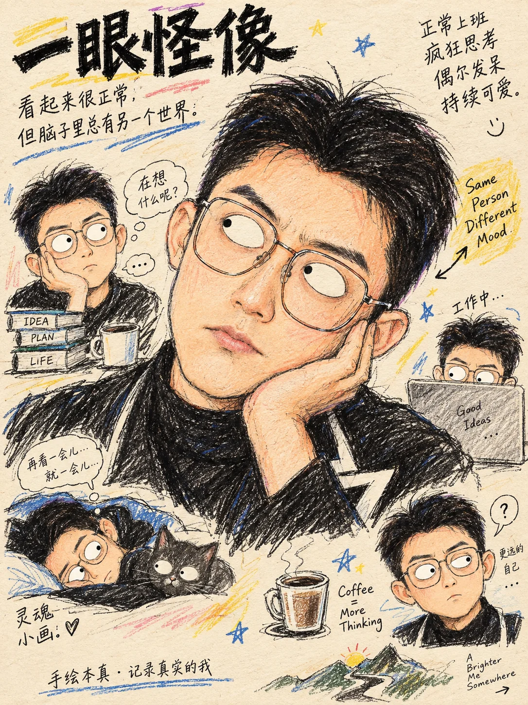

# 怪诞灵魂手绘



## Prompt

````text
# 怪诞灵魂手绘

## Prompt

```text
基于我上传的照片，将主体重新绘制成一张“怪诞灵魂手绘”风格插画。

这不是照片滤镜，不是照片做旧，也不是精致数字插画。

请像真正的手绘插画师一样，重新观察人物或宠物的身份特征、表情、姿态和当下情绪，再使用彩色铅笔、蜡笔和圆珠笔，把这种“灵魂状态”夸张地重新画出来。

核心效果：

第一眼：很像本人。
第二眼：有一点怪。
第三眼：觉得很好笑、很传神，而且这种怪非常符合本人当下的状态。

整体必须：
怪诞但可爱，
夸张但不恶意，
滑稽但不丑化，
随性但有观察力。

【输入】
上传照片：{{上传人物 / 宠物照片}}
画幅比例：{{保持原图比例 / 1:1 / 4:5 / 3:4 / 其他}}
可选主题：{{日常 / 上班 / 发呆 / 健身 / 咖啡 / 音乐 / 投资 / 程序员 / 旅行 / 宠物 / 自定义，可留空}}
可选背景元素：{{想保留或增加的物品，可留空}}
可选文字：{{手写吐槽或短句，可留空}}
可选禁用元素：{{不想出现的元素，可留空}}

【核心目标】
保留上传照片中主体最重要的身份识别特征。

对于人物，重点保留：
脸型特征，
发型，
眉眼关系，
鼻子特征，
嘴型，
耳朵，
眼镜 / 帽子 / 饰品，
服装主特征，
身体姿态，
手部动作，
标志性道具。

对于宠物，重点保留：
毛色，
花纹，
脸型，
耳朵，
鼻子，
体型，
尾巴，
原本姿势，
最有辨识度的外轮廓。

不要把主体变成一个与原照片无关的通用卡通角色。

最终即使经过夸张，
熟人仍应能够快速认出是谁。

【情绪放大原则】
先判断上传照片中主体真实存在的表情和姿态，
然后把这个状态视觉化放大约 300%。

不要随机更换情绪。

例如：

开心 → 更明显的开心、得意、兴奋或憨笑；
严肃 → 更冷、更绷、更一本正经；
发呆 → 更空、更木、更魂不守舍；
思考 → 更迟钝、更纠结、更陷入自己的世界；
高冷 → 更疏离、更嫌弃、更懒得搭理；
疲惫 → 更松垮、更无力、更像灵魂已经下班；
困惑 → 更迷茫、更怀疑人生；
无语 → 更明显的眼神游离和嘴角状态。

夸张必须从原照片出发。

不要把严肃人物随机画成大笑，
不要把开心人物随机画成哭脸，
不要为了搞怪而强行制造与原照片相反的情绪。

【眼睛：硬性视觉规则】
所有人物、猫、狗以及画面中的小涂鸦角色，
眼睛统一使用：

白色椭圆形眼白
+
非常小的黑色圆点眼珠。

这是本风格最重要的视觉标识之一。

眼白必须明显偏多。
黑色眼珠必须很小。

禁止：
真实虹膜，
真实瞳孔，
美瞳效果，
写实眼球高光，
动漫大眼，
精致睫毛眼，
玻璃珠眼睛。

眼珠位置必须参与情绪表达。

可以：
向上飘，
向下看，
向左偷看，
向右偷看，
两眼轻微错位，
呆呆看前方，
集中到某个角落，
产生放空、无语、震惊、嫌弃、困惑、心虚或怀疑人生的效果。

眼睛可以轻微不对称，
但不要出现恐怖畸形。

【嘴巴】
嘴巴是第二重要的情绪结构。

根据原照片真实状态放大嘴型，
不要所有人物统一画成标准微笑。

可以根据情绪使用：
微撅嘴，
圆嘴，
轻微香肠嘴，
抿嘴，
张嘴发呆，
露牙，
偷笑，
坏笑，
傻笑，
苦笑，
吐舌头，
嘴角轻微抽动，
不耐烦式歪嘴。

嘴型允许轻微夸张，
但必须仍然与人物性格和照片情绪一致。

目标是：
“这个嘴很有戏”，
而不是“为了怪而随机变形”。

不要出现：
恐怖裂嘴，
极端牙齿畸形，
恶心口腔细节，
过度丑化。

【脸部夸张】
允许轻微重新设计：
额头大小，
脸部宽窄，
下巴长度，
鼻子比例，
耳朵大小，
脸颊轮廓。

可以：
头略大，
额头略高，
下巴略短，
鼻子略突出，
耳朵略大，
脸部轮廓略不规则。

但不要改变人物核心身份。

夸张程度应像：
一个非常了解这个人的朋友，
用几笔准确地把他的性格缺点和可爱之处画出来。

不是恶意漫画。

【身体与姿态】
允许适度夸张人物身体比例：

头稍大，
身体稍小，
脖子缩短或拉长，
肩膀更加松垮，
手臂和腿略细，
身体姿态更加慵懒、僵硬或别扭。

但必须保持原照片的：
站姿，
坐姿，
身体方向，
手势，
动作关系。

如果原照片中的姿势本身很有性格，
优先放大这种姿势。

例如：
驼一点，
瘫一点，
站得更直一点，
身体更僵一点，
手插兜更明显，
抱臂更防御，
低头看手机更沉浸。

【宠物】
如果主体是猫、狗或其他宠物，
使用与人物完全一致的怪诞手绘逻辑。

眼睛仍然必须是：
白色椭圆眼白 + 黑色小圆点眼珠。

保留原宠物的：
毛色，
花纹，
耳朵，
脸型，
鼻子，
体型，
尾巴，
原本姿势。

可以适度夸张：
脑袋变大，
身体变短，
腿变细，
耳朵变大，
尾巴拉长，
毛发炸开，
脸变得更圆或更扁。

根据照片中的真实状态，
把宠物夸张成：
发呆，
嫌弃，
困惑，
委屈，
警觉，
不耐烦，
无语，
呆萌，
自信，
懒散。

不要把所有宠物统一画成卖萌状态。

【手绘媒介】
画面必须具有真实手工绘制痕迹。

综合使用：

彩色铅笔上色，
蜡笔颗粒，
黑色圆珠笔线稿，
铅笔辅助线，
重复描边，
略微抖动的轮廓，
偶尔断开的线条，
明显手工笔触，
颜色不均匀，
局部涂出轮廓，
局部没有完全涂满，
纸张纹理透出。

轮廓线不需要绝对精准。

允许：
同一轮廓重复画两三遍，
线条轻微错位，
局部突然变粗，
部分地方留下草稿线，
颜色压在线稿外面。

这些“不完美”必须让画面更像真实手绘，
而不是画坏。

【颜色】
整体颜色来自上传照片，
但重新转译为手绘色彩。

使用明亮但略带纸张感的：
彩色铅笔色，
蜡笔色，
低至中等饱和度手绘色。

肤色、衣服、宠物毛色和关键道具应保留原照片主要颜色关系。

颜色可以不均匀，
允许露出纸张，
允许笔触方向可见。

不要使用：
电影级摄影调色，
平滑数字渐变，
塑料高光，
3D 材质，
过于精确的光影。

【纸张】
背景基础材质优先使用：
米黄色纸张，
奶油色纸张，
淡象牙色纸张，
轻微暖灰纸张。

必须能感受到细微真实纸张纤维和颗粒。

纸张保持平整、干净，
不要做成破旧古董纸，
不要出现严重污渍、折痕或烧焦边缘。

整体像：
一本私人手账里认真又随意画下的一页人物观察插画。

【背景】
背景不要复杂写实。

优先观察上传照片，
提取少量真正具有记忆点的环境元素，
重新画成简洁涂鸦。

例如：
咖啡杯，
电脑，
键盘，
书，
本子，
耳机，
乐器，
K 线图，
城市地标，
桌椅，
宠物玩具，
鱼，
熊猫，
太阳，
云，
星星，
植物，
便利贴，
小图标。

这些元素应像随手补在主体周围的生活观察涂鸦。

如果原背景：
过于复杂，
过暗，
没有辨识价值，
会干扰主体，

则直接简化成：
米黄色，
奶油色，
浅灰色，
浅蓝色，
浅粉色
等纯色或轻微纸张背景。

背景永远服务主体。

【主题化背景】
如果用户填写 {{主题}}，
可以加入极少量与主题有关的小涂鸦。

例如：

程序员：
电脑、键盘、代码括号、小终端窗口、咖啡。

健身：
哑铃、水杯、毛巾、小肌肉符号。

投资：
简单 K 线、小箭头、硬币、计算器。

音乐：
耳机、音符、小音箱、乐器。

旅行：
地图、行李箱、山、飞机、小路牌。

宠物：
鱼、小球、骨头、猫抓板。

不要把主题元素堆满画面。

最多选择 2–5 个最有价值的小元素。

【手写文字】
如果用户填写 {{可选文字}}，
将其作为手绘吐槽或情绪批注自然加入画面。

文字要像：
圆珠笔随手写，
手账边注，
漫画吐槽，
人物观察笔记。

可以配合：
箭头，
圈画，
下划线，
小星号，
歪歪扭扭的文本框。

不要使用整齐的商业排版。

如果用户没有提供文字，
不要强制加入大段随机文字。

可以只使用极少量无语义的小线条和涂鸦符号完成构图。

【构图】
主体必须是第一视觉中心。

保留原照片中最重要的人物姿态和辨识特征，
同时允许为了插画表现适度重新组织构图。

优先使用：
主体居中或轻微偏置，
人物占据主要画面，
周围散落少量生活涂鸦，
大片纸张留白。

不要把所有空白填满。

周围元素应该有一种：
“画到这里时顺手又加了几笔”
的自然感觉。

不是规整信息图。

【整体气质】
整体应该像：
怪诞人物速写，
私人手账人物画，
独立插画师的小作品，
带一点地下漫画感，
带一点儿童蜡笔的直接，
带一点成年人自嘲式幽默。

关键词：
真实，
松弛，
有趣，
有性格，
有一点怪，
非常传神，
略带笨拙，
不完美，
有灵魂。

不要追求：
漂亮，
精致，
美型，
高级时尚，
摄影真实。

重点是：
“像他，而且只有他才会这么怪。”

【必须避免】
不要照片滤镜感。
不要照片做旧。
不要直接保留原照片皮肤纹理。
不要 AI 精修感。
不要平滑数字插画。
不要 3D 渲染。
不要商业矢量插画。

不要动漫美型。
不要大眼萌妹风。
不要日漫五官。
不要迪士尼式角色。
不要过度可爱化。

不要写实眼睛。
不要真实虹膜。
不要真实瞳孔。
不要眼球高光。
不要美瞳。
不要标准动漫眼睛。

所有眼睛坚持：
白色椭圆眼白 + 黑色小圆点眼珠。

不要统一微笑。
不要随机换表情。
不要无依据增加夸张情绪。

不要把人物画得恐怖、病态或严重畸形。
不要恶意放大缺陷。
不要让夸张破坏身份识别。

不要让背景抢走主体。
不要堆满无关涂鸦。
不要加入真实品牌 Logo、水印或商业标识。

不要加入 {{可选禁用元素}}。

【生成前检查】
生成前内部检查：

主体是否仍然一眼可识别？

夸张是否来自原照片真实情绪？

眼睛是否严格使用：
白色椭圆眼白 + 黑色小圆点眼珠？

眼珠方向是否参与了情绪表达？

嘴型是否与原表情相关，而不是随机搞怪？

人物是否有明显彩铅、蜡笔和圆珠笔手绘痕迹？

是否仍存在过于光滑的数字插画区域？

背景元素是否真的服务于主体？

是否可以删除任何多余涂鸦？

整体是否达到：
像 → 怪 → 好笑又传神
的三层观看体验？

【最终标准】
最终只生成一张独立完整插画。

不要输出：
多个方案，
拼图，
前后对比，
设计过程，
角色设定页，
照片滤镜版。

最终成图必须同时满足：

主体来自上传照片且具有高辨识度；
表情和姿态根据原照片真实状态被适度放大；
所有人物和宠物使用白色椭圆眼白 + 黑色小圆点眼珠；
眼神具有强烈情绪表达；
嘴巴灵动、有戏，但不随机搞怪；
脸部和身体比例允许轻微怪诞化；
彩色铅笔、蜡笔、圆珠笔质感明确；
线条抖动、重复描边和上色不均自然可见；
背景简洁，只保留少量生活化涂鸦；
米黄色或浅色纸张具有真实手工质感；
整体没有照片滤镜感和 AI 精修感。

最终效果应让人产生明确的三步感受：

第一眼：
“这不就是他吗？”

第二眼：
“怎么有点怪？”

第三眼：
“但也太像他的精神状态了。”

最终像一位非常懂人物观察的独立插画师，
把照片中那一瞬间的外貌、情绪和灵魂状态，
用几支彩色铅笔、蜡笔和圆珠笔重新画了出来。
```
````
