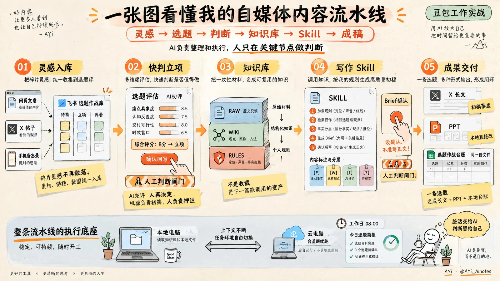

# 手绘编辑型知识信息图



## Prompt

```text
创作一张 16:9 横版的「手绘编辑型知识信息图」。

主题：
{{主题}}

需要表达的核心内容：
{{核心信息}}

需要呈现的步骤 / 模块：
{{步骤或模块，可由模型根据主题自动整理}}

整体视觉定位为：
现代知识信息图 × 手帐笔记 × 手绘流程图 × 轻复古编辑设计。

不要模仿某一张具体图片中的内容，
不要复制具体标题、文案、品牌、人物、图标或案例，
只采用这种视觉语言和信息组织方式重新设计。

【整体画面】

使用暖米白、浅奶油色纸张作为完整背景，
带非常轻微的天然纸纤维、颗粒和旧纸印刷质感，
不要纯白数字画布感，
也不要明显脏污、破损或复古做旧。

整体像一张由专业内容创作者亲手绘制、
再经过编辑设计整理完成的知识海报。

信息量可以较高，
但必须通过清晰的网格、留白、分组和视觉层级保持易读，
呈现“丰富但不杂乱”的感觉。

【构图结构】

顶部约占画面 15%～20%，作为标题区。

使用一行醒目的中文手写主标题，
标题字号明显大于其他内容，
采用粗黑手写马克笔或毛毡笔效果，
字形自然、有轻微不规则感，
但必须清晰易读。

主标题下方可设置一句简短副标题、
一句核心结论，
或一条横向流程概览：

{{A}} → {{B}} → {{C}} → {{D}}

流程文字使用暖橙色或橙红色，
搭配细手绘线框或下划线强调。

主体区域根据内容自动拆分为 4～6 个模块，
优先采用横向连续流程布局。

每个模块具有：

- 圆形步骤编号
- 简短模块标题
- 一句说明
- 一个主要示意图
- 1～3 个辅助标签、注释或便利贴

模块之间使用粗细适中的橙色手绘箭头连接，
形成明确的从左到右阅读顺序。

如果主题不适合流程，
则改为横向知识卡片、对比模块或分组式结构，
但保持统一的编辑网格。

【视觉组件】

大量使用手绘 UI 卡片作为知识容器，例如：

- 浏览器窗口
- 软件面板
- 文档卡片
- 文件夹
- 数据表格
- 仪表盘
- 清单
- 数据卡片
- 堆叠资料
- 简化设备
- 流程节点

这些元素不是精确的软件截图，
而是经过概括的手绘 UI 示意图。

窗口和卡片使用黑灰色细线描边，
四角略微圆润，
线条带轻微手绘抖动，
允许少量不完全平行、不完全对称，
保持真实人工绘制感。

可以加入少量：

黄色便利贴、
胶带纸、
荧光笔底纹、
手绘下划线、
括号、
箭头、
星号、
感叹号、
小圆点、
简单符号、
小型涂鸦。

这些装饰只用于强化重点，
不要覆盖主体信息。

【配色】

整体采用低饱和暖色知识笔记配色。

主色：
暖米白 / 奶油白纸张背景

主要文字与轮廓：
炭黑色、墨黑色、深灰色

重点强调：
暖橙色、橙红色

辅助强调：
明亮但柔和的黄色

辅助模块：
极浅蓝、灰蓝、浅薄荷绿、浅鼠尾草绿

允许极少量浅粉色或珊瑚色作为次级分类色。

所有颜色带轻微蜡笔、马克笔、彩铅或丝网印刷质感，
避免高饱和霓虹色，
避免大面积纯色数字渐变。

【手绘语言】

整体使用真实的人工手绘线条。

黑色线稿类似：

马克笔速写、
签字笔线稿、
手帐插画、
编辑草图。

线条不要完全机械笔直，
边缘略带自然抖动和墨迹变化，
但不要粗糙到影响阅读。

图标使用极简线稿，
造型朴素、直接、易理解，
避免复杂写实插画。

需要人物时，
只使用非常简单的手绘小人：

圆头、
极简五官、
简单肢体线条、
轻松自然的动作。

人物主要承担叙事和视觉点缀，
不要画成卡通角色立绘。

【文字排版】

文字是画面的重要组成部分。

所有中文必须尽量正确、清晰、可读。

采用类似人工手写但经过整理的字体气质：

主标题：
粗黑手写马克笔风格

模块标题：
中粗黑色手写体

正文：
较整齐的小号手写体

强调信息：
橙色、黄色荧光笔、高亮底纹、下划线或便利贴

每个文字区块保持短句化，
避免大段连续正文。

优先使用：

关键词、
短标题、
一句解释、
数字、
箭头、
小标签。

让用户能够先看图和标题理解结构，
再阅读细节。

【信息层级】

建立明显的四级层级：

第一级：整张图的大标题

第二级：步骤编号 + 模块标题

第三级：核心示意图或关键结论

第四级：辅助注释、标签、数据和说明

最重要的信息必须第一眼可见。

次要内容使用更小字号和更淡颜色，
避免所有元素视觉权重相同。

【底部区域】

如果内容适合，
可以在底部加入一条横向总结区或系统底座区。

使用浅蓝灰或极浅灰背景，
展示：

基础设施、
执行环境、
长期机制、
总结结论、
输入输出关系、
最终状态。

可以搭配电脑、文件夹、云端、时钟、咖啡杯、
植物等少量极简线稿元素，
形成轻松的手帐式收尾。

【质感】

呈现真实纸张印刷与手绘结合的效果：

轻微纸张颗粒，
轻微彩铅或马克笔纹理，
极轻微墨线浓淡差异，
极轻微套色不完全精准感。

整体仍然必须干净、现代、精致。

不是儿童蜡笔画，
不是漫画，
不是传统水彩，
不是纯数字扁平矢量插画。

【最终视觉目标】

最终效果应像：

“一位很会做知识整理的内容创作者，
把复杂主题整理成一张漂亮、清楚、有温度的手绘知识海报。”

第一眼看到完整结构，
第二眼理解流程关系，
第三眼能够阅读细节。

既具有真实手绘笔记的亲切感，
又具有专业编辑设计的信息组织能力。

【约束】

不要照搬任何参考图片的具体内容。
不要复制已有标题、文案、品牌、账号、水印或署名。
不要生成现成社交平台 Logo。
不要制作真实软件截图。
不要使用照片写实风格。
不要使用 3D 渲染。
不要使用赛博朋克风格。
不要使用高饱和渐变。
不要让背景过于复杂。
不要让装饰抢过知识内容。
不要为了填满画面而堆积无意义图标。

优先保证：
中文正确、
结构清楚、
层级明确、
手绘自然、
信息丰富但不拥挤。
```
