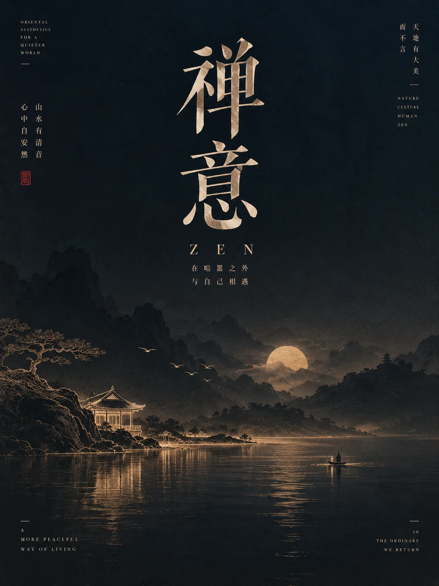

# 东方纪念日鎏光线描海报



## Prompt

```text
围绕用户提供的主题，创作一张“东方文化纪念海报 × 深色单色氛围 × 鎏金发光线描 × 山水剪影”风格的高级竖版视觉作品。

【输入】
主题 / 主标题：{{主题}}
核心含义：{{一句话说明主题真正表达的纪念意义或文化价值，可留空}}
副标题：{{可留空}}
日期：{{可留空}}
核心意象：{{2–4 个与主题直接相关的文化符号，可留空}}
画幅比例：{{默认 9:16}}
语言：{{默认中文，可少量中英混排}}
用途：{{纪念日海报 / 文化海报 / 节庆海报 / 非遗主题 / 城市文化视觉 / 公益宣传}}
主色倾向：{{中国红 / 靛青紫 / 墨蓝 / 深青 / 自动判断}}
可选强调色：{{金色 / 暖白 / 朱砂 / 自动判断}}
可选禁用元素：{{不想出现的元素，可留空}}

【提示词】

先理解用户主题真正对应的历史、文化、纪念价值和精神象征，再从中提炼一个具有中国文化识别度的核心场景。

整个画面采用：

深色单色背景
+
大面积氛围留白
+
远景东方山水剪影
+
中下部一条发光的文化线描景观
+
少量向上漂浮的文化符号
+
大字号中文标题
+
克制的纪念性排版。

作品应具有庄重、安静、诗性、文化感和轻微仪式感，像博物馆、文化机构、城市宣传或国家级文化主题活动使用的高级视觉。

【核心视觉结构】

画面采用纵向构图。

上部约 40%：
大面积深色留白，承担主标题、副标题、日期和空气感。

中部约 20%：
远山、云雾、古建筑、树林或城市文化地标形成极暗剪影层次。

下部约 30%：
使用一条细腻、连续、带暖光的线描景观作为主要视觉焦点。

最底部：
暗部水面、山影或渐隐空间，并安排极少量竖排文化文字。

整个视觉重心集中在画面中下部的一条“发光文化地平线”上。

【发光线描】

这是整套视觉最重要的识别特征。

根据主题提取 2–5 个最具代表性的文化意象，并将其连接成一条连续的横向线描景观。

可以包含：

山脉；
长城；
古塔；
楼阁；
桥梁；
城墙；
传统建筑；
文化器物；
非遗符号；
城市地标；
传统纹样；
代表性自然景观。

线稿使用极细的暖金、暖白、浅橙或浅粉金线条。

线条具有轻微发光和辉光，但整体仍然精致克制。

像使用一支发光的金色针线，在深色画布上描出文化轮廓。

不要做成霓虹灯招牌。

不要出现强烈赛博朋克感。

线稿应保留中国传统白描、金线画和现代城市剪影之间的融合感。

【文化意象选择】

核心意象必须来自用户主题自身。

如果主题是山河纪念：
优先提取山脉、河流、长城、楼阁、城市文化地标等。

如果主题是非遗：
优先选择与具体非遗相关的器物、纹样、技艺象征、建筑或动植物图腾。

如果主题是传统节日：
优先选择与该节日真正相关的月亮、花灯、舟船、植物、建筑、民俗物件。

如果主题是城市文化：
优先使用真实具有代表性的城市轮廓、地标建筑、山水或历史元素。

如果主题是历史纪念：
优先提取具有时间感和纪念意义的建筑、山河、遗迹和象征物。

不要机械加入长城、仙鹤、祥云或古塔。

所有元素都必须服务于当前主题。

【山水氛围】

发光线稿后方使用层层递进的深色山水剪影。

山体不需要大量细节，而是通过：

深浅渐变；
雾气；
柔和轮廓；
少量树木；
远处古建筑；
水面反射

建立空间。

远景几乎融入背景。

中景稍微可见。

前景保持最暗。

通过这种方法形成传统山水画“远、中、近”三个层级。

不要使用高对比写实风景。

【水面与反射】

如果主题适合，可以在发光线描下方增加一层平静水面。

线描的金色光线在水面形成细长、柔和、断续的反射。

反射需要：

略微模糊；
横向拉伸；
逐渐消失；
不完全对称。

水面只承担增强诗意和空间纵深的作用。

不要形成强烈镜面反射。

【漂浮元素】

从主要发光景观向上方留白区域，可以散落极少量微型符号。

例如：

飞鸟；
传统纹样；
花瓣；
非遗图案；
微型器物轮廓；
几何文化符号；
光点。

数量保持在 3–10 个以内。

这些元素沿一条隐约的斜向路径向上延伸，形成视线引导。

越往上越小、越疏。

像文化记忆缓慢升起。

不要填满天空。

【色彩系统】

整张海报采用单一深色主色域。

优先从以下体系选择一种：

纪念 / 山河：
深中国红、暗朱红、酒红。

非遗 / 传统文化：
深靛紫、墨紫。

历史 / 人文：
墨蓝、深青。

夜景 / 城市：
深海军蓝、蓝黑。

主背景从顶部到下方可以有非常轻微的明暗渐变。

大部分画面维持深色。

强调色仅使用一种：

暖金；
浅橙金；
暖白；
淡粉金。

强调色只用于核心线描、极少量文字或文化节点。

整体不超过两种主要色相。

【主标题】

主标题位于画面上部。

使用高品质中文宋体、现代衬线字体或具有碑刻骨架感的标题字体。

根据主题自动选择：

庄重纪念：
挺拔、端正、带传统文化气质的宋体。

非遗文化：
较修长、具有东方雕刻感的衬线字体。

城市文化：
现代宋体与极简编辑排版结合。

标题通常控制在 4–8 个字。

标题字号明显大于其他信息，但不要铺满画面。

需要保留大面积背景，让标题“悬浮”在深色空间中。

【副标题】

主标题下方放置一句简短的纪念性副标题。

例如表达：

致敬；
守护；
传承；
纪念；
家园；
文化延续；
人与土地的关系。

具体文字根据当前主题自动生成。

副标题字号约为主标题的 35%–50%。

不要使用互联网宣传口号式语言。

文案应端正、克制、具有公共文化机构的气质。

【日期与微型信息】

日期、年份或活动说明可以放在主标题下方。

排版使用小字号宋体或极细现代字体。

例如：

05 / 20
2026
文化传承
纪念主题

如果用户没有提供确切日期，不要随意伪造具有事实意义的官方日期。

可以省略日期，或只使用抽象年份和主题信息。

【底部竖排文字】

在画面下方中心或靠近视觉轴的位置，可以加入一组极小的中文竖排短句。

内容应像题记、落款或文化注释。

通常控制在：

4–12 个汉字。

可以搭配一个极小朱红印章或方形标记。

这一区域只起到收束构图的作用。

不要成为第二标题。

【英文辅助文字】

如果需要国际编辑感，可以在底部加入极浅、极小、宽字距的英文主题翻译。

例如：

CULTURAL HERITAGE
MEMORY OF MOUNTAINS AND RIVERS
CRAFT · CULTURE · MEMORY

具体内容根据用户主题生成。

英文需要低对比，甚至接近背景，仅作为细节存在。

整个画面的核心依然是中文。

【字体层级】

文字层级保持简单：

第一层：
中文主标题。

第二层：
中文副标题。

第三层：
日期或短说明。

第四层：
底部竖排题记和极小英文。

总文字量需要克制。

不要形成信息密集的活动宣传页。

【材质】

背景带有轻微高级纸张、丝绒、细颗粒或矿物颜料质感。

可以观察到很轻微的：

纸纤维；
色彩颗粒；
自然明暗变化；
油墨感；
柔和噪点。

整体应具有实体艺术海报或高品质文化画册封面的质感。

不要明显做旧。

不要添加裂纹、污渍、褶皱。

【光线】

整个场景没有明显真实光源。

视觉光线主要来自中下部的发光线描。

让线描附近的山体、水面和雾气受到非常轻微的暖光照亮。

距离越远，影响越弱。

这种局部暖光能够形成：

深色大环境
+
一条发光文化脉络

的核心视觉隐喻。

【主题自适应规则】

山河 / 家园：
用山脉、河流、长城、古建筑或地方地标形成连续线稿，主色偏深红、墨红或深青。

非遗 / 文化传承：
用传统器物、纹样、建筑、技艺符号和传承意象形成线稿，主色偏靛紫、墨蓝。

传统节日：
使用节日对应的真实文化元素，加入更柔和的暖光与少量节庆细节。

城市 / 地域文化：
以城市最具有识别度的建筑轮廓、自然地貌和历史元素组成发光天际线。

历史 / 纪念：
减少装饰，增强留白、山影和纪念性排版，整体更加庄重。

自然保护 / 公益：
以山川、动植物、水域和人与自然关系形成更加简洁的线描。

无论主题如何变化，都维持：

深色单色环境
+
大量留白
+
一条横向发光线描
+
远景山水剪影
+
少量漂浮符号
+
庄重中文标题

这一稳定视觉系统。

【整体气质】

庄重、诗性、深邃、含蓄、东方、纪念性、文化感。

像国家级文化主题视觉、博物馆纪念海报、城市文化形象海报或非遗保护主题宣传作品。

画面不追求热闹，而是让文化符号像从黑暗中被一束温暖的光重新勾勒出来。

【负面约束】

避免大面积金色；
避免红金喜庆婚庆风；
避免春节年货海报；
避免廉价国潮；
避免赛博朋克；
避免霓虹灯街景；
避免高饱和多色；
避免仙侠游戏原画；
避免复杂人物；
避免大型人物肖像；
避免满版传统纹样；
避免祥云、仙鹤、灯笼机械堆叠；
避免厚重三维建筑；
避免写实照片作为主体；
避免密集文字；
避免电商宣传；
避免商业促销感；
避免发光效果过强；
避免线条变成刺眼霓虹灯。
```
