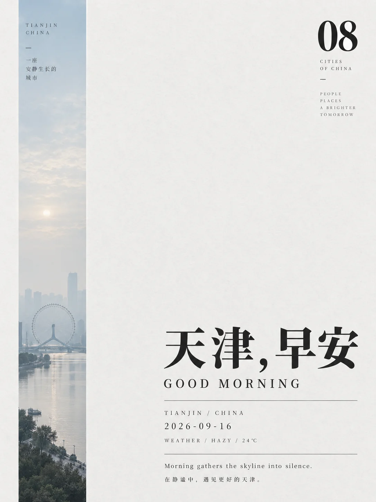

# 极简城市晨语地标海报


## Prompt

```text
围绕用户提供的城市，创作一张“极简城市编辑海报 × 地标远景切片 × 多语言问候排版”风格的竖版视觉作品。

【输入】
城市：{{城市名}}
国家 / 地区：{{可留空，未提供时自动判断}}
主问候语：{{可留空，默认根据主题自动生成，例如早安 / GOOD MORNING}}
语言：{{可留空，默认使用该城市主要语言 + 英文辅助}}
时间语境：{{清晨 / 上午 / 黄昏 / 夜晚，默认清晨}}
日期：{{可留空}}
天气信息：{{可留空，展示性文案，可不要求真实}}
补充短句：{{一句简短情绪文案，可留空}}
画幅比例：{{默认 4:5}}
用途：{{城市海报 / 系列视觉 / 社交媒体视觉 / 编辑封面}}
色彩倾向：{{冷灰蓝 / 雾绿 / 浅沙色 / 浅雾灰，默认自动判断}}
可选禁用元素：{{不想出现的元素，可留空}}

【提示词】

先理解用户提供的城市，并自动提取该城市最具识别度的一处标志性建筑或天际线元素。整体采用“极简编辑设计 + 大面积留白 + 窄幅城市景观切片 + 多语言标题系统”的视觉语言，气质安静、理性、克制，像一本城市观察类独立杂志的封面海报。

【核心视觉结构】

使用竖版海报，整体背景为浅灰白、暖白或轻微纸感的中性底色，大面积留白占据画面绝大多数面积。

画面左侧设置一条极窄、极高的竖向图像切片，宽度约为画面宽度的 8%–14%，从接近顶部延伸到底部附近。切片内部呈现该城市的远景地标或天际线，景象需要非常克制、安静，像被压缩进一条竖向窗景之中。

地标不要近距离堆满画面，而应以远景、小比例、低密度方式出现。地标通常位于切片底部或下方三分之一附近，上方保留大量天空、雾气或空气感。整体像在清晨通过一扇狭长高窗，远远望见这座城市。

【城市地标】

根据用户提供的城市，自动选择最具辨识度的一个核心地标或一组极简天际线特征，例如塔、歌剧院、摩天楼、钟楼、桥梁、尖塔、清真寺轮廓、古城地标或典型城市天际线。只选最能代表这座城市的一处或一组简洁轮廓，不要把多个景点拼贴在一起。

地标应当：
远景；
比例很小；
轮廓清晰；
环境克制；
具有雾气、晨光或淡化空气感。

不要做成旅游宣传照，也不要加入大量街道人群和繁复建筑细节。

【色彩】

整张海报色彩非常节制。大部分区域是浅灰白纸面，左侧窄幅城市切片则使用一组低饱和、近单色的柔和颜色。

根据城市气质自动判断色彩，例如：
清冷晨雾城市：灰蓝、雾青、浅冷灰；
沙漠或温暖城市：沙色、浅米色、暖灰褐；
海港城市：灰蓝绿、雾蓝；
阴天都市：冷灰、蓝灰；
晴朗晨空：淡蓝、灰白。

整体像被轻微褪色处理过的城市明信片，不能鲜艳，也不能高对比。

【主标题】

主标题位于画面右侧或右下区域，是整个海报第二个视觉中心。

主标题通常是一句简短问候，优先使用该城市所属语言。例如：
韩文；
阿拉伯文；
日文；
英文；
或其他与城市真实语言环境相匹配的语言。

如果用户没有指定语言，则自动使用该城市最自然的本地书写语言作为主标题，并在下方加入英文辅助翻译，例如：
“GOOD MORNING”。

主标题使用粗黑、现代、简洁、具有强烈识别度的字体，字重明显，视觉上形成与左侧细长景观条带的强烈对比。字体不必装饰，重点是简洁、稳定、现代。

【辅助文字系统】

围绕主标题建立一套微型编辑信息系统，通常包括：

一行英文辅助问候，例如：
GOOD MORNING

城市 / 国家，例如：
SEOUL / SOUTH KOREA
DUBAI / UAE
TOKYO / JAPAN
SYDNEY / AUSTRALIA

日期，例如：
2026-08-20

天气描述，例如：
WEATHER / CLEAR / 28°C
WEATHER / SUNNY / 41°C
WEATHER / BREEZY / 16°C

一行极短的情绪性句子，用于表达这座城市清晨的氛围，例如：
Morning gives the city its quiet rhythm again.
The city returns gently with the first light.
The morning gathers the skyline into silence.
具体内容需根据城市和整体情绪自动生成，语言简短、克制、具有编辑感，不口号化。

【信息排版】

所有文字位于画面右侧中下区域，形成一个紧凑而克制的信息模块。信息排版需要有明显层级：

第一层：
本地语言大标题。

第二层：
英文问候短语。

第三层：
城市 / 国家、日期、天气。

第四层：
一句极短的城市情绪短句。

这些文字之间通过极细横线、短竖线、小星号、项目点或留白分隔，形成现代编辑设计感。不要加入复杂图标，不要形成卡片界面。

【编号系统】

在画面右上角放置一个醒目的两位数字编号，例如：
02
04
08
10

编号使用粗黑字体，简洁、独立，像杂志系列页码或城市系列编号。编号只起到系列化视觉识别作用，不需要解释含义。

【留白】

留白是这套风格的核心。除左侧窄幅景观切片和右侧文字模块外，其余区域应保持空白、安静、干净。不要为了丰富画面增加多余图形、装饰边框、花纹或背景纹样。

留白应该让观众感受到：
城市尚未完全苏醒；
空气仍然很轻；
远方地标只是被轻轻提示；
文字像低声说出这座城市的名字。

【材质】

背景可带有非常轻微的纸张质感、哑光印刷感或细腻颗粒，但整体仍然极简、平整、干净。不要做旧，不要脏污，不要复古折痕。

【主题自适应规则】

如果用户提供的是现代国际都市：
优先选择天际线、高塔、地标建筑，整体更冷静、几何、现代。

如果用户提供的是历史文化城市：
优先选择钟楼、寺塔、古城轮廓、穹顶或经典建筑剪影，保持克制，不做旅游手册感。

如果用户提供的是海港或滨海城市：
可在切片中保留少量海面、港湾或远处建筑，但仍然以地标轮廓为核心。

如果用户提供的是中东、东亚或其他多语言语境明显的城市：
主标题优先使用当地主要书写语言，并保留英文辅助信息，形成“本地语言 + 国际编辑”的双语结构。

如果用户没有提供日期和天气：
可以生成展示性的版式信息，但应简短、抽象、克制，不必追求真实新闻式精确。

【整体气质】

安静、城市化、国际化、杂志感、呼吸感、留白感、观察感。

整张海报像一本“城市早晨系列”里的单页设计：左边是一道细长的城市窗景，右边是用本地语言说出的简短问候，配上极少量城市信息，让这座城市以一种安静而克制的方式被看见。

【负面约束】

避免旅游宣传海报感；
避免复杂城市全景铺满画面；
避免高饱和蓝天和彩色建筑；
避免大量人物；
避免电商运营设计；
避免复杂图标和信息图；
避免粗糙纹理；
避免赛博朋克；
避免霓虹灯；
避免卡通插画；
避免多地标拼贴；
避免文字过多；
避免把左侧景观做宽；
避免将地标做得过大、过近、过热闹；
避免语言与城市语境不匹配；
避免破坏整体留白和克制感。
```