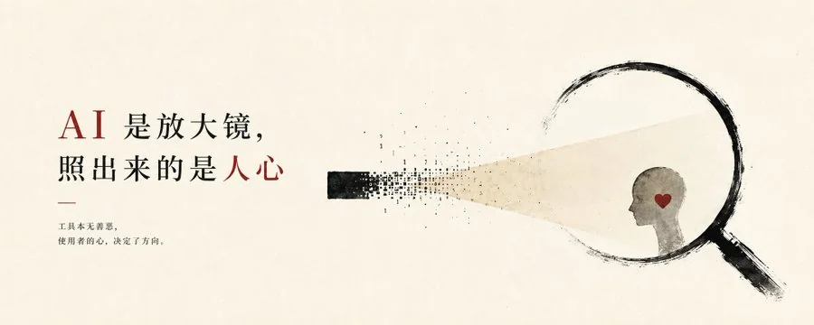

# 极简纸本墨线概念封面



## Prompt

````text
# 极简纸本墨线概念封面

## Prompt

```text
创作一张“极简纸本编辑设计 × 黑色墨线概念插画 × 单一视觉隐喻”风格的高级封面。

这是一套稳定的系列视觉语言。

不要复刻任何具体参考图中的人物、放大镜、心形、简历、手势或文案。
这些只是不同主题下的具体隐喻。

真正需要保持一致的是：

暖米白纸本背景，
大面积安静留白，
左侧克制的编辑标题系统，
右侧一个简单但准确的概念隐喻，
黑色墨线与毛笔笔触，
少量极细的理性构造线，
最多一种极小面积强调色，
以及纸本艺术书封般的安静、理性和思想感。

【输入】
主题词 / 主标题：{{主题词}}
副标题：{{副标题，可留空}}
画幅比例：{{5:2 / 16:9 / 4:5 / 3:4 / 2:3 / 1:1 / 自定义}}
语言：{{中文 / 英文 / 中英混排}}
用途：{{文章封面 / 公众号封面 / 报告题图 / 海报 / 书封 / 其他}}
核心观点：{{一句话说明真正想表达的观点，可留空}}
可选核心隐喻：{{可留空；留空时根据主题自动推导}}
可选主体类型：{{人物 / 人物局部 / 手部 / 物件 / 几何结构 / 空间关系 / 抽象符号 / 自动判断}}
可选强调色：{{暗红 / 克制蓝 / 不使用 / 自动判断}}
可选情绪倾向：{{理性 / 清醒 / 克制 / 疏离 / 自省 / 冷静 / 温柔 / 思考 / 自动判断}}
可选禁用元素：{{不想出现的元素，可留空}}

【核心目标】
先理解“{{主题词}}”真正表达的：

核心观点，
矛盾，
关系，
动作，
心理状态，
因果，
变化，
最终结果。

不要直接把标题里的名词逐个画出来。

先把主题压缩成一句简单的视觉判断，
再寻找一个最适合单张海报表达的核心隐喻。

整张图只保留：

1 个主标题，
1 个核心隐喻，
1 个主要视觉主体，
1 个视觉中心，
最多 1 个副标题，
最多 1 种强调色。

不要同时讲多个故事。

【系列视觉骨架】
无论主题怎么变化，都保持下面的视觉家族特征：

左侧：
文字与大量留白。

右侧：
一个概念化墨线视觉。

背景：
暖米白纸。

主色：
墨黑 / 深黑。

辅助结构：
极淡灰黑细线。

强调色：
最多一种极少量红色或蓝色。

整体形成：

编辑文字
＋
空白
＋
墨线隐喻

的稳定结构。

【背景】
使用温暖米白、象牙白、奶油白或非常浅的旧纸白。

背景应：

安静，
干净，
柔和，
略带纸张触感。

可以存在极轻微的：

纸纤维，
哑光颗粒，
印刷介质感。

但必须非常克制。

不要：

明显做旧，
脏污，
破损，
折痕，
水渍，
复杂纹理，
渐变背景，
装饰图案。

纸张只负责提供温度和呼吸感。

【留白】
大量留白是这个风格最重要的组成部分。

留白应占画面很大比例。

不要为了画面丰富而填满：

人物，
物体，
文字，
几何，
装饰。

空白承担：

距离，
沉默，
思考，
理性，
高级感，
阅读停顿。

画面必须有一种：
“很多地方什么都没有，但每个空白都有意义”
的感觉。

【核心隐喻】
如果用户提供 {{核心隐喻}}，
围绕它建立画面。

如果没有提供，
根据主题自动提炼一个最简单、最准确的视觉关系。

隐喻优先来自：

观察，
筛选，
照见，
选择，
放下，
阻挡，
连接，
拉扯，
穿透，
拆解，
聚焦，
暴露，
隐藏，
判断，
等待，
给予，
拒绝，
边界，
距离，
失衡，
恢复。

隐喻最好可以被一句话描述。

例如：

一只手正在从一组东西里挑出唯一一个目标；

一道光照进一个抽象对象；

一个物体正在被放大、筛选或穿透；

一个人物正在捧着一个抽象情绪结构；

两种结构之间存在明显距离；

一个对象正在从杂乱状态进入清晰状态。

这些只是关系示例，不是固定模板。

【主体选择】
主体根据主题自动变化。

可以是：

人物侧脸，
人物背影，
手部，
眼睛局部，
普通物件，
卡片，
纸张，
文件，
透镜，
放大镜，
线团，
门，
孔洞，
几何结构，
抽象装置，
极简符号。

不要默认每次都画人物。

不要默认每次都画放大镜、心形、眼睛或手。

只有真正符合当前主题时才使用。

【人物语言】
如果使用人物：

人物不是写实摄影，
也不是完整商业插画。

采用极简黑色墨线表现。

优先使用：

侧脸，
局部脸部，
背影，
肩颈，
手部，
身体局部。

人物只保留：

轮廓，
动作，
眼神方向，
最关键的姿态。

五官用极少量线条建立。

不要细画皮肤、头发、服装纹理。

人物应像艺术家用几笔毛笔、钢笔和干笔迅速捕捉出来。

【手部】
手部可以作为非常重要的概念媒介。

例如：

拿取，
筛选，
托住，
拉动，
推动，
放下，
打开。

手部线稿保持：

细长，
克制，
写意，
结构清楚。

不要写实皮肤纹理。

【墨线】
主要视觉使用：

黑色墨线，
毛笔笔触，
干笔，
钢笔线，
局部墨块。

线条应：

粗细不均，
有停顿，
有断裂，
有飞白，
有轻微毛边，
带人工书写感。

部分轮廓可以非常细，
部分关键笔触可以突然加粗。

不要统一数字描边。

不要矢量线稿感。

【线条层级】
画面同时存在两套线条语言：

第一层：
具有情绪和生命感的黑色墨线。

第二层：
非常细、非常轻、偏理性的构造线。

两者形成：

感性
×
理性

的视觉反差。

这也是本系列非常重要的识别特征。

【理性构造线】
允许加入少量极细的：

水平线，
垂直线，
框角，
定位线，
十字准线，
网格片段，
几何轮廓，
透视线，
节点，
点阵，
极简坐标关系。

这些线条使用：

浅灰，
灰黑，
极浅蓝灰。

线宽极细。

它们像：

设计师草图，
分析图，
扫描框，
测量辅助线，
视觉研究标记。

不要发展成：

UI，
HUD，
复杂科技界面，
完整信息图。

构造线只用于强化：
分析，
判断，
观察，
筛选，
理性。

【强调色】
整个画面最多使用一种强调色。

自动从以下选择：

暗红 / 砖红：
适合情绪、人性、关系、欲望、风险、内心。

克制蓝 / 灰蓝：
适合理性、AI、分析、筛选、系统、科技。

如果主题不需要，
完全不用强调色。

强调色面积不得超过画面约 2%–4%。

只允许出现在一个关键位置，例如：

一个眼睛，
一个节点，
一小段线，
一个心形线团，
一个焦点，
一道微小光痕，
标题中的一个词。

不要多点撒色。

【主标题】
主标题必须准确显示：

“{{主题词}}”

主标题位于左侧主要文字区域。

整体偏：

左上，
左中，
或中上。

标题必须是第一视觉之一。

但不要使用粗暴超黑大字。

优先选择：

现代宋体，
高对比宋体，
明朝体气质，
现代衬线中文，
克制的编辑黑体。

字体需要具有：

理性，
文学性，
思想性，
书籍感。

不要：

卡通字体，
手账字体，
科技 UI 字体，
圆体，
粗暴标题党黑体。

【标题尺度】
标题可以很大，
但应保持克制和呼吸。

横版标题通常控制在左侧区域，
不跨越整个页面。

竖版可以形成 2–4 行较大的文字块。

标题与人物 / 隐喻之间保持明确空白。

不要让标题贴到主体上。

【标题排版】
排版保持高级编辑设计感。

允许：

自然拆行，
大小层级，
局部关键词稍大，
极少量字距变化。

不要：

复杂错位，
多方向旋转，
花哨竖排，
大面积水印字，
文字穿插人物，
商业广告式夸张排版。

整体像：

独立杂志，
思想书籍，
艺术画册，
高端文化刊物。

【副标题】
如果用户提供：

“{{副标题}}”

准确显示一次。

使用小号字体，
明显弱于主标题。

可以放在：

主标题下方，
左侧留白区域，
或靠近一条短横线的位置。

副标题尽量只保留：

1 行，
或极短 2 行。

不要写成长段。

【辅助文字】
原则上只保留：

主标题，
副标题。

必要时允许极少量短文字，例如：

3 个关键词；
一句极短英文；
一句简短判断。

但必须具有真实语义。

不要为了杂志感自动生成：

编号，
年份，
日期，
刊号，
品牌，
假出版信息，
随机英文，
无意义小字。

【短横线】
可以加入 1–3 条极简细横线。

用于：

建立文字层级，
结束一个段落，
连接排版节奏。

线条使用深灰或黑色。

不要形成边框。

【构图】
本系列默认采用：

文字偏左，
隐喻偏右，
大量中央留白。

不要严格五五分。

通常：

文字区域约 30%–45%；
视觉隐喻约 30%–45%；
其余为空白。

根据比例灵活调整。

【横版】
5:2 / 16:9：

强化横向呼吸感。

标题偏左，
隐喻偏右。

左右之间保留很大的安静空白。

适合：

分析，
AI，
商业，
心理，
哲学，
关系类主题。

【竖版】
3:4 / 4:5 / 2:3：

仍然保留：

左侧文字，
右侧或右下人物 / 隐喻。

人物可以被局部裁切，
但画面仍保持大量空白。

标题可以形成较大的纵向文字块。

【方形】
1:1：

使用偏心结构。

不要把标题和主体平均放在两边。

可以让：

文字偏左上，
隐喻偏右下。

继续保持不对称和大量留白。

【图文关系】
文字和图形讲述的是同一个观点，
但不需要物理穿插。

标题负责：

准确命名问题。

墨线隐喻负责：

表达问题内部的关系。

例如：

标题谈“筛选”，
右侧表现选择、聚焦或过滤；

标题谈“内心”，
右侧表现人和一个被托住的情绪对象；

标题谈“看见”，
右侧表现光、视线或放大关系。

不要标题说一件事，
右侧只是放一个无关漂亮人物。

【纸本编辑感】
整体像直接印刷在高级米白艺术纸上的视觉作品。

保留：

墨线颗粒，
干笔痕迹，
极浅纸纹，
细线印刷感。

不要使用：

大量水彩，
厚涂，
油画，
复杂拼贴，
照片质感。

【情绪控制】
根据 {{情绪倾向}} 调整：

理性：
增加细构造线，减少感性色彩。

清醒：
强化黑白对比和空白。

自省：
人物姿态更内收，隐喻更小。

疏离：
增加人物与文字之间距离。

温柔：
使用更柔和线条和暖米白背景。

克制：
进一步减少文字和图形。

科技：
增加极少量理性构造线和蓝色节点，
但不改变整体纸本墨线体系。

【必须避免】
不要复杂场景。

不要完整室内空间。

不要写实摄影。

不要 3D。

不要普通商业插画。

不要企业科技宣传风。

不要信息图。

不要流程图。

不要仪表盘。

不要赛博朋克。

不要蓝紫霓虹。

不要复杂 UI。

不要大量图标。

不要高饱和多色。

不要复杂背景。

不要同时出现多个核心隐喻。

不要随机使用：

心形，
放大镜，
人物，
眼睛，
手部

作为固定模板。

它们只能在语义确实需要时出现。

不要加入：
Logo，
水印，
假刊名，
假编号，
无意义英文，
复杂装饰。

不要出现 {{可选禁用元素}}。

【生成前检查】
生成前内部检查：

主题最核心的关系是什么？

能否用一句话描述画面中的隐喻？

是否只有一个主要隐喻？

主体是否真正由主题决定，
而不是复制上一张图的元素？

是否保持：
暖米白纸，
左文字，
右墨线隐喻，
大面积留白？

黑色墨线是否有手绘停顿、断裂和飞白？

是否存在少量极细的理性构造线？

强调色是否最多一种？

强调色面积是否足够小？

标题是否准确清楚？

是否加入了不必要的小字？

如果有，删除。

是否存在复杂背景？

如果有，继续简化。

如果去掉标题，
右侧隐喻是否仍然能让人感觉某种关系正在发生？

如果不能，
重新设计隐喻。

最终画面是否和同系列其他作品拥有明显共同语言，
同时又没有重复同一个具体物件？

如果是，
则方向正确。

【最终标准】
最终只生成一张独立完整封面。

不要输出：

分析过程，
多个方案，
拼图，
样机，
网格，
联系表。

最终成图必须稳定呈现：

暖米白纸本背景；
大面积干净留白；
左侧高级编辑文字；
右侧一个单一概念隐喻；
黑色墨线、毛笔或干笔轮廓；
少量极细理性构造线；
最多一种极小面积暗红或克制蓝；
没有复杂场景；
没有商业广告感；
没有信息图感；
没有科技 UI 感。

整个系列的统一感来自：

纸，
墨，
文字，
空白，
一个关系。

而每张图的变化来自：

主题不同，
主体不同，
动作不同，
隐喻不同。

最终效果应像：

一位同时具备编辑设计、概念艺术和东方墨线表达能力的艺术家，
针对每个主题只画最必要的一笔。

不是“固定人物风格模板”，

而是：

“用同一套纸本、墨线、留白和编辑语言，
不断讲述不同主题的概念封面系列。”
```
````
