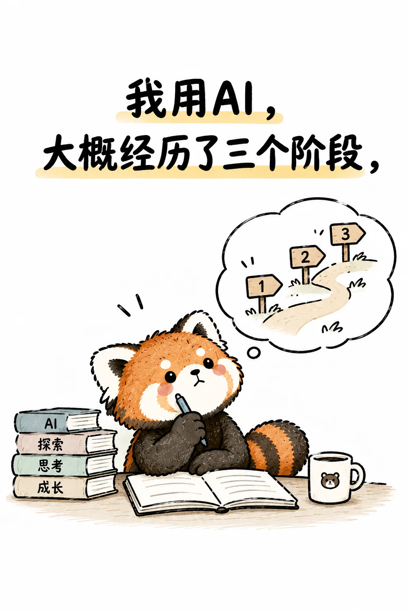

# 极简手绘生活哲理漫画


## Prompt

```text
围绕用户提供的一句话、生活感悟或观点，创作一张“极简生活漫画 × 黑色墨线手绘 × 治愈系小人物 × 大面积留白”风格的竖版单幅漫画。

【输入】
主题 / 文案：{{需要表达的一句话}}
核心含义：{{这句话真正想表达的情绪或观点，可留空}}
主角：{{人物 / 小动物 / 自动选择}}
视觉隐喻：{{雨伞、咖啡、工资、爱心、气球、仙人掌等，可留空自动判断}}
情绪：{{治愈 / 无奈 / 通透 / 自嘲 / 温暖 / 坚定 / 松弛}}
画幅比例：{{默认 2:3}}

【提示词】

先理解文案真正表达的生活处境或情绪，再将它转译成一个简单、直接、有轻微幽默感的日常漫画场景。坚持“一张图只表达一个意思”，使用一个主角、一个动作和少量象征物完成叙事，不堆砌元素。

画面采用竖版构图和大面积纯白或暖白纸张背景。插画集中在画面上半部或中上部，占整体约 50%–60%；下方保留宽阔留白，并放置文案。整体像一本轻松生活漫画或独立手绘小刊中的单页作品。

主角采用圆润、简单、略带笨拙感的 Q 版造型，头部稍大、身体简化、四肢短小，表情克制但清晰，可通过眼睛、嘴巴、腮红、姿态和少量动作线表现情绪。允许使用小兔、小熊、小狗、小猫、普通小人物等，根据主题自动选择最合适的形象。

使用自然手绘黑色墨线，线条略粗、轻微抖动、粗细不完全均匀，保留真实纸笔绘制的随性感；轮廓简洁，不追求精确透视和复杂细节。局部可以加入少量铅笔排线或轻微阴影，但保持整体干净。

色彩极度克制，以黑色线稿和白色背景为主，仅使用 1–3 种柔和色彩作为强调，例如暖黄色、珊瑚红、浅粉、灰绿色、米灰色。使用平涂色块和轻微纸张质感，避免复杂渐变、高光和高饱和配色。

视觉叙事优先使用普通生活物件形成隐喻，例如雨伞代表面对未知，咖啡代表打工疲惫，钞票代表工资，爱心或气球代表情感，仙人掌代表关系中的边界。隐喻必须简单易懂，不做复杂象征体系。

在画面下方清晰呈现文字：
“{{主题 / 文案}}”

文字只出现一次，保持原文准确，不改写、不增删。使用自然、略带稚拙感的黑色中文手写字，通常排成 1–3 行，居中布局，字号较大，与插画之间保留充分呼吸空间。

整体气质轻松、朴素、温暖，带一点成年人生活中的无奈、自嘲和通透感；像随手画出的生活感悟，却具有清晰的视觉节奏和情绪表达。

避免复杂背景、复杂透视、多人群像、精细厚涂、写实摄影、3D 渲染、商业矢量插画、日漫赛璐璐、过度可爱装饰、花哨字体、边框、贴纸、二维码、签名、品牌标识和水印。除指定文案外，不添加任何额外文字。
```