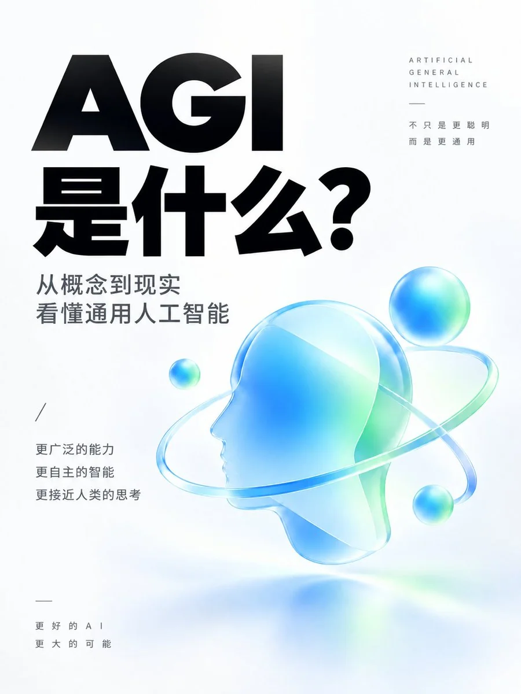

# 极简轻科技视觉



## Prompt

````text
# 极简轻科技视觉

## Prompt

```text
请根据下面的用户输入，设计一张「极简轻科技」风格的视觉作品。

【用户输入】

内容主题：
【填写主题。用于决定视觉概念与整体气质，不要求直接显示在画面中。】

画面文字：
【填写必须准确出现在画面中的全部文字。若不需要文字，填写“无文字”。】

画幅比例：
【例如：5:2、3:4、1:1、16:9】

渐变色系：
【自动选择 / 蓝绿系 / 蓝紫系 / 紫粉系 / 青绿系 / 薄荷系 / 冰川系 / 银蓝系 / 金橙系 / 黑金系 / 低饱和暖色系 / 低饱和冷色系 / 其他指定色系】

配色补充：
【可留空。例如：更柔和 / 更高级 / 更清爽 / 更克制 / 更明亮 / 更未来 / 更低饱和 / 更有品牌感】

主视觉偏好：
【自动设计 / 更抽象 / 更极简 / 更柔和 / 更克制 / 更未来 / 更有体积感 / 指定简单形体】

Logo：
【有 Logo / 无 Logo】

Logo 使用方式：
【可留空。例如：保留原识别特征 / 轻微立体化 / 融入主视觉 / 作为核心视觉锚点】

参考图：
【可留空。如果上传多张图片，请明确说明各图片用途，例如：
图 1 是 Logo；
图 2 是风格参考；
图 3 是配色参考。
参考图只用于指定的用途，不随意混用。】

────────────────

【设计目标】

创作一张干净、现代、克制、高级的极简轻科技视觉作品。

画面应具有：

大量留白，
清晰的信息层级，
一个单一明确的主视觉锚点，
柔和细腻的渐变，
轻微而可信的立体感，
自然克制的光影，
安静、理性、现代的科技气质。

整体更接近高端科技品牌的编辑视觉，
而不是复杂的赛博朋克海报或信息密集型 UI。

────────────────

【背景与整体风格】

背景使用纯白、暖白、浅灰白或非常浅的中性色。

保持背景安静、干净，大面积留白。

视觉重点集中在：
文字信息 + 一个主视觉锚点。

不要用大量装饰填满画面。

整体感觉：

极简，
轻盈，
精确，
现代，
理性，
克制，
具有轻科技感和高级编辑设计感。

────────────────

【构图】

严格按照用户填写的画幅比例生成。

画幅比例只决定画布形状，不要把比例数字显示在画面中。

根据实际比例、文字数量和主视觉形态自动组织版式。

横版：
可使用左右结构、偏心结构、大留白结构或文字与视觉错位结构。

竖版：
可使用上下结构、顶部文字 + 下方主视觉、偏心结构或纵向留白结构。

方形：
可使用中心聚焦、偏心聚焦或均衡结构。

每种比例都重新设计构图，
不要简单拉伸或裁切同一模板。

主视觉与文字之间保留明显呼吸空间。

所有重要内容远离画面边缘。

构图稳定，但避免机械居中。

────────────────

【文字】

如果“画面文字”为“无文字”：

画面中不要出现任何文字、字母、数字、标签、署名或装饰性字符。

如果用户提供了画面文字：

只使用用户明确提供的文字。

必须准确呈现原文：
不改写，
不增删，
不自动生成宣传语，
不添加副标题，
不添加英文翻译，
不添加日期，
不添加标签，
不添加署名。

将用户提供的文字视为需要准确排版的内容。

文字系统采用现代、清晰、具有科技编辑感的无衬线字体。

中文主标题：
大字号、较粗字重、清晰稳定的现代黑体风格。

次级文字：
更小、更轻、更克制。

通过字号、字重、行距、位置和留白建立层级。

文字颜色以黑色或近黑色为主。

必要时最多允许一个重点词使用与主视觉呼应的颜色。

不要使用：
霓虹描边，
复杂渐变字，
夸张投影，
金属立体字，
过度挤压效果。

文字必须清晰可读，并保持足够留白。

────────────────

【主视觉锚点】

整张图只设计一个主要视觉锚点。

它应该：
轮廓清晰，
结构简单，
具有明确视觉重心，
有轻微想象力，
能够承载主题气质，
同时保持极简。

不要加入多个互相竞争的主视觉。

不要通过大量小图标解释主题。

────────────────

【有 Logo 时】

如果用户上传 Logo 或明确填写“有 Logo”：

将 Logo 作为主要视觉基础。

保留 Logo 最关键的识别特征、轮廓和品牌关系。

允许进行轻度视觉转译，例如：

轻微立体化，
柔和材质化，
轻拟物化，
半透明处理，
渐变材质处理，
与简单几何结构融合，
形成悬浮或具有体积感的品牌视觉锚点。

不要把 Logo 改造成无法识别的新图形。

不要只是把 Logo 平贴在背景中央。

Logo 应自然成为整体视觉设计的一部分。

────────────────

【无 Logo 时】

如果没有 Logo：

不要虚构品牌 Logo 或标志。

根据“内容主题”设计一个简单的抽象视觉锚点。

可以选择：

简单几何体，
柔和曲面，
折叠结构，
悬浮模块，
抽象界面形体，
未来感体块，
流体几何，
半透明结构，
具有体积感的符号化造型。

形态应与主题的感觉产生隐喻关系，
但不要把主题直接画成复杂说明插图。

例如：
“连接”可以通过两个结构的连接关系表达；
“智能”可以通过有秩序的抽象结构表达；
“速度”可以通过方向、延展和空间关系表达。

不要默认生成 App 图标、渐变卡片、便签或 Logo 底板。

根据每个主题重新选择最合适的抽象形态。

────────────────

【色彩】

根据以下优先级决定配色：

1. 用户明确指定的颜色或色系；
2. 用户提供的 Logo 或品牌视觉中的主要品牌色；
3. 参考图明确提供的配色方向；
4. 根据内容主题自动选择。

色彩主要集中在主视觉锚点。

背景保持白色或非常浅的中性色。

渐变可采用：

同色系深浅变化，
两种协调颜色的柔和渐变，
最多三种相近颜色形成自然过渡。

渐变应细腻、连续、柔和。

可根据主题选择：

蓝绿：理性、清爽、科技；

蓝紫：数字、现代、未来；

紫粉：轻盈、创意、前沿；

青绿：理性、自然、生命力；

薄荷：清新、柔和、明亮；

冰川：通透、冷静、克制；

银蓝：专业、高级、精确；

金橙：温暖、能量、前沿；

黑金：高端、品牌、克制；

低饱和暖色：柔和、编辑、高级；

低饱和冷色：安静、理性、未来。

不要无序堆叠高饱和颜色。

不要使用大面积强烈霓虹光效。

────────────────

【材质与光影】

主视觉具有轻微而可信的三维体积感。

材质可以根据主题选择：

细腻哑光，
柔和半透明，
轻微珠光，
克制玻璃感，
柔润塑形材质，
细腻磨砂材质。

使用大型柔光源。

光影自然、柔和、克制。

允许主视觉：
轻微悬浮，
轻微旋转，
轻微倾斜，
产生非常柔和的接触阴影或空间阴影。

材质的目的只是增强形体和质感，
不要让材质效果成为视觉主体。

────────────────

【最终效果】

最终画面应呈现：

充足留白
+
清晰文字层级
+
一个单一视觉锚点
+
柔和高级渐变
+
轻微三维体积
+
克制光影
+
现代科技编辑设计。

适用于：

科技内容封面，
教程封面，
产品介绍，
工具介绍，
AI 主题内容，
品牌观点，
软件发布，
技术概念表达，
现代商业视觉。

如果提供 Logo：
形成极简的品牌化科技视觉。

如果没有 Logo：
形成极简的抽象化科技视觉。

无论哪种情况，
都保持统一的「极简、留白、轻科技、柔和渐变、单一锚点」视觉系统。

【避免】

复杂赛博朋克；
密集 UI；
多主体竞争；
大量小图标；
复杂机械结构；
花哨拼贴；
拥挤排版；
强烈霓虹；
厚重金属质感；
过度镜面反射；
复杂背景；
大量装饰元素；
过强投影；
多种无关渐变；
模板化 App 图标；
无意义科技线条；
未经用户提供的额外文字。
```
````
