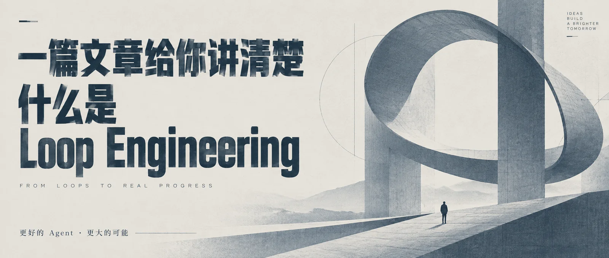

# 极简建筑排版封面


## Prompt

```text
围绕用户提供的主题，创作一张“极简编辑排版 × 抽象建筑空间 × 蓝灰单色印刷质感”的横版封面海报。

这不是白板手绘风，也不是复杂信息图，而是一张具有高级杂志封面气质、强排版感和抽象空间感的观点型封面。
整体视觉应接近：现代主义平面设计、建筑海报、极简商业观点封面、杂志级排版海报。
重点是“大标题冲击力 + 大面积留白 + 抽象几何建筑主体 + 微小人物比例 + 冷静克制的高级感”。

【输入】
主题 / 主标题：{{主题}}
核心观点：{{一句话说明真正想表达的判断}}
副标题：{{副标题，可留空}}
核心关系：{{例如：限制 → 突破 / 输入 → 重组 → 结果 / 能力 → 杠杆 → 自由，可留空}}
关键维度：{{2–4 个短词，可留空}}
最终结果：{{一个短词或短句，可留空}}
画幅比例：{{默认 16:9}}
语言：{{中文 / 英文 / 中英混排}}
用途：{{文章封面 / 公众号封面 / 报告题图 / 商业观点图 / 知识卡片}}
可选情绪倾向：{{理性 / 专注 / 克制 / 深度 / 高级 / 未来 / 研究}}
可选禁用元素：{{不想出现的元素，可留空}}

【核心视觉结构】

采用“左侧标题区 + 右侧抽象主体”的稳定横版构图。

1. 左侧标题区
- 左侧预留约 34%–42% 的干净留白区域。
- 在左侧放置主标题，要求使用超大字号、粗体、窄体、压缩感强的现代无衬线字体。
- 标题建议分 2–4 行排布，纵向叠放，形成强烈的版式张力。
- 标题整体左对齐，位置处于左侧中部略偏上区域。
- 标题必须清晰、准确、完整，优先保证文字可读性。
- 若有英文副标题，可用较小字号置于主标题下方，字距略微拉开，形成“主标题 + 小标语”的层级关系。
- 若有中文副标题，可放在主标题下方或旁侧，保持克制，不要喧宾夺主。
- 左侧允许少量极细辅助线、淡淡几何草图线或极轻结构线，但不能破坏整体留白感。

2. 右侧主体区
- 右侧约 58%–66% 区域放置抽象视觉主体。
- 主体不是具体写实建筑，而是“抽象建筑 / 雕塑化结构 / 几何空间体块”的融合体。
- 可以由大尺度弧面、斜面、拱形、切面、薄片结构、巨大立柱或流动曲面组成。
- 形态应具有“未来建筑模型”与“纪念碑式空间装置”的气质。
- 主体应高耸、简洁、干净，具有压迫感与秩序感。
- 主体可部分延伸到中间区域，与左侧标题形成视觉呼应，但不要压住标题主体。

3. 空间叙事元素
- 在右下或画面偏下区域加入一个极小的人物剪影或人物背影。
- 人物应非常小，用来强化尺度对比、孤独感、探索感和思考感。
- 人物不要有复杂细节，只需作为比例尺和情绪锚点。
- 允许地面有轻微透视和极淡阴影，让人物与主体有空间关系。

4. 版式关系
- 画面整体必须强调“大”和“小”的对比：
  巨大的标题、巨大的抽象结构、极小的人物。
- 通过这种对比，形成思想性、未来感和观点感。
- 标题区与图像区既分离又统一，不能像普通 PPT 那样割裂。

【核心原则】

1. 版式优先
版式稳定性 > 标题可读性 > 气质统一 > 空间隐喻 > 装饰细节。

2. 极简克制
画面元素必须少而准。
不堆砌图标，不做复杂流程，不放大段说明文字。
依靠排版、留白、结构体量和比例关系建立高级感。

3. 标题处理
标题必须有“杂志封面级”的冲击力。
字体应接近高挑、压缩、挺拔、理性的现代无衬线风格。
避免可爱字体、圆体、卡通字、书法字、花哨装饰字。

4. 空间隐喻
抽象建筑主体不需要明确说明是什么，但必须让人感到：
宏大、理性、未来、通往更高层次、跨越边界、进入新秩序。
让画面像是在表达某种“更大的系统、秩序、自由、能力或未来”。

5. 人物比例
小人物非常关键。
它能让画面从单纯平面设计变成带有叙事感的思想型封面。
人物必须克制，不抢视觉中心。

6. 文字控制
除主标题、副标题和必要短句外，不加入多余文字。
如果有英文短句，应简短、有格言感、像封面标语。
中文文字和英文文字都必须清晰、正确、完整。

【主色系统】

整体采用“蓝灰单色 + 米白纸底”的低饱和高级配色。

1. 背景色
- 浅米白
- 浅灰白
- 略带纸张质感的暖白色
背景应干净、安静、克制，像高级纸张或艺术印刷纸。

2. 主标题颜色
- 蓝灰色
- 雾霾蓝
- 冷调石板蓝
主标题颜色应厚重、沉稳、有印刷海报感。

3. 主体结构颜色
- 更浅的蓝灰色
- 半透明灰蓝
- 雾感冷灰蓝
主体结构可与标题同色系，但明度区分开，形成层次。

4. 辅助颜色
- 深灰
- 石墨灰
- 极浅冷灰
用于小字、线条、人物剪影、局部结构线。

5. 配色原则
- 整体以单色系为主，不做花哨多色搭配。
- 颜色总量克制，尽量控制在 2–4 种近似色范围内。
- 可以有轻微深浅变化，但不要出现高饱和亮色。
- 避免霓虹、彩虹渐变、强对比撞色。

【风格总基调】

整体气质应接近：
- 现代主义编辑海报
- 建筑事务所概念海报
- 金融与商业思想类杂志封面
- 高级品牌观点广告
- 抽象未来主义平面设计

视觉特征包括：
- 大面积留白
- 巨大的粗体窄体排版
- 抽象几何建筑或空间装置
- 细腻的纸张颗粒感
- 轻微印刷噪点或胶片般的细颗粒质感
- 低饱和蓝灰色调
- 极小人物带来的尺度反差
- 冷静、克制、理性、孤独而坚定的情绪

【材质与细节要求】

- 背景可带轻微纸张纹理、细颗粒感、柔和印刷质感。
- 主体结构可有淡淡半透明层次、轻微叠印感或建筑图纸般的结构痕迹。
- 可加入非常淡的几何辅助线、草图线、圆弧构造线，让画面更像“概念建筑 + 编辑设计”。
- 这些线条必须极轻，不可喧宾夺主。
- 画面整体不要出现厚重阴影、强烈反光或复杂写实贴图。

【避免事项】

不要做成：
- 白板手绘流程图
- 卡通插画
- 商务 PPT
- 赛博朋克海报
- 3D 写实科幻场景
- 照片拼贴海报
- 高饱和广告风
- 花哨多彩海报
- 儿童绘本风
- 复杂 UI 截图式封面

不要加入：
- 大量图标
- 大段正文
- 杂乱装饰
- 过多元素
- Logo、水印、二维码
- 毫无意义的小字填充

【最终效果】

最终效果应是一张具有强烈思想感和现代审美的横版封面：
左侧是醒目、巨大的标题排版，风格克制而有力量；
右侧是抽象、巨大、未来感的建筑式结构主体；
下方或右下有一个极小人物作为比例参照；
整体以米白纸底和蓝灰单色为主，带轻微印刷与纸张质感，
呈现出一种理性、自由、边界被打开、面向更大空间的高级编辑封面气质。
```