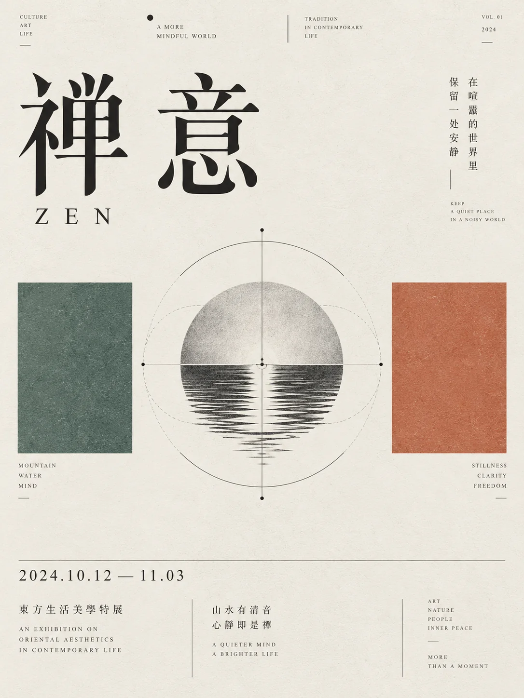

# 现代主义文化活动海报


## Prompt

```text
围绕用户提供的主题，创作一张“东亚现代主义编辑设计 × 瑞士网格系统 × 极简几何概念符号”风格的高级文化海报。

【输入】
主题 / 主标题：{{主题}}
核心观点：{{一句话说明真正想表达的内容，可留空}}
副标题：{{副标题，可留空}}
核心关系：{{例如：开放 → 阅读 → 连接 / 空间 → 材料 → 未来 / 声音 → 自由 → 共鸣，可留空}}
关键信息：{{2–4 个关键词，可留空}}
活动名称：{{可留空}}
日期 / 时间：{{可留空}}
地点：{{可留空}}
补充信息：{{活动内容、招募说明、展期等，可留空}}
画幅比例：{{默认 3:4}}
语言：{{默认中英混排}}
用途：{{活动海报 / 展览海报 / 品牌视觉 / 文章封面 / 公共文化宣传}}
色彩倾向：{{可留空，留空时根据主题自动判断}}
可选禁用元素：{{不想出现的元素，可留空}}

【提示词】

先理解用户提供的主题，提炼其中最核心的概念、关系和行为，再将它转化为一个高度简化、具有识别度的几何视觉符号。

整个设计采用“东亚现代主义编辑设计 × 瑞士国际主义网格 × 极简概念图形”的视觉语言，具有文化机构、建筑展览、独立出版物、设计节或公共文化项目的高级视觉气质。

【核心视觉逻辑】

将主题压缩成：

主题
→
核心关系
→
一个概念符号
→
两种辅助色彩
→
完整编辑版式

中央只建立一个主要视觉符号。

这个符号应当通过极细线条、基础几何形、轴线、圆、矩形、拱门、轨迹、结构框架、节点或抽象物件完成，不使用复杂插画。

例如：

阅读 / 知识：
可以抽象为书页、门、拱形入口、展开结构或光源。

建筑 / 空间：
可以抽象为梁柱、门洞、体块、轴测结构或空间框架。

音乐 / 声音：
可以抽象为唱片、声波、轨道、旋转结构或节奏圆环。

社区 / 生长：
可以抽象为种子、叶片、水滴、根系、节点网络或开放结构。

连接 / 协作：
可以抽象为交汇线、桥梁、路径、模块、节点或连续结构。

科技 / 信息：
可以抽象为信号、坐标、数据节点、轨迹或模块化结构。

只选择一个最准确的视觉隐喻，并继续几何化和符号化。

【版式结构】

采用严格的现代主义网格系统。

整体背景使用接近纯白或温暖象牙白的大面积纸面。

顶部保留细小的栏目式信息，例如英文分类词、品牌信息、小圆点和极细水平线，形成出版物或文化机构视觉系统。

主标题位于画面上部，占据明显视觉重量。

中文标题使用极细、优雅、具有强烈编辑感的宋体或现代衬线字体，字距舒展，结构端正。

标题可以一行横排、两行排布或使用分隔线组织，根据主题长度自动调整。

英文副标题使用小字号、大字距、全大写或克制的编辑字体。

画面中部为主要概念视觉。

中央放置一个精密、黑灰色线稿构成的几何符号。

中央图形左右分别安排一块纯色方形或接近方形的色块，与中央符号形成稳定的三段式关系：

色块
+
核心符号
+
色块

两侧色块大小接近，但颜色不同。

不要在色块内部加入复杂图形或文字，让它们主要承担视觉重量、色彩对比与构图平衡。

中央符号可以略高于或略低于色块中心，使画面保持轻微的非机械感。

【中央符号】

中央图形是整张海报最关键的部分。

它需要：

结构简洁；
概念明确；
线条极细；
黑色或深灰；
具有建筑制图、工业设计草图、图标系统或抽象信息图的精密感。

允许加入：

圆形；
半圆；
拱形；
细轴线；
结构辅助线；
重复轮廓；
节点；
透视线；
虚线；
极小黑点；
几何投影。

图形应当具有“看似简单，但经过严密设计”的感觉。

避免具象写实绘画。

【色彩系统】

整张海报以白色、黑色和灰色为基础，只加入 2 种主要强调色。

强调色根据主题自动推导。

例如：

文化 / 公共：
钴蓝 + 朱红。

建筑 / 城市：
墨绿 + 陶土橙。

音乐 / 青年：
深紫 + 荧光黄绿。

生态 / 社区：
苔藓绿 + 深蓝。

科技 / 未来：
群青 + 暖橙。

两个色块需要形成明显色相差异，但保持成熟、克制和设计感。

避免同时出现大量颜色。

【标题系统】

主标题是第一视觉层级。

中文标题保持明显字号和大量呼吸空间。

不要使用粗黑商业字体。

优先采用细宋体、现代宋体、东亚衬线字体或具有建筑出版物气质的字体。

标题可以适度拆分，例如：

新｜锐｜建｜筑｜展

或：

独立音乐厂牌
发布会

具体结构根据主题自动判断，不机械重复。

标题附近可加入极小的英文翻译或概念短语，例如：

EMERGING ARCHITECTURE EXHIBITION

LABEL LAUNCH

LIBRARY OPEN DAY

具体英文必须根据用户主题重新生成。

【微型编辑文字】

在画面边缘和主视觉周围加入少量微型信息，用于建立专业编辑设计感。

可以包含：

英文关键词；
中文短句；
年份；
项目编号；
机构名称；
地点；
网站；
栏目标签；
极短说明。

英文通常采用：

全大写；
极小字号；
宽字距；
2–5 个单词组成一组；
纵向或横向排列。

这些文字承担版式节奏，不抢夺主标题与中央符号的视觉中心。

【下部信息区】

画面下方约 20%–30% 用于承载活动或项目详情。

使用极细水平线划分信息区域。

根据用户提供的信息，可以安排：

活动名称；
日期；
时间；
地点；
展期；
活动内容；
报名方式；
项目介绍；
主办机构。

信息采用两栏、三栏或模块化网格排列。

日期可以适当放大，形成次级视觉焦点。

说明文字保持小字号、高行距和明确层级。

如果用户没有提供具体活动信息，则自动生成与主题匹配的极简展示性信息，不虚构真实机构、真实地址、联系电话或网站。

【细节系统】

可以使用极少量：

黑色圆点；
细横线；
竖线；
极小定位图标；
抽象网站标记；
几何项目符号；
坐标感辅助线。

这些元素主要用于强化网格和编辑秩序。

整体信息密度保持克制，留白应明显大于文字和图形占用面积。

【材质】

背景带有非常轻微的高级艺术纸、哑光纸或印刷纸纹理。

纯色色块允许存在轻微油墨颗粒和天然不均匀感。

黑色线稿保持清晰锐利。

整体具有实体设计海报、艺术出版物或高品质丝网印刷作品的纸本质感。

避免明显复古做旧、脏污和破损效果。

【整体气质】

理性、克制、专业、现代、文化感、建筑感、公共性。

像一张由独立设计工作室为：

美术馆、
建筑展、
公共图书馆、
设计节、
音乐厂牌、
艺术机构、
社区项目、
文化活动

设计的正式视觉海报。

视觉重点来自：

大字号中文标题
+
严格编辑网格
+
中央概念符号
+
左右双色几何色块
+
微型英文排版
+
底部信息系统。

【主题自适应规则】

不同主题必须重新设计中央概念符号。

不要固定使用书本、拱门、唱片、叶片或水滴。

先理解主题的核心动作和关系，然后寻找最简单的视觉结构进行表达。

如果主题强调：

开放：
使用入口、展开、打开、向外延伸等结构关系。

连接：
使用节点、桥梁、交汇、路径或连续线条。

生长：
使用种子、枝叶、扩散、向上结构或渐进变化。

声音：
使用旋转、同心圆、波形、节奏和轨迹。

空间：
使用门洞、梁柱、体块、透视和轴线。

知识：
使用书页、光、层级、窗口和展开关系。

社区：
使用多个节点围绕中心、共享空间或循环系统。

最终图形应具有强烈概念性，同时保持足够简单，让观众在远距离仍能识别其整体轮廓。

【负面约束】

避免商业电商海报、互联网运营海报、霓虹渐变、赛博朋克、复杂插画、人物摄影、三维渲染、卡通图标、密集信息图、大量渐变、多种高饱和颜色、复杂背景、厚重阴影、拟物界面、廉价科技感以及装饰性元素堆积。
```