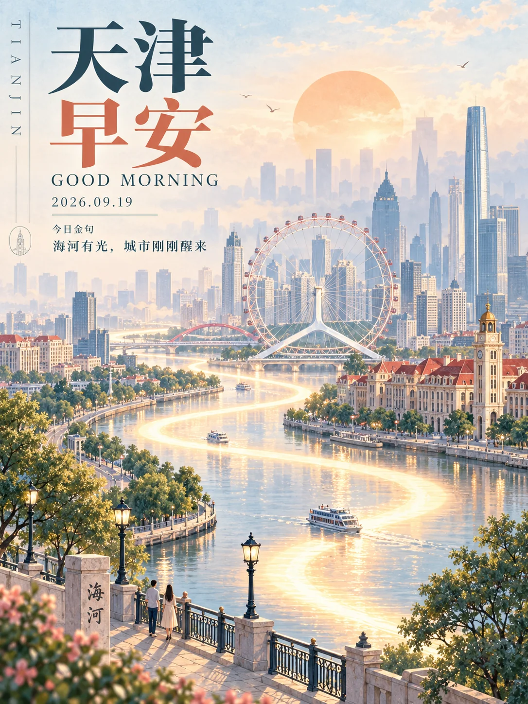

# 城市晨光旅行编辑海报



## Prompt

```text
围绕用户提供的城市或地点，创作一张“城市旅行海报 × 晨光叙事 × 复古编辑设计 × 柔雾粉彩建筑插画”风格的竖版作品。

画面应像一本高品质城市文化杂志的晨间特别页，也像经过当代重新设计的经典旅行宣传画。

重点表现城市在清晨刚刚苏醒时的状态：

安静；
明亮；
温暖；
空气通透；
带有轻微晨雾；
城市仍然熟悉，却比现实更加理想化、诗意化。

整张作品要形成一个完整的“城市晨光世界”，让建筑、河流、道路、天空、朝阳和文字共同构成统一的视觉叙事，而不是简单排列城市地标。

【输入】

城市 / 地点：{{城市名称}}

中文主标题：{{默认“城市名称 + 早安”，例如“杭州早安”}}

英文副标题：{{默认 GOOD MORNING}}

日期：{{日期，可留空}}

今日金句：{{一句简短、自然、有晨间气息的中文句子，可留空}}

英文城市名：{{例如 HANGZHOU，可自动生成}}

代表性地标：{{2–5 个，可留空；留空时根据城市自动判断}}

自然环境：{{河流 / 湖泊 / 海湾 / 山体 / 公园 / 街道 / 自动判断}}

前景元素：{{桥梁 / 建筑 / 树木 / 游船 / 街灯 / 栏杆 / 人物 / 自动判断}}

主色倾向：{{自动判断 / 青蓝 / 青绿 / 淡紫 / 暖橙 / 其他}}

用途：{{手机壁纸 / 城市海报 / 社交媒体 / 公众号配图 / 城市宣传}}

画幅比例：{{默认 1:2 竖版}}

可选禁用元素：{{不希望出现的元素，可留空}}


【主题理解】

首先理解这座城市最具有识别度的视觉结构，而不是机械堆砌旅游景点。

分析并提炼：

1. 最具有代表性的城市天际线；
2. 2–5 个能够快速识别城市身份的建筑或地标；
3. 城市特有的自然环境，例如河流、湖泊、海岸、山体或树林；
4. 最适合进入前景的生活化元素，例如桥梁、游船、街灯、栏杆、树木、小型人物；
5. 能够代表这座城市气质的主色。

将这些元素重新组织成一个理想化、具有纵深感的城市景观。

地标保持真实世界中可辨认的核心轮廓和比例特征，同时适度简化细节，使它们自然融入统一的插画语言。


【核心视觉母题】

设计一条巨大的、柔和发光的“S 形晨光路径”，从画面底部附近进入画面，经过前景和中景，最终盘旋进入远处城市与天空。

这条路径是整张作品最重要的视觉线索。

它可以同时具有：

晨光；
河流反光；
城市道路；
时间轨迹；
晨间气流；

几种含义。

保持抽象和诗意，不需要明确解释它到底是什么。

路径呈柔和的奶白色、淡金色或象牙色，边缘自然扩散出微弱暖光。

它需要连续、流畅、有节奏地穿过整个纵向画面，将前景、中景、远景以及城市地标串联起来。

避免机械的霓虹灯效果。

更接近清晨太阳照亮水面后形成的一条巨大光带。


【整体构图】

采用极高纵深的竖版城市景观。

视觉阅读顺序：

左上标题
↓
天空与朝阳
↓
远景城市天际线
↓
代表性地标
↓
S 形晨光路径
↓
中景城市或水域
↓
近景建筑、植物、栏杆或人物
↓
画面底部的安静留白与细节

构图整体采用“远景高、前景低”的纵向展开方式。

上半部分保持大量浅色天空和晨雾，为标题留下呼吸空间。

城市主体从画面中上部开始逐渐出现，并随着视觉向下移动变得更加具体。

避免所有地标处在同一平面。

让建筑沿纵深逐层展开。


【空间层次】

至少建立四层明显景深。

第一层：极远景

城市轮廓几乎融入晨雾，只保留淡淡剪影。

颜色非常浅，接近天空。

细节最少。


第二层：远景

出现城市主要天际线和现代高楼。

轮廓清楚，但仍然受到晨雾影响。

饱和度较低。


第三层：中景

放置最具有城市识别度的核心地标。

建筑结构明显，色彩稍微增强。

这里是城市身份识别的主要区域。


第四层：近景

加入桥梁、传统建筑、街灯、植物、游船、小人物、栏杆或滨水空间。

轮廓最清楚。

颜色最深。

细节最多。

利用这种层层递减的对比度，制造明显的空气透视与晨雾空间。


【朝阳】

在画面上方约三分之一的位置放置一个巨大但非常柔和的圆形朝阳。

太阳是淡杏色、淡橙色、奶油色或粉桃色。

边缘柔和。

亮度克制。

像被晨雾过滤后的太阳。

不要成为强烈光源，而应更像整张作品背后的暖色视觉锚点。

太阳可以部分被城市轮廓遮挡，使画面产生更明显的空间纵深。


【城市建筑】

建筑采用具有真实建筑逻辑的简化插画方式。

保留：

主要轮廓；
屋顶结构；
塔楼比例；
拱门；
窗户节奏；
桥梁结构；
城市天际线特征。

减少：

复杂纹理；
密集窗格；
过度写实材质；
杂乱广告牌；
商业招牌。

建筑应具有“能够认出是什么，却经过编辑插画重新设计”的状态。

不同建筑之间保持统一的线条粗细、阴影逻辑和色彩语言。


【插画语言】

使用高级平面插画与轻水彩质感结合的视觉媒介。

整体具有：

精细建筑线稿；
大面积平涂；
低对比柔和阴影；
轻微纸张纹理；
少量透明水彩晕染；
克制的颗粒感；
复古石版印刷气质；
现代数字插画的干净边缘。

轮廓精确，但避免强烈黑色描边。

主要通过色块深浅和冷暖关系区分建筑结构。

远景边缘可以略微溶解进晨雾。


【色彩】

整体使用低饱和粉彩色系。

背景：
暖白；
象牙白；
奶油白。

冷色：
雾蓝；
灰青；
淡青绿；
浅灰紫。

暖色：
杏色；
粉橙；
浅珊瑚；
淡赭石；
柔和砖红。

强调色只占较小面积。

例如：

主标题中的“早安”；
旗帜；
花朵；
屋顶；
朝阳；
局部晨光。

控制整体颜色数量。

画面主体最好维持在 4–6 个主要色相以内。

颜色像被晨雾和日光漂白过一样柔和。


【光线】

时间设定为太阳刚刚升起后的清晨。

采用漫射晨光。

没有强烈直射阴影。

建筑朝向光线的一侧略微温暖，背光面略带青蓝。

水面反射奶白、淡金、淡蓝和轻微粉橙。

整个画面像空气中存在一层极薄的暖色雾气。


【水面与倒影】

如果城市拥有河流、湖泊、海湾或运河，将水域作为重要的纵深空间。

水面保持平静。

倒影采用简化的纵向色块与短笔触，不进行照片级镜面复制。

晨光在水面形成大面积浅金色和奶白色反光。

可以加入：

一艘小船；
游船；
帆船；
贡多拉；
渡轮；

具体类型根据城市自动判断。

船只尺寸较小，只承担生活气息和比例参照作用。


【人物与生命感】

允许出现极少量人物、鸟类或船只。

人物尺寸应很小。

不承担叙事主角。

他们的作用是让城市拥有尺度和生活感。

例如：

桥上的两三个人；
河面上的船夫；
远处散步的人；
天空中的几只飞鸟；
栏杆旁一个安静的行人。

动作自然、克制。

不要形成拥挤街景。


【文字版式】

文字区主要集中在左上角，保持明显留白。

整体采用“中文城市主标题 + 英文副标题 + 日期 + 今日金句 + 少量编辑装饰”的杂志式排版。

中文主标题占据左上最大的文字区域。

建议分成两行：

第一行：
“{{城市名称}}”

第二行：
“早安”

城市名称使用深青、墨绿、深蓝或根据城市配色自动选择的深色。

“早安”使用暖橙、珊瑚、砖红或其他与晨光呼应的暖色。

中文字体视觉上接近高对比宋体 / 明朝体：

笔画具有明显粗细变化；
端庄；
锐利；
具有书籍与报刊印刷感。

英文副标题：

"GOOD MORNING"

放在中文标题下方。

使用经典高对比英文衬线体。

字号明显小于中文标题。

字距略微拉开。

颜色使用深青灰。


【辅助信息】

在英文副标题下方安排日期与今日金句。

文字层级依次降低。

例如：

"{{日期}}"

"今日金句"

"{{今日金句}}"

正文使用简洁宋体或细衬线字体。

保持良好行距。

每行不要过长。

在画面左侧边缘，可以加入一次竖排英文城市名称：

"{{英文城市名}}"

字距较大。

作为编辑设计元素，而不是主要信息。


【编辑装饰】

允许加入极少量杂志式装饰：

细水平线；
小型城市图标；
圆形印章式城市符号；
极小英文短句；
细小页码感文字；
简化地方植物或建筑符号。

这些元素全部保持低存在感。

辅助文字总面积远小于主标题。

视觉重点始终是城市与晨光。


【文字准确性】

以下指定文字需要清晰、准确、可读，并分别只出现一次：

中文主标题：
"{{城市名称}}"
"早安"

英文副标题：
"GOOD MORNING"

日期：
"{{日期}}"

今日金句：
"{{今日金句}}"

英文城市名：
"{{英文城市名}}"

不要自动改写这些指定文字。

不要增加无意义汉字、乱码、虚构品牌名或随机英文段落。


【画面质感】

整体保持轻盈。

纸张背景略带暖白纤维感。

允许极轻微旧印刷颗粒。

颜色边缘保持柔和。

避免过度锐化。

最终效果应介于：

高品质旅行杂志封面；
复古城市旅游宣传画；
建筑编辑插画；
现代文化机构海报；

之间。

画面即使缩小到手机屏幕，也应首先识别出：

城市名称；
“早安”；
城市代表性地标；
巨大的 S 形晨光路径；
柔和朝阳；

这五个核心信息。


【视觉节奏】

整个画面保持“上疏下密”。

顶部：
天空、标题、朝阳、大面积留白。

中部：
城市天际线、主要地标、晨光路径。

下部：
近景建筑、水面、桥梁、植物、人物或栏杆。

细节密度从远景向前景逐渐增加。

色彩对比同样由上至下略微增强，使视线自然进入城市。


【最终效果】

最终作品应呈现一种经过理想化处理的“城市清晨记忆”。

城市具有真实身份和辨识度，同时保持柔和、诗意、克制。

画面像晨光穿过整座城市后留下的一张旅行纪念海报：

空气很轻；
城市刚刚醒来；
远处仍有薄雾；
水面开始发亮；
建筑逐渐被晨光照亮；
一条柔软的光带从眼前一直延伸到城市深处。

保持高级编辑设计感、完整空间纵深和统一的城市视觉语言。
```
