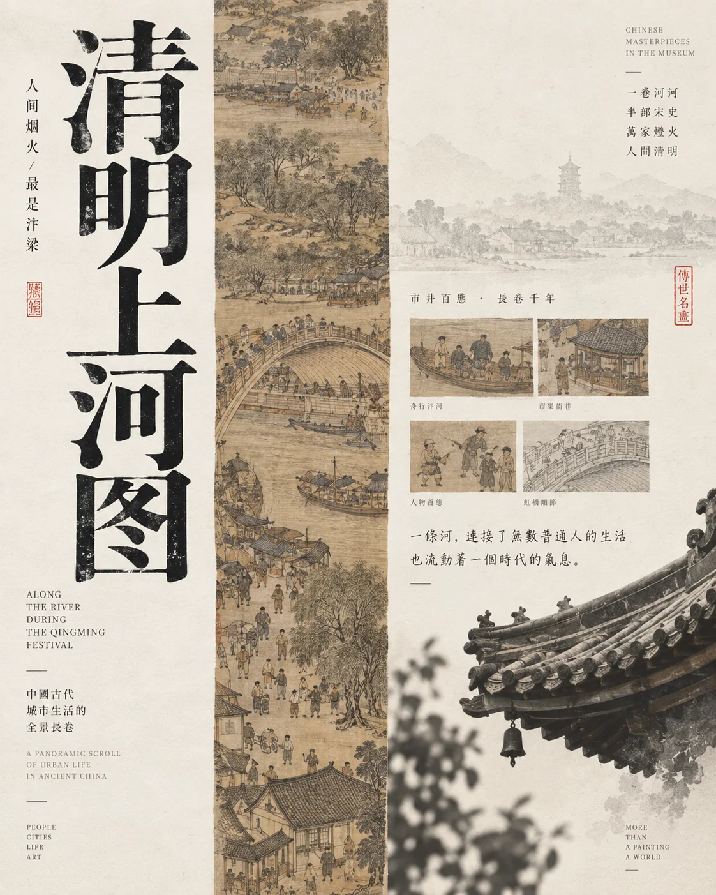

# 博物馆文物典藏编辑海报


## Prompt

```text
围绕用户提供的一件博物馆文物，或一个文物主题，创作一张“博物馆典藏图录 × 东方编辑设计 × 文物线描档案 × 当代纸本展览视觉”风格的高级竖版海报。

【输入方式】

支持以下任意一种输入：

方式 A：具体文物
文物：{{文物名称，例如后母戊鼎 / 青花瓷瓶 / 宋代汝窑瓷器 / 敦煌写经}}
所属博物馆：{{可留空}}
朝代 / 年代：{{可留空}}
补充信息：{{材质、用途、历史背景等，可留空}}

方式 B：文物主题
主题：{{例如青铜器 / 青花瓷 / 古籍善本 / 香炉 / 玉器 / 敦煌文物 / 宋瓷 / 书画装裱}}
核心方向：{{展览 / 典藏 / 修复 / 工艺 / 纹样 / 历史 / 可留空}}

其他输入：
画幅比例：{{默认 3:4}}
语言：{{默认中文，可少量中英混排}}
用途：{{展览海报 / 博物馆视觉 / 文物专题 / 文化封面 / 公开课海报}}
可选禁用元素：{{可留空}}

【核心目标】

先理解文物本身的：

材质；
时代特征；
器型；
纹样；
工艺；
用途；
历史文化语境；
最具有识别度的造型特征。

再将这些信息转化成一张具有“博物馆档案与当代编辑设计”气质的视觉海报。

整张作品不追求热闹的国风视觉，而强调：

文物本身；
研究感；
典藏感；
纸本感；
档案感；
修复与考据感；
东方文化的安静秩序。

最终效果像一本高品质博物馆展览图录、馆藏研究刊物或文物修复档案的封面。

【视觉系统】

整张海报由以下视觉语言组成：

大面积纯净纸面；
一条纵向文物档案带；
文物实物或线描；
器物局部纹样；
细小中文注释；
展览式日期与编号；
朱红小印章；
大量留白；
极细分隔线；
少量英文编辑信息。

不要将所有内容集中成普通展板。

通过尺度、留白与精密信息建立博物馆视觉气质。

【核心构图】

优先采用“纵向档案带”作为系列识别元素。

在画面中央、偏中或约三分之一位置设置一条狭长纵向区域，占画面宽度约 16%–28%。

这条纵向区域可以表现：

文物全貌；
器物局部；
纹样拓片；
古籍页面；
修复痕迹；
器型线描；
考古图；
结构图；
材质纹理；
相关历史文字。

它像一条贯穿整张海报的：

博物馆档案切片；
古籍书脊；
文物研究卷轴；
展柜观察窗口。

纵向区域之外保持大量留白，并布置标题、说明和少量独立文物。

根据具体内容可以略微改变位置与宽度，但始终保持“窄长视觉轴 + 大面积安静留白”的系列语言。

【具体文物模式】

如果用户提供具体文物：

优先准确保持它的核心视觉特征，例如：

器型；
轮廓；
比例；
足、耳、盖、口沿；
纹样位置；
材质特征；
颜色；
重要结构。

可以将文物拆解成多个视觉层级：

主体器物；
器物线稿；
纹样局部；
结构细节；
材质拓片；
器型档案图。

不要为了美观随意改变文物造型。

如果无法确认某个历史细节，不要虚构铭文、年代、出土地、尺寸或馆藏编号。

【主题模式】

如果用户只提供一个文物主题，例如“青铜器”：

选择 1 件代表性器物类型作为视觉核心，例如鼎、尊、爵、觥或钟，同时通过纹样、器型图和极少量辅助文物表现主题。

如果主题是“青花瓷”：

以一件瓷瓶、梅瓶、罐或盘为核心，同时提取青花纹样、瓷片、修复金线或器型图。

如果主题是“古籍善本”：

强化纸张、线装书、版心、书页、刻本、藏书印与文字排版。

如果主题是“玉器”：

强化器型轮廓、半透明材质、纹饰和考古式线描。

如果主题是“香炉”：

强化炉体、盖、足、纹饰以及极淡烟气。

主题模式不虚构某一件真实馆藏文物的具体编号和 provenance（来源流传）。

【文物视觉表现】

文物可以使用以下方式之一或组合：

真实器物摄影；
精细线描；
博物馆档案插图；
淡彩设色；
古籍式版画；
扫描拓片；
轮廓图；
局部纹样放大；
文物修复图。

不要把文物做成三维游戏道具。

主体应保持真实材质感，同时具有纸本图录般的克制表现。

【材质适配】

根据文物材质自动确定主视觉色系。

青铜器：
深青绿、铜绿、墨绿、灰绿、旧金属色。

青花瓷：
象牙白、瓷白、钴蓝、浅灰蓝。

古籍：
暖米色、宣纸黄、茶褐、墨黑。

玉器：
灰白、青玉色、浅灰绿。

漆器：
黑、深褐、朱砂红。

香炉 / 金属器：
暖灰、铜色、烟紫、米白。

陶器：
赭石、陶土、暖灰、沙色。

书画：
纸白、淡墨、赭色、极少量矿物色。

整体颜色保持低饱和、柔和、纸本化。

【主体文物】

画面可以在纵向档案带之外放置 1–2 件独立文物。

主体尺寸不宜过大。

它们通常位于：

左下；
右下；
角落；
标题下方。

文物下方可以加入极小的名称和说明。

例如：

器物名称
年代
材质

如果这些信息由用户明确提供，则准确使用。

如果没有提供可靠信息，则只显示类别名称或省略。

【线描与档案图】

从文物中提取最有价值的结构进行线描化，例如：

器型侧视图；
正视图；
局部纹样；
兽面纹；
云雷纹；
花卉纹；
釉裂；
书页版心；
器物铭文布局；
修复拼接线。

线条极细、低对比、精密。

整体像：

考古绘图；
修复档案；
博物馆研究手稿。

不要做成现代工程 CAD。

【修复主题】

如果用户主题包含“修复”，可以突出：

破碎瓷片；
拼接痕迹；
金缮线；
修复前后关系；
器型复原图；
残片档案；
局部编号。

但视觉仍要克制。

修复痕迹应体现：

时间；
手工；
保存；
材料；
重新连接。

不要把“修复”做成破败或残损美学。

【古籍与版心语言】

如果主题与古籍、历史档案或书画相关，可将纵向视觉轴设计成类似：

线装书页；
古籍版心；
经折装；
卷轴；
目录；
书脊。

加入：

竖排小字；
印章；
栏目；
页码；
小型插图；
古籍线框。

整体仍然使用现代留白和编辑逻辑，避免完全复刻古书页面。

【标题系统】

中文主标题是第二视觉中心。

标题可采用：

纵向排列；
多字分列；
左侧竖排；
底部横排；
大字与细字组合。

字体优先选择：

现代宋体；
具有雕版印刷感的衬线中文字体；
书籍装帧气质的细宋体；
非常克制的篆隶结构作为少量点缀。

不要使用廉价毛笔字体。

标题根据文物气质自动调整。

例如：

青铜器：
字形更加稳重、古朴、有重量。

瓷器：
字形更加纤细、清雅。

古籍：
字形更有书卷感与版刻感。

宫廷器物：
更加典雅、端正。

【标题内容】

如果用户提供具体文物：

主标题优先使用文物名称，例如：

青铜长歌
或者直接：
何尊
青铜鼎
汝窑洗

也可以围绕文物生成一个更具策展感的标题，但不要改变文物身份。

如果用户提供主题：

自动生成一个 4–8 字左右的中文展览式标题，例如围绕：

器物；
修复；
时间；
技艺；
文明；
材质；
纹样；
典藏

进行提炼。

避免网络化、营销化标题。

【微型编辑文字】

画面周围加入少量研究型信息。

可以包含：

类别；
材质；
年代；
研究方向；
展览编号；
主题短句；
馆藏标签；
修复关键词；
英文名称。

例如视觉结构：

CERAMIC RESTORATION
OPEN CLASS

BRONZE
RITUAL VESSELS
ARCHIVE

MUSEUM COLLECTION

英文只承担国际化编辑感，不作为主要内容。

【编号系统】

允许加入类似博物馆档案的编号：

No. 08
BC-2024-01
COLLECTION 03
ARCHIVE 09

如果用户没有提供真实馆藏编号，则只能作为明显的设计系列编号，不能冒充真实博物馆文物编号。

避免生成看似权威但实际上虚构的鉴定编号。

【日期与活动信息】

如果用户提供展览、公开课或活动信息，可以在右侧设置细长信息栏：

日期；
时间；
地点；
活动方式；
主办机构。

采用小字号、高行距、极细分隔线。

如果用户没有提供这些信息，不要虚构真实博物馆活动。

可以完全省略，保持典藏海报形式。

【朱红印章】

加入 1–3 枚极小的朱红印章作为东方文化视觉节点。

印章可以表示：

系列名称；
文物类别；
策展视觉标记；
抽象篆刻符号。

位置通常靠近：

标题；
档案轴；
文物说明；
角落。

印章必须很小。

不要让印章成为主要装饰。

【器物纹样】

可以从文物本身提取真实或合理的纹样结构，在背景中低对比呈现。

例如：

青铜兽面纹；
云雷纹；
青花缠枝纹；
古籍版框；
印章纹；
香炉烟纹；
玉器卷云纹。

纹样透明度极低，只作为纸张中的隐约文化痕迹。

不要把纹样铺满整张画面。

【背景】

背景根据文物气质使用：

象牙白；
暖灰白；
米黄；
深青绿；
墨绿；
灰蓝；
淡粉米色。

如果使用深色背景，文字与文物仍保持克制。

避免纯黑商业奢侈品视觉。

【纸张与印刷质感】

整张作品具有高品质博物馆图录印刷质感。

加入极细微：

棉纸纹理；
宣纸纤维；
旧书纸张颗粒；
丝网印刷感；
油墨微弱不均；
扫描档案质感。

保持干净、平整、珍贵。

不要过度做旧。

不要加入污渍、裂纹、烧焦边缘。

【留白】

留白至少承担约 40%–60% 画面。

文物不应填满画面。

信息不应密集排列。

让器物像被单独陈列在博物馆展柜中一样，拥有足够呼吸空间。

“空”本身就是展陈的一部分。

【主题自适应规则】

青铜器：
深青绿或铜绿背景；
器型和纹样成为核心；
文字稳重；
可加入拓片与铭文结构。

瓷器：
高比例白色空间；
蓝白、青白或釉色作为视觉主色；
强调器型、瓷片、釉裂和修复线。

古籍：
暖纸色；
书脊、版心、线装结构；
竖排文字；
藏书印；
植物或古典插图极少量出现。

香炉 / 文房：
大量暖白留白；
精细器物线描；
极淡烟气；
小型实物静物。

玉器：
浅青灰或米白背景；
器物轮廓和透光质感；
纹饰细节更加精密。

书画：
弱化实物体积；
强化卷轴、纸张、笔墨、印章和题跋结构。

文物修复：
强化残片、接缝、局部结构图与时间痕迹。

【具体文物信息原则】

如果用户提供一件真实文物：

不得随意改变名称；
不得虚构年代；
不得虚构作者；
不得虚构出土地；
不得虚构博物馆；
不得虚构尺寸；
不得虚构铭文；
不得虚构文物级别。

用户没有提供、且无法确定的信息，可以不显示。

视觉设计优先于把海报填满不可靠的资料。

【整体气质】

安静、考究、典藏、文化、学术、东方、精致。

像一张由博物馆视觉设计部门或独立文化设计工作室完成的正式展览海报，也像一本馆藏研究图录的封面。

整个系列的稳定识别来自：

大面积纸本留白
+
纵向文物档案带
+
一件核心器物
+
细密线描与纹样研究
+
高品质中文标题
+
小型研究信息
+
朱红印章
+
与文物材质对应的单一主色。

不同文物之间不套用同一种具体图形，而是在同一个博物馆视觉体系中，根据器物自身的材料、时代和工艺重新设计。

【负面约束】

避免廉价国潮；
避免古风游戏海报；
避免仙侠；
避免文物悬浮发光；
避免黄金奢侈品广告；
避免大面积红金；
避免三维游戏道具；
避免过度写实展柜摄影；
避免高饱和多色；
避免传统纹样满铺；
避免大量祥云；
避免复杂花边；
避免大型印章；
避免电商商品海报；
避免密集说明文字；
避免伪造真实馆藏资料；
避免虚构历史事实；
避免无依据加入与文物无关的传统元素；
避免所有文物使用相同背景与相同构图。
```