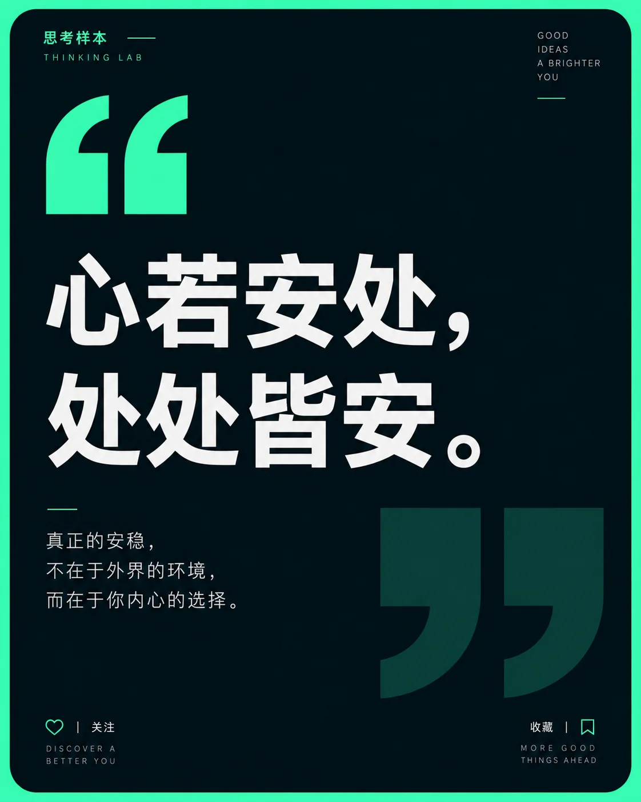

# 霓虹极简金句卡片



## Prompt

```text
围绕用户提供的一句金句，或根据用户提供的主题自动提炼一句有观点、有记忆点的金句，创作一张“深色极简编辑设计 × 高亮霓虹边框 × 巨型引号符号 × 中文观点卡片”风格的竖版视觉作品。

【输入方式】

支持以下任意一种输入：

方式 A：用户直接提供金句
金句：{{用户提供的一句话或一段话}}
作者 / 来源：{{可留空}}
栏目名称：{{可留空}}

方式 B：用户只提供主题
主题：{{用户提供的主题}}
核心倾向：{{可留空，例如关系 / 独处 / 成长 / 工作 / 人性 / 阅读 / 生活 / 思考}}

其他输入：
画幅比例：{{默认 4:5}}
强调色：{{荧光绿 / 电光蓝 / 薄荷青 / 自动判断}}
用途：{{金句卡片 / 社交媒体配图 / 公众号配图 / 观点海报}}
可选禁用元素：{{可留空}}

【核心目标】

整张作品只聚焦一件事：

让一句话成为绝对视觉中心。

采用极深海军蓝或接近黑色的主体卡片，外部使用一种高纯度、高亮度的霓虹强调色形成强烈边界。通过巨型引号、中文大字号排版、大量深色留白和少量微型编辑文字，形成简洁、年轻、锐利、具有互联网思想栏目气质的视觉卡片。

不要加入人物、摄影、插画、复杂图形或背景场景。

视觉力量全部来自：

一句话
+
引号
+
字号
+
留白
+
黑暗背景与高亮色之间的反差。

【内容处理规则】

如果用户直接提供金句：

优先原样保留用户文字，不随意改写语义。

可以根据版面需要调整：
换行；
标点；
段落；
字距；
行距。

不得为了设计效果改变核心表达。

如果用户同时提供作者或来源，则准确显示。

如果用户没有提供作者，可以省略，也可以使用中性署名，例如：

匿名
摘录
地球人

不要擅自把用户提供的句子归于某位真实人物。

如果用户只提供主题：

先理解主题真正的矛盾、判断或洞察，再自动生成一句适合作为视觉中心的原创金句。

金句需要满足：

表达完整；
能够独立阅读；
有明确观点；
语言自然；
不故作深刻；
不使用空泛鸡汤；
通常为 1–4 行；
中文约 20–80 字为宜。

优先使用具有生活观察和思辨感的表达。

主题是“独处”，不要只生成：
“独处是一种成长。”

应更加具体，例如表达：
一个人真正需要的，也许不是热闹，而是不必随时回应别人的生活。

主题模式生成的文字视为原创设计文案，不虚构真实名人来源。

【整体版式】

使用竖版 4:5 画布。

画面外层铺满一种高亮霓虹强调色。

在其上放置一块占据约 92%–96% 面积的深色卡片。

主体卡片：

深海军蓝；
蓝黑色；
接近纯黑但保留轻微蓝绿色倾向。

卡片四角使用大圆角。

让亮色背景只在四周形成约 10–20 像素视觉宽度的边缘，从而产生极强、极简的霓虹框架。

不要使用发光外阴影。

强调色应像纯色纸张露出的边缘，而非赛博朋克光效。

【卡片结构】

主体卡片可以根据文字长度自动选择两种结构。

结构 A：连续卡片

适用于中短金句。

整块深色卡片保持连续，只在中部通过轻微内凹圆弧、视觉收腰或极弱分区形成上下节奏。

结构 B：上下双区

适用于较长金句。

上部为主要文字区域；
下部为留白与巨型闭合引号区域。

两个区域之间可以存在极细缝隙或圆角分界，但颜色保持一致。

不要使用明显面板、卡片套卡片或复杂框线。

【顶部微型栏目】

左上角放置一行极小的栏目或系列名称。

如果用户提供栏目名称，使用用户内容。

如果没有，则根据主题自动生成一个克制的栏目名，例如：

自洽研究所
关系实验室
静界
生活观察室
思考样本
日常研究

也可以加入极少量英文：

RELATION LAB
SOLO MODE
LIFE NOTES
THINKING LAB

字号非常小，与正文形成巨大尺度反差。

颜色使用白色或当前强调色。

不要让栏目名称抢夺注意力。

【开引号】

在正文上方或左上区域放置一个巨大的开引号符号：

“

或者使用几何化的双引号图形。

引号尺寸明显大于普通文字，约占画面宽度的 12%–20%。

使用当前霓虹强调色：

荧光绿；
电光蓝；
薄荷青；
亮青色。

引号结构粗壮、几何、现代。

它是整套视觉识别中最重要的图形符号。

不要使用传统衬线引号。

不要增加阴影、渐变或立体效果。

【正文金句】

正文使用纯白或略带暖灰的中文无衬线字体。

字体气质：

现代；
清晰；
中性；
稍粗；
具有互联网编辑设计感。

根据金句长度动态调整字号。

短句：
可以使用非常大的字号，占据较大面积。

中等长度：
保持 3–6 行。

较长内容：
使用 6–10 行，并适当减小字号。

不要为了保持固定字号而把文字挤满画面。

正文整体宽度约为卡片的 72%–84%。

左对齐优先。

行距宽松，让句子具有明显呼吸感。

换行依据语义而不是机械按照字数切断。

例如：

你觉得一个人过得好，
可能是因为
跟她不熟。

比把每行强行切成相同长度更自然。

【重点层级】

如果输入内容包含一句铺垫和一句核心观点，可以形成两级字号。

例如：

较小文字：
这句话的含金量还在上升：

较大正文：
你对别人好，
就是想别人也对你好。
你不如直接对自己好，
没有中间商赚差价。

铺垫文字字号约为正文的 55%–70%。

如果只有一句金句，则无需增加铺垫。

【作者与来源】

正文下方可以显示：

作者；
角色；
来源；
作品；
栏目。

例如：

地球人
来自网络

或：

尼采
《某某作品》

只有用户明确提供真实作者或来源时，才使用对应真实信息。

用户未提供来源时，不虚构真实出处。

作者字号明显小于正文，但可比来源略大。

来源使用微型字号。

整体保持左对齐。

【底部巨大闭引号】

在卡片右下方加入一个超大的闭合引号：

”

尺寸可以非常大，甚至超出可视区域。

颜色使用比卡片背景稍亮一点的深蓝灰、墨青或低透明度强调色。

视觉对比非常低，像隐藏在背景中的水印。

它通常占右下角约 25%–40% 面积。

可以部分裁切。

不要让它干扰正文阅读。

上下引号形成：

上方高亮开引号
+
下方暗色闭引号

的视觉呼应。

【底部交互文字】

在左下和右下分别放置极小文字，例如：

左下：
关注

右下：
收藏

也可以根据栏目风格使用：

关注 @栏目名
收藏这句

如果需要，可配极小的：

心形线框；
书签线框。

但保持极简。

这些元素主要用于营造社交媒体观点卡片的产品感，不应抢夺正文注意力。

【强调色系统】

整张图只使用一种强调色。

可根据主题自动选择：

理性 / 关系 / 城市 / 思考：
电光蓝、亮青蓝。

独处 / 自我 / 平静：
薄荷绿、青绿色。

锋利 / 反常识 / 强判断：
荧光黄绿。

未来 / 科技 / 新观念：
高亮青色。

推荐色彩关系：

90% 深蓝黑
+
8% 白色文字
+
2% 高亮强调色。

强调色主要用于：

外边框；
顶部开引号；
少量栏目文字；
极小图标。

不要用强调色给整段正文上色。

【形状语言】

卡片使用极大圆角。

中部允许出现轻微的：

圆弧内凹；
沙漏式收腰；
两个圆角面板连接处；
水平切口。

这种微妙轮廓变化可以增强品牌识别，但不能过度复杂。

整体仍然应该一眼看起来像一块简洁深色卡片。

【留白】

保持明显的深色留白。

尤其是：

正文右侧；
正文与作者之间；
作者与底部之间；
右下角闭引号周围。

不要因为用户文字较短就强行添加更多内容。

一句很短的话可以拥有非常大的空白。

这种空白正是作品的力量之一。

【文字准确性】

这是文字型视觉作品，必须高度重视文字准确度。

用户提供的金句不得：

漏字；
错字；
改变核心标点；
错误署名；
错误引用。

主题模式自动生成文案后，所有画面中的文字保持一致，不要在生成过程中出现重复、断裂或乱码。

中文优先保证可读性。

不要加入无意义英文字符作为装饰。

【纸面与数字质感】

整体以数字编辑设计为主。

背景可以有极其细微的：

暗色颗粒；
微弱纸纹；
柔和噪点。

但默认保持非常干净。

不要使用明显纸张做旧。

不要加入玻璃拟态、金属、三维材质或强烈光效。

【主题自适应】

关系 / 亲密：
文案聚焦边界、理解、期待、距离、相处。

独处 / 自我：
聚焦自由、安静、自我安排、选择权。

成长 / 人生：
聚焦经验、判断、时间、取舍。

职场 / 工作：
聚焦价值、交换、效率、选择、规则。

阅读 / 思考：
聚焦认知、观察、理解与判断。

人性 / 社会：
允许稍微锋利和反常识，但避免为了冲击力制造极端观点。

生活：
偏向具体生活经验，避免空洞哲理。

无论主题如何变化，始终维持：

深色圆角卡片
+
高亮纯色外边
+
巨型开引号
+
白色中文正文
+
小型作者来源
+
右下暗色巨大闭引号

这一稳定视觉系统。

【整体气质】

简洁、年轻、理性、锋利、克制、具有社交媒体传播感。

像一个长期发布高质量观点和摘录的独立思想栏目，拥有非常稳定的品牌视觉。

观众第一眼看到：

高亮引号和一句话。

第二眼看到：

作者、来源和栏目。

整个画面不依靠复杂视觉元素，只让文字本身产生力量。

【负面约束】

避免摄影；
避免人物；
避免插画；
避免复杂背景；
避免渐变背景；
避免霓虹发光特效；
避免赛博朋克；
避免多种强调色；
避免复杂信息图；
避免玻璃拟态；
避免三维卡片；
避免大量图标；
避免装饰性纹样；
避免花哨字体；
避免书法字体；
避免彩色正文；
避免文字居中堆叠；
避免正文过度拥挤；
避免大段解释文字；
避免鸡汤式空泛文案；
避免虚构名人名言；
避免错误署名；
避免无来源内容冒充真实引用；
避免加入与金句无关的视觉元素。
```
