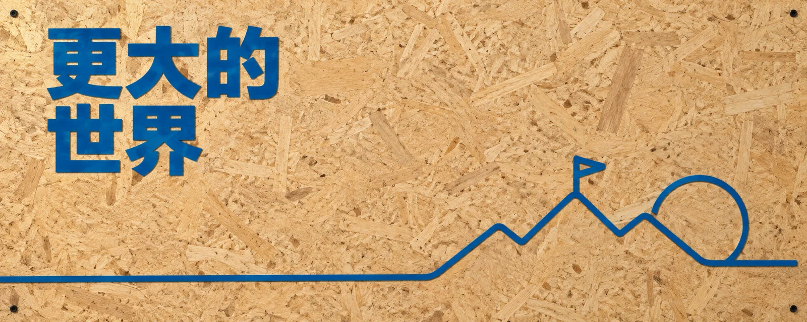

# OSB 工业蓝线条隐喻



## Prompt

```text
围绕用户提供的主题，创作一张“真实 OSB 定向刨花板 × 工业蓝实体标题 × 极简连续线隐喻”的高级编辑封面。

整张画面建立在一个非常明确的材质反差之上：

天然、随机、粗粝的 OSB 木屑纹理
×
精确、理性、统一的工业蓝文字和线条。

最终效果应接近：
创意工作室视觉，
建筑事务所封面，
独立品牌视觉，
共享空间导视，
当代设计机构海报。

它不是普通木纹背景上的文字，
也不是信息图或图标排版。

真正的视觉重点是：

真实材料
+
严格色彩系统
+
一个连续关系隐喻
+
大面积未经填充的 OSB 木板空间。

【输入】
主题：{{主题}}
主标题：{{建议 2–10 个汉字}}
副标题：{{可留空；建议 15 个汉字以内}}
画幅比例：{{默认 5:2；可选 16:9 / 4:3 / 1:1 / 4:5 / 3:4 / 9:16}}
用途：{{文章封面 / 社交媒体封面 / 视频封面 / 海报}}
可选禁止元素：{{可留空}}

【核心原则】
整张封面只允许：

1 个核心概念；
1 组统一线条隐喻；
1 条主要视觉路径；
最多 3 个核心图形元素；
1 个主标题；
最多 1 个副标题；
1 种精确工业蓝；
超过一半面积的真实 OSB 留白。

不要把主题中的每个名词都变成图形。

不要建立多套视觉隐喻。

不要为了填充空间增加无关线条。

最终画面只讲一个关系。

【主题理解】
生成前先在内部理解“{{主题}}”。

判断：

主题真正讨论的是什么问题？
哪些对象之间发生了关系？
最重要的动作是什么？
状态从什么变成什么？
最终结果是什么？

不要展示分析过程。

从中只提炼一个最适合被线条表达的关系。

优先考虑：

连接，
分离，
打结，
切断，
打开，
关闭，
压缩，
展开，
阻挡，
穿越，
绕行，
重连，
收束，
分叉，
解开，
嵌合，
失衡，
恢复。

如果存在多个可能方向，
选择：
最简单，
最容易读懂，
最适合单张封面，
同时最能形成清楚路径
的一种。

【线条隐喻】
将核心关系转译为一组极简工业蓝连续线条。

线条可以形成：

一个人物轮廓；
一个设备；
一个工具；
一个抽象结构；
两个对象之间的连接；
一条发生状态变化的路径；
一个被打开、切断、打结或重新连接的形体。

但整组线条必须属于同一个视觉故事。

最多 3 个核心图形元素。

例如：

一个起点；
一个关系发生区；
一个终点。

或者：

两个对象
+
它们之间的一条关系线。

不要自动做成：
01 → 02 → 03 流程，
多节点流程图，
多个图标并排。

这是视觉隐喻，
不是说明图。

【动作必须可见】
隐喻中的核心动作必须直接通过线条形态被看到。

例如：

连接：
两条独立结构最终通过一个明确接口接触。

分离：
一条连续结构在某处断开并拉开距离。

打结：
连续路径自身形成一个清楚、可读的结。

切断：
路径被一个明确切口中断。

打开：
封闭结构出现一个有方向的开口。

压缩：
宽阔结构逐渐收束成狭窄区域。

展开：
紧密结构逐渐打开成更大的空间。

阻挡：
路径遇到明确障碍并发生停顿或绕行。

穿越：
一条线穿过一个边界或实体。

重新连接：
两个断开的结构通过新路径重新建立关系。

隐喻必须让观众即使不读标题，
也能感觉：
“某种关系正在发生变化。”

【OSB 背景】
整张画面必须由真实 OSB 定向刨花板铺满。

镜头正面平视。

木板与画面平面近似平行。

不要出现：
房间，
桌面，
墙角，
室内透视，
家具，
地板，
工作台，
人物环境，
展示架。

画面本身就是一整块真实安装好的 OSB 板。

【OSB 材质】
材质必须明确识别为：
Oriented Strand Board / OSB 定向刨花板。

颜色偏：
自然暖黄色，
浅蜂蜜色，
暖米木色。

表面由大量真实木屑压制形成。

木屑应具有：

不规则长度，
不同宽度，
随机方向，
自然交叠，
深浅变化，
真实压制纹理，
微弱表面起伏。

纹理不得规律重复。

不要生成普通直线木纹。

不要变成：

实木板，
胶合板，
软木板，
MDF，
纸板，
木饰面，
光滑家具表面。

OSB 的随机刨花结构必须一眼可辨。

【木板状态】
木板保持：

真实，
干燥，
干净，
略显粗粝。

允许有轻微天然色差和压制痕迹。

不要：
严重做旧，
裂纹遍布，
脏污，
烧焦，
涂鸦，
喷漆背景，
工业锈蚀。

重点是材料本身的天然粗粝，
不是废墟感。

【固定螺丝】
可以在四角加入 0–4 颗非常小的黑色固定螺丝。

螺丝只用于暗示：
木板真实安装在某个结构表面。

尺寸要小。

不要：
放大，
高光，
复杂金属反射，
成为装饰元素。

如果没有必要，
可以完全不出现。

【工业蓝】
整张图只选择以下一种颜色：

#087FBE
或
#007FC4
或
#006FC0

选择后，
主标题、
副标题、
所有线条、
所有核心图形
必须使用同一个精确蓝色。

不得在同一画面混用深蓝、浅蓝或其他蓝色。

不要：
渐变，
透明渐变，
发光，
霓虹，
蓝紫过渡，
彩色高光。

工业蓝必须表现为稳定、纯净、清楚的实体色。

【主标题】
主标题必须准确显示：

“{{主标题}}”

默认放置于左上区域。

使用：

粗重，
简洁，
几何感明确，
高识别度的现代中文无衬线字体。

标题整体：
左对齐，
结构稳定，
字距自然，
与上边和左边保持充足安全距离。

标题是画面的主要文字视觉。

不要贴边。

不要居中悬浮。

不要无理由旋转。

【标题材质】
标题不是纯数字文字层。

它应像：

薄型哑光蓝色亚克力字，
或
薄型蓝色金属标识字

直接固定在 OSB 木板表面。

允许极轻微：
实体厚度，
边缘体积，
自然接触阴影。

但保持接近平面。

不要制作成：

厚重 3D 字，
泡沫字，
镜面金属字，
液态字，
玻璃字，
霓虹灯字，
发光字，
浮雕字。

木板纹理仍应在标题周围清楚可见。

【英文】
英文只在用户输入中明确提供时出现。

不得自动：

翻译主标题，
补充英文副标题，
添加英文 slogan，
添加设计说明。

如果用户提供英文，
可以位于：

中文标题上方，
或单独一行。

仍然使用相同工业蓝。

【副标题】
只有用户提供 {{副标题}} 时才显示。

准确显示：

“{{副标题}}”

副标题明显小于主标题。

保持：
左对齐，
简短，
清楚，
克制。

建议不超过 15 个汉字。

不要扩写。

不要自动增加额外说明。

【唯一文字规则】
除用户明确提供的：

主标题，
副标题，
英文标题

之外，
画面中不得出现任何其他可读文字。

不要生成：

随机英文，
编号，
日期，
页码，
品牌信息，
说明，
标签，
Logo，
水印，
机构名称，
虚构文案。

【线条语言】
所有隐喻线稿使用与标题完全一致的工业蓝。

视觉语言融合：

建筑导视线条，
工业标识，
连续线插画，
现代编辑概念图形，
极简符号设计。

线条要求：

宽度统一；
轮廓清楚；
转折干净；
圆角逻辑统一；
直角逻辑统一；
结构高度简化。

不要同时使用多种线宽制造复杂层级。

不要做成素描线条。

不要做成卡通描边。

不要使用手绘抖动。

这是“工业标识线条”，
不是自由手绘线稿。

【线条实体感】
线条必须像真实固定在木板表面的实体标识。

可以表现为：

极薄哑光蓝色金属条，
薄型蓝色亚克力条，
或精确印制于木板表面的蓝色线。

允许非常轻微的：

厚度，
自然侧向投影，
接触阴影。

但线条仍然必须显得轻和精确。

不要：
悬浮，
发光，
形成科技 HUD，
出现光轨。

【品牌与产品主题】
即使 {{主题}} 涉及：

产品，
软件，
应用，
平台，
品牌，
工具，
AI 服务

也不要直接粘贴：

真实 Logo，
品牌图标，
产品截图，
应用界面，
照片，
现成商标。

如果确实需要表现某种工具或产品概念，
只根据：

功能，
动作，
非识别性轮廓，
关系结构

重新设计为工业蓝单线隐喻。

不要复刻可识别商标。

【图形位置】
线条隐喻优先位于：

中下区域，
右下区域，
或从某个画面边缘进入后延伸至右下。

它可以形成一条连续视觉路径。

线条可以：
从画面外进入，
沿木板延伸，
穿过图形，
连接对象，
发生变化，
最终停在右下区域。

整个线稿系统面积不得超过画面的约 30%。

不要把线条铺满整个画面。

【主构图】
默认建立：

左上：
主标题。

右下：
核心线条隐喻。

中间：
大面积真实 OSB 木板留白。

整体形成明确的左上 → 右下对角平衡。

不要平均分割画面。

不要让标题与线条各占一半。

不要把视觉重心放在正中央。

【留白】
至少约 55% 的画面保留为完整 OSB 板面。

这里的“留白”不是纯白色，
而是：
没有文字、没有图形覆盖的 OSB 木板区域。

木板天然纹理本身就是视觉内容。

不要因为留白中有大量刨花纹理，
就再添加额外装饰。

【横版】
5:2 / 16:9 / 4:3：

强化：
长距离路径，
左上到右下关系，
水平延伸，
大面积中央木板空间。

5:2 特别适合：
短标题，
长路径，
右下隐喻，
大面积横向呼吸感。

不要把方形布局拉长。

【方形】
1:1：

缩短线条路径。

标题仍在左上，
隐喻偏右下。

主体区域适当集中，
但仍要保持超过一半的木板空间。

不要因为画布变短而增大图形到填满画面。

【竖版】
4:5 / 3:4 / 9:16：

标题保持左上。

线条从：
中部，
左侧边缘，
或标题以下区域

向下延伸，
最终在右下完成核心隐喻。

利用纵向距离强化：
下降，
展开，
穿越，
连接，
变化。

不要机械把横版构图裁成竖版。

【比例重构】
每个目标比例都重新决定：

标题字号，
标题行数，
线条路径，
图形尺度，
隐喻位置，
留白分布。

禁止：
机械裁切，
拉伸，
补边。

【光线】
使用柔和、自然、方向统一的侧光。

光线的作用只有：

表现 OSB 木屑细微起伏；
表现蓝色标题轻微厚度；
表现蓝色线条与木板接触关系。

整体保持明亮自然。

不要：
戏剧聚光，
硬阴影，
复杂多方向照明，
强烈暗角。

【阴影】
标题和实体线条允许产生极轻微接触阴影。

阴影：
短，
浅，
柔和，
方向一致。

它只是为了证明：
蓝色字与蓝色线条确实安装在木板表面。

不要让阴影成为设计元素。

【材质反差】
最终视觉张力主要来自：

OSB：
随机，
粗粝，
天然，
不可预测。

工业蓝系统：
精确，
克制，
统一，
人工，
理性。

两者之间的反差就是设计语言。

不要通过增加其他材质丰富画面。

【用途适配】
文章封面：
保证标题在缩略图中清楚，
隐喻简洁易懂。

社交媒体封面：
加强主标题识别，
保持右下图形具有明确轮廓。

视频封面：
可以适度增加标题尺度，
但不要牺牲木板留白。

海报：
可以让线条路径稍长，
增强材料与空间关系。

【必须避免】
不要把 OSB 变成：

普通木纹，
实木，
胶合板，
软木板，
纸板，
光滑家具，
桌面，
墙面场景。

不要出现：

室内空间，
房间，
桌椅，
写实人物，
复杂建筑，
完整故事场景。

不要：

彩色 Logo，
真实商标，
截图，
照片，
UI，
流程图，
信息图，
图标矩阵，
大量小图标。

不要多套隐喻。

不要超过 3 个核心图形元素。

不要让图形面积超过约 30%。

不要让留白低于约 55%。

不要出现额外文字。

不要随机添加：
英文，
数字，
日期，
品牌名，
Logo，
水印，
说明。

不要混用多种蓝色。

不要：
渐变蓝，
发光蓝，
霓虹蓝，
镜面蓝，
透明蓝光。

不要复杂阴影。

不要夸张 3D 标题。

不要使用现成图标。

严格排除：
{{可选禁止元素}}

【生成前检查】
生成前内部检查：

背景是否一眼能识别为真实 OSB 定向刨花板？

是否没有任何房间、桌面或其他环境？

工业蓝是否只使用：
#087FBE、
#007FC4、
#006FC0
中的一种？

标题和所有线条是否完全同色？

主题是否被压缩为一个核心关系？

线稿是否只表达一个视觉故事？

核心图形是否不超过 3 个？

图形面积是否低于约 30%？

完整 OSB 留白是否高于约 55%？

线条是否真的像固定在木板表面的工业标识？

是否存在无意义图形？

如果删除一个图形不会影响隐喻，
删除它。

是否错误加入了真实 Logo、截图或品牌图标？

标题是否准确？

画面中是否存在用户没有提供的文字？

如果存在，
删除。

【最终标准】
最终只生成一张独立完整封面。

不要输出：

分析，
解释，
备选方案，
多方案，
拼图，
网格，
联系表，
样机。

最终成图必须稳定呈现：

满版真实暖黄色 OSB 定向刨花板；
天然随机的木屑压制纹理；
左上工业蓝哑光实体主标题；
可选的克制副标题；
右下同色极简线条隐喻；
只有一个核心概念；
最多 3 个核心图形元素；
一条清楚的视觉路径；
超过一半的完整 OSB 板面留白；
柔和自然侧光；
极轻微、真实、一致的接触阴影。

远看时：

先看到暖黄粗粝木板
+
左上精确蓝色标题
+
右下一个极简蓝色关系图形。

近看时：

再发现木屑天然纹理、
蓝色标识字的轻微厚度、
线条与木板之间的真实接触阴影，
以及那条线正在完成连接、切断、展开、穿越或重新连接。

最终效果应像一个成熟设计工作室，
只用一块真实 OSB 板、
一种工业蓝、
一句标题、
一组线条，

就把“{{主题}}”表达清楚。

不是“木板上的图标设计”，
而是“天然材料的无序，与人工线条的秩序，共同完成一个关系隐喻”。
```
