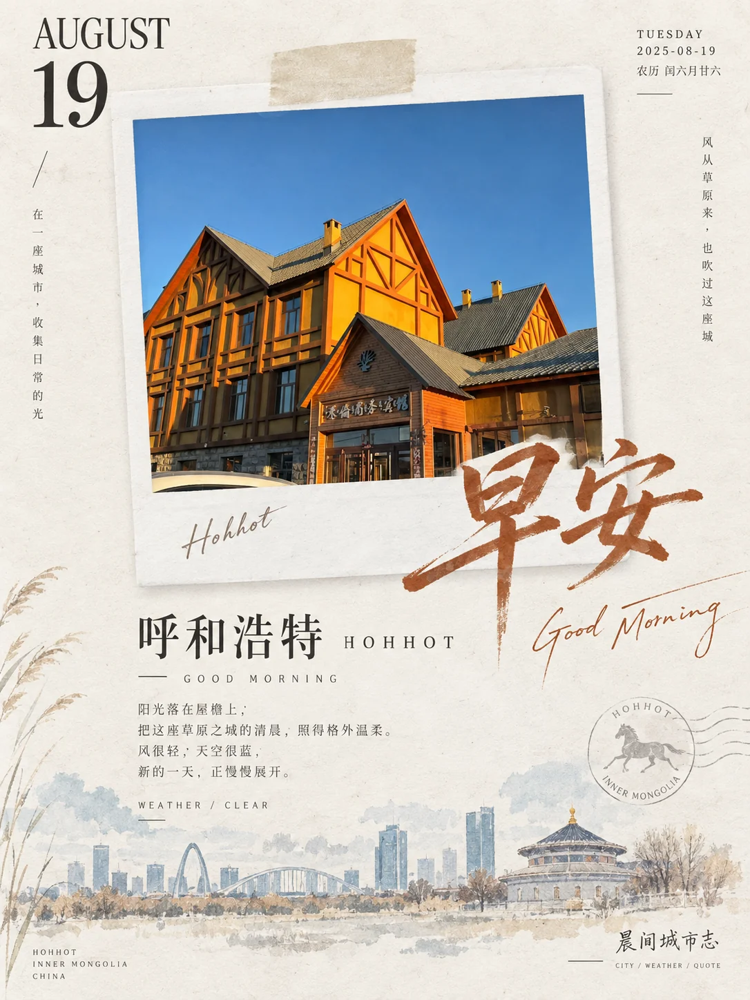

# 城市时刻拍立得手账海报


## Prompt

```text
基于用户上传的一张图片和用户提供的城市信息，创作一张“城市摄影 × 拍立得纸本拼贴 × 东方手账编辑设计 × 淡彩水墨”风格的竖版视觉作品。

【输入】
参考图：{{用户上传的图片，必填}}
城市：{{城市名，必填}}
国家 / 地区：{{可留空}}
画幅比例：{{默认 3:4}}

无需用户额外提供主题、时间、标题、天气或文案。

【核心原则】

用户上传的图片负责决定：

画面主体；
场景内容；
时间段；
天气感受；
光线；
主色调；
视觉情绪。

用户提供的城市信息负责决定：

城市名称；
英文城市名；
城市语境；
底部城市意象；
与城市相关的文案表达。

不得根据图片自行猜测或替换用户提供的城市。

即使照片中的城市特征不明显，也始终以用户提供的城市名称作为最终城市信息。

【第一步：判断图片时间】

首先分析用户上传图片的自然光、天空、阴影、环境亮度、人工照明和整体色温，将时间只归入以下三种状态：

早晨；
中午；
晚上。

判断依据包括：

太阳高度；
晨光或暮色；
天空明度；
阴影长度；
环境色温；
人工灯光强度；
街道活动状态；
晨雾；
夜色；
整体曝光。

不要单纯因为画面偏暖就判断为晚上，应综合场景判断。

如果无法可靠识别时间，默认按照“早晨”处理。

对应文字固定为：

早晨：
早安
GOOD MORNING

中午：
午安
GOOD AFTERNOON

晚上：
晚安
GOOD EVENING

只允许这三种状态，不创建其他时间分类。

【整体结构】

使用竖版 3:4 画布。

整体背景为暖白、象牙白或浅奶油色高级艺术纸。

画面主要包含：

左上角大号日期；
右上角日期与星期信息；
中央拍立得照片；
跨越照片边缘的大号中文时间问候；
下方城市日记文字；
右下角城市系列标识；
底部极淡水彩城市意象。

整体像一本精心设计的城市旅行手账、生活方式杂志或纸本城市日记。

保持明显留白。

【中央拍立得】

将用户上传图片完整保留为主要视觉内容，并放入真实拍立得相纸框中。

保留原图中的：

主体；
人物；
建筑；
街道；
自然景观；
环境结构；
构图方向；
光线；
天气；
重要视觉关系。

允许轻微调整：

裁切；
曝光；
色彩；
空气感；
摄影层次。

不要改变原照片核心场景。

拍立得通常位于画面中央偏上，约占画面宽度的 50%–65%。

可以产生 1–4° 的轻微自然倾斜。

拍立得相纸具有真实白色纸边和极浅自然阴影。

顶部加入一小段米色半透明和纸胶带，形成真实手账拼贴感。

【日期系统】

左上角使用大字号英文月份和日期数字，例如：

AUGUST
19

月份采用优雅高对比衬线字体。

日期数字明显放大，形成左上角视觉锚点。

右上角使用小字号信息：

WEDNESDAY
2026-08-19

如果能够可靠生成对应农历，可以增加一行农历日期。

不要虚构与图片或用户输入无关的纪念日、节日和历史事件。

【时间主标题】

根据图片判断的时间自动生成：

早晨 → 早安
中午 → 午安
晚上 → 晚安

中文标题使用具有现代东方气质的自由手写字体或克制毛笔字体。

标题笔触自然，有轻微飞白、墨色变化和手写痕迹。

标题通常位于拍立得右下方，并横跨：

照片内部；
拍立得白边；
外部纸张背景。

通过文字突破照片边界建立视觉层次。

不要使用传统书法作品式狂草。

【标题颜色】

从用户上传照片中自动提取一种具有辨识度的低饱和颜色作为标题颜色。

例如：

蓝灰城市 → 墨蓝；
古城暖光 → 赭红；
植物街景 → 橄榄绿；
花市 → 灰紫；
暖色街道 → 茶褐。

标题颜色必须与原照片产生视觉呼应。

【城市标题】

城市名称完全使用用户输入的：

{{城市}}

不要根据图片重新判断城市。

在下方信息区生成：

GOOD MORNING · {{城市英文名}}

或：

GOOD AFTERNOON · {{城市英文名}}

或：

GOOD EVENING · {{城市英文名}}

如果用户只提供中文城市名，则自动生成常用英文名称。

例如：

北京 → BEIJING
西安 → XI'AN
昆明 → KUNMING
深圳 → SHENZHEN

城市英文名仅承担排版用途。

【城市日记文案】

根据：

用户提供的城市；
图片内容；
识别出的时间；
图片天气感；
画面情绪

自动生成 2–4 行简短中文城市日记。

内容可以涉及：

此刻的光线；
街道状态；
天气感受；
季节气息；
城市节奏；
照片中的人物或环境；
一天此刻的情绪。

文案应像个人旅行手账，而不是城市宣传文案。

例如整体语言气质：

雨后的风从街道慢慢吹来。
晨光落在城市刚刚苏醒的屋檐上。
正午的阳光把街道照得更加清晰。
天色暗下来以后，城市开始亮起自己的灯。

具体句子必须根据当前图片重新生成。

避免套用固定文案。

【天气判断】

根据照片只能判断视觉上明确的信息，例如：

晴；
多云；
阴天；
雨；
雨后；
雾；
雪；
夜间晴朗。

可以写成：

WEATHER / CLEAR
WEATHER / CLOUDY
WEATHER / AFTER RAIN
WEATHER / FOGGY

不要根据图片虚构精确温度、湿度、风速或天气预报。

如果用户没有提供这些真实数据，则不要生成诸如“28–35°C”的具体数值。

【城市水彩意象】

在画面底部加入非常淡的水彩或水墨城市意象。

这里可以结合两个信息来源：

第一优先：
从用户照片中提取具有代表性的建筑、街道、山水或环境轮廓。

第二优先：
结合用户提供的城市，加入一个极其克制、低对比的城市代表性轮廓。

例如可以是：

天际线；
古城墙；
塔楼；
桥梁；
山形；
湖岸；
传统建筑；
现代城市轮廓。

这一部分必须很淡，像纸面上若隐若现的一段城市记忆。

不要把它做成第二张完整风景画。

不要加入大量城市地标。

【城市与照片关系】

如果照片中本身已经具有明显城市建筑或地标，则底部优先沿用照片里的场景。

如果照片只是普通街道、植物、人物或生活场景，则可以使用用户提供城市的一处代表性轮廓作为极淡辅助背景。

城市地标只能作为次级视觉信息。

主体始终是用户上传的照片。

【右下角系列标识】

根据识别时间自动生成：

早晨：
晨间城市志

中午：
午间城市志

晚上：
夜间城市志

使用带轻微手写感或现代东方书写气质的字体。

下方加入极小英文：

CITY / WEATHER / QUOTE

形成系列化视觉识别。

【装饰元素】

允许根据照片内容增加极少量：

植物线稿；
水彩花枝；
小圆点；
细线；
印章式小标记；
极淡飞鸟；
水墨晕染。

这些元素必须来源于照片或城市语境。

不要为了所谓国风感机械加入花枝、飞鸟、亭台或印章。

【色彩系统】

整体颜色来自：

暖白纸张；
照片原始色彩；
从照片中提取的一种主要强调色；
一组极淡水彩辅助色。

如果照片偏冷：
使用墨蓝、灰蓝、浅青。

如果照片偏暖：
使用赭石、茶褐、暖金。

如果照片偏绿：
使用橄榄绿、灰绿。

如果照片偏紫粉：
使用灰紫、淡粉。

整体低饱和、柔和、温润。

不要使用高饱和商业颜色。

【纸张质感】

背景具有真实高级艺术纸质感。

可以看到极轻微：

纸纤维；
天然颗粒；
颜色变化；
水彩渗透；
印刷墨迹。

拍立得相纸比背景略白，并有非常轻的厚度与阴影。

整体像真实制作的纸本手账，而不是数字界面。

【版式】

视觉顺序大致为：

日期
↓
拍立得照片
↓
早安 / 午安 / 晚安
↓
城市与时间信息
↓
城市日记
↓
底部水彩城市意象。

采用非对称编辑设计，大量留白。

不要将所有元素居中排列。

不要使用卡片界面。

不要添加复杂边框。

【时间视觉自适应】

早晨：

整体更加轻盈、清新、通透。

标题：
早安

英文：
GOOD MORNING

文案围绕：

晨光；
醒来；
第一阵风；
雨后；
街道开始苏醒；
新一天展开。

中午：

整体光线更清晰、直接、明亮。

标题：
午安

英文：
GOOD AFTERNOON

文案围绕：

日光；
街道节奏；
城市运行；
午间空气；
短暂停留；
建筑与光影。

晚上：

照片部分可以保持原始夜色和灯光，纸张区域仍然使用暖白背景。

标题：
晚安

英文：
GOOD EVENING

文案围绕：

灯光；
暮色；
夜风；
归途；
街道慢下来；
城市进入夜晚节奏。

如果无法明确判断：
必须默认使用早晨体系。

【字体】

中文正文：
纤细宋体、现代衬线字体或具有书卷感的正文体。

英文月份和日期：
优雅高对比衬线字体。

英文辅助信息：
细无衬线或小型大写编辑字体。

早安 / 午安 / 晚安：
现代东方手写字体。

整张海报控制在三种主要字体气质以内，保持统一。

【整体气质】

安静、温柔、城市感、生活感、时间感、旅行手账感。

像一个人在一座城市里记录下当天某个时刻，把照片贴进纸本日记，再写下城市、时间、天气和一句当时想到的话。

稳定视觉识别来自：

用户照片
+
用户提供城市
+
自动判断早晨 / 中午 / 晚上
+
大号日期
+
拍立得
+
手写时间问候
+
城市日记文字
+
淡彩城市轮廓
+
暖白纸本背景。

【负面约束】

避免自行猜测或替换用户提供的城市；
避免改变照片核心场景；
避免无法判断时间时随机选择中午或晚上；
时间无法判断必须默认早晨；
避免虚构精确天气温度；
避免旅游宣传海报；
避免商业广告感；
避免高饱和配色；
避免复杂拼贴；
避免多张照片；
避免大量贴纸；
避免卡通装饰；
避免厚重阴影；
避免拍立得倾斜过度；
避免大面积传统水墨；
避免廉价古风模板；
避免文字过密；
避免鸡汤文案；
避免底部城市地标抢夺照片主体；
避免无依据加入与用户城市无关的建筑。
```