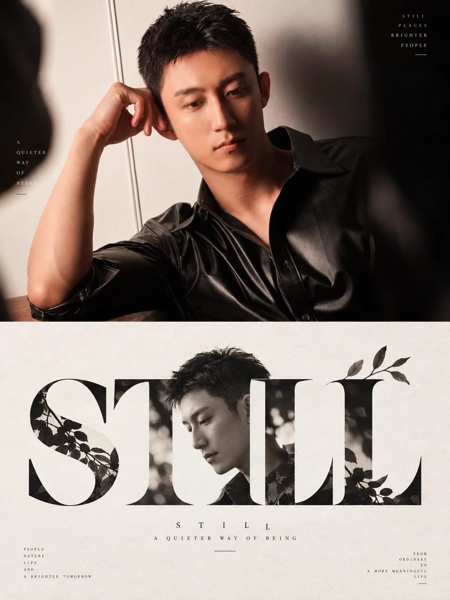

# 摄影概念字标二联画



## Prompt

```text
基于用户上传的一张图片，创作一张“真实摄影 × 概念字标设计 × 极简品牌视觉”风格的上下二联画。

【输入】
参考图：用户上传的图片
画幅比例：{{默认 3:4}}
语言：{{根据图片内容自动判断，可使用中文 / 英文 / 日文 / 中英混排}}
用途：{{概念海报 / 品牌视觉 / 艺术海报 / 摄影再设计 / Logo 概念稿}}

【核心目标】

用户上传的图片是视觉内容的唯一依据。

无需用户额外提供主题、标题或文案。

首先分析图片中的：

核心主体；
主体数量；
主体的轮廓特征；
动作和朝向；
主体之间的关系；
最有辨识度的局部；
环境特征；
主要色彩；
照片传递出的情绪；
能够被转化成符号的视觉结构。

然后将同一张图片转化成上下两个视觉层级：

上半部分：
保持真实摄影。

下半部分：
从照片中提炼一个高度简化的概念字标、文字 Logo 或图形化标题。

最终作品必须能够明显看出：

下方的字标设计来自上方照片，
同时又能够脱离照片独立成为一套成熟的视觉符号。

【整体结构】

使用竖版 3:4 画布。

沿水平方向划分为上下两个面积接近的区域：

上方约 50%：
原始摄影或经过轻微优化的真实摄影。

下方约 50%：
暖白或象牙白背景上的概念字标。

上下两部分边界直接、整洁，不使用复杂边框、渐变或装饰。

整体视觉关系为：

真实对象
↓
识别特征
↓
抽象形态
↓
融入文字
↓
形成 Logo / 字标。

【上半部分：摄影】

以上传图片为唯一场景来源。

保持照片中的：

主体身份；
主体数量；
主要环境；
动作；
朝向；
构图；
色彩关系；
光线与气氛。

可以进行适度摄影优化，包括：

自然曝光；
更加稳定的构图；
轻微电影调色；
改善光线层次；
增强主体与背景之间的分离。

但不得为了适配下方设计而改变照片核心内容。

不要主动加入新的重要人物、动物、建筑或物件。

【核心提炼】

下半部分不要重新画一遍照片。

需要寻找照片中最适合被符号化的一个视觉特征。

这个特征可以是：

动物身体轮廓；
植物的花瓣与茎；
人物姿势；
建筑外形；
器物轮廓；
山体走势；
波浪；
太阳；
道路；
杯子；
茶壶；
船只；
车辆；
树木；
飞鸟；
其他具有强辨识度的形态。

优先寻找能够与文字结构自然结合的部分。

例如：

鸟的颈部可以成为字母曲线；

花茎可以成为文字竖笔；

花朵可以成为字母圆点；

动物头部可以替代字母局部；

杯子可以构成字母 U；

壶嘴可以成为字母笔画；

船的航迹可以变成下划线；

建筑轮廓可以成为字母外框；

山峰可以成为字母 A 的顶部结构。

所有设计都必须来自当前图片，而不是复用固定视觉模板。

【字标设计原则】

下半部分优先生成一个简短、易识别的名称。

根据照片自动判断最合适的命名方式。

可以是：

1–2 个中文词；

一个英文单词；

两个英文单词；

一个短日文词组；

一个具有品牌感的造词。

名称不需要直接描述照片内容，可以围绕照片表达出的：

自然；
安静；
生长；
陪伴；
旅行；
自由；
时间；
温暖；
日常；
关系；
光；
生活方式

进行提炼。

名字应简短、具有视觉设计价值。

不要生成长句作为主标题。

【图形与文字融合】

这是整套视觉最关键的部分。

不要采用：

图标
+
文字

彼此独立的普通 Logo 结构。

优先采用：

图形就是文字的一部分。

主体形态应直接嵌入字母或汉字结构。

例如：

动物轮廓构成一个字母；

植物从字母笔画中自然生长；

器物替代某一个字母；

花朵变成标点；

建筑轮廓形成字母负空间；

动物头部从字母弧线自然出现；

杯中液体成为文字中的色块；

连续曲线同时表示主体和字体笔画。

视觉上应让观众经历：

先读到文字
→
再发现里面隐藏着照片中的主体。

或者：

先看到主体
→
再发现它其实构成了一个单词。

这种“第二眼才发现”的效果是设计重点。

【抽象程度】

主体需要高度简化。

保留：

最典型的外轮廓；
一个或两个关键特征；
必要的姿态关系。

删除：

毛发细节；
复杂纹理；
摄影光影；
大量环境信息；
细碎结构。

最终应接近：

Logo；
品牌字标；
现代符号；
编辑字体设计。

不要变成一幅完整插画。

【线条】

主要使用非常干净的：

黑色实形；
细黑线；
中等粗细轮廓；
几何曲线；
少量有机曲线。

根据照片主体决定使用线稿还是实体形状。

动物轮廓可以使用黑色实形与负空间。

植物可以使用细线。

器物可以使用几何轮廓。

建筑可以使用理性直线。

整体线条简洁、准确。

【负空间】

允许大量利用负空间完成图形。

例如：

用白色空隙形成动物头部；

在字母内部形成植物；

通过两个字母之间的空隙构成人物；

利用字母圆洞形成太阳或杯口。

不要把照片主体机械描边后贴到文字旁边。

尽量让文字结构本身承担图形表达。

【色彩】

下半部分背景使用暖白、米白、象牙白或浅灰白。

主要字标以：

黑色；
深灰；
墨色

为主。

允许从原照片中提取一种极小面积强调色。

例如：

照片中的黄色花朵
→
字标中的黄色花蕊；

红色花田
→
Logo 中一朵红花；

茶汤金黄
→
杯形字母内部的浅金色；

夕阳橙红
→
一个小型圆点；

绿色植物
→
极小绿色叶片。

强调色面积通常不超过下半部分的 5%–10%。

如果照片没有明显适合的强调色，则保持纯黑白。

【字体】

字体应服务于图形融合。

根据主体自动选择：

优雅高对比衬线字体；
现代极细无衬线字体；
具有东方气质的日文字形；
现代宋体；
几何无衬线字体；
定制化字母结构。

如果主体具有柔软有机轮廓：
优先采用优雅衬线或细线字体。

如果主体偏建筑、工业、现代：
优先采用几何无衬线字体。

如果主体偏自然、生活、美学：
可以采用更加优雅、有呼吸感的字形。

不要使用卡通字体、粗重商业字体或复杂装饰字体。

【字形定制】

允许为了与图片主体融合而局部改变字体结构，例如：

延长一条笔画；
删除局部结构；
替换字母横线；
重新设计圆弧；
让植物茎成为竖线；
让动物尾巴形成收笔；
让器物成为字母内部空间。

但必须保持文字仍然可读。

原则是：

70% 可读性
+
30% 图形创造。

不能为了视觉效果让主标题完全无法辨认。

【主体数量关系】

如果照片中存在多个具有关系的主体，例如：

一只大鸟 + 三只小鸟；

人与宠物；

人物 + 马；

多朵花；

茶壶 + 茶杯；

两个建筑；

可以在字标中保留这种数量或关系特征。

例如：

一只大鸟成为主字形，
三只小鸟成为连续的小符号；

茶壶构成一个字母，
茶杯成为另一个字母；

花茎承担不同文字笔画。

这种对应会让上下两部分的关联更明确。

【文字排版】

字标通常放在下半部分视觉中心附近。

根据设计结构可以：

水平居中；
略微偏左；
略微偏右；
上下两行。

整体应保持大量留白。

字标通常只占下半部分约 35%–60% 的宽度。

不要铺满整个区域。

【辅助文案】

在主字标下方可以加入一行非常小的英文、中文或其他语言辅助文字。

文字用于补充气质，而不是解释照片。

例如可以围绕：

自然；
生活；
陪伴；
时间；
安静；
季节；
日常；
人与环境

自动生成一句很短的品牌式文案。

建议控制在：

英文 2–5 个词；
中文 4–10 个字。

可以通过：

宽字距；
极小字号；
几个圆点或中点分隔

形成编辑设计感。

如果主字标已经足够完整，可以完全不添加副文字。

【语言选择】

不要机械使用英语或日语。

根据照片和字形机会自动判断。

如果英文单词更适合与主体轮廓融合，可以使用英文。

如果中文可以形成更好的字形关系，则使用中文。

如果图片具有明显且真实的地域文化语境，可以选择对应语言。

语言的选择首先服务于图形设计。

不要为了制造“高级感”随机使用外语。

【不同主体的转化规则】

动物：

重点分析：

头部；
耳朵；
尾巴；
脖子；
身体曲线；
腿；
姿态。

将最明显的部分转换成字母或汉字笔画。

植物：

重点分析：

花茎；
花瓣；
叶片；
花蕊；
排列节奏。

可以让文字像从植物结构中自然生长。

器物：

重点分析：

壶嘴；
把手；
杯口；
瓶身；
家具轮廓；
灯具结构。

优先寻找与字母几何形状的对应。

建筑：

重点分析：

拱门；
窗；
屋顶；
塔；
门洞；
立面几何。

采用更加理性的字标结构。

自然景观：

重点分析：

山形；
海浪；
河流；
道路；
太阳；
地平线。

将其转化为文字横线、曲线、底线或负空间。

人物：

重点分析：

侧影；
动作；
姿态；
手势；
衣服轮廓。

不要直接使用写实人像，优先转换成简化剪影或线条。

【上下呼应】

下半部分的设计必须存在至少两个与上方图片清晰对应的视觉线索。

例如：

主体轮廓
+
原图强调色；

主体数量
+
运动方向；

建筑结构
+
环境曲线；

器物外形
+
内部颜色。

这样即使下半部分已经高度抽象，仍然能够让观众自然联想到上方照片。

【整体气质】

聪明、简洁、克制、有设计巧思。

它应该像一位优秀品牌设计师看到一张照片后，将照片里最重要的形态提炼成一枚新的品牌标识。

整个作品的乐趣来自：

上半部分看到真实世界；

下半部分看到设计师如何理解真实世界。

最重要的视觉识别来自：

真实摄影
+
同一主体的形态提炼
+
主体与字形融合
+
大面积暖白留白
+
黑色概念字标
+
一点来自原照片的强调色。

【负面约束】

避免直接把照片转成普通黑白插画；
避免完整临摹照片；
避免图标与文字完全分离；
避免简单把动物头像放在单词旁边；
避免复杂 Logo；
避免盾牌徽章；
避免企业传统标志；
避免渐变 Logo；
避免三维 Logo；
避免金属质感；
避免大面积彩色；
避免卡通吉祥物；
避免儿童插画；
避免复杂信息图；
避免大量说明文字；
避免字体过度变形导致不可读；
避免随机使用日文或英文；
避免下半部分缺乏与原照片的对应关系。
```
