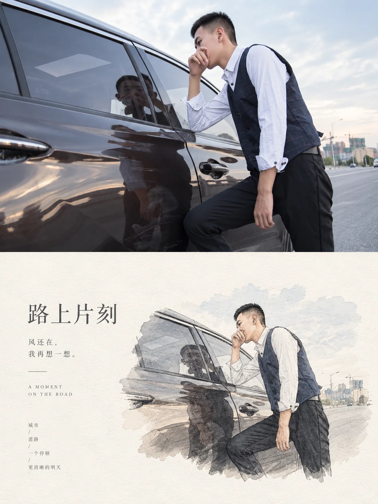

# 摄影纸本编辑插画二联画


## Prompt

```text
基于用户上传的一张图片，创作一张“真实摄影 × 纸本编辑插画 × 极简留白二联画”风格的竖版视觉作品。

【输入】
参考图：用户上传的图片
画幅比例：{{默认 3:4}}

【核心目标】

用户上传的图片是主体、场景、构图关系和故事内容的唯一依据。

无需用户提供主题、标题、情绪或文案。

首先自行分析图片，理解：

主体是什么；
主体数量；
主体的姿态、动作与朝向；
主体和环境之间的关系；
最重要的场景元素；
前景、中景和远景结构；
环境、季节、天气和时间；
光线方向；
主色调；
图片最具有识别度的视觉特征；
画面传递出的主要情绪与隐含主题。

然后把同一张图片重新组织成上下二联画：

上半部分：真实摄影世界；
下半部分：同一场景的极简纸本编辑插画。

最终必须让人明显感受到上下两部分描述的是同一个场景、同一个主体和同一刻情绪，同时形成“现实 / 记忆”“摄影 / 插画”的视觉对照。

【整体结构】

使用竖版 3:4 画布。

沿水平方向分为上下两个面积接近的区域：

上方约 50%：
完整真实摄影。

下方约 50%：
暖白纸本背景上的场景插画与编辑文字。

上下分界干净、直接，不使用边框、渐变过渡或装饰性分割。

整个视觉逻辑为：

原始场景
→
理解核心内容
→
提取视觉主体
→
删除环境噪声
→
转化成纸本插画
→
加入极简诗性排版。

【上半部分：真实摄影】

以上传图片为唯一视觉依据。

尽可能忠实保留原图中的：

主体；
主体数量；
主体外观；
动作；
朝向；
关键物体；
建筑；
植物；
动物；
环境；
空间关系；
构图方向。

不要主动增加不存在于原图中的重要主体。

可以对画面进行轻微电影摄影级优化，包括：

自然曝光；
更清晰的空间层次；
柔和高光；
自然阴影；
空气透视；
真实景深；
克制电影调色。

但不得改变原始场景的故事。

如果照片以环境为主，继续保持环境主导。

如果照片以人物、动物、建筑或物件为主，也维持原始视觉权重。

不要为了“艺术感”强制加入古装人物、太阳、飞鸟、山峰、花朵等固定元素。

【下半部分：编辑插画重构】

将原照片重新解释成一幅高度提炼的纸本场景插画。

不要完整复制上方照片。

先识别原图最重要的 2–5 个视觉元素，只保留这些足以唤起原照片记忆的内容。

例如：

海鸟 + 木桩 + 水面；

风车 + 花田 + 山丘；

人物 + 温室拱廊 + 植物；

书桌 + 文件柜 + 台灯；

人物 + 建筑；

动物 + 草地；

汽车 + 道路 + 树木。

具体保留什么完全根据上传图片决定。

删除大多数次要背景、重复物件和杂乱细节，让下半部分成为上半部分的“视觉摘要”。

【场景保持规则】

下半部分必须继承原图最关键的结构关系：

主体数量保持一致；

主体身份保持一致；

人物或动物的朝向尽量保持一致；

主要物体之间的位置关系保持一致；

核心建筑轮廓保持一致；

重要环境特征保持一致；

视觉运动方向保持一致。

如果原图主体位于左侧，下方不应无理由镜像到右侧。

如果原图主体面对某个方向，下方继续维持这个方向。

如果原图是人与环境之间的尺度关系，下方继续体现这种关系。

如果原图没有人物，则不要主动添加人物。

【插画语言】

下半部分采用“现代纸本编辑插画 × 淡彩版画 × 手绘线稿”的混合语言。

核心场景使用：

精细墨线；
铅笔线；
版画线条；
淡墨；
低饱和水彩；
局部平涂；
颗粒印刷；
轻微纸纹。

轮廓清晰，但不能像矢量图标一样生硬。

保留适量真实细节，使观众能够认出原照片中的主体。

同时删除摄影中的复杂光影和纹理，把它们转化成更简洁的线、块面和留白。

整体像一本高品质独立杂志中的编辑插图，而非卡通插画。

【插画轮廓】

下方场景不必使用矩形照片边界。

根据场景结构自动选择更自然的视觉轮廓，例如：

不规则水墨边缘；
柔和椭圆；
拱门形；
自由纸片轮廓；
植物形成的自然框景；
地面自然消失；
水面笔触结束；
不完整几何窗口。

场景边缘应逐渐融入纸张留白。

不要给插画增加明显相框。

不要每次都使用同一种撕纸轮廓。

【尺度与留白】

下半部分的大部分区域必须保持空白。

插画场景通常占下半部分约 25%–45%。

根据原照片复杂程度适当调整。

不要为了还原所有信息而把插画放大到铺满画面。

留白本身是设计元素。

最终形成：

一个小型场景插画
+
一组诗性文字
+
大面积安静纸面。

【色彩转换】

下半部分继承原照片最主要的 2–4 种颜色，但进行明显的纸本化和降饱和处理。

例如：

深灰蓝海面
→
灰蓝墨色；

黄色花田
→
柔和赭黄；

深绿色植物
→
墨绿与灰绿；

暖木色家具
→
米褐与浅赭；

橙红夕阳
→
小面积朱砂或陶土红。

不要机械套用固定颜色。

颜色必须来源于原照片。

大部分插画使用低饱和中性色，只保留一两处来自原照片的重点颜色作为视觉锚点。

【纸张背景】

下半部分使用温暖的象牙白、米白或天然纸白背景。

纸面具有极其细微的：

纸纤维；
印刷颗粒；
轻微墨色渗透；
自然颜色变化。

整体保持干净。

不要添加明显污渍、折痕、破损或重度复古滤镜。

【自动生成文字】

根据图片内容和情绪，自行提炼一组非常简短的诗性文案。

文字不是图片说明，也不要描述“画面里有什么”。

它应该像摄影集、艺术书或独立杂志中的标题，通过一句话补充画面的情绪。

自动生成：

一个简短主标题；
一句极短辅助文字；
必要时增加一组很小的编辑注释。

主标题建议控制在：

中文 4–10 个字；

日文或韩文等其他语言，根据视觉需要自然控制长度；

英文 2–6 个单词。

文字应具有含蓄、安静、克制的文学感。

例如关注：

等待；
远方；
时间；
季节；
光线；
安静；
生长；
日常；
归途；
距离；
自然；
思考。

但具体文案必须根据当前图片重新生成，不复用固定句子。

【文字语言】

默认根据用户界面语境使用中文。

如果原照片具有非常明显的地域文化信息，可以在不影响理解的情况下选择与场景相协调的当地语言作为主标题，并加入极少量英文或中文辅助信息。

语言选择只服务于整体视觉，不应为了异国感随机使用日语、韩语、阿拉伯语等文字。

如果无法可靠判断文化语境，优先使用中文。

【文字排版】

文字主要出现在下半部分。

不要覆盖上方摄影。

根据场景位置自动寻找视觉平衡。

如果插画偏右：
文字优先放左侧。

如果插画偏左：
文字优先放右侧。

如果插画位于中央：
文字可以布置在左右边缘或上下留白区域。

主标题允许：

竖排；
两至三行短句；
横排。

根据文字特征和画面比例自动决定。

中文使用优雅、纤细、具有书卷感的宋体或现代东方衬线字体。

英文使用小字号、高字距的编辑字体。

辅助文字字号明显小于主标题。

可以加入一条极短细线作为排版节点。

不要使用大型商业字体、粗黑标题或复杂装饰字体。

【编辑细节】

可以加入极少量：

细分隔线；
微型英文；
短编号；
小型圆点；
日期感文字；
极短注释。

这些元素只能用于建立编辑节奏。

不能形成信息图，也不能抢夺场景主体。

【整体气质】

安静、克制、诗性、自然、生活化、有观察感。

上半部分像真实世界的一瞬间。

下半部分像一位插画师将这一瞬间重新画进一本艺术书里。

摄影部分负责“发生过”。

插画部分负责“记住它”。

整个系列依靠：

真实摄影
+
暖白纸面
+
原场景编辑插画
+
大面积留白
+
诗性文字

建立稳定的视觉识别。

具体场景、主体、颜色、构图、语言和插画轮廓全部根据用户上传的照片自动变化。

【负面约束】

避免改变原图核心主体；
避免凭空加入重要人物或动物；
避免固定加入太阳、飞鸟、山峰、花枝；
避免每张图片都变成东方古风；
避免仙侠感；
避免二次元；
避免儿童绘本风；
避免卡通化；
避免下半部分完整临摹原照片；
避免下半部分铺满画面；
避免复杂信息图；
避免高饱和商业配色；
避免三维模型感；
避免厚重投影；
避免复杂拼贴；
避免大型装饰文字；
避免文字压住主体；
避免无依据使用外国语言；
避免过度做旧；
避免上下两部分缺乏明确视觉对应。
```