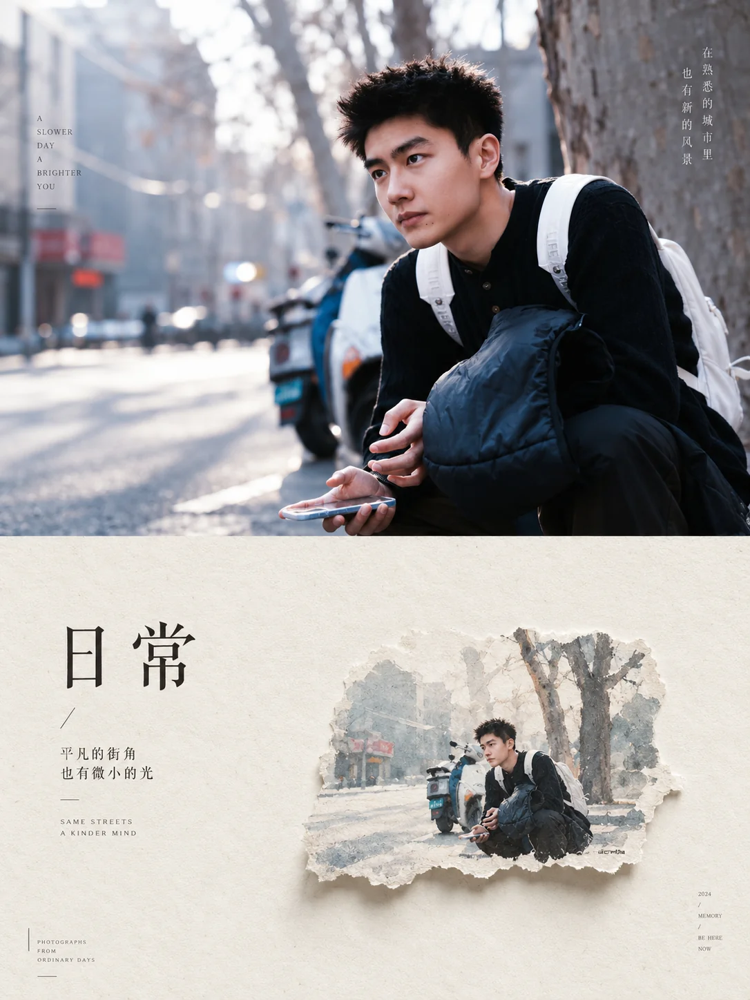

# 摄影纸本微缩二联画



## Prompt

```text
基于用户上传的一张照片，创作一张“电影感摄影 × 极简纸本微缩重构 × 编辑设计二联画”风格的竖版视觉作品。

【输入】

参考图：用户上传的照片
画幅比例：{{默认 3:4}}
语言：{{默认中英混排}}
用途：{{艺术海报 / 摄影作品 / 社交媒体视觉 / 文章封面}}

【核心原则】

用户上传的照片是画面内容、主体身份、环境、动作、空间关系和故事语义的唯一参考。

首先分析照片中的：

主体是谁；
主体正在做什么；
主体的姿态和朝向；
所在环境；
主要景物；
前景、中景、远景关系；
季节与天气；
时间与光线；
主色调；
最具有识别度的视觉元素；
照片传达出的主要情绪。

在此基础上，将同一个场景转化成上下两个彼此呼应的视觉世界：

上半部分保留真实摄影世界；
下半部分将同一场景高度提炼成安静、克制的纸本微缩艺术。

整张作品应当让人一眼看出上下两部分来自同一张照片，同时形成“真实世界 / 被收藏的记忆”之间的视觉对照。

【整体结构】

使用竖版 3:4 画布，并沿水平方向划分为上下两个面积接近的区域。

上方约 50%：
完整的电影感摄影场景。

下方约 50%：
暖白艺术纸背景上的微缩纸本重构。

上下区域保持清晰、自然、简洁的分界，不使用装饰边框。

整个视觉逻辑为：

真实场景
↓
提取核心关系
↓
删除次要信息
↓
缩小尺度
↓
转化成纸上微缩世界

【上半部分：摄影重构】

以上传照片为唯一场景依据。

保留原照片中的主体身份、数量、服装特征、动作、姿态、朝向、关键物件以及主体与环境之间的位置关系。

保留照片中最重要的环境语义，例如：

山峰、
湖泊、
树林、
花朵、
建筑、
道路、
草原、
海岸、
天空、
动物、
交通工具、
室内空间、
城市结构或其他真实存在于照片中的元素。

可以对摄影质感进行艺术化提升，使其具有更成熟的电影摄影效果，包括更自然的光影、空气透视、色彩层次、环境纵深和画面秩序，但不得改变照片原本的故事关系。

主体在原图中较小时继续保持环境主导的尺度感；主体在原图中较突出时，也应维持原本的视觉权重。

整体保持真实摄影质感，具有自然光线、真实空间、真实材质和克制的电影调色。

【下半部分：核心场景提炼】

重新分析上半部分，只提取最能代表这张照片的 2–4 个核心元素。

例如：

人物 + 山峰；

人物 + 马 + 花枝；

人物 + 建筑 + 飞鸟；

人物 + 动物 + 草地；

人物 + 海岸 + 日落；

车辆 + 道路 + 远山；

建筑 + 树木 + 月亮。

具体元素完全由上传照片决定。

不要机械加入山峰、斗笠、太阳、飞鸟、古建筑等固定元素。

只保留照片中真实存在，或者能够从原场景自然抽象出来的视觉关系。

【微缩场景】

将提取出的核心场景缩小成一个精致的“纸上微缩世界”。

微缩场景通常只占下半部分约 15%–30% 的面积，其余区域保留大量暖白留白。

根据原照片的视觉方向自动决定微缩场景位于：

偏左、
偏右、
中央偏下、
中央偏上

等位置。

构图重点不是重新画一遍原照片，而是保留：

主体身份；
主体动作；
主体朝向；
主体与环境的距离关系；
最重要的地形或场景轮廓；
最具有识别度的关键物件。

将复杂现实场景压缩为一个高度概括的小型视觉记忆。

【纸本重构语言】

微缩场景采用精致的混合媒介纸本风格：

手工撕纸；
薄纸拼贴；
淡墨；
水彩晕染；
铅笔与炭笔细节；
旧版画颗粒；
极轻微水墨扩散；
艺术纸纤维。

微缩场景的底部可以形成一块自然撕裂的不规则纸片，如同从原照片中撕下一小块记忆。

纸片边缘具有真实纤维感、自然破口和轻微厚度。

在纸片下方加入非常柔和、轻薄的自然投影，让微缩场景略微悬浮于纸面。

整体保持二维纸艺感，不形成明显模型或玩具质感。

【上下对应规则】

下半部分必须准确对应上半部分。

主体数量保持一致。

主体之间的关系保持一致。

人物或动物的朝向保持一致。

关键物件保持一致。

环境类型保持一致。

主要视觉方向保持一致。

如果原图人物望向右方，下方人物也维持相同方向。

如果原图包含人与动物，下方继续保留人与动物之间的关系。

如果原图的核心是人物面对巨大自然环境，下方继续体现“小人物面对远方”的比例关系。

如果原图核心是两个人互动，下方继续保留二者互动，不将其改造成单人场景。

如果原图没有人物，则以原照片中的建筑、车辆、动物、植物或其他主体作为微缩场景中心。

【抽象程度】

上半部分强调“真实”。

下半部分强调“提炼”。

下半部分应删除：

复杂背景纹理；
大量重复景物；
无关路人；
琐碎物件；
视觉噪声。

保留能够让人辨认原照片的最小视觉集合。

最终效果类似：

把一段真实经历，
压缩成一块被撕下、收藏在纸上的记忆。

【下半部分背景】

使用大面积暖白、象牙白或浅米色高级艺术纸。

纸张具有极细腻的天然纤维、微弱颗粒和轻微颜色变化。

背景应非常安静。

约 70%–80% 区域保持为空白。

不增加大面积纹样、插画或背景风景。

【文字系统】

根据上传照片的场景和情绪，自动生成一组极简、诗性的编辑文字。

文字只承担视觉设计和情绪补充作用，不解释照片故事。

优先生成：

2–5 个汉字组成的简短中文标题；

一句非常短的英文辅助文字；

必要时增加一条微型英文注释。

中文可以采用纵排或横排，根据下半部分构图自动决定。

字体使用细而克制的宋体、现代东方衬线字体或具有书卷气的印刷字体。

英文采用极小字号、高字距、优雅的衬线体或编辑字体。

文字区域与微缩场景之间保持较大距离，通过留白建立关系。

推荐结构类似：

中文短标题

极短英文句子

————

一行更小的诗性注释

所有文字内容必须根据照片自动生成，不能固定复用示例文案。

【文字位置】

根据微缩场景的位置自动寻找视觉平衡。

如果微缩场景偏右，则文字通常放在左侧。

如果微缩场景偏左，则文字通常放在右侧。

如果微缩场景位于中央，则文字可以放在远离主体的一侧或上下区域。

文字与主体不能拥挤。

整个下半部分呈现艺术摄影集扉页、诗集内页或高级编辑设计的留白结构。

【色彩关系】

上半部分保留照片本身的主色关系，只进行轻微电影化整理。

下半部分继承上半部分的主要色彩，但整体降低饱和度和对比度，使颜色像经过纸张吸收后的淡化版本。

例如：

上方深蓝雪山
→
下方淡灰蓝山影；

上方粉白花朵
→
下方浅粉水彩花枝；

上方橙红晚霞
→
下方淡赭红日轮；

上方翠绿草地
→
下方灰绿色纸本植物。

通过颜色建立上下区域之间的隐性对应。

【材质对比】

上半部分：
真实摄影、自然光线、清晰环境、空气透视、丰富空间。

下半部分：
艺术纸、撕纸边缘、淡墨、水彩、纤维、颗粒、微弱阴影。

让两个区域拥有明显不同的材质语言，但保持同一个故事。

【整体气质】

作品应该具有：

安静、
克制、
诗性、
电影感、
旅行感、
记忆感、
东方编辑设计气质。

上半部分像旅途中真实看到的一幕。

下半部分像多年之后留下的一页记忆。

画面最重要的视觉特征是：

宏大的真实场景
+
巨大的暖白留白
+
非常小的纸本微缩场景
+
少量诗性文字。

最终作品具有高级摄影集、艺术书、独立杂志或展览视觉的气质。
```
