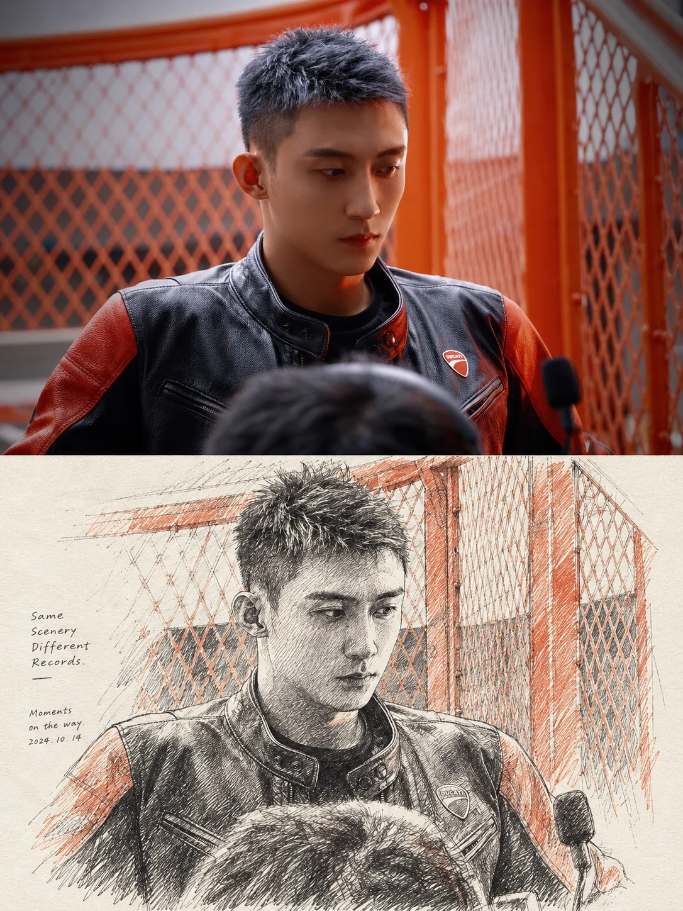

# 摄影钢笔速写二联画


## Prompt

```text
基于用户上传的一张图片，创作一张“真实摄影 × 钢笔建筑速写 × 旅行手稿二联画”风格的竖版视觉作品。

【输入】
参考图：用户上传的图片
画幅比例：{{默认 3:4}}

【核心目标】

用户上传的图片是主体、场景、构图、透视、比例和空间关系的唯一依据。

无需用户额外提供主题、标题或文案。

将同一张图片呈现为上下两个视觉版本：

上半部分：
真实摄影。

下半部分：
严格依据同一场景重新绘制的钢笔速写。

最终作品应让人一眼看出上下两部分表现的是同一个地方、同一个主体、同一个观察角度和同一组空间关系，形成“现实观察 / 手绘记录”的视觉对照。

【整体结构】

使用竖版 3:4 画布。

沿水平方向将画面划分为上下两个面积接近的区域：

上方约 50%：
完整摄影画面。

下方约 50%：
暖白或象牙色纸张上的钢笔速写。

上下边界直接、干净，不使用相框、渐变或装饰性分割。

整体类似：

旅行摄影
+
建筑师速写本
+
城市观察笔记。

【上半部分：摄影】

上半部分以用户上传图片为依据。

保留原图中的：

主体；
建筑；
人物；
动物；
交通工具；
自然景观；
道路；
水面；
地形；
透视方向；
运动方向；
光线；
天气；
时间；
前中后景关系。

不要为了风格需要随意改变原始场景。

可以进行轻微摄影级优化，包括：

自然曝光；
空气层次；
细节恢复；
合理对比度；
电影感但克制的色彩整理。

不得改变照片最重要的内容关系。

如果原图是航拍，则保持航拍视角。

如果原图是建筑正立面，则继续保持建筑正立面。

如果原图具有明显透视消失点，下半部分也必须延续该透视。

【下半部分：钢笔速写】

将上方摄影场景重新绘制成高质量钢笔手稿。

重点不是重新设计场景，而是尽可能准确地重现原照片的：

构图比例；
主体位置；
透视关系；
轮廓；
建筑结构；
地形走势；
运动轨迹；
空间层级。

视觉上类似建筑师、旅行画家或城市观察者面对真实场景进行现场写生。

【保真规则】

下半部分必须与上方摄影具有明确的一一对应关系。

如果上方主体位于右侧，下方继续位于右侧。

如果上方主体向右移动，下方保持相同运动方向。

如果上方有一道明显尾流、道路、河流或轨迹，下方继续保留其形状和走向。

如果上方建筑前方有车辆、人物、路灯、树木等具有识别度的元素，下方应保留主要元素。

如果上方存在特殊地标、山峰、建筑轮廓或交通工具，下方应准确保持其核心结构特征。

不要镜像。

不要改变观察角度。

不要凭空加入重要元素。

【线稿语言】

使用精细钢笔、针管笔和建筑速写的线条语言。

主要使用：

极细轮廓线；
快速排线；
交叉排线；
短线阴影；
连续结构线；
建筑透视辅助感；
自由但准确的手绘线条；
局部粗细变化。

线条应同时具有两个特点：

结构准确；
具有真实手绘的不规则感。

不要做成机械 CAD 图纸。

不要做成干净的矢量线稿。

不要做成漫画勾线。

【明暗处理】

通过线条密度表现明暗，不大面积使用灰色填充。

暗部：
使用密集平行排线、交叉排线和局部墨色。

中间调：
使用较稀疏线条。

亮部：
尽量保留纸张本色。

例如海浪、云层、建筑阴影、树林或山体，可以通过不同方向和密度的排线形成丰富层次。

整体保持黑白或深灰单色手稿气质。

【不同题材的速写规则】

建筑场景：

优先准确表现：

屋顶；
门窗；
立面分格；
柱体；
檐口；
招牌；
道路；
车辆；
电线杆；
周围植物。

建筑应具备真实结构感和透视关系。

自然景观：

优先表现：

山体轮廓；
岩石纹理；
树木；
水面；
海浪；
云层；
岸线；
光影边界。

使用大量自由线条和疏密变化，不追求每一个自然纹理都写实。

交通工具：

保留车辆、船只、自行车、飞机等核心外形和朝向。

不要简化到无法辨认型号类别。

人物：

如果人物在原照片中较小，下方同样使用少量简洁线条表现。

人物只用于建立尺度与生活感。

不要主动放大人物。

【运动表现】

如果照片存在明显动态，例如：

船只航行；
车辆移动；
奔跑；
流水；
海浪；
烟雾；
风吹植物；
飞鸟。

下半部分需要通过线条方向强化运动感。

例如船的尾流可以使用大量快速、连续、略带自由度的钢笔线条表现。

线条方向应与真实运动方向一致。

【纸张】

下半部分使用天然暖白、象牙白或略带米色的高品质素描纸。

纸面保留极细微的：

纸纤维；
天然颗粒；
轻微色差；
真实扫描感。

纸张应干净、安静。

不要使用黄色旧报纸效果。

不要增加污渍、折痕或重度复古做旧。

【留白】

下半部分不要求像摄影一样铺满整个区域。

允许速写边缘自然消失。

尤其是：

天空；
道路边缘；
水面；
远景；
地面。

可以逐渐减少线条，让它们融入纸张。

这种“未完全画满”的状态非常重要，使作品具有真实现场速写感。

主体和核心场景需要完整，而边缘可以自然松开。

【速写边界】

不要使用硬矩形裁切框包住下方线稿。

让线稿自然结束。

例如：

建筑周围逐渐减线；
山体边缘自然淡出；
海浪排线逐渐消失；
道路以几根快速线条收尾。

形成真正画在速写本纸张上的感觉。

【辅助文字】

下半部分可以加入极少量手稿式编辑文字。

文字不是标题海报的核心，仅作为旅行笔记或观察记录。

允许加入：

一句很短的英文；
坐标；
日期；
天气；
地点缩写；
方向；
编号；
一条短横线。

例如整体结构可以是：

FORWARD /
LEAVE NOTHING
BUT WAKE.

或：

quiet nights,
warm light,
mountains always there.

具体内容必须根据当前图片的气质自动生成，不重复固定示例。

文字数量应非常少。

【文字风格】

辅助文字使用：

小字号英文无衬线体；
打字机感字体；
建筑草图注释字体；
极细手写体。

文字通常位于下半部分左下角或右下角。

字号非常小。

可以配一条极短横线。

不要生成大型中文标题。

不要把这组作品变成普通海报排版。

摄影和速写本身才是视觉主体。

【坐标与记录信息】

如果适合场景，可在下方角落加入类似旅行记录的微型信息，例如：

N 35° / E 138°

或：

15.01
07:30

但只有在与画面气质协调时使用。

这些数据属于视觉设计元素。

如果无法从图片确定真实坐标，不要伪装成真实地理信息，可以使用抽象编号、日期样式或完全省略。

【色彩】

上半部分：
保持原照片的自然色彩。

下半部分：
基本使用深灰、墨黑或略带暖色的黑色线稿。

不要把原照片颜色复制到速写区域。

必要时最多使用极微弱的单色淡洗，但默认保持纯钢笔黑白表现。

上下两个区域的色彩反差正是作品的重要视觉特征。

【主题自动理解】

无需用户提供主题。

根据上传图片自动判断：

这是建筑；
自然；
旅行；
交通；
城市；
海岸；
人物；
生活场景；
工业景观；
其他题材。

再自动调整速写语言。

建筑较多：
强化透视、结构线和立面细节。

自然较多：
强化自由排线、轮廓和空气感。

运动较强：
强化方向性线条。

场景安静：
减少线条密度，增加纸面留白。

复杂城市：
提取核心建筑结构，避免把所有细节机械画满。

【材质对照】

上半部分强调：

真实色彩；
真实光影；
真实空气；
摄影细节。

下半部分强调：

笔尖摩擦纸面的感觉；
线条疏密；
黑白结构；
手工绘制痕迹；
纸面留白。

最终形成非常明确的：

照片
/
观察
/
速写

三层视觉关系。

【整体气质】

理性、安静、观察感、旅行感、建筑感、手工感。

像一本高级建筑旅行杂志中的跨页设计，也像建筑师旅途中拍下一张照片以后，在速写本中重新描绘这段场景。

作品最重要的识别来自：

同一场景
+
上下严格对应
+
上方真实摄影
+
下方精细钢笔速写
+
暖白纸张
+
极少量旅行注释。

【负面约束】

避免下半部分改变原始构图；
避免镜像；
避免随意移动主体；
避免加入原图不存在的重要人物、动物或建筑；
避免水彩插画成为主风格；
避免彩色漫画；
避免卡通；
避免动漫；
避免粗黑轮廓；
避免机械矢量线稿；
避免 CAD 工程图；
避免完整矩形边框；
避免下方铺满所有纸面；
避免大量文字；
避免大型标题；
避免商业广告感；
避免拼贴；
避免撕纸效果；
避免古风水墨化；
避免三维建模；
避免纸张重度做旧；
避免上下两个场景无法对应。
```