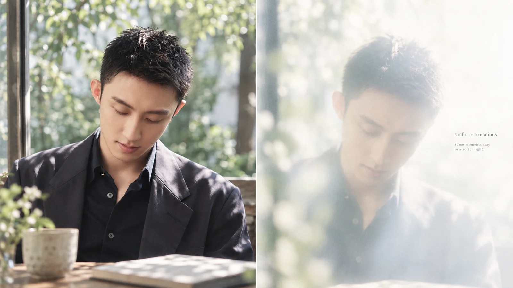

# 柔光记忆双联写真


## Prompt

```text
围绕用户提供的主题、故事或参考照片，创作一张“日系生活写真 × 双联画编辑设计 × 柔光记忆投影”风格的横版摄影海报。

整张作品表达同一个瞬间的两种状态：

左侧是正在发生的现实，
右侧是这个瞬间留在记忆里的残影。

画面应安静、轻盈、自然，像一本日系独立摄影集中的跨页作品。重点不是戏剧化叙事，而是把一个普通生活瞬间处理得具有空气感、时间感和轻微的诗意。

【输入】

主题 / 主标题：{{主题}}
核心场景：{{例如咖啡馆、街道、海边、房间、校园、旅行途中，可留空}}
人物 / 主体：{{人物、物件或自然景物，可留空}}
核心动作：{{阅读、行走、奔跑、回头、吹花瓣、望向窗外等，可留空}}
核心情绪：{{安静 / 自由 / 春日 / 怀念 / 温柔 / 独处 / 松弛，可留空}}
参考照片：{{可上传；如提供，以其中人物、场景、动作和空间关系作为内容参考}}
主标题文字：{{可留空}}
辅助短句：{{1–2 句很短的文字，可留空}}
语言：{{中文 / 英文 / 中英混排}}
画幅比例：{{默认 16:9}}
用途：{{摄影海报 / 公众号配图 / 旅行记录 / 人物写真 / 社交媒体视觉}}

【构图】

采用横向双联画结构，左右两部分面积接近 1:1，中间形成干净、自然的垂直分界。

左侧约占画面 50%，表现真实世界中的完整摄影瞬间。

右侧约占画面 50%，表现左侧同一瞬间经过记忆、光线和时间重新转译后的视觉残影。

左右两侧必须存在明确的语义联系，例如保持相近的人物姿态、动作方向、身体轮廓、场景结构或核心物件，使观者能够意识到两边表现的是同一个瞬间，而不是两张互不相关的图片。

【左侧：现实摄影】

使用自然、克制的日系生活摄影语言。

画面像使用胶片相机或早期数码相机随手捕捉的真实生活瞬间，人物动作自然，不看镜头也可以，避免商业棚拍和刻意摆拍感。

使用自然窗光、清晨、午后逆光、树荫漏光或日落余晖，让阳光真正参与画面叙事。

保留适量真实细节、轻微胶片颗粒、柔和高光和自然阴影，整体反差偏低，颜色清淡但不灰暗。

主体不需要占满画面，应保留环境、天空、窗户、树木、海面、墙壁等能够形成呼吸感的空间。

构图允许轻微偏心、遮挡和抓拍感，使照片看起来像一个真实发生过的瞬间。

【右侧：记忆投影】

不要简单复制左侧照片并添加模糊滤镜。

重新解释同一场景，只保留最具有识别度的人物轮廓、动作、环境影子或核心视觉关系。

整体使用高调曝光、大面积乳白色留白、柔焦、散射光、轻微雾化和半透明感，像阳光透过磨砂玻璃、薄纱、窗帘或旧照片形成的模糊投影。

人物可以退化成柔和剪影、光影轮廓或朦胧倒影，不需要清晰五官和服装细节。

允许部分环境完全溶解进光线，只留下淡淡的天空、树影、海岸线、花瓣、窗框或地面反射。

右侧的信息密度明显低于左侧，让大面积空白和光线成为主要视觉元素。

画面应具有轻微失焦、过曝和梦境感，但仍保持摄影真实性，避免变成数字插画或浓重奇幻场景。

【色彩与光线】

整体使用低饱和、明亮而通透的颜色。

优先从场景自身提取色彩，例如：

天空形成浅蓝与雾蓝；
夕阳形成淡粉、杏色和暖黄色；
植物形成灰绿与墨绿；
室内形成象牙白、米白与柔和木色。

避免强烈综合色、霓虹色、高对比电影调色和厚重暗部。

高光可以轻微溢出，阴影边缘柔软，使画面拥有晒过太阳的旧照片质感。

【文字与编辑设计】

文字只作为极小比例的编辑元素存在，不抢夺摄影主体。

主标题建议使用纤细、优雅的现代衬线字体，小字号、宽字距，并放置在右侧大面积留白区域。

英文可使用小写字母、标题式大小写或宽字距大写；中文使用纤细宋体或具有现代编辑感的衬线字体。

辅助文字控制在一到两句短句，可加入一条极细短横线作为排版停顿。

文字之间保持较大的行距与留白，像独立摄影杂志、诗集或艺术摄影书的跨页设计。

如果用户没有提供文字，只保留极少量自动生成的短标题，不生成大段文案。

【核心气质】

安静、松弛、透明、轻微怀旧。

像一个普通生活瞬间，在几年后重新想起时，只剩下光线、动作和模糊轮廓。

画面需要同时拥有真实生活的温度与记忆逐渐褪色后的距离感。

不要过度唯美，不要商业时尚大片感，不要复杂拼贴，不要厚重滤镜，不要明显人工光效，不要增加无关装饰，不要让右侧变成单纯的模糊照片。

最终效果应接近：

一页现实摄影，
与一页关于这段现实的记忆。

两者共同组成一张安静、克制、有呼吸感的摄影编辑作品。
```