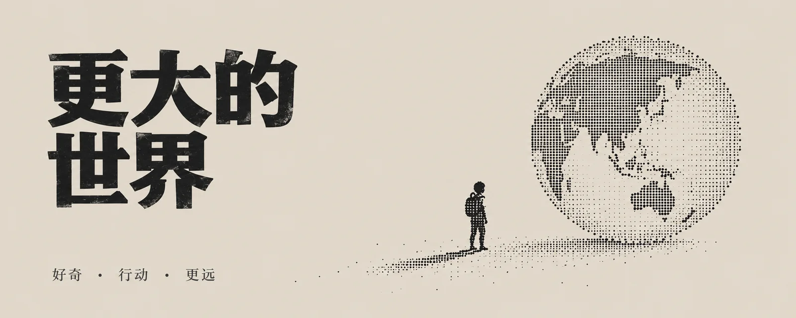

# 复古油墨点阵隐喻



## 复古油墨点阵隐喻

### Prompt

```text
根据用户提供的主题，创作一张高度稳定、结构固定的“复古油墨打印 × 极简点阵隐喻”编辑封面。

本风格的优先级是：

版式稳定性>文字准确性>点阵隐喻可读性>风格变化。

不同主题只能改变：

主标题内容，底部短词，点阵插图表达的隐喻。

不得因为主题变化而重新设计：
背景颜色，
字体体系，
文字颜色，
字号比例，
版式骨架，
插图尺度，
整体信息密度。

最终效果应像：

1970s–1990s 复古科技杂志封面，
旧式打印说明页，
机械打字档案，
早期计算机研究资料，
极简技术编辑海报。

整体必须安静、理性、克制、复古，同时保持大量留白和非常稳定的系列视觉识别。

【输入】
主题词 / 主标题：{{主题词}}
副标题：{{副标题，可留空；默认不显示}}
底部短词：{{3 个以内短词，可留空}}
画幅比例：{{5:2 / 16:9 / 3:2 / 4:3 / 1:1 / 4:5 / 3:4 / 9:16}}
语言：{{中文 / 英文 / 中英混排}}
用途：{{用途}}
可选补充语境：{{补充背景，可留空}}
可选情绪倾向：{{理性 / 安静 / 复古 / 科技 / 档案 / 克制 / 未来 / 研究，可留空}}
可选核心隐喻：{{核心隐喻，可留空；留空时从主题提炼一个最简单隐喻}}
可选禁用元素：{{不想出现的元素，可留空}}

【固定视觉系统】
无论主题是什么，都必须保持以下视觉系统不变：

固定浅暖灰米色背景；固定深黑主标题；固定深灰底部短词；固定机械油墨铅字字体体系；固定主标题字号比例；固定留白比例；固定“小型点阵插图”体量；固定横版左文右图 / 竖版上文下图结构。

不要为了“每张图都有创意”而破坏系列统一性。

创意只发生在：“点阵插图表达什么关系”。

【严格三色系统】
整张图只能使用以下三种颜色：

背景：#DED9CF

主标题与点阵插图：#111111

底部短词：#343434

除此之外禁止任何第四种颜色。

不要出现：

纯白，
彩色强调色，
红色，
蓝色，
黄色，
绿色，
渐变，
透明彩色，
发光颜色。

色彩必须保持稳定、一致。

【固定背景】
整个画布使用纯色：#DED9CF

背景必须：
均匀，
平整，
干净，
没有明显方向，
没有明暗变化。

不要让背景偏向：

黄色，
粉色，
纯白，
冷灰，
棕色。

不要加入：

渐变，
光斑，
暗角，
大面积颗粒，
明显纸纹，
做旧痕迹，
污渍，
折痕，
褪色斑块，
扫描色带。

允许非常轻微、几乎不可察觉的印刷介质感，但从正常观看距离应首先被识别为一整块统一的 #DED9CF 平底。

【字体系统】
全部文字使用同一套“复古油墨机械铅字”字体语言。

字体气质：

略窄，
方正，
机械，
稳定，
实用主义，
旧式打字机 / 铅字报刊 / 技术档案感。

文字边缘允许极轻微：

油墨扩散，印刷不均，微小墨量变化。

但文字仍必须清楚锐利、完整可读。

不要改变字体体系。

禁止使用：

现代几何黑体，
极简科技字体，
像素字体，
宋体，
手写体，
书法体，
卡通字体，
装饰字体，
粗暴破损字体，
故障字体。

【主标题】
主标题必须准确显示：

“{{主题词}}”

不得：改写，摘要，翻译，增加字符，删除字符，生成错字，乱码。

主标题使用同一机械铅字字体体系的粗体版本。

标题颜色固定：#111111

标题最多两行。不要超过两行。

不要让标题铺满整个画面。

不要因为标题短而自动放大。

不要因为标题长而自动缩小字号。

字号始终服从当前画幅对应的固定尺寸。

如果标题较长，优先通过合理断行控制在两行内，不要改变字号。

【固定输出尺寸与标题字号】
严格根据画幅比例使用以下目标规格：

5:2
画布：2000 × 800
主标题：72 px
行高：76 px

16:9
画布：1920 × 1080
主标题：84 px
行高：89 px

3:2
画布：1800 × 1200
主标题：88 px
行高：93 px

4:3
画布：1600 × 1200
主标题：88 px
行高：93 px

1:1
画布：1600 × 1600
主标题：96 px
行高：102 px

4:5
画布：1600 × 2000
主标题：104 px
行高：110 px

3:4
画布：1500 × 2000
主标题：104 px
行高：110 px

9:16
画布：1080 × 1920
主标题：108 px
行高：114 px

保持这些字号之间的视觉比例稳定。

不要为了“更有冲击力”擅自增大标题。

【副标题】
默认不显示副标题。

即使用户填写 {{副标题}}，
只有当用户明确要求显示副标题时才显示。

否则忽略副标题，
保持标准模板只有：

主标题，
点阵插图，
可选底部短词。

如果确实要求副标题，
使用同一字体体系，
明显弱于主标题，
且不得改变主版式结构。

不要自动生成副标题。

【底部短词】
只有用户填写 {{底部短词}} 时才显示。

最多 3 组短词。

使用中点：· 进行分隔。

例如：RESEARCH · SYSTEM · FUTURE

或：

研究 · 系统 · 未来

不得自动补充短词。

不得根据主题自行创造标签。

底部短词使用与主标题完全相同的字体体系，
但使用细体版本。

颜色固定：

#343434

字号固定为主标题字号约 23%。

字距约为正常字距的 1.15 倍。

底部短词必须是非常弱的第三视觉层级。

【信息层级】
整个画面标准情况下只允许三种内容：

第一层：
主标题。

第二层：
极简点阵隐喻插图。

第三层：
可选底部短词。

除此之外不要出现：

主题说明，
隐喻解释，
备注，
编号，
功能列表，
标签，
日期，
作者，
机构，
Logo，
二维码，
水印，
页面索引，
随机英文，
额外说明文字。

【横版固定结构】
以下比例：

5:2
16:9
3:2
4:3

统一使用：

左文右图。

视觉结构固定为：

左侧：
主标题 + 可选底部短词。

右侧：
小型点阵隐喻插图。

中间：
明显空白。

不要交换左右。

不要让插图进入左侧标题区域。

不要把标题居中。

不要使用上下结构。

【横版文字区】
左侧文字区整体约占画面宽度：

52%

主标题位于左侧文字区的中上部。

底部短词位于左侧文字区下方安全区域。

标题与插图之间必须存在大面积空白。

【5:2 特殊规则】
5:2 画幅：

主标题文字框宽度固定约为画面宽度的：

38%–42%

左边距约为画面宽度的：

7%–9%

主标题总高度不得超过画面高度：

24%

插图位于右侧中部，
垂直居中。

保持大量上下留白。

不要因为超宽画幅增加更多内容。

【横版插图区】
右侧点阵插图区域约占画面宽度：

22%–26%

插图必须偏小。

它不能接近标题字号形成同等级视觉重量。

插图周围保留充足空白。

不要让插图靠边过近。

【方形与竖版固定结构】
以下比例：

1:1
4:5
3:4
9:16

统一使用：

上文下图。

主标题：
位于上方偏中区域。

插图：
位于中下区域。

底部短词：
位于最下方安全区域。

三者之间保持明显距离。

不要使用左右分栏。

不要把主标题放在最底部。

【方形与竖版插图尺度】
点阵插图整体高度约占画面高度：

25%–32%

不要超过这个视觉量级。

即使画幅很高，
也不要把插图放大成为大型主体。

整张图必须继续保持：

标题 + 小插图 + 大留白。

【固定留白】
留白是该风格的核心结构。

画面必须明显疏朗。

不要：

填满，
增加边框，
加入背景纹理，
补充图标，
放置第二插图，
增加装饰文字。

标题和插图之间必须能够感受到明显“空气”。

画面需要像一页经过编辑设计的旧技术资料，
不是现代满版海报。

【主题理解】
只在内部理解 {{主题词}} 与 {{可选补充语境}}。

提炼：

主题真正表达的核心关系是什么？
什么动作最能代表这个观点？
能否把它压缩成一个简单物体或两个物体之间的关系？

不要展示分析过程。

不要试图表达标题中的所有信息。

整张图只保留一个隐喻。

【核心隐喻】
如果用户指定：

{{核心隐喻}}

围绕它建立插图。

如果没有指定，
从主题中自动提炼一个：

最简单，
最直接，
最容易一眼理解
的视觉隐喻。

优先表达：

连接，
分离，
阻挡，
突破，
循环，
靠近，
远离，
平衡，
倾斜，
堆叠，
打开，
关闭，
穿越，
折断，
重组，
汇聚，
扩散，
缺失，
嵌合。

不要选择需要大量说明才能理解的复杂隐喻。

【插图原则】
插图只能：

有一个核心主体，

或者：

由两个物体形成一个简单关系。

不要出现三个以上互相独立的主物体。

不要制作复杂叙事场景。

不要使用背景环境。

不要画完整人物场景。

不要发展成信息图。

【点阵视觉语言】
插图全部使用：

#111111

由以下视觉元素构成：

黑色圆点，
稀疏线性点阵，
少量油墨网点，
点状轮廓，
局部密度变化。

效果接近：

老式针式打印，
点阵打印，
早期计算机输出，
复古报刊网点，
技术资料中的简化黑色插图。

不要使用连续光滑矢量描边作为主轮廓。

形体主要依靠：
点，
点阵，
稀疏墨点密度
建立。

【点阵精度】
点阵必须清楚、有规律感，但不能像现代像素图。

区别：

不是 8-bit 像素块；
不是马赛克；
不是 LED 点阵屏；
不是半色调照片滤镜。

它应更像：

老式打印机通过大量黑色圆点，
以有限精度重新构成一个简洁物体。

允许：
局部点距略有变化，
轻微油墨不均，
少量打印缺点。

但整体仍然清楚可辨。

【插图简化】
主体只保留：

外部轮廓，
一个主要动作，
1–2 个身份特征。

不要表现：

复杂材料纹理，
完整背景，
复杂阴影，
大量内部零件，
高精度结构，
无关小物件。

例如：

人物：
只保留整体姿态、头部方向、手部动作。

设备：
只保留外形和一个功能特征。

动物：
只保留轮廓、耳朵、尾巴或关键动作。

物体：
只保留最容易识别的结构。

抽象关系：
只保留两个形体和它们之间的关系。

【插图视觉重量】
宁小勿大。

宁简勿繁。

插图不承担“第一视觉冲击”。

主标题仍然是整个封面的第一阅读入口。

插图是阅读标题后的第二层理解。

不要让插图：

占据半个画面，
跨越整个背景，
围绕标题形成复杂装饰。

【插图位置】
横版：

插图位于右侧中部，
垂直居中或轻微偏下。

竖版 / 方形：

插图位于中下部，
与标题保持明显距离。

不要让插图紧贴标题。

不要让点阵图穿过文字。

【字体与插图统一】
标题和插图必须共享一种“旧机器输出”的视觉世界。

标题像：
机械铅字印刷。

插图像：
旧式点阵打印。

两者都使用同样的深黑：

#111111

但不要把主标题本身做成像素字或点阵字。

标题必须仍然是机械铅字。

【情绪倾向】
{{可选情绪倾向}} 只能轻微影响：

插图隐喻的动作，
点阵密度，
整体语义气质。

不得改变：

固定背景色，
字体，
字号，
版式，
文字颜色，
插图大小，
三色系统。

例如：

理性：
选择结构清楚、对称或嵌合关系。

安静：
降低插图动态感。

复古：
保持原本印刷语言，不额外做旧。

科技：
选择系统、连接、结构类隐喻。

档案：
选择更静态、研究资料式构图。

未来：
通过隐喻表达，而不是加入未来科技视觉。

研究：
选择观察、拆解、汇聚或比较关系。

情绪不改变视觉模板。

【用途适配】
{{用途}} 不得改变本风格的基本视觉系统。

文章封面、
社交媒体封面、
视频封面、
报告题图

仍然使用相同版式逻辑。

用途只能影响：
标题断行，
最终裁切安全区，
插图隐喻选择。

不要因为是视频封面就放大标题。

不要因为是社交媒体就增加装饰。

【严格避免】
不要增加任何高饱和颜色。

不要第四种颜色。

不要渐变。

不要发光。

不要 3D。

不要写实摄影。

不要复杂背景。

不要大面积做旧污渍。

不要大颗粒背景噪点。

不要明显纸张纹理。

不要修改 #DED9CF 背景。

不要修改 #111111 主标题和插图颜色。

不要修改 #343434 底部短词颜色。

不要自动更换字体。

不要自动改变标题字号。

不要因为文字少而放大标题。

不要让标题超过两行。

不要自动生成副标题。

不要自动生成底部短词。

不要：

图标阵列，
多主体，
多重隐喻，
复杂人物场景，
信息图，
流程图，
说明书式标注。

不要让插图过大。

不要让画面过满。

不要加入 {{可选禁用元素}}。

【生成前检查】
生成前内部检查：

背景是否严格接近 #DED9CF？

是否没有渐变、光斑和明显纸纹？

画面是否只有三种颜色？

主标题和插图是否统一为 #111111？

底部短词是否为 #343434？

所有文字是否使用同一套机械油墨铅字体系？

主标题字号是否严格遵循当前画幅规格？

是否因为标题长度擅自调整字号？

如果有，恢复固定字号。

主标题是否最多两行？

横版是否严格左文右图？

竖版 / 方形是否严格上文下图？

插图是否保持偏小？

是否只有一个隐喻？

是否只有一个主体或两个物体的简单关系？

插图是否由点阵和油墨网点构成？

是否误做成像素画或半色调照片？

底部短词是否只在用户提供时出现？

画面中是否存在额外文字？

如果有，删除。

是否为了主题增加了额外颜色、图标或复杂背景？

如果有，删除。

本系列最重要的问题不是：

“这一张够不够丰富？”

而是：

“把它和其他主题放在一起时，是否明显属于同一套稳定视觉系统？”

【最终标准】
最终只生成一张独立完整封面。

不要输出：

分析，
解释，
多个方案，
拼图，
网格，
联系表，
样机。

最终画面必须稳定呈现：

纯色浅暖灰米背景 #DED9CF；
深黑机械油墨主标题 #111111；
与标题同色的极简点阵隐喻插图；
可选深灰底部短词 #343434；
固定机械铅字字体体系；
固定字号逻辑；
固定版式结构；
一个核心隐喻；
一个小型插图；
大量连续留白。

远看时：

先看到稳定、机械、复古的主标题。

第二眼：

看到一枚很小、很简洁的黑色点阵隐喻。

第三眼：

理解这枚插图与标题之间的关系。

整套作品必须让人明显感受到：

无论主题如何变化，
它们都来自同一台旧式打印机器、
同一套编辑模板、
同一个复古技术档案系统。

主题在变，
隐喻在变，

但字体、颜色、尺度、版式和视觉纪律不变。
```