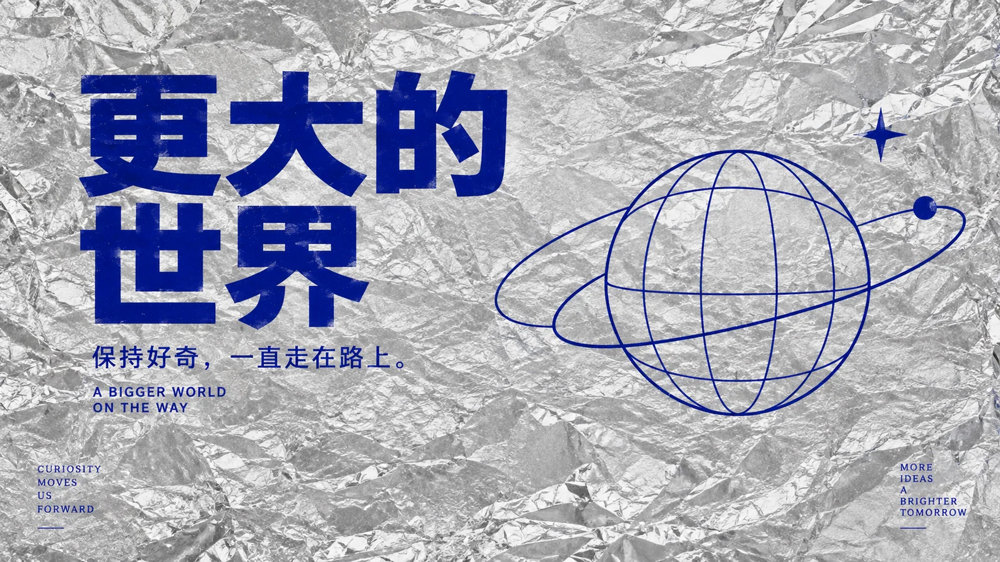

# 银色锡纸蓝字



## Prompt

```text
围绕用户提供的主题，创作一张“真实银色细纹锡纸 × 统一克莱因蓝文字 × 单一线条隐喻”的高级极简编辑封面。

画面只有两个核心视觉系统：

真实银色锡纸背景
+
纯正、统一、深邃的克莱因蓝文字与线条。

视觉吸引力主要来自：

锡纸真实而细腻的金属纹理，
银色材料随机但克制的褶皱，
统一蓝色形成的理性秩序，
舒展清楚的文字排版，
一个简单而准确的线条隐喻，
以及大面积未被文字和图形占据的银色空间。

最终效果应像：
高级独立杂志封面，
当代设计展海报，
创意工作室视觉，
现代文化出版物，
设计研究项目封面。

不是营销海报，
不是科技宣传页，
不是金属 3D 概念图，
也不是在银灰背景上简单加蓝字。

【输入】
主题词 / 主标题：{{主题词}}
副标题：{{副标题，可留空}}
补充说明：{{入门教程 / 方法论 / 线下课 / 实战指南，可留空}}
画幅比例：{{5:2 / 16:9 / 1:1 / 4:5 / 3:4 / 9:16}}
语言：{{中文 / 英文 / 中英混排}}
用途：{{X封面 / 文章封面 / 视频封面 / 竖版海报}}
可选补充语境：{{补充背景，可留空}}
可选情绪倾向：{{极简 / 冷静 / 理性 / 克制 / 高级 / 现代 / 清楚，可留空}}
可选核心隐喻：{{路径 / 回路 / 节点 / 阶梯 / 入口 / 连接 / 输入输出 / 状态变化，可留空；留空时从主题提炼一个最容易理解的概念}}
可选禁用元素：{{不想出现的元素，可留空}}

【核心原则】
整张图只保留：

1 个主标题；
最多 1 个副标题；
最多 1 条极短补充说明；
1 个线条隐喻；
1 个明确视觉中心；
1 种统一蓝色；
1 张覆盖全画面的真实银色锡纸。

不要建立第二个主视觉。

不要加入多个隐喻。

不要通过复杂图形、人物、产品、图标或小字丰富画面。

这个风格的设计感来自：

材料
×
排版
×
蓝色
×
留白
×
关系隐喻。

【主题理解】
生成前先在内部理解“{{主题词}}”与“{{补充语境}}”。

判断主题最重要的关系是什么，例如：

进入，
连接，
推进，
循环，
建立，
拆解，
学习，
升级，
输入，
输出，
转化，
跨越，
从起点到目标，
从旧状态进入新状态。

如果用户指定：
{{核心隐喻}}

优先围绕该概念设计。

如果没有指定，
只选择一个最简单、最容易在一眼内理解的关系。

不要展示分析过程。

不要将标题中的每一个名词都变成图标。

【固定背景：真实银色锡纸】
整个画面必须被真实银色铝箔 / 锡纸完全覆盖。

不能留出纯白、纯灰或其他纯色背景。

锡纸像：

一整张薄铝箔被轻微揉皱，
然后重新仔细铺平。

表面保留细密、自然、不规则的折痕，
但整体仍然平整、克制、高级。

必须清楚表现：

冷银色金属质感，
细小褶皱，
细密折射，
柔和高光，
轻微明暗变化，
真实薄箔厚度感，
自然随机纹理。

【锡纸纹理尺度】
褶皱必须：

细，
密，
自然，
随机，
轻微。

不要使用：
巨大皱褶，
深沟，
夸张折叠，
尖锐金属山脊，
大面积镜面反射。

画面首先应被识别为：
“平整铺开的细纹银色锡纸”。

而不是：
“揉成一团的铝箔”。

【锡纸真实性】
材质必须明确是薄铝箔 / 锡纸。

不要变成：

拉丝不锈钢，
镜面钢板，
液态金属，
铬面，
银色塑料膜，
镭射膜，
金属装甲，
磨砂银色纸张。

锡纸应具有非常薄、柔软、可弯折的材料感。

【文字安全区域】
标题所在区域的锡纸纹理必须相对平整。

仍然保留真实细纹，
但避免：

高亮反光穿过文字，
深色折痕切过字形，
复杂皱褶干扰阅读。

不要通过人为放置纯色块来承载标题。

背景仍然必须是连续真实锡纸。

只是通过自然光和更轻的褶皱，
让文字区域更容易阅读。

【固定蓝色系统】
所有可见蓝色元素必须使用同一种纯正、深邃、高饱和的克莱因蓝。

包括：

主标题，
副标题，
补充说明，
英文辅助文字，
隐喻线条，
节点，
极少量图形。

所有蓝色必须：

色相完全统一，
亮度基本统一，
饱和度统一。

禁止：

一部分深蓝，
一部分浅蓝，
蓝紫色，
灰蓝色，
青蓝色，
蓝色渐变，
发光蓝，
透明蓝。

视觉上必须感觉：
所有蓝色来自同一桶油墨 / 同一套印刷色。

【颜色数量】
整张作品只允许两种核心色彩：

银色锡纸
+
克莱因蓝。

黑、红、绿、黄、紫等颜色不要出现。

不要通过增加第三种强调色制造层级。

层级主要依靠：

字号，
位置，
留白，
线宽，
空间关系。

【主标题】
主标题必须准确显示：

“{{主题词}}”

不得：

改写，
摘要，
翻译，
增字，
漏字，
错字，
乱码。

主标题使用：
现代中粗中文黑体 / 无衬线字体。

字体特征：

简洁，
现代，
理性，
稳重，
笔画清楚，
略带几何秩序，
但不僵硬。

不要使用过粗字体。

不要使用超粗标题党字体。

标题需要醒目，
但整体保持内敛。

【标题尺度】
主标题字号适中。

不要让标题占据半个以上画面。

不要为了视觉冲击无限放大。

标题应让人感觉：

清楚，
舒展，
安静，
有设计感。

而不是：
巨大，
压迫，
喊话式。

【标题排版】
每张图只选择一种主要排版逻辑。

可以选择：

左对齐；
右对齐；
居中；
上下两行；
上下三行；
两端对齐；
一侧文字 + 一侧图形。

不要同时混合多种复杂排版。

禁止：

斜排，
大幅旋转，
复杂错位，
横竖混排，
多方向文字，
巨型背景水印字，
标题互相重叠。

如果标题需要换行，
按照自然语义拆分，
保持每行长度相对均衡。

【副标题】
如果用户提供：

“{{副标题}}”

则准确显示一次。

明显小于主标题。

使用与主标题同体系的字体，
字重可以稍轻。

仍然使用相同克莱因蓝。

如果没有提供副标题，
不要自动生成。

【补充说明】
如果提供：

“{{补充说明}}”

可作为非常短的第三层信息。

例如：

入门教程
方法论
线下课
实战指南

它必须明显弱于副标题和主标题。

只出现一次。

不要扩写成完整说明句。

不要自动增加更多标签。

【英文】
如果 {{语言}} 包含英文，
英文只能来自用户实际提供的内容。

使用粗体或中粗无衬线字体，
字号明显小于中文主标题。

不要自动翻译标题。
不要自动增加：

英文 slogan，
EDITORIAL，
ARCHIVE，
DESIGN，
ISSUE，
PROJECT
等装饰文字。

【文字间距】
标题需要：

自然字距，
舒展行距，
充足边距，
明显安全区。

不要：

贴边，
拥挤，
紧缩，
堆叠，
故意裁切。

文字四周都应有足够的银色锡纸空间。

【核心隐喻】
根据主题提炼一个最容易理解的抽象关系，
将其设计成克莱因蓝极简线条图形。

可使用：

路径，
回路，
节点，
阶梯，
入口，
连接，
输入与输出，
状态变化，
从起点到目标，
从分散到汇聚，
从封闭到打开，
从旧状态进入新状态。

只表达一个概念。

不要建立完整流程。

不要通过大量文字解释。

【隐喻设计原则】
隐喻要做到：

简单，
准确，
直观，
几何清楚，
线条克制。

优先使用：

一条路径；
两个节点之间的关系；
一个入口；
几级阶梯；
一个简单闭环；
一个状态从 A 变到 B；
一处打开的边界；
一条从起点走向目标的路线。

不要：

同时出现路径 + 阶梯 + 门 + 箭头 + 回路。

只选择最准确的一种。

【图形语言】
隐喻使用统一克莱因蓝线条绘制。

线条可以接近：

建筑导视，
工业标识，
编辑图形，
极简连续线，
抽象系统符号。

线宽统一或只有非常小的层级差异。

转折清楚。

曲线干净。

节点少。

不要复杂机械细节。

【图形体量】
隐喻图形面积控制在画面的约：

15%–25%。

它不能比标题更醒目。

不要放大成大型插画。

不要铺满半个以上画面。

图形周围应有大量锡纸背景。

【标题与隐喻关系】
标题和隐喻之间必须保持明确距离。

不要：

穿插，
遮挡，
文字穿过图形，
图形压住文字。

两者通过：
方向，
对齐，
留白，
视觉平衡

共同表达主题。

标题负责命名。

隐喻负责补充关系。

【横版构图】
5:2 / 16:9：

优先采用以下之一：

左文右图；
右文左图；
上下结构；
极简居中结构。

最常用但不是强制：

标题位于一侧，
图形位于另一侧，
中间保留明显空白。

不要机械左右五五分。

文字区域可稍重，
图形区域稍轻。

【5:2 超宽比例】
5:2 应进一步强化横向呼吸感。

标题不宜过大。

图形不宜过大。

让锡纸材质本身占据大量空间。

不要通过：
加大标题，
拉长图形，
增加说明文字

填满横幅。

【竖版构图】
4:5 / 3:4 / 9:16：

优先使用稳定居中或偏中结构。

标题位于：
中上区域。

隐喻图形位于：
标题下方或中下区域。

两者之间保留明显距离。

整体保持：
稳定，
安静，
略带对称性。

不要大幅偏斜。

【方形构图】
1:1：

可使用：

居中标题 + 下方隐喻；
偏左标题 + 偏右图形；
轻微偏心构图。

仍然只保留一个隐喻图形。

不要增加第二个装饰视觉。

【比例适配】
每个比例都重新决定：

标题尺度，
标题行数，
图形位置，
图形大小，
留白范围。

不要把 5:2 构图机械裁成 9:16。

【光线】
使用柔和、宽阔、自然的棚拍光。

光线负责表现：
银色锡纸的细密纹理，
微小褶皱，
柔和金属反射，
轻微高光与暗部变化。

光线整体均匀。

不要强烈戏剧化。

不要出现：

硬聚光灯，
黑死阴影，
强轮廓光，
霓虹光，
彩色灯光。

【锡纸高光】
允许锡纸上存在细碎、柔和的银色高光。

但要严格控制标题附近。

主标题所在区域不能被巨大白色反光覆盖。

不要让高光切断中文字形。

图形区域同样应保持足够对比。

【材质与蓝字关系】
蓝色文字和线条可以表现为：

直接印刷在锡纸上，
丝网印刷，
哑光油墨，
极薄平面涂层。

优先呈现为：
平面哑光克莱因蓝油墨。

不要做成：

厚重立体亚克力字，
浮雕字，
3D 挤压字，
发光字，
液态蓝色，
玻璃文字。

蓝色应与银色金属形成：
哑光 × 反光
的材料反差。

【整体气质】
画面必须同时具备：

极简，
冷静，
理性，
克制，
高级，
现代，
清楚。

视觉张力来自：

粗粝但精细的锡纸
+
纯净蓝色字体
+
克制线稿
+
大面积空白。

不要通过额外效果增加“设计感”。

【用途适配】
X 封面：
加强横向留白和标题安全区。

文章封面：
标题识别度优先，隐喻更简单。

视频封面：
可以略提高标题尺寸，但仍不能巨型化。

竖版海报：
保持标题中上、图形中下的大间距结构。

无论用途如何，
都不能改变本风格的：
双核心色，
真实锡纸背景，
单一线条隐喻，
克制文字层级。

【必须避免】
不要人物。

不要产品摄影。

不要复杂插画。

不要多个图标。

不要复杂流程图。

不要信息图。

不要密集小字。

不要：

液态金属，
镜面钢板，
拉丝钢板，
镭射彩膜，
彩虹膜，
塑料膜，
未来科技装甲。

不要赛博朋克。

不要：
超大标题，
超粗字体，
文字拥挤，
大面积水印字，
斜排，
横竖混排。

不要让锡纸高光穿过标题。

不要让蓝色：
忽深忽浅，
发灰，
发紫，
渐变，
发光。

不要大面积蓝色色块。

不要蓝色渐变。

不要立体字。

不要 3D 图标。

不要加入 {{可选禁用元素}}。

【生成前检查】
生成前内部检查：

背景是否完整覆盖真实银色锡纸？

是否一眼能识别为轻微揉皱后铺平的铝箔？

锡纸褶皱是否足够细密、自然，而不是巨大凌乱？

标题附近的锡纸是否相对平整？

是否只有：
银色
+
一种统一克莱因蓝？

所有蓝色文字和线条是否完全一致？

主标题是否准确显示“{{主题词}}”？

标题是否使用现代中粗黑体而非超粗字体？

标题是否足够清楚但没有占据大半画面？

是否只使用一种主要排版方式？

副标题和补充说明是否只在用户提供时出现？

是否存在自动添加的英文或小字？

如果有，删除。

是否只有一个核心隐喻？

隐喻是否真正表达主题关系？

图形面积是否控制在约 15%–25%？

标题和图形是否保持明确距离？

是否错误加入人物、产品、3D 图标、复杂流程或 UI？

是否有第二个视觉中心？

如果有，
删除。

【最终标准】
最终只生成一张独立完整封面。

不要输出：

分析，
解释，
多个方案，
拼图，
网格，
联系表，
样机。

最终画面必须稳定呈现：

覆盖全画面的真实银色细纹锡纸；
细密、自然、克制的铝箔褶皱；
冷银色金属反射；
清楚舒展的克莱因蓝主标题；
最多一个副标题或短补充说明；
与文字完全同色的极简线条隐喻；
只有一种蓝色；
只有一个视觉中心；
大量可见的银色锡纸空间；
没有复杂内容；
没有科技特效；
没有多余颜色。

远看时：

先看到银色金属材料
+
一组安静、深邃、非常纯净的蓝色文字。

第二眼：

发现画面另一侧只有一个很轻的蓝色线条隐喻。

近看时：

再看到锡纸细小折痕、
柔和反光、
哑光蓝色油墨和精确线条之间的材料反差。

最终效果应像一个成熟独立设计工作室，
只使用：

一张真实锡纸，
一种克莱因蓝，
一句标题，
一个极简关系图形，

就完成了一张高级编辑封面。

不是“银色科技背景 + 蓝色标题”，

而是：

“随机、柔软、反光的银色材料，
与理性、统一、克制的蓝色秩序之间，
形成一张完整的视觉作品。”
```
