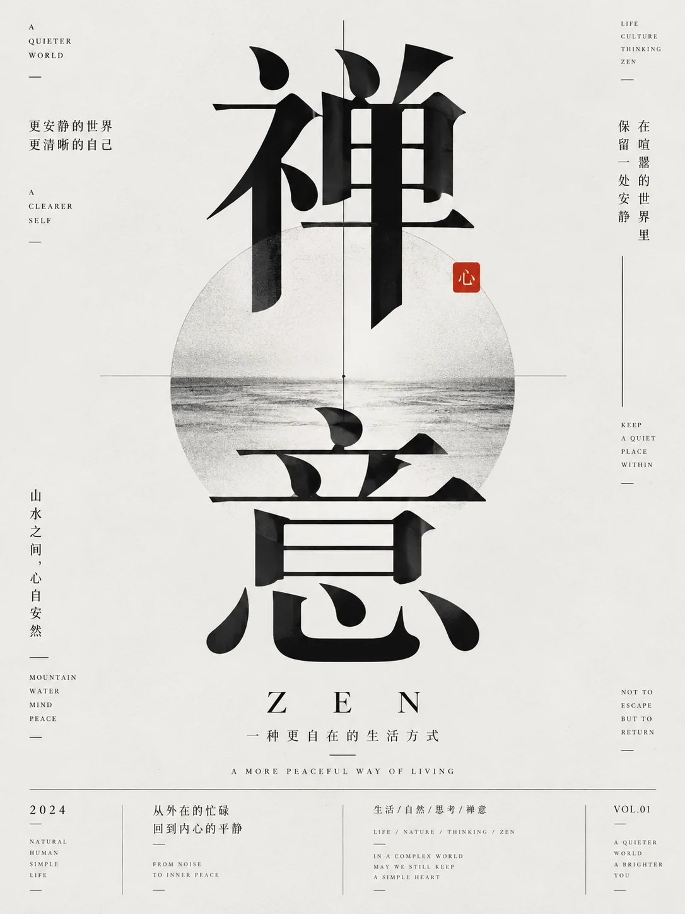

# 极简中文排版观念海报



## Prompt

```text
围绕用户提供的主题，创作一张“东亚现代主义排版 × 极简观念海报 × 中文字体视觉主导”风格的高级文字海报。

【输入】
主题 / 主标题：{{主题}}
核心观点：{{一句话说明真正想表达的判断}}
副标题：{{副标题，可留空}}
核心关系：{{例如：边界 → 距离 → 关系 / 留白 → 秩序 → 聚焦 / 对立 → 差异 → 表达，可留空}}
关键维度：{{2–4 个短词，可留空}}
最终结果：{{一个短词或短句，可留空}}
画幅比例：{{默认 3:4}}
语言：{{默认中英混排}}
用途：{{文章封面 / 公众号封面 / 观点海报 / 设计海报 / 系列视觉}}
可选情绪倾向：{{理性 / 克制 / 冷静 / 深度 / 锋利 / 高级 / 研究}}
可选强调色：{{黑白 / 黑白加红 / 黑白加单色，可留空}}
可选禁用元素：{{不想出现的元素，可留空}}

【提示词】

先理解用户提供主题真正表达的思想重心，不要把它当作普通活动海报处理，而是把它转化成一张“观点通过排版被放大”的文字视觉海报。整张画面的核心不是插画、照片或复杂图形，而是中文文字本身的结构、重量、节奏、对比和空间关系。主题应先被提炼为一个足够有力量的中文核心词组，再围绕它建立中英双语的编辑排版系统。

整体采用极简、理性、克制的现代主义版式。背景使用接近纯白、浅灰白或温暖冷白的大面积留白，画面干净、安静、没有杂乱装饰。通过不可见的网格系统组织主标题、副标题、辅助短句、编号、分隔线和微型英文信息，使画面具有高级设计书、独立杂志封面、艺术展览海报或设计研究海报的气质。

【核心视觉】

整张海报必须由中文主标题承担主要视觉冲击力。主标题可以是 2–6 个字的核心词组，例如一个概念名词、一个判断短语或一个带有观念性的组合词。主标题使用高品质、极具造型张力的中文衬线字体或现代黑体宋体混合风格字体，字形巨大、醒目、具有雕塑感和视觉压迫感。允许主标题打破常规阅读方式，可以竖向堆叠、纵向排列、交错组合、局部重叠、局部出血、穿越版心，或者在一个大框架内部形成视觉中心，但必须保持高级、克制和秩序感。

中文主标题不是简单写字，而是整张画面的主要图形。它可以通过以下方式建立视觉张力：
字重大幅对比；
字号极端放大；
竖排与横排结合；
局部穿插英文；
局部留白切割；
黑白对比；
单字错位；
关键字着重突出；
斜向轴线引导；
框线或版心包裹；
文字与细线共同构成结构关系。

【英文系统】

围绕中文主标题，加入少量英文副标题与英文解释性短句，形成中英混排的现代编辑气质。英文通常不承担第一视觉中心，而是作为“信息层级”和“设计节奏”的组成部分。英文可使用高字距的衬线体、小型大写字母、极细无衬线体或杂志感极强的编辑字体，用于表现：
英文主题翻译；
一句简短观点；
一个系列名；
一组概念提示语；
微型栏目标签；
一句很短的设计性说明。

英文必须克制、短小、精确，不要形成大段正文。典型结构可以是：
主题英文翻译；
一行简短判断；
一组极小辅助说明；
一个系列标签或项目名。

【信息层级】

整张海报至少包含三层文字层级：

第一层：中文主标题，承担主要视觉冲击。
第二层：副标题或一句中文判断，用于解释主题核心含义。
第三层：英文说明、小型概念词、编号、栏目文字、短句或辅助标签，用于建立编辑设计感。

如果用户提供了“关键维度”或“核心关系”，可以将它们拆解为数个独立的短词、短行、竖排列表或边缘信息，分布在版面四周，形成视觉呼应。例如：
自我 / 他人 / 亲密 / 独立；
空间 / 材料 / 未来；
黑白 / 粗细 / 大小；
信息 / 秩序 / 聚焦。

这些词组不应堆在一起，而应作为版面节点分散布局，增强海报的思考感。

【构图方式】

根据主题自动选择最合适的文字构图方式，不固定模板，但整体必须保持现代主义秩序与留白。

可优先使用以下几类构图语言之一：

1. 大字纵向构图  
适合主题本身具有强概念感或冲突感。用超大中文主标题沿画面纵向排列，英文与小字分布于左右边缘，通过巨大字形和边缘信息形成张力。

2. 中央版心构图  
适合强调“秩序、留白、聚焦、结构、规则”等主题。将主标题放入一个细线框、隐形版心或中央结构区域，四周保持大量空白。

3. 对角线构图  
适合表达“对比、差异、冲突、张力、变化、叙事”等主题。主标题沿一条隐含斜轴展开，英文信息和细线沿斜线分布，形成更强的动态感。

4. 左右失衡构图  
适合表达“边界、关系、距离、思考、分离、独处”等主题。主标题集中于一侧，另一侧以小字、线条和局部强调色平衡画面。

无论采用哪一种构图，都必须让留白成为设计的一部分，而不是空出来的无意义区域。

【线条与辅助图形】

画面可加入极少量辅助图形，但这些图形必须从属于排版系统，而不是成为插画主角。允许使用：
极细水平线；
极细竖线；
短分隔线；
小圆点；
编号圆圈；
细边框；
极简矩形框；
少量平行线；
极小色点；
轻微的定位感标记。

这些元素的作用是建立秩序、节奏与方向感。它们应当像编辑设计中的结构骨架，而不是装饰图案。避免复杂几何图形、装饰插画、大面积纹理图案和具象图标。

【色彩系统】

整体色彩以黑、白、灰为基础，形成高对比、清晰而理性的视觉效果。在此基础上最多加入一种小面积强调色。强调色优先考虑红色，也可以根据主题使用暗蓝、深绿或其他成熟单色，但面积必须极小，只用于：
一个关键字；
一个字中的局部；
编号圆点；
小型节点；
短横条；
少量结构点睛。

如果主题强调“冲突、边界、提醒、张力、差异”，优先使用小面积红色。  
如果主题强调“秩序、冷静、理性、建筑感”，可以只使用黑白灰。  
如果主题强调“思想、空间、文化、研究”，可以使用黑白灰加一处成熟深色点缀。

严禁高饱和多色堆叠，避免互联网运营海报和商业促销海报感。

【字体气质】

中文主标题需具有高级编辑感和清晰字骨，不使用卡通字体、毛笔书法字或廉价装饰字体。优先选择：
现代宋体；
高对比衬线中文字体；
具有雕塑感的中文标题字；
理性、清晰、硬朗、气质高级的字形。

英文部分需与中文形成风格对照，可在优雅衬线与现代极细无衬线之间选择，核心是克制、精确和高字距。

【文字内容生成规则】

必须围绕用户提供主题重新组织文字，而不是简单把用户输入照搬。应先提炼：

一个最有力量的中文主标题；
一个补充解释主题的中文短句；
一个英文主题翻译或英文概念短句；
若干个关键维度短词；
必要时加一个系列名、编号或微型说明。

文字内容整体应带有观点感、思考感、设计研究感，像一本关于设计、关系、认知、秩序、生活方式或思想方法的编辑项目视觉。文案不要过长，不要口号化，不要营销化。

【材质与质感】

背景应带有非常轻微的纸张质感或印刷哑光感，但几乎不可察觉。整体质感偏干净、平整、克制，像高品质印刷纸上的排版实验。避免脏污、做旧、褶皱、破损、重颗粒、厚重阴影和复杂纹理。

【整体气质】

高级、理性、观念化、克制、锋利、清晰、具有现代编辑美学。像独立设计杂志封面、设计学院展览海报、文化研究主题视觉或品牌思想海报。视觉力量主要来自：
超大中文标题；
精确留白；
中英层级；
黑白高对比；
极少量强调色；
细线与小型结构元素；
强烈但克制的版式秩序。

【主题自适应规则】

不要机械重复同一版式，而是先判断主题属于哪一类，再自动选择更合适的视觉语法：

如果主题偏“关系 / 边界 / 心理 / 自我”，优先使用大字纵向构图或左右失衡构图，通过留白体现距离感，通过线条体现边界。

如果主题偏“秩序 / 留白 / 聚焦 / 规则 / 系统”，优先使用中央版心构图，用框、细线和中轴结构建立稳定感。

如果主题偏“差异 / 冲突 / 对比 / 故事 / 变化”，优先使用对角线构图、局部红色强调和字重对比，形成明显张力。

如果主题偏“知识 / 设计 / 思考 / 文化 / 研究”，优先保持更强的编辑感与出版物气质，让文案、编号和微型英文更完整。

【负面约束】

避免人物摄影；
避免插画主体；
避免复杂图标；
避免信息图；
避免商业广告感；
避免电商海报；
避免赛博朋克；
避免高饱和多色；
避免花哨背景；
避免密集正文；
避免粗糙书法字；
避免廉价古风；
避免儿童卡通感；
避免粗黑标题与装饰图案混用；
避免文字杂乱堆叠；
避免缺乏留白；
避免用过多元素削弱中文主标题的视觉主导地位。
```
