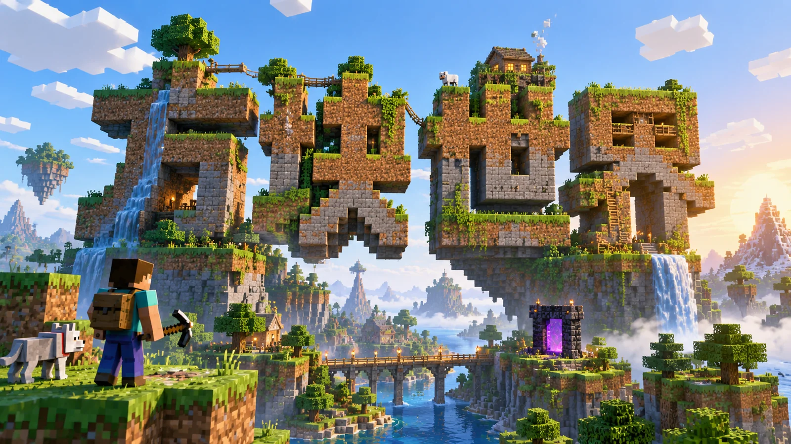

# 方块世界



## Prompt

````text
# 方块世界

## Prompt

```text
创作一张 Minecraft 式高饱和体素方块世界视觉海报。

不要把标题作为普通文字覆盖在游戏场景上。
围绕主题重新设计整个方块世界，让主标题本身成为可以进入、穿越、攀爬或探索的场景结构，使文字、建筑、道路、地形和人物属于同一个空间。

【输入】
主题词 / 主标题：{{主题词}}
副标题：{{副标题，可留空}}
画幅比例：{{画幅比例}}
语言：{{中文 / 英文 / 中英混排}}
用途：{{用途}}
可选补充语境：{{补充背景，可留空}}
可选情绪倾向：{{情绪倾向，可留空}}
可选禁用元素：{{不想出现的元素，可留空}}

【核心目标】
围绕“{{主题词}}”构建一个完整、明亮、具有探索感的体素方块世界。

先理解“{{主题词}}”与“{{补充背景}}”真正表达的对象、关系、事件或概念，再把其中最重要的内容转译成一处核心方块场景。

主标题必须同时承担：
文字信息，
核心地标，
视觉中心，
场景结构。

它可以被重新构造成：
天空岛、
城市入口、
巨大矿洞墙、
方块道路、
阶梯建筑、
浮空建筑群、
传送门、
峡谷、
桥梁、
山体、
地下遗迹、
可探索地形。

不要出现“背景是一张游戏截图，前面再覆盖标题”的分离结构。

【世界视觉】
整个世界采用统一的体素化视觉语言。

所有主要物体都由：
方块、
立方体、
像素格、
体素颗粒、
块状材质
构成。

保持明显的三维空间和真实尺度关系，不要退化成二维像素图。

整体气质：
高饱和，
明亮，
清爽，
阳光，
有活力，
具有高质量游戏宣传视觉的空间感。

场景可以出现：
草地方块、
泥土层、
岩石、
矿石、
水面、
云层、
树林、
山体、
浮岛、
洞穴、
道路、
桥梁、
阶梯、
建筑、
遗迹、
传送结构。

颜色丰富但要有主次关系，避免所有颜色同等饱和导致视觉混乱。

【主标题结构】
主标题必须准确显示：
“{{主题词}}”

文字必须保持可辨识性，同时真实存在于这个方块世界中。

不要只是把字体加上像素纹理。
要把字形本身转译成三维体素结构。

例如可以让标题成为：
巨大方块建筑，
悬浮岛屿轮廓，
山崖表面，
矿洞入口，
城门，
连续阶梯，
道路系统，
传送门结构，
峡谷边界，
浮空平台，
地图中的主要地标。

允许人物在文字上行走、攀爬、穿过或进入其中，以强化标题真实存在于空间中的感觉。

文字的厚度、透视、投影和材质必须与周围世界一致。

即使发生体素化，主标题也必须完整、准确、清晰可辨。

【场景叙事】
根据“{{主题词}}”设计一条简单但明确的场景叙事。

优先围绕一个核心场景展开，不要把大量互不相关的小场景平均铺满画面。

可以加入少量辅助元素：
方块人物，
工具，
武器或探索道具，
地图，
路径，
告示牌，
矿物，
宝箱，
能量方块，
任务物品，
云层，
植物，
流水，
阶梯，
小型建筑，
机械装置。

辅助元素必须服务于主题和视觉动线。

场景应该让人感觉：
这里能够进入，
能够行走，
能够探索，
具有明确的空间方向和目的地。

【人物与尺度】
可使用少量体素人物作为空间尺度参照和叙事角色。

人物应明显小于主标题和核心场景结构。
通过人物站立、奔跑、攀爬、探索、观察或向某个方向前进，引导视线返回主标题。

避免让人物成为最大的视觉主体。

人物、建筑、地形和道路之间必须拥有可信的空间比例。

【构图】
根据 {{画幅比例}} 原生设计构图，不要先制作固定场景后再机械裁切。

建立明确的：
前景，
中景，
背景，
核心视觉中心，
主要探索路径。

优先使用具有空间纵深的透视构图，例如：
轻微俯视，
等距视角，
广角透视，
低角度仰视，
沿道路向远方延伸，
从洞穴内部望向出口，
从高处俯瞰岛屿。

让道路、桥梁、阶梯、河流、光线、人物行动方向和地形边缘共同形成视觉引导线，并最终把视线引向“{{主题词}}”。

避免所有元素平铺在一个平面。

【光照】
光线可以根据主题选择：
清晨，
晴朗正午，
温暖夕阳，
清透室内光，
洞穴入口光，
传送门附近的局部光源。

无论选择哪种光照，都要保持：
干净，
清晰，
明亮，
有层次，
具有明确方向。

方块表面需要有清楚的受光面、背光面和投影，使体素结构具有真实空间体积。

不要使用浑浊、灰暗或过度复杂的电影级黑暗照明，除非 {{可选情绪倾向}} 明确要求。

【副标题与辅助文字】
如果有副标题，准确显示：
“{{副标题}}”

副标题不要使用普通海报文字框覆盖场景。

可以自然转译为：
像素告示牌，
任务面板，
游戏菜单，
地图标签，
物品栏，
关卡提示牌，
入口标识，
建筑铭牌。

辅助文字必须属于这个世界中的界面或实体结构。

如果没有填写副标题，则不要自动生成副标题。

不要擅自添加乱码、伪文字、虚构游戏名称或无意义标签。

【情绪】
根据 {{可选情绪倾向}} 调整天气、光照、尺度和空间氛围。

如果没有指定，则默认保持：
明亮，
轻快，
清爽，
充满探索感，
具有冒险游戏世界的积极空间氛围。

情绪主要通过：
天空，
光照，
地形高度，
空间尺度，
路径方向，
人物动作
表达。

不要依赖大量文字解释情绪。

【用途适配】
这是一张用于 {{用途}} 的成品视觉海报。

根据实际用途调整标题占比、远距离识别度和场景复杂度，同时保持“标题就是世界结构”的核心设计。

用于封面时：
标题轮廓更加突出，场景细节适度减少。

用于社交媒体海报时：
保证缩略图状态下仍能快速识别主标题和核心场景。

用于大尺寸展示时：
可以增加地形、材质、矿物、建筑和小型探索细节。

【必须避免】
不要让标题与场景彼此分离。
不要把标题简单贴在天空或画面表面。
不要仅仅给普通字体添加像素描边。
不要做成儿童贴纸风。
不要做成低质卡通。
不要做成二维像素图标合集。
不要把大量独立方块元素平均堆满整张画面。
不要让小场景数量过多而失去视觉中心。
不要让人物抢走主标题的视觉权重。
不要使用与体素世界不一致的写实摄影人物或光滑真实材质。
不要出现大量与主题无关的 HUD、按钮或游戏界面。
不要生成错误标题、乱码或无意义文字。
不要加入 {{可选禁用元素}}。

【最终标准】
最终只输出一张完整独立海报，不要输出样机、拼图、多方案、角色设定图或场景拆解图。

成图必须同时满足：
主标题完整准确且清晰可读；
主标题本身就是核心方块场景；
标题、地形、建筑和人物属于同一个三维空间；
体素视觉统一；
色彩明亮高饱和但有明确层级；
前中后景清晰；
探索路径明确；
人物尺度合理；
光线干净且具有体积感；
场景丰富但不过度拥挤；
远看有强烈视觉中心，近看有可探索的小型方块细节。

最终效果应像一张专门围绕“{{主题词}}”设计的高质量体素冒险游戏主视觉，而不是“游戏背景 + 标题文字”的普通宣传图。
```
````
