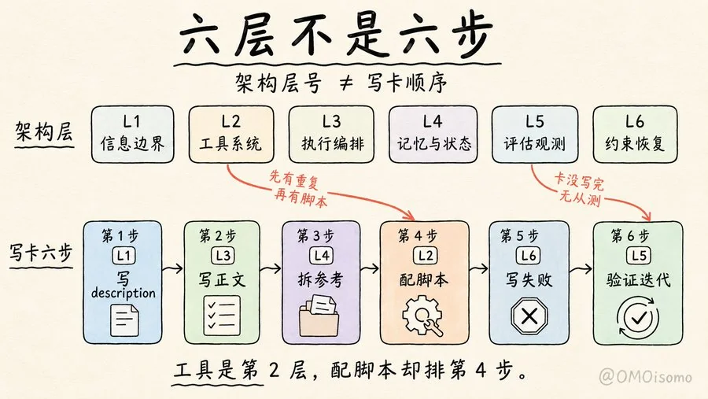

# 白板手绘知识图解



## Prompt

````text
# 白板手绘知识图解

## Prompt

```text
白板手绘知识图解风格，现代极简手绘信息图，适合做知识讲解图、流程拆解图、概念说明图、步骤示意图。

请根据用户提供的主题或内容，生成一张“白板讲解式”的手绘图解海报。
整体视觉必须像用黑色马克笔和淡彩色块，在白色或暖白色白板/纸面上手工画出来的教学图，而不是电脑制图、PPT、UI 界面或商业海报。

【整体风格】
- 纯白或微暖白背景，大量干净留白，画面明亮、轻松、清晰。
- 使用黑色手绘线条作为主结构，线条略微不规则，保留手绘感。
- 版面像知识博主手绘白板图：亲切、直观、逻辑强、信息密度适中。
- 文字、箭头、边框、图标、说明块都要像手工画出来的，不要过度工整。
- 整体要有“讲给人听”的感觉，而不是“设计给人看”的冷商业感。

【文字系统】
- 主标题使用较大的手写中文标题，醒目、清楚、居中或偏上布局。
- 副标题可放在主标题下方，字号明显更小，用于补充一句核心判断。
- 画面中的说明文字以中文为主，可少量加入英文术语或文件名样式的小字。
- 所有文字必须清晰可读，避免错字、乱码、过小文字和无意义装饰字。
- 重点词、提醒语、错误提示、关键结论，可用红色或橙红色手写批注强调。

【图形与结构】
- 使用圆角矩形卡片、手绘边框、流程箭头、连接线、编号圆点、分组区域来组织信息。
- 常见结构包括：步骤流程、上下分层、左右对比、卡片分组、因果链路、概念拆解、清单总结。
- 每个模块都要有明确边界，模块之间通过箭头或排版自然连接。
- 图标采用极简手绘小图标，例如：文档、文件夹、开关、门、锁、勾选、叉号、人物、小机器人、齿轮、放大镜、对话框、箭头等。
- 图标必须简洁可爱，像白板速写，不要写实，也不要拟物 3D。

【配色】
- 整体以黑线 + 低饱和浅色块为主。
- 色块常用浅蓝、浅绿、浅黄、淡紫、浅橙、浅粉等柔和颜色。
- 每个模块可以使用一种浅底色，帮助分区，但颜色不能太艳、太脏、太花。
- 重点提示可用少量红色、橙红色做批注、圈线、箭头或警示框。
- 配色要轻盈、克制、统一，不能做成高饱和营销海报。

【构图】
- 16:9 横版构图，整体像一张完整的白板知识图。
- 主标题位于顶部区域。
- 中部放主要流程、步骤卡片或结构图。
- 底部可放一句总结性结论、提醒句或关键认知。
- 画面重心稳定，阅读顺序清楚，一眼能知道先看哪里、再看哪里。
- 不要把元素堆满，宁可留白，也不要过度拥挤。

【内容表达方式】
- 将复杂知识拆解成 3–6 个主要模块，每个模块表达一个清晰要点。
- 每个模块只保留最关键的信息，不展开成长段正文。
- 让画面具备“先看懂结构，再看懂细节”的阅读层次。
- 适合表达：步骤、方法、误区、层级、开关条件、核心差异、因果关系、框架拆解。
- 如果主题里存在“对比、纠错、提醒、误解、关键点”，优先用红色手写批注强化。

【质感要求】
- 保留真实手绘感：轻微歪斜、线条抖动、边角不完全工整。
- 色块像马克笔淡涂或浅色荧光笔铺底，不要数字渐变，不要玻璃质感。
- 视觉上像“手绘白板 + 笔记图解 + 教学卡片”的结合体。
- 整体干净、友好、易读、有知识感，但不严肃僵硬。

【适合模仿的核心气质】
- 手绘知识博主白板图
- 轻松讲解式信息图
- 教学拆解卡片
- 白底、黑线、浅色块、少量红色批注
- 简单可爱但逻辑明确

【禁止项】
- 不要照片写实、3D 渲染、UI 截图风、PPT 模板风、商业科技海报风。
- 不要复杂背景、深色背景、炫光、霓虹、玻璃拟态、金属质感。
- 不要密集大段文字，不要过多装饰元素，不要把画面塞满。
- 不要过度精致到失去手绘感，也不要潦草到难以辨认。
- 不要使用粗暴商业排版，不要做成电商图、营销图、课程广告图。

【最终效果】
生成一张高可读性的白板手绘知识图解：
白底暖白背景，
黑色马克笔手绘线条，
柔和浅色信息模块，
少量红色重点批注，
逻辑清楚，
图标简洁可爱，
整体像一位擅长知识拆解的人在白板上亲手画出的高质量教学图。
```
````
