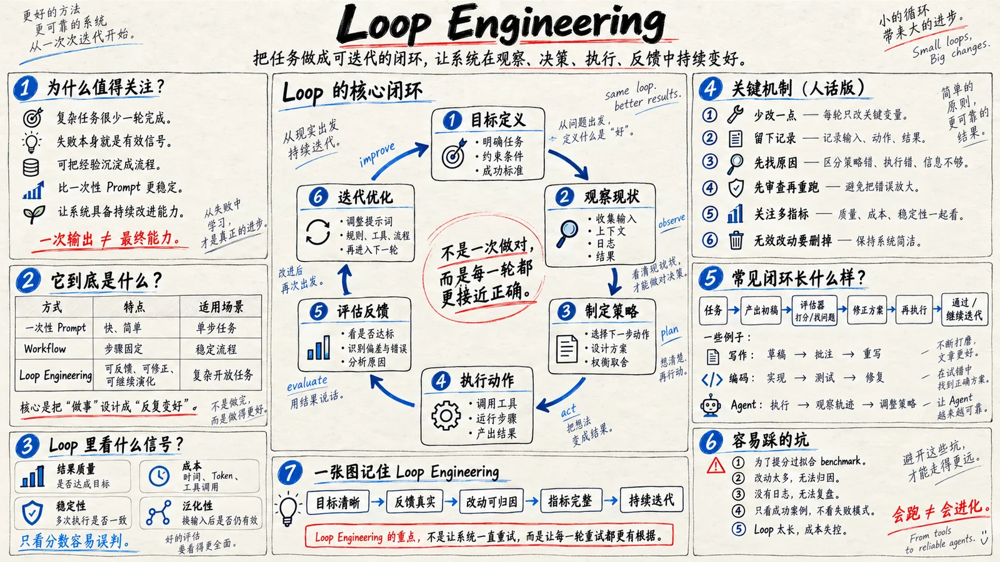

# 白板手绘知识图解


## Prompt

```text
围绕用户提供的主题，创作一张“纸本白板手绘 × 高密度知识图解 × 工程笔记 × 模块化编辑排版”风格的横版知识信息图。它应像一位资深工程师或研究者在一张大型纸质白板上，用黑色马克笔完整拆解一个复杂问题：结构严谨、信息丰富、手绘自然，同时具有专业出版物级的信息组织能力。重点复现这种视觉语言和信息组织方式，不复刻任何具体参考图的标题、内容、流程、数据或图形。

【输入】
主题 / 主标题：{{主题}}
核心问题：{{这张图最终要解释清楚的问题}}
核心观点：{{一句话说明最重要的判断}}
中心流程 / 核心关系：{{例如：输入 → 分析 → 决策 → 执行 → 反馈 → 优化，可留空}}
关键模块：{{4–8 个知识模块，可留空，由模型根据主题自动拆解}}
对比关系：{{需要比较的两个或多个对象，可留空}}
数据 / 实验信号：{{需要展示的数据、比例、指标或案例，可留空}}
最终启发：{{希望读者看完后记住的一句话，可留空}}
画幅比例：{{默认 16:9}}
语言：{{默认简体中文，可支持英文或中英混排}}
用途：{{技术文章插图 / 知识科普 / 研究报告 / 公众号配图 / 培训材料}}

【构图】
使用一整张横向暖米白色纸张作为画布，保留细微纸纤维、铅笔擦痕和真实扫描纸张质感。顶部设置醒目的手写主标题，可使用粗黑马克笔字，标题下方配一条细蓝线或红线作为手绘强调；主标题下放置一句较小的核心解释，让读者先理解整张图要回答什么。

主体采用“大型中央核心图 + 左右知识模块”的编辑式布局。中央区域占据约 45%–55% 的视觉权重，用于绘制最重要的流程、循环、系统关系、因果链或架构图；使用多个手绘矩形节点、弧形箭头、编号步骤和少量简洁图标组成完整叙事，使读者能够沿箭头自然阅读。左右两侧以及底部布置若干独立知识卡片，每个模块使用细黑色手绘边框分隔，并以蓝色圆形编号 ①②③④ 标记章节顺序。模块内部可以根据内容使用短段落、对比表格、小型柱状图、检查清单、迷你流程图、关键词框、灯泡、放大镜、齿轮、盾牌、垃圾桶、书本、折线图等极简线稿图标，但所有元素必须服务于解释主题。

【视觉语言】
整体以黑色墨线和黑色马克笔为主体，线条具有轻微粗细变化、自然抖动和真实手写压力感，不使用机械化矢量直线。蓝色作为主要理性强调色，用于编号、箭头、下划线、关键步骤和结构提示；红色只用于少量高价值结论、警告、关键公式或重点下划线。整体控制为黑色 + 蓝色 + 红色三色体系，红蓝面积都明显低于黑色。允许少量浅灰色斜线阴影、铅笔排线或柱状图填充，保持真实纸笔笔记感。

字体全部呈现真实手写效果：主标题为粗重、有力量的黑色马克笔手写体；模块标题稍粗；正文为清晰自然的细黑色手写体。中文书写应端正、自然、可辨认，可以偶尔穿插少量英文技术术语或英文边注，但不要为了装饰随机生成英文。重要词语可用蓝色或红色手写下划线强调，允许箭头旁出现极短的工程师式旁注，例如原因、反馈、风险、成本、优化方向等。

【信息组织】
先理解主题，再自动建立信息层级。整张图必须存在一个明确的主叙事路径，而不是把知识点平均铺满画面。优先采用“问题 → 原理 → 过程 → 反馈 → 对比 / 数据 → 启发”的结构；如果主题更适合其他结构，可以调整，但中央核心关系必须一眼可见。每个知识模块只解决一个子问题，模块之间通过编号、箭头、位置和视觉层级形成连续阅读顺序。复杂概念优先使用流程、空间关系和图形表达，文字承担解释作用，不用大段正文填满画面。

如果用户提供了具体流程、术语、数字、表格字段或结论，优先严格使用这些真实信息，不随意篡改数据或改变逻辑关系。指定标题、关键术语和重要数字必须清晰可读。正文尽量使用短句和关键词，避免生成几十行微小文字；宁可减少次要说明，也要保证主要文字能够阅读。图表的数据关系、流程箭头方向和因果关系必须逻辑正确。

【风格细节】
画面应具有真实知识工作者手工绘制完成的感觉，而不是数字软件模拟的模板：边框略有不规则，箭头具有不同弧度，图标简洁粗朴，部分文字存在轻微倾斜，局部可以出现自然的小箭头、圈选、下划线和边缘批注。允许在画面角落加入极少量英文手写边注或一句简短思考，让画面产生研究笔记和工作白板的现场感，但不要形成装饰性英文堆积。

整体信息密度可以较高，但必须保持足够留白，每个模块之间存在清楚间距。视觉效果应接近高质量技术白板、研究者工作笔记、工程架构讲解稿与纸本知识地图的结合体：理性、可信、丰富、有人味，同时具有专业编辑设计感。

【避免】
不要复刻任何具体参考图片中的原始标题、数字、模块数量、流程名称或内容；不要使用照片级写实人物、三维渲染、霓虹科技风、渐变玻璃拟态、网页界面、标准企业演示文稿模板或过度规整的矢量信息图；不要使用彩虹配色；不要塞入无意义装饰；不要出现大量无法辨认的伪文字；不要让所有模块大小完全相同；不要把中央核心关系弱化成普通卡片；不要为了填满空间而添加与主题无关的信息。

最终效果：像一张被认真规划过、又由研究者亲手完成的大型知识白板。第一眼看到主题和中央核心关系，第二眼理解各模块之间的逻辑，继续阅读时可以发现数据、对比、注释和细节；整体呈现“复杂知识被一张图讲清楚”的感觉。
```